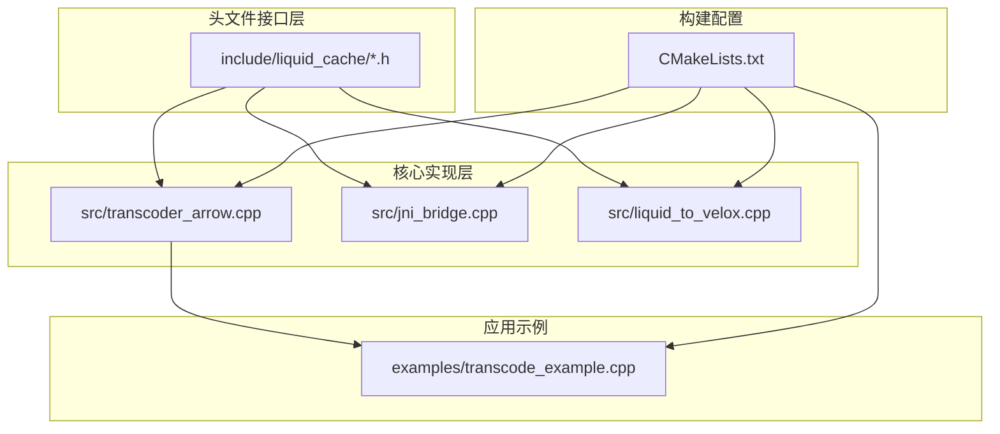
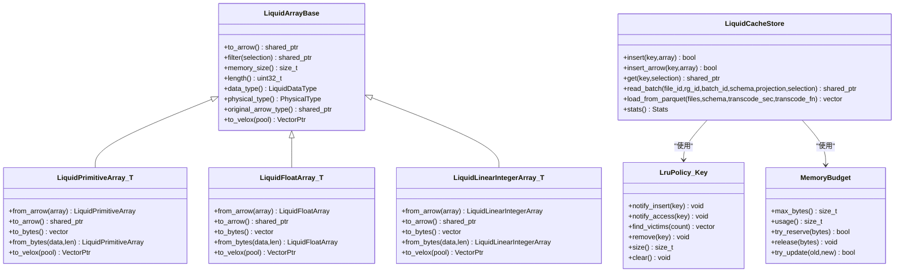
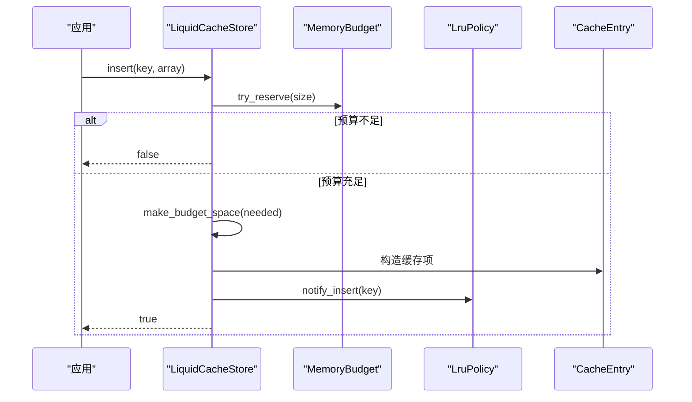
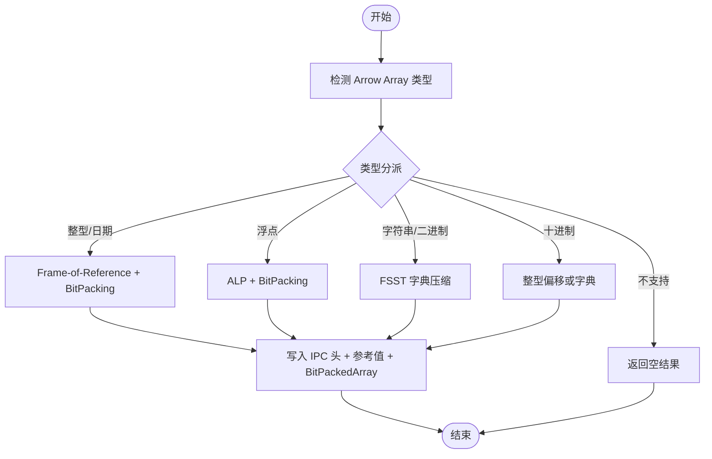
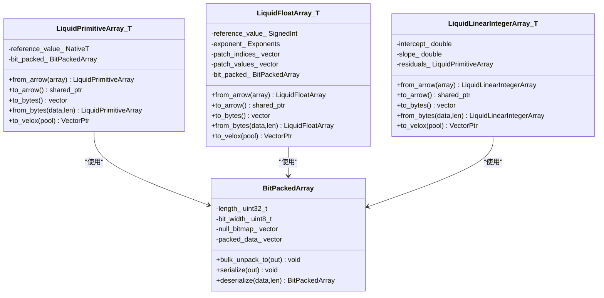
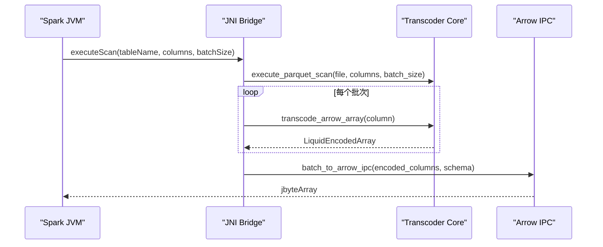
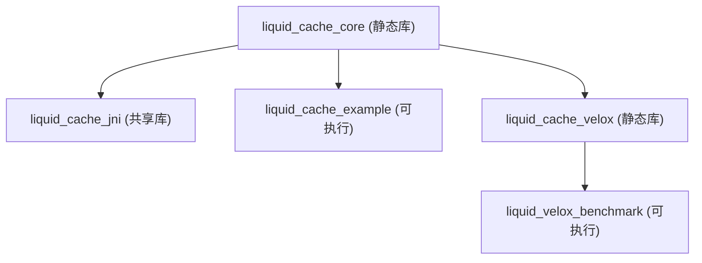

# 核心架构设计

<cite>
**本文档引用的文件**
- [README.md](file://README.md)
- [CMakeLists.txt](file://CMakeLists.txt)
- [liquid_cache_store.h](file://include/liquid_cache/liquid_cache_store.h)
- [transcoder.h](file://include/liquid_cache/transcoder.h)
- [transcoder_arrow.cpp](file://src/transcoder_arrow.cpp)
- [lru_policy.h](file://include/liquid_cache/lru_policy.h)
- [liquid_array.h](file://include/liquid_cache/liquid_array.h)
- [liquid_arrays.h](file://include/liquid_cache/liquid_arrays.h)
- [bit_packed_array.h](file://include/liquid_cache/bit_packed_array.h)
- [ipc_header.h](file://include/liquid_cache/ipc_header.h)
- [jni_bridge.cpp](file://src/jni_bridge.cpp)
- [liquid_to_velox.cpp](file://src/liquid_to_velox.cpp)
- [transcode_example.cpp](file://examples/transcode_example.cpp)
</cite>

## 目录
1. [简介](#简介)
2. [项目结构](#项目结构)
3. [核心组件](#核心组件)
4. [架构总览](#架构总览)
5. [详细组件分析](#详细组件分析)
6. [依赖关系分析](#依赖关系分析)
7. [性能考虑](#性能考虑)
8. [故障排除指南](#故障排除指南)
9. [结论](#结论)

## 简介
本项目为 liquid-cache-cpp 的核心架构设计文档，聚焦于内存中列式缓存与零序列化读取的设计理念。整体架构采用模块化与可插拔设计，围绕以下关键目标构建：
- 零序列化读取：缓存以原生结构存储，避免反序列化开销
- 列式缓存与投影过滤：按列独立缓存，支持列投影与行过滤
- LRU 内存预算控制：基于原子计数的无锁预算与 LRU 淘汰
- 多引擎兼容：通过适配器模式支持 Arrow 与 Velox 双后端
- 编解码优化：针对整型、浮点、字符串等类型采用专用编码策略

## 项目结构
仓库采用头文件与源文件分离的模块化组织方式，核心目录与职责如下：
- include/liquid_cache：公共头文件，定义接口、数据结构与编解码协议
- src：核心实现，包含 Arrow 与 JNI/Velox 适配桥接
- examples：示例程序，演示基准测试与正确性验证
- tests：单元测试与交叉验证
- build/build_velox：构建产物与测试二进制

**图表来源**
- [CMakeLists.txt:184-245](file://CMakeLists.txt#L184-L245)
- [transcoder_arrow.cpp:1-50](file://src/transcoder_arrow.cpp#L1-L50)
- [jni_bridge.cpp:1-35](file://src/jni_bridge.cpp#L1-L35)
- [liquid_to_velox.cpp:1-20](file://src/liquid_to_velox.cpp#L1-L20)

**章节来源**
- [CMakeLists.txt:1-120](file://CMakeLists.txt#L1-L120)

## 核心组件
本节深入解析关键组件及其职责与协作关系。

- LiquidCacheStore：列式缓存的核心控制器，负责键管理、插入/读取、批量读取、预算控制与 LRU 淘汰
- LiquidArrayBase/LiquidArrayRef：抽象数组接口与类型擦除句柄，支撑异构数组统一管理
- Transcoder：编解码器，提供 Arrow 原生缓冲区到 Liquid 结构的转换与反向解码
- LruPolicy/MemoryBudget：内存预算与 LRU 策略，保障缓存容量约束与淘汰顺序
- 数组抽象层：包含整型/线性整型、浮点、字节视图、定长字节数组、十进制等专用实现
- JNI/Velox 适配：JNI 桥接与 Velox 向量直转，实现跨引擎兼容

**章节来源**
- [liquid_cache_store.h:188-527](file://include/liquid_cache/liquid_cache_store.h#L188-L527)
- [liquid_array.h:29-85](file://include/liquid_cache/liquid_array.h#L29-L85)
- [transcoder.h:17-36](file://include/liquid_cache/transcoder.h#L17-L36)
- [lru_policy.h:30-96](file://include/liquid_cache/lru_policy.h#L30-L96)
- [liquid_arrays.h:95-248](file://include/liquid_cache/liquid_arrays.h#L95-L248)

## 架构总览
整体架构采用“接口抽象 + 模板多态 + 工厂适配”的组合模式：
- 接口抽象：LiquidArrayBase 提供统一的 to_arrow/filter/memory_size 等接口
- 模板多态：各数组类型通过模板特化实现，编译期确定类型信息
- 工厂适配：transcode_to_liquid_array 作为工厂函数，根据 Arrow 类型分派到具体数组类型
- 适配器模式：JNI/Velox 层对底层数组进行适配，屏蔽 Arrow/Velox 差异

**图表来源**
- [liquid_array.h:29-85](file://include/liquid_cache/liquid_array.h#L29-L85)
- [liquid_arrays.h:95-248](file://include/liquid_cache/liquid_arrays.h#L95-L248)
- [liquid_arrays.h:358-566](file://include/liquid_cache/liquid_arrays.h#L358-L566)
- [liquid_cache_store.h:188-527](file://include/liquid_cache/liquid_cache_store.h#L188-L527)
- [lru_policy.h:111-188](file://include/liquid_cache/lru_policy.h#L111-L188)
- [lru_policy.h:30-96](file://include/liquid_cache/lru_policy.h#L30-L96)

## 详细组件分析

### LiquidCacheStore：列式缓存控制器
- 键模型：LiquidCacheKey 将文件/行组/列/批号打包为单一 64 位键，便于哈希与比较
- 插入策略：支持 Arrow 原始数组与 Liquid 结构两种插入；更新时先扩容再预算更新
- 读取路径：单列读取与批量读取；批量读取支持列投影与行过滤
- 预算与淘汰：MemoryBudget 使用原子操作进行无锁预留；LruPolicy 维护 MRU/LRU 顺序，find_victims 批量淘汰
- 多引擎接口：在启用 Velox 时提供 to_velox 的直接转换能力

**图表来源**
- [liquid_cache_store.h:222-274](file://include/liquid_cache/liquid_cache_store.h#L222-L274)
- [lru_policy.h:116-130](file://include/liquid_cache/lru_policy.h#L116-L130)
- [lru_policy.h:143-159](file://include/liquid_cache/lru_policy.h#L143-L159)
- [lru_policy.h:49-91](file://include/liquid_cache/lru_policy.h#L49-L91)

**章节来源**
- [liquid_cache_store.h:188-527](file://include/liquid_cache/liquid_cache_store.h#L188-L527)
- [lru_policy.h:30-188](file://include/liquid_cache/lru_policy.h#L30-L188)

### Transcoder：编解码器与工厂适配
- 类型分派：transcode_arrow_array 根据 Arrow 类型映射到对应 Liquid 数组类型；不支持类型降级为空结果
- 原始缓冲区接口：transcode_primitive/transcode_float 提供裸缓冲区编码，便于 JNI/Velox 直接使用
- 解码路径：decode_liquid_array 读取 IPC 头并分派到具体类型解码
- 工厂函数：transcode_to_liquid_array 返回类型擦除的 LiquidArrayRef，用于缓存存储

**图表来源**
- [transcoder.h:44-358](file://include/liquid_cache/transcoder.h#L44-L358)
- [transcoder_arrow.cpp:44-351](file://src/transcoder_arrow.cpp#L44-L351)
- [transcoder_arrow.cpp:378-477](file://src/transcoder_arrow.cpp#L378-L477)

**章节来源**
- [transcoder.h:17-360](file://include/liquid_cache/transcoder.h#L17-L360)
- [transcoder_arrow.cpp:34-746](file://src/transcoder_arrow.cpp#L34-L746)

### 数组抽象层：多类型编码实现
- 整型/日期：FoR + BitPacking，参考值减法消除负值，bit_width 最小化存储
- 浮点：ALP 自适应无损编码，指数搜索 + patch 补丁机制
- 线性整型：L∞回归拟合 + 残差存储，适合单调/近线性序列
- 字节视图/定长字节数组：字典 + FSST + BitPacking，兼顾压缩率与解压速度
- 十进制：小范围直接整型偏移，大范围字典 + FSST

**图表来源**
- [liquid_arrays.h:95-248](file://include/liquid_cache/liquid_arrays.h#L95-L248)
- [liquid_arrays.h:599-800](file://include/liquid_cache/liquid_arrays.h#L599-L800)
- [liquid_arrays.h:358-566](file://include/liquid_cache/liquid_arrays.h#L358-L566)
- [bit_packed_array.h:39-486](file://include/liquid_cache/bit_packed_array.h#L39-L486)

**章节来源**
- [liquid_arrays.h:95-800](file://include/liquid_cache/liquid_arrays.h#L95-L800)
- [bit_packed_array.h:39-486](file://include/liquid_cache/bit_packed_array.h#L39-L486)

### JNI/Velox 适配：跨引擎兼容
- JNI 桥接：执行扫描、批次序列化为 Arrow IPC，兼容现有 Spark Scala 读取路径
- Velox 直转：to_velox 直接生成 Velox 向量，避免中间 Arrow 转换；提供 RowType 映射与批量 RowVector 生成

**图表来源**
- [jni_bridge.cpp:51-170](file://src/jni_bridge.cpp#L51-L170)
- [transcoder_arrow.cpp:44-351](file://src/transcoder_arrow.cpp#L44-L351)

**章节来源**
- [jni_bridge.cpp:1-320](file://src/jni_bridge.cpp#L1-L320)
- [liquid_to_velox.cpp:1-639](file://src/liquid_to_velox.cpp#L1-L639)

## 依赖关系分析
- 构建系统：CMakeLists.txt 定义了核心库、JNI 库、示例与测试目标，并支持可选的 Velox 集成
- 运行时依赖：Arrow/Parquet 为必需依赖；可选 Velox 在启用时替换 Arrow 版本以确保 ABI 兼容
- 模块间耦合：核心实现位于 transcoder_arrow.cpp，通过头文件接口与上层组件解耦；JNI/Velox 仅在编译期条件开启

**图表来源**
- [CMakeLists.txt:184-245](file://CMakeLists.txt#L184-L245)
- [CMakeLists.txt:396-430](file://CMakeLists.txt#L396-L430)

**章节来源**
- [CMakeLists.txt:1-563](file://CMakeLists.txt#L1-L563)

## 性能考虑
- 零序列化读取：缓存以原生结构存储，读取时直接访问内存，避免反序列化成本
- 批处理与列投影：批量读取减少锁竞争与上下文切换；列投影避免无关列解码
- 无锁预算预留：MemoryBudget 使用 compare_exchange_weak 实现无锁预留，降低并发写入开销
- SIMD 加速：BitPackedArray 在支持 AVX2 的平台使用 SIMD 批量解包，提升解码吞吐
- LRU 淘汰：批量 victim 选择减少频繁锁竞争，提高淘汰效率

## 故障排除指南
- 类型不支持：当 Arrow 类型不在支持列表时，transcode_arrow_array 返回空结果；建议检查数据类型或扩展支持
- 预算超限：insert 返回 false 表示条目过大或超出预算；可通过增大预算或清理缓存解决
- JNI/Velox 集成问题：启用 LIQUID_ENABLE_VELOX 时需确保与 Velox 构建树一致的 Arrow 版本，避免 vtable 不匹配
- 空指针异常：CacheEntry::read 在类型不匹配或空缓存时返回空指针，调用方应进行空值检查

**章节来源**
- [transcoder_arrow.cpp:344-351](file://src/transcoder_arrow.cpp#L344-L351)
- [liquid_cache_store.h:222-274](file://include/liquid_cache/liquid_cache_store.h#L222-L274)
- [lru_policy.h:49-91](file://include/liquid_cache/lru_policy.h#L49-L91)

## 结论
liquid-cache-cpp 通过“接口抽象 + 模板多态 + 工厂适配 + 适配器模式”实现了高度模块化与可插拔的缓存架构。其核心优势在于：
- 零序列化读取显著降低解码开销
- 列式缓存与投影过滤满足现代分析查询需求
- LRU + 原子预算保障内存可控与高吞吐
- 多引擎兼容通过 JNI/Velox 适配实现无缝集成

该架构为后续扩展（如 Squeeze、更多类型支持）提供了清晰的扩展点与稳定的接口契约。