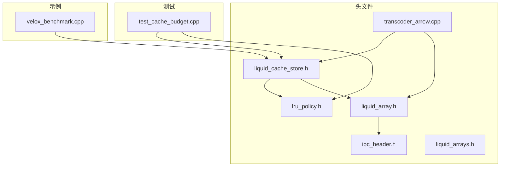
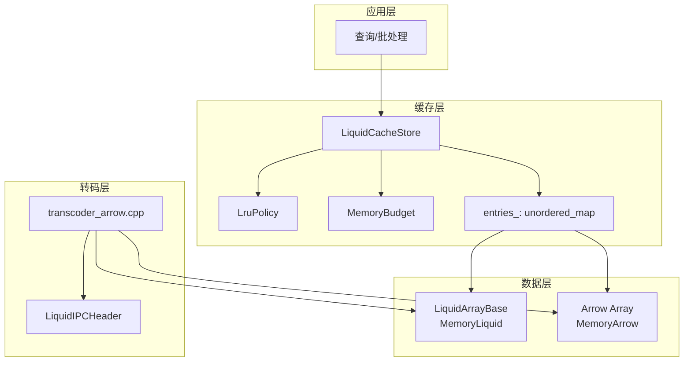
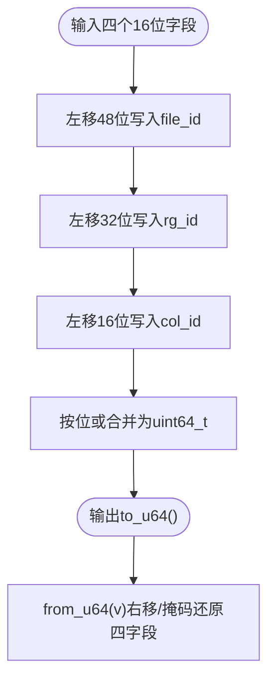
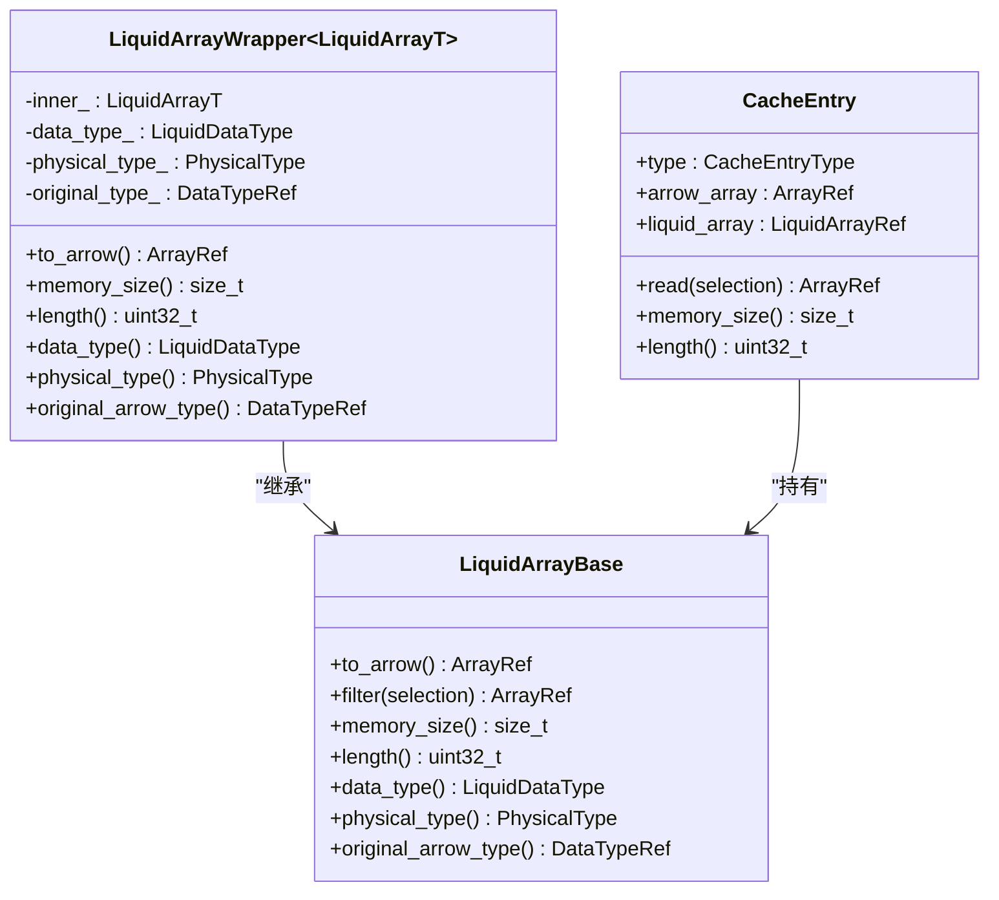
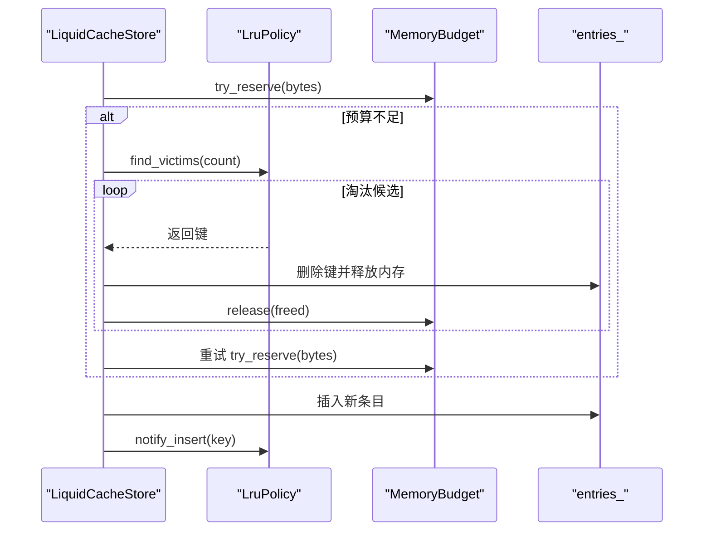
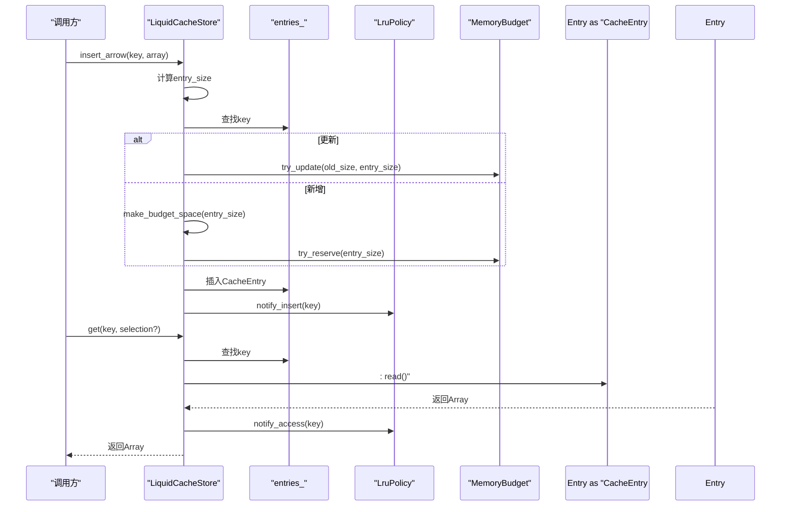
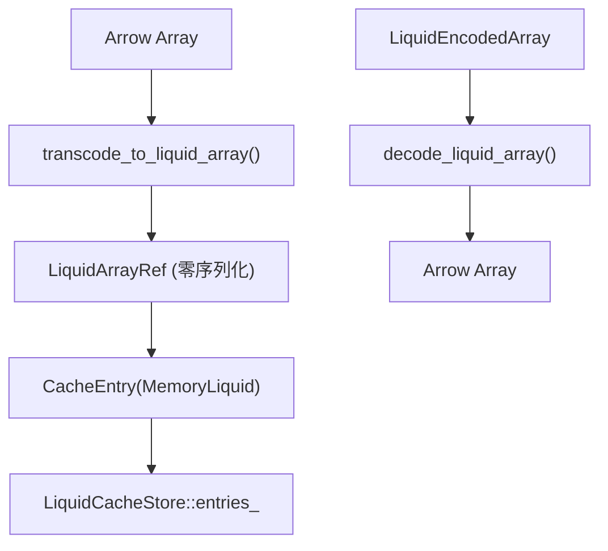
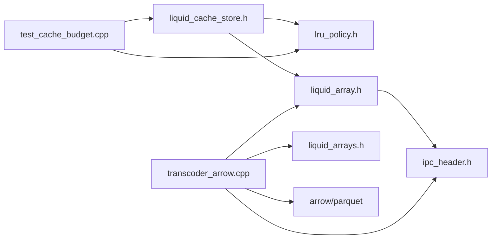

# 缓存系统架构

<cite>
**本文引用的文件**
- [liquid_cache_store.h](file://include/liquid_cache/liquid_cache_store.h)
- [lru_policy.h](file://include/liquid_cache/lru_policy.h)
- [liquid_array.h](file://include/liquid_cache/liquid_array.h)
- [ipc_header.h](file://include/liquid_cache/ipc_header.h)
- [liquid_arrays.h](file://include/liquid_cache/liquid_arrays.h)
- [transcoder_arrow.cpp](file://src/transcoder_arrow.cpp)
- [test_cache_budget.cpp](file://tests/test_cache_budget.cpp)
- [README.md](file://README.md)
</cite>

## 目录
1. [简介](#简介)
2. [项目结构](#项目结构)
3. [核心组件](#核心组件)
4. [架构总览](#架构总览)
5. [详细组件分析](#详细组件分析)
6. [依赖关系分析](#依赖关系分析)
7. [性能考量](#性能考量)
8. [故障排查指南](#故障排查指南)
9. [结论](#结论)
10. [附录](#附录)

## 简介
本文件面向液体缓存系统（LiquidCacheStore）的架构设计与实现，聚焦以下关键主题：
- 列式缓存存储：按列独立缓存，支持投影与过滤
- LRU 淘汰策略：基于访问顺序的淘汰机制
- 内存预算控制：无锁原子会计与上限约束
- 缓存键设计：64 位打包与位移比较
- 双重类型缓存条目：MemoryArrow 与 MemoryLiquid 的零序列化读取优势
- 内存管理：原子锁-free 预算会计、线程安全与内存追踪
- 插入/更新/删除流程：预算不足时的淘汰算法

## 项目结构
仓库采用头文件驱动的模块化组织，核心位于 include/liquid_cache 下，包含缓存键、LRU 策略、数组抽象、IPC 头、转码器与缓存存储等；src 提供转码实现；tests 提供预算与 LRU 行为验证；examples 展示与 Velox 的集成基准。

图表来源
- [liquid_cache_store.h:188-527](file://include/liquid_cache/liquid_cache_store.h#L188-L527)
- [lru_policy.h:30-191](file://include/liquid_cache/lru_policy.h#L30-L191)
- [liquid_array.h:29-85](file://include/liquid_cache/liquid_array.h#L29-L85)
- [ipc_header.h:46-107](file://include/liquid_cache/ipc_header.h#L46-L107)
- [liquid_arrays.h:95-248](file://include/liquid_cache/liquid_arrays.h#L95-L248)
- [transcoder_arrow.cpp:44-351](file://src/transcoder_arrow.cpp#L44-L351)
- [test_cache_budget.cpp:23-393](file://tests/test_cache_budget.cpp#L23-L393)
- [README.md:1-1](file://README.md#L1-L1)

章节来源
- [README.md:1-1](file://README.md#L1-L1)

## 核心组件
- 缓存键与哈希：LiquidCacheKey 使用 64 位打包，提供 to_u64/from_u64 与相等性比较，配合 std::hash 特化用于 LruPolicy 的键映射。
- 缓存条目：CacheEntry 支持两种类型（MemoryArrow 与 MemoryLiquid），统一读取接口 read()，并提供 memory_size()/length()。
- 缓存存储：LiquidCacheStore 负责插入、读取、批量读取、统计与清理；内部维护 entries_、LRU 策略与内存预算。
- 内存预算：MemoryBudget 基于原子操作的无锁预留与释放，支持 try_reserve/try_update/release。
- LRU 策略：LruPolicy 维护 MRU/LRU 双向链表与哈希映射，提供 notify_insert/notify_access/find_victims/remove/size/clear。
- 数组抽象：LiquidArrayBase 定义统一接口（to_arrow/filter/memory_size/length/data_type/original_arrow_type），并提供类型擦除包装器。
- IPC 头：LiquidIPCHeader 定义二进制兼容的头部格式，包含逻辑类型与物理类型标识。
- 转码器：transcoder_arrow.cpp 将 Arrow 数组转为 Liquid 结构（零序列化），或解码回 Arrow；同时提供 load_from_parquet 的实现。

章节来源
- [liquid_cache_store.h:48-173](file://include/liquid_cache/liquid_cache_store.h#L48-L173)
- [lru_policy.h:30-191](file://include/liquid_cache/lru_policy.h#L30-L191)
- [liquid_array.h:29-85](file://include/liquid_cache/liquid_array.h#L29-L85)
- [ipc_header.h:46-107](file://include/liquid_cache/ipc_header.h#L46-L107)
- [transcoder_arrow.cpp:44-351](file://src/transcoder_arrow.cpp#L44-L351)

## 架构总览
液体缓存系统以列式存储为核心，每个列批次独立缓存，支持投影与过滤。数据在内存中以“零序列化”形式保存（MemoryLiquid）或原生 Arrow 形式（MemoryArrow）。缓存通过 LRU 策略与内存预算进行容量控制，确保在有限内存下维持热点命中率。

图表来源
- [liquid_cache_store.h:188-527](file://include/liquid_cache/liquid_cache_store.h#L188-L527)
- [lru_policy.h:111-188](file://include/liquid_cache/lru_policy.h#L111-L188)
- [lru_policy.h:30-96](file://include/liquid_cache/lru_policy.h#L30-L96)
- [liquid_array.h:29-85](file://include/liquid_cache/liquid_array.h#L29-L85)
- [transcoder_arrow.cpp:44-351](file://src/transcoder_arrow.cpp#L44-L351)
- [ipc_header.h:46-107](file://include/liquid_cache/ipc_header.h#L46-L107)

## 详细组件分析

### 缓存键设计（LiquidCacheKey）
- 设计目标：将 file_id、rg_id、col_id、batch_id 四个 16 位字段打包到一个 uint64_t 中，便于哈希与比较。
- 打包与解包：to_u64() 使用左移位将各字段拼接；from_u64() 通过右移与掩码还原。
- 哈希与相等：提供 std::hash 特化，保证与 LruPolicy 内部使用的 std::unordered_map 兼容；operator== 基于 to_u64() 比较。

图表来源
- [liquid_cache_store.h:58-73](file://include/liquid_cache/liquid_cache_store.h#L58-L73)

章节来源
- [liquid_cache_store.h:48-86](file://include/liquid_cache/liquid_cache_store.h#L48-L86)

### 缓存条目与零序列化读取（CacheEntry 与 LiquidArrayBase）
- CacheEntry 类型：MemoryArrow 与 MemoryLiquid 两种类型，统一 read() 接口；memory_size()/length() 用于内存统计与长度获取。
- 零序列化读取：MemoryLiquid 直接持有 LiquidArrayBase 派生对象，避免序列化/反序列化开销；MemoryArrow 保持 Arrow 原生结构，必要时通过 Arrow 计算内核进行过滤。
- LiquidArrayBase 抽象：定义 to_arrow()/filter()/memory_size()/length()/data_type()/original_arrow_type()，并提供类型擦除包装器 LiquidArrayWrapper，便于在 CacheEntry 中统一管理。

图表来源
- [liquid_array.h:29-85](file://include/liquid_cache/liquid_array.h#L29-L85)
- [liquid_array.h:98-146](file://include/liquid_cache/liquid_array.h#L98-L146)
- [liquid_cache_store.h:111-173](file://include/liquid_cache/liquid_cache_store.h#L111-L173)

章节来源
- [liquid_cache_store.h:106-173](file://include/liquid_cache/liquid_cache_store.h#L106-L173)
- [liquid_array.h:29-85](file://include/liquid_cache/liquid_array.h#L29-L85)

### 内存预算与线程安全（MemoryBudget 与 LruPolicy）
- MemoryBudget：使用 std::atomic<size_t> 实现无锁预留/释放；try_reserve/try_update/release 提供原子更新；支持最大预算限制。
- LruPolicy：使用 std::list + std::unordered_map 维护 MRU/LRU 顺序；notify_insert/notify_access 将访问提升至前端；find_victims 从后端选择淘汰项；remove/clear 提供细粒度控制。

图表来源
- [lru_policy.h:111-188](file://include/liquid_cache/lru_policy.h#L111-L188)
- [lru_policy.h:30-96](file://include/liquid_cache/lru_policy.h#L30-L96)
- [liquid_cache_store.h:491-517](file://include/liquid_cache/liquid_cache_store.h#L491-L517)

章节来源
- [lru_policy.h:30-191](file://include/liquid_cache/lru_policy.h#L30-L191)
- [liquid_cache_store.h:480-517](file://include/liquid_cache/liquid_cache_store.h#L480-L517)

### 缓存存储（LiquidCacheStore）与读写流程
- 单条插入：insert()/insert_arrow() 在互斥锁保护下计算条目大小，若更新则先尝试预算差额预留，否则先 make_budget_space() 淘汰直至有足够空间，再 try_reserve() 并更新 LRU。
- 单条读取：get() 在互斥锁保护下查找并调用 CacheEntry::read()，命中后通知 LRU 访问提升。
- 批量读取：read_batch() 根据投影列逐列构建键并读取，最终合成 RecordBatch；支持可选的行过滤 BooleanArray。
- 清理与统计：clear() 清空 entries_/预算/LRU；stats()/entry_count()/total_memory_size() 提供运行时统计。

图表来源
- [liquid_cache_store.h:219-274](file://include/liquid_cache/liquid_cache_store.h#L219-L274)
- [liquid_cache_store.h:284-295](file://include/liquid_cache/liquid_cache_store.h#L284-L295)
- [liquid_cache_store.h:471-478](file://include/liquid_cache/liquid_cache_store.h#L471-L478)

章节来源
- [liquid_cache_store.h:188-527](file://include/liquid_cache/liquid_cache_store.h#L188-L527)

### 转码与加载（Arrow ↔ Liquid）
- 转码入口：transcode_to_liquid_array() 将 Arrow 数组转为 LiquidArrayRef（零序列化），覆盖整数、浮点、字符串/二进制、字典、时间戳、十进制等多种类型。
- 解码入口：decode_liquid_array() 依据 IPC 头部类型分派到具体解码器，重建 Arrow 数组。
- 批量加载：load_from_parquet() 逐列转码并插入缓存，支持失败回退为 Arrow 存储。

图表来源
- [transcoder_arrow.cpp:490-658](file://src/transcoder_arrow.cpp#L490-L658)
- [transcoder_arrow.cpp:378-477](file://src/transcoder_arrow.cpp#L378-L477)
- [transcoder_arrow.cpp:664-743](file://src/transcoder_arrow.cpp#L664-L743)
- [liquid_cache_store.h:378-383](file://include/liquid_cache/liquid_cache_store.h#L378-L383)

章节来源
- [transcoder_arrow.cpp:44-351](file://src/transcoder_arrow.cpp#L44-L351)
- [transcoder_arrow.cpp:490-658](file://src/transcoder_arrow.cpp#L490-L658)
- [transcoder_arrow.cpp:664-743](file://src/transcoder_arrow.cpp#L664-L743)

## 依赖关系分析
- 头文件依赖：liquid_cache_store.h 依赖 lru_policy.h 与 liquid_array.h；liquid_array.h 依赖 ipc_header.h；transcoder_arrow.cpp 依赖 liquid_array.h、liquid_arrays.h、ipc_header.h 与 arrow/parquet。
- 运行时依赖：Arrow 计算内核用于最小/最大、过滤与类型转换；Parquet Reader 用于批量加载。
- 测试依赖：test_cache_budget.cpp 验证 MemoryBudget、LruPolicy 与缓存插入/淘汰行为。

图表来源
- [liquid_cache_store.h:30-31](file://include/liquid_cache/liquid_cache_store.h#L30-L31)
- [liquid_array.h:17-17](file://include/liquid_cache/liquid_array.h#L17-L17)
- [transcoder_arrow.cpp:18-26](file://src/transcoder_arrow.cpp#L18-L26)
- [test_cache_budget.cpp:9-10](file://tests/test_cache_budget.cpp#L9-L10)

章节来源
- [liquid_cache_store.h:30-31](file://include/liquid_cache/liquid_cache_store.h#L30-L31)
- [liquid_array.h:17-17](file://include/liquid_cache/liquid_array.h#L17-L17)
- [transcoder_arrow.cpp:18-26](file://src/transcoder_arrow.cpp#L18-L26)
- [test_cache_budget.cpp:9-10](file://tests/test_cache_budget.cpp#L9-L10)

## 性能考量
- 零序列化读取：MemoryLiquid 直接持有结构化数据，避免序列化/反序列化，降低 CPU 与内存带宽消耗。
- 无锁预算预留：MemoryBudget 使用 compare_exchange_weak 原子 CAS，减少锁竞争；在高并发场景下优于传统互斥锁。
- LRU 访问提升：命中后提升至 MRU，有效抑制抖动，提高缓存命中率。
- 批量投影与过滤：read_batch() 仅读取所需列并应用布尔掩码，减少不必要的解码与内存分配。
- 内存对齐与紧凑布局：IPC 头部与压缩编码（如位打包）减少冗余，提升缓存局部性。

## 故障排查指南
- 预算不足导致插入失败：检查 max_cache_bytes 设置与单条目大小；可通过 get() 提升热点键，避免被误淘汰。
- 大型条目无法插入：当 entry_size > max_cache_bytes 时直接返回失败；可考虑增大预算或拆分列。
- 淘汰策略不生效：确认 LRU 是否正确通知（notify_insert/notify_access）；检查 find_victims 返回数量是否符合预期。
- 类型不支持：transcode_to_liquid_array() 对不支持的 Arrow 类型会返回空；可降级为 Arrow 存储或扩展转码分支。
- 统计信息异常：使用 stats()/entry_count()/total_memory_size() 核对缓存状态；结合 clear() 重置后再次观察。

章节来源
- [test_cache_budget.cpp:166-393](file://tests/test_cache_budget.cpp#L166-L393)
- [liquid_cache_store.h:480-517](file://include/liquid_cache/liquid_cache_store.h#L480-L517)

## 结论
液体缓存系统通过列式存储、零序列化、LRU 与内存预算控制，实现了高性能、低开销的内存缓存方案。其核心优势在于：
- 以列维度的独立缓存与投影/过滤能力，显著降低无效解码与内存占用
- 无锁预算会计与 LRU 访问提升，兼顾吞吐与稳定性
- 以 LiquidArrayBase 为核心的类型抽象，简化了多类型数组的统一管理
建议在生产环境中结合业务特征设置合理的 max_cache_bytes，并利用 get() 的访问提升机制优化热点命中。

## 附录
- IPC 头部格式：包含魔数、版本、逻辑类型与物理类型标识，确保跨语言/跨平台兼容。
- 编码器族：LiquidPrimitiveArray/LiquidFloatArray/LiquidLinearIntegerArray 等，分别针对整数、浮点、线性整数等模式进行高效压缩与解码。

章节来源
- [ipc_header.h:46-107](file://include/liquid_cache/ipc_header.h#L46-L107)
- [liquid_arrays.h:95-248](file://include/liquid_cache/liquid_arrays.h#L95-L248)
- [liquid_arrays.h:598-799](file://include/liquid_cache/liquid_arrays.h#L598-L799)