# 转码器架构设计

<cite>
**本文档引用的文件**
- [README.md](file://README.md)
- [transcoder.h](file://include/liquid_cache/transcoder.h)
- [transcoder_arrow.cpp](file://src/transcoder_arrow.cpp)
- [liquid_arrays.h](file://include/liquid_cache/liquid_arrays.h)
- [liquid_byte_view_array.h](file://include/liquid_cache/liquid_byte_view_array.h)
- [liquid_decimal_array.h](file://include/liquid_cache/liquid_decimal_array.h)
- [liquid_fixed_len_byte_array.h](file://include/liquid_cache/liquid_fixed_len_byte_array.h)
- [bit_packed_array.h](file://include/liquid_cache/bit_packed_array.h)
- [transcode_example.cpp](file://examples/transcode_example.cpp)
</cite>

## 目录
1. [引言](#引言)
2. [项目结构](#项目结构)
3. [核心组件](#核心组件)
4. [架构概览](#架构概览)
5. [详细组件分析](#详细组件分析)
6. [依赖关系分析](#依赖关系分析)
7. [性能考虑](#性能考虑)
8. [故障排除指南](#故障排除指南)
9. [结论](#结论)
10. [附录](#附录)

## 引言

Liquid Cache C++ 转码器是一个高性能的列式数据内存缓存与编码压缩库，专门用于将 Apache Arrow 数据转换为高效的 Liquid 编码格式。该库支持多种数据类型的智能编码策略，包括整数/日期类型的帧参考(FoR)+位打包、浮点类型的自适应无损浮点(ALP)编码，以及字符串/二进制类型的字典+FSST压缩。

该转码器的核心优势在于其模块化的架构设计，通过类型分发机制自动选择最适合的编码算法，实现了数据压缩率和解码性能的最佳平衡。同时，库提供了完整的 Arrow 集成接口，支持从 Arrow 数组直接转换到压缩的 Liquid 格式。

## 项目结构

项目采用清晰的模块化组织结构，主要分为以下几个层次：

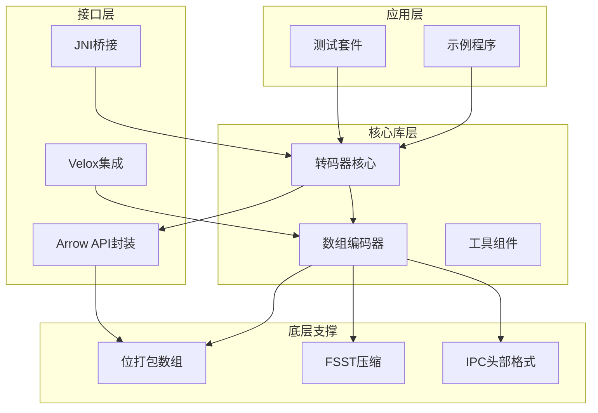

**图表来源**
- [README.md:1-378](file://README.md#L1-L378)
- [transcoder_arrow.cpp:1-746](file://src/transcoder_arrow.cpp#L1-L746)

**章节来源**
- [README.md:1-378](file://README.md#L1-L378)

## 核心组件

### 转码器核心架构

转码器采用双层架构设计，既支持独立的裸缓冲区操作，也提供与 Arrow 生态系统的无缝集成：

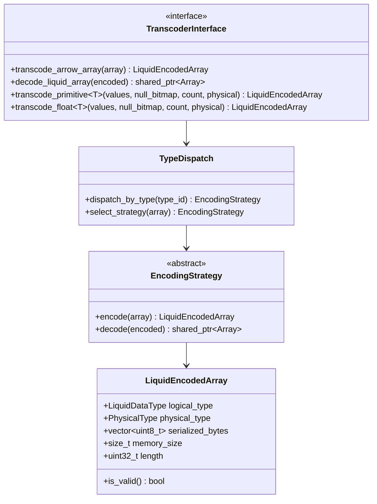

**图表来源**
- [transcoder.h:23-360](file://include/liquid_cache/transcoder.h#L23-L360)

### 编码策略选择机制

转码器实现了智能的编码策略选择机制，根据不同数据类型和特征自动选择最优的编码算法：

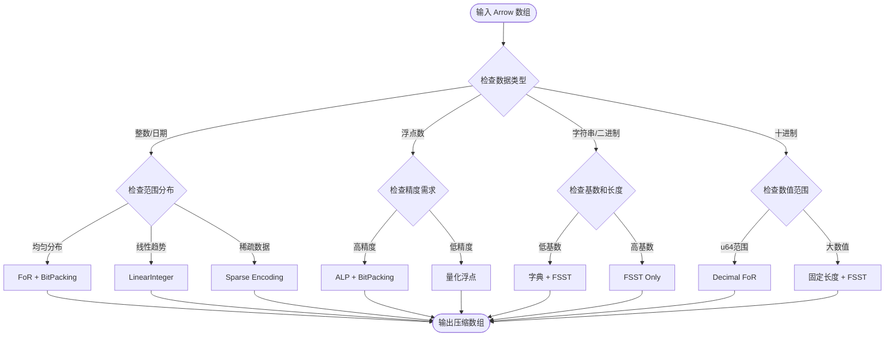

**图表来源**
- [transcoder_arrow.cpp:44-351](file://src/transcoder_arrow.cpp#L44-L351)
- [transcoder.h:86-342](file://include/liquid_cache/transcoder.h#L86-L342)

**章节来源**
- [transcoder_arrow.cpp:44-351](file://src/transcoder_arrow.cpp#L44-L351)
- [transcoder.h:86-342](file://include/liquid_cache/transcoder.h#L86-L342)

## 架构概览

### 整体系统架构

转码器采用分层架构设计，从底层的数据结构到上层的应用接口形成了完整的数据处理流水线：

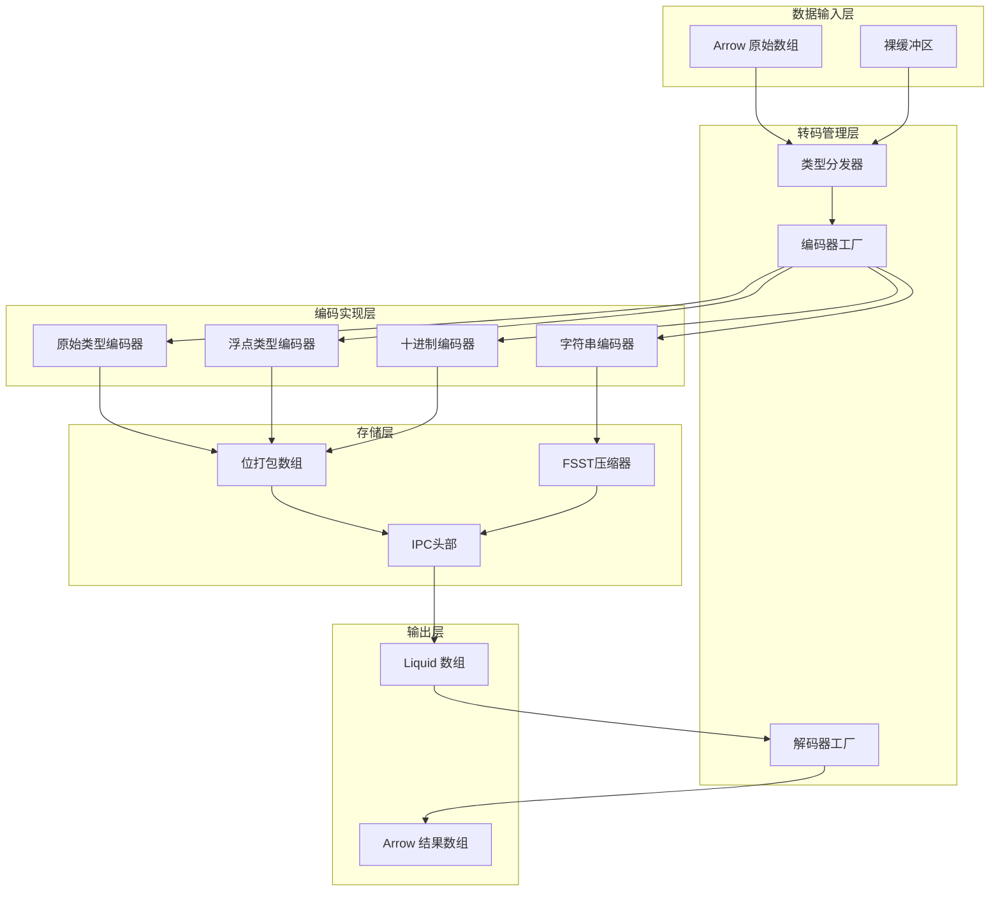

**图表来源**
- [transcoder_arrow.cpp:44-658](file://src/transcoder_arrow.cpp#L44-L658)
- [liquid_arrays.h:95-248](file://include/liquid_cache/liquid_arrays.h#L95-L248)

### 内存布局优化策略

转码器在内存布局方面采用了多项优化技术：

1. **8字节对齐**: 所有序列化数据都进行8字节对齐，提高内存访问效率
2. **连续内存块**: 位打包数据采用连续内存布局，减少内存碎片
3. **零拷贝设计**: 支持零拷贝的 Arrow 数组转换
4. **缓存友好的数据结构**: 采用适合 CPU 缓存的数据布局

**章节来源**
- [transcoder_arrow.cpp:186-191](file://src/transcoder_arrow.cpp#L186-L191)
- [liquid_byte_view_array.h:414-478](file://include/liquid_cache/liquid_byte_view_array.h#L414-L478)

## 详细组件分析

### 位打包数组组件

位打包数组是转码器的核心数据结构，提供了高效的位级数据存储和访问能力：

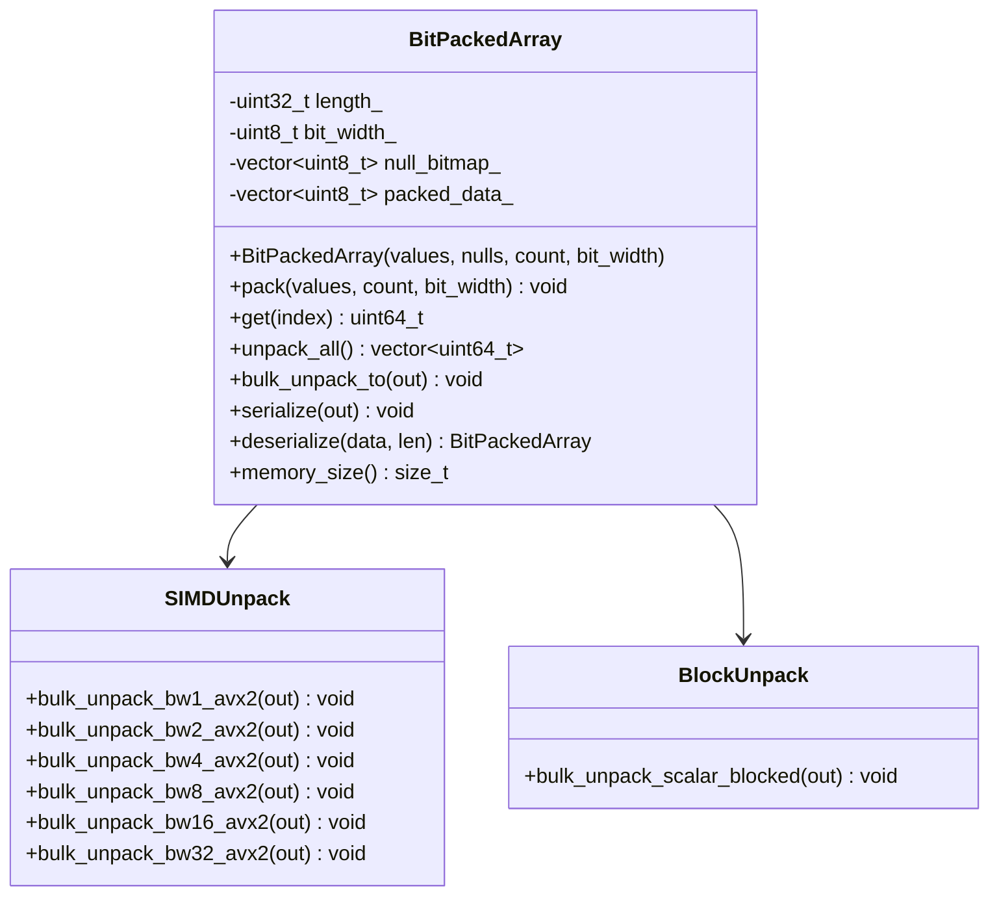

**图表来源**
- [bit_packed_array.h:39-486](file://include/liquid_cache/bit_packed_array.h#L39-L486)

#### 性能特性分析

位打包数组实现了多种解包策略以优化不同位宽下的性能：

| 位宽 | SIMD实现 | 性能特点 | 适用场景 |
|------|----------|----------|----------|
| 1位 | AVX2向量化 | 256元素/32字节 | 布尔值、稀疏数据 |
| 2位 | AVX2向量化 | 128元素/32字节 | 小整数、状态标志 |
| 4位 | AVX2向量化 | 64元素/32字节 | 小范围计数 |
| 8位 | AVX2向量化 | 32元素/32字节 | 字节值、字符编码 |
| 16位 | AVX2向量化 | 16元素/32字节 | 短整数、坐标值 |
| 32位 | AVX2向量化 | 8元素/32字节 | 整数、浮点数尾数 |
| 其他 | 标量回退 | 可变性能 | 特殊位宽 |

**章节来源**
- [bit_packed_array.h:249-444](file://include/liquid_cache/bit_packed_array.h#L249-L444)

### 浮点类型编码器

浮点类型编码器实现了自适应无损浮点(ALP)编码算法，能够根据数据特征自动选择最优的指数参数：

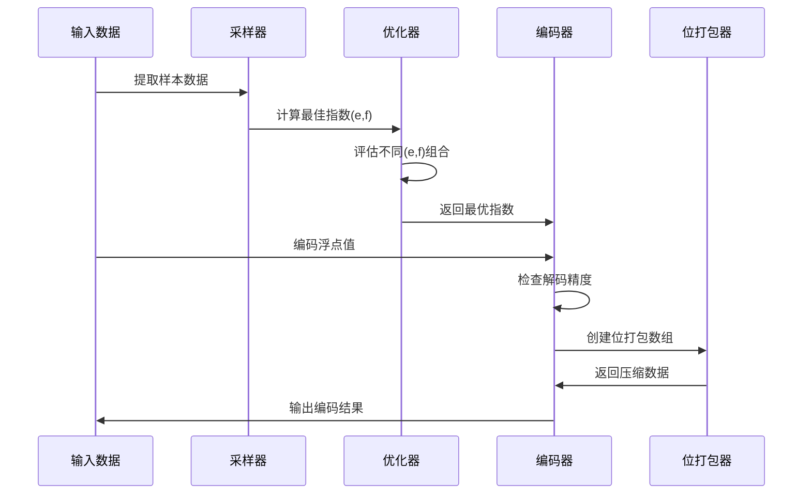

**图表来源**
- [liquid_arrays.h:705-799](file://include/liquid_cache/liquid_arrays.h#L705-L799)

#### ALP编码算法详解

ALP(自适应无损浮点)编码通过以下步骤实现高效压缩：

1. **指数搜索**: 在预定义范围内搜索最优的指数参数(e, f)
2. **精度评估**: 计算不同参数组合的解码误差和压缩率
3. **位宽计算**: 基于编码后的最大值计算所需的位宽
4. **补丁记录**: 记录解码精度不足的位置和原始值

**章节来源**
- [liquid_arrays.h:966-1010](file://include/liquid_cache/liquid_arrays.h#L966-L1010)

### 字符串类型编码器

字符串类型编码器结合了字典压缩和FSST压缩技术，针对不同基数的数据提供最优的压缩策略：

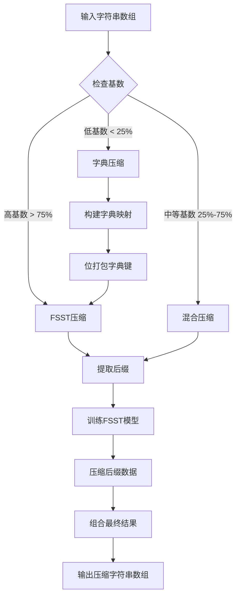

**图表来源**
- [liquid_byte_view_array.h:209-353](file://include/liquid_cache/liquid_byte_view_array.h#L209-L353)

#### FSST压缩优化

FSST(Fast Static Symbol Table)压缩在字符串编码中发挥重要作用：

1. **共享前缀提取**: 自动识别字典值之间的共享前缀
2. **线性回归偏移**: 使用线性回归压缩字典值的偏移量
3. **符号表管理**: 高效的符号表训练和存储
4. **缓存机制**: 避免重复的FSST解压缩操作

**章节来源**
- [liquid_byte_view_array.h:46-164](file://include/liquid_cache/liquid_byte_view_array.h#L46-L164)

### 十进制类型编码器

十进制类型编码器针对不同精度的十进制数据提供了灵活的编码策略：

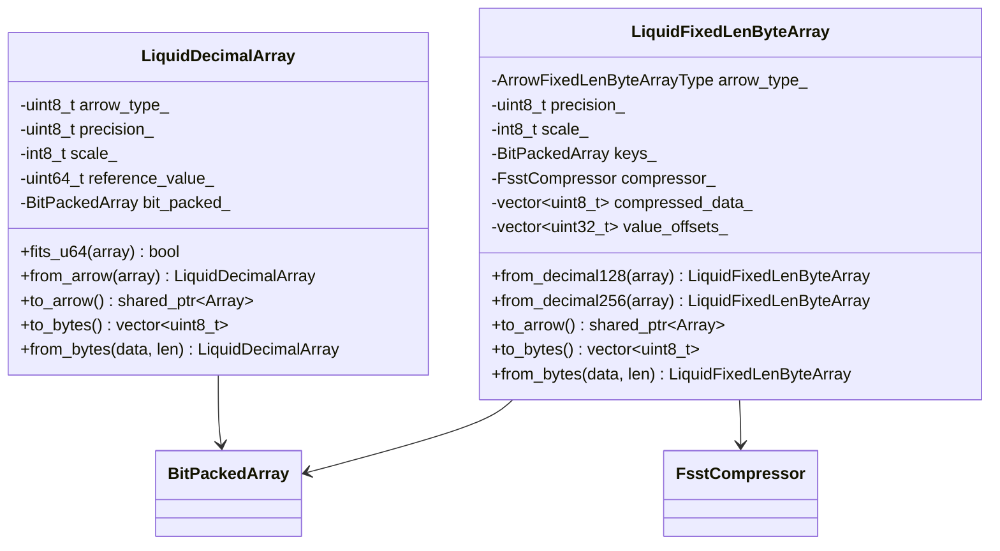

**图表来源**
- [liquid_decimal_array.h:69-404](file://include/liquid_cache/liquid_decimal_array.h#L69-L404)
- [liquid_fixed_len_byte_array.h:111-531](file://include/liquid_cache/liquid_fixed_len_byte_array.h#L111-L531)

**章节来源**
- [liquid_decimal_array.h:74-104](file://include/liquid_cache/liquid_decimal_array.h#L74-L104)
- [liquid_fixed_len_byte_array.h:292-296](file://include/liquid_cache/liquid_fixed_len_byte_array.h#L292-L296)

## 依赖关系分析

### 组件耦合度分析

转码器的组件设计遵循了高内聚、低耦合的原则：

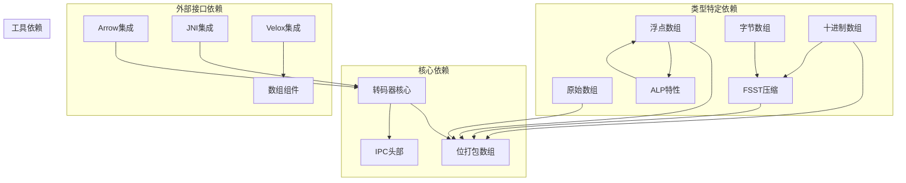

**图表来源**
- [transcoder_arrow.cpp:18-26](file://src/transcoder_arrow.cpp#L18-L26)
- [liquid_arrays.h:22-24](file://include/liquid_cache/liquid_arrays.h#L22-L24)

### 类型分发机制

转码器实现了基于 Arrow 类型系统的智能分发机制：

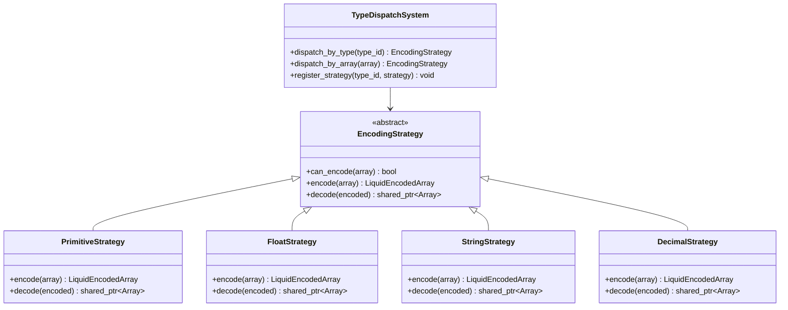

**图表来源**
- [transcoder_arrow.cpp:44-351](file://src/transcoder_arrow.cpp#L44-L351)
- [transcoder.h:41-58](file://include/liquid_cache/transcoder.h#L41-L58)

**章节来源**
- [transcoder_arrow.cpp:44-351](file://src/transcoder_arrow.cpp#L44-L351)
- [transcoder.h:41-58](file://include/liquid_cache/transcoder.h#L41-L58)

## 性能考虑

### 批处理优化策略

转码器在设计时充分考虑了批量处理的性能优化：

1. **内存预分配**: 在编码前预先估算并分配足够的内存空间
2. **向量化操作**: 利用SIMD指令集加速批量数据处理
3. **零拷贝转换**: 在可能的情况下避免不必要的数据复制
4. **缓存友好**: 采用适合CPU缓存的数据布局

### 并行化可能性

虽然当前实现主要面向单线程优化，但转码器架构为未来的并行化提供了良好的基础：

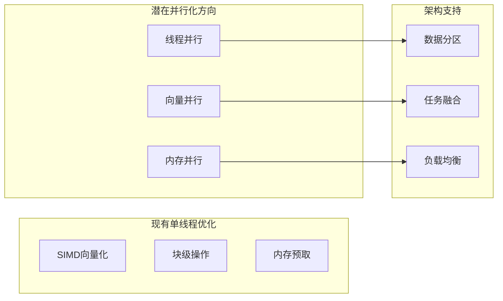

### 内存管理策略

转码器采用了多层次的内存管理策略：

1. **栈上局部变量**: 小规模临时数据使用栈内存
2. **向量预分配**: 大规模数据提前分配容量
3. **智能指针管理**: 自动内存生命周期管理
4. **缓存重用**: 复用昂贵的计算结果

## 故障排除指南

### 常见问题诊断

#### Arrow依赖问题

**问题**: 构建时出现"min_max函数未注册"错误
**原因**: 链接器丢弃了Arrow库中的静态初始化器
**解决方案**: 确保使用`-Wl,--whole-archive`包裹Arrow库

#### 类型不匹配问题

**问题**: 编码后的数据解码失败
**原因**: 物理类型与逻辑类型不匹配
**解决方案**: 检查IPC头部中的类型标识符

#### 内存不足问题

**问题**: 大数据集编码时内存溢出
**原因**: 未正确预分配内存或数据量过大
**解决方案**: 使用流式处理或增加内存限制

**章节来源**
- [README.md:347-378](file://README.md#L347-L378)

### 性能调优建议

1. **批大小优化**: 根据数据特征调整批处理大小
2. **位宽选择**: 为不同数据类型选择最优的位宽
3. **缓存策略**: 合理利用字典缓存和FSST缓存
4. **内存对齐**: 确保数据按8字节对齐以获得最佳性能

## 结论

Liquid Cache C++ 转码器通过其精心设计的架构，在数据压缩率、解码性能和易用性之间取得了优秀的平衡。其核心优势包括：

1. **智能编码策略**: 自动选择最适合的编码算法
2. **高性能实现**: 利用SIMD指令集和优化的数据结构
3. **完整的生态系统**: 与Arrow、JNI、Velox等生态系统的无缝集成
4. **可扩展架构**: 清晰的接口设计便于添加新的编码算法

该转码器特别适用于需要高性能列式数据处理的应用场景，如数据分析、机器学习和实时查询系统。

## 附录

### 使用示例

以下是一个完整的转码流程示例：

```cpp
// 1. 从Parquet文件读取数据
auto reader = ParquetFileReader::OpenFile(file_path);
auto schema = reader->schema();
auto batch_reader = reader->get_record_batch_reader();

// 2. 逐批转码为Liquid格式
std::vector<LiquidEncodedArray> liquid_arrays;
while (true) {
    auto batch = batch_reader->read_next();
    if (!batch) break;
    
    for (int i = 0; i < batch->num_columns(); ++i) {
        auto liquid = transcode_arrow_array(batch->column(i));
        liquid_arrays.push_back(liquid);
    }
}

// 3. 存储到缓存中
for (size_t i = 0; i < liquid_arrays.size(); ++i) {
    cache.store(key, liquid_arrays[i]);
}

// 4. 解码回Arrow格式
auto decoded = decode_liquid_array(liquid_arrays[0]);
```

### 接口参考

转码器提供了丰富的接口供不同使用场景：

- **独立缓冲区接口**: `transcode_primitive<T>()`, `transcode_float<T>()`
- **Arrow集成接口**: `transcode_arrow_array()`, `decode_liquid_array()`
- **内存结构接口**: `transcode_to_liquid_array()`
- **批量处理接口**: `transcode_record_batch()`

这些接口确保了转码器既能满足高性能要求，又能保持良好的易用性。