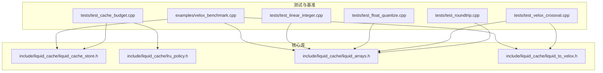
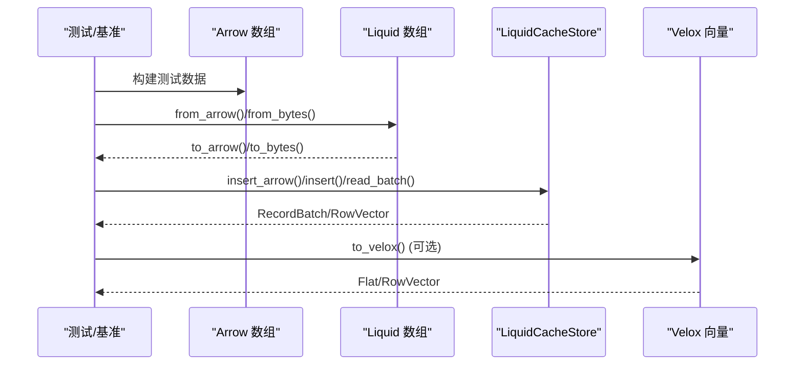
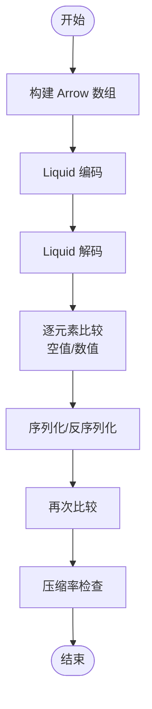
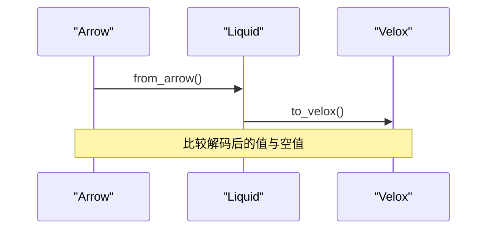
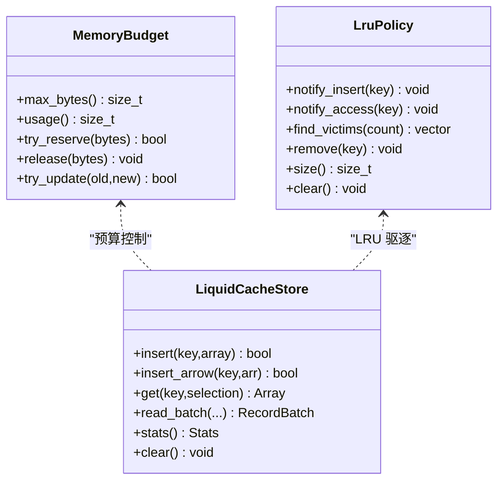
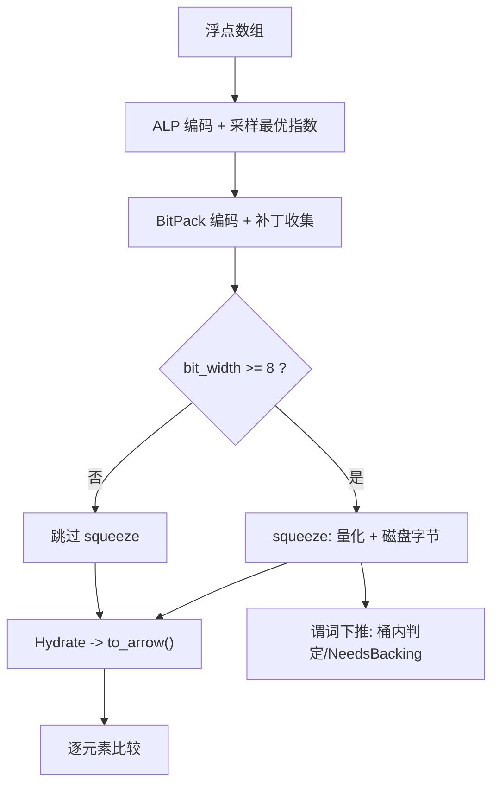
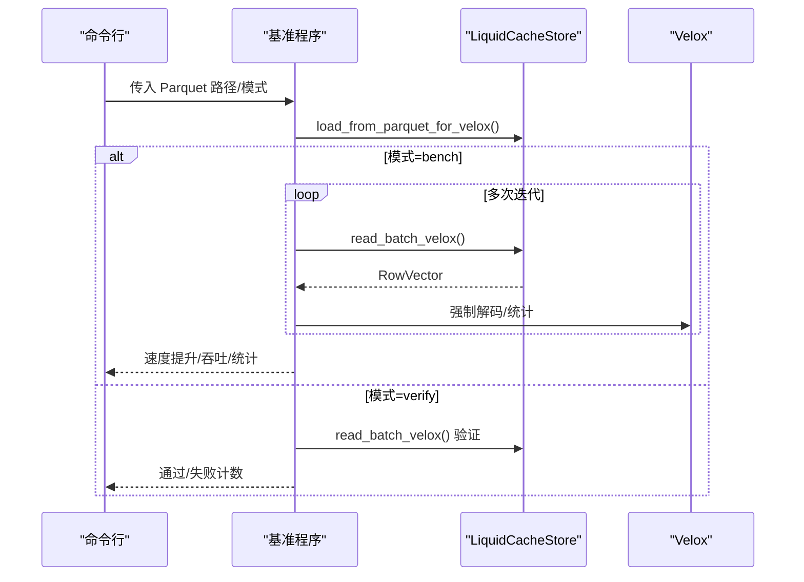
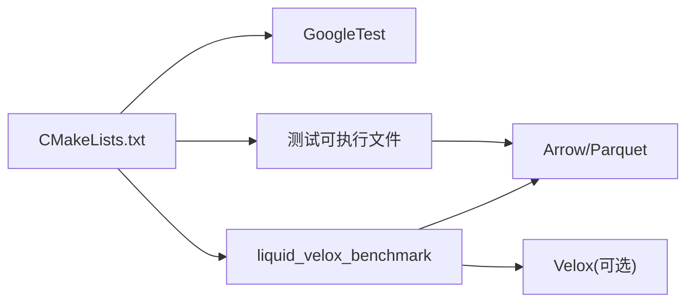

# 测试与基准测试

<cite>
**本文档引用的文件**
- [CMakeLists.txt](file://CMakeLists.txt)
- [README.md](file://README.md)
- [test_roundtrip.cpp](file://tests/test_roundtrip.cpp)
- [test_velox_crossval.cpp](file://tests/test_velox_crossval.cpp)
- [test_cache_budget.cpp](file://tests/test_cache_budget.cpp)
- [test_float_quantize.cpp](file://tests/test_float_quantize.cpp)
- [test_linear_integer.cpp](file://tests/test_linear_integer.cpp)
- [velox_benchmark.cpp](file://examples/velox_benchmark.cpp)
- [liquid_cache_store.h](file://include/liquid_cache/liquid_cache_store.h)
- [lru_policy.h](file://include/liquid_cache/lru_policy.h)
- [liquid_arrays.h](file://include/liquid_cache/liquid_arrays.h)
- [liquid_to_velox.h](file://include/liquid_cache/liquid_to_velox.h)
</cite>

## 目录
1. [简介](#简介)
2. [项目结构](#项目结构)
3. [核心组件](#核心组件)
4. [架构总览](#架构总览)
5. [详细组件分析](#详细组件分析)
6. [依赖关系分析](#依赖关系分析)
7. [性能考量](#性能考量)
8. [故障排查指南](#故障排查指南)
9. [结论](#结论)
10. [附录](#附录)

## 简介
本指南面向测试与基准测试，系统性阐述 liquid-cache-cpp 的测试框架与实践方法，涵盖：
- 单元测试：roundtrip 正确性、跨引擎一致性、缓存预算与 LRU 驱逐、浮点量化与谓词下推、线性整数编码等
- 集成测试：Arrow → Liquid → Velox 转换一致性验证
- 性能基准测试：内存中 Parquet 数据驱动的 Velox 向量读取对比，含统计分析与结果解读
- 运行与扩展：如何构建、运行测试与基准，以及新增测试用例的最佳实践

## 项目结构
测试与基准相关的关键位置如下：
- tests/：单元与集成测试源码目录
  - test_roundtrip.cpp：各类数据类型的 roundtrip 正确性测试
  - test_velox_crossval.cpp：Arrow → Liquid → Velox 一致性交叉验证
  - test_cache_budget.cpp：MemoryBudget、LruPolicy、LiquidCacheStore 预算与驱逐
  - test_float_quantize.cpp：浮点量化 squeeze 与谓词下推
  - test_linear_integer.cpp：线性整数编码 roundtrip 与序列化
- examples/：性能基准示例
  - velox_benchmark.cpp：内存中 Parquet → Velox 与 Liquid Cache → Velox 的对比基准
- include/liquid_cache/：核心组件头文件
  - liquid_cache_store.h：缓存存储、列投影、行过滤、批量读取
  - lru_policy.h：内存预算与 LRU 策略
  - liquid_arrays.h：各类 Liquid 数组类型与序列化接口
  - liquid_to_velox.h：Liquid → Velox 类型映射与转换工具
- CMakeLists.txt：测试目标构建、发现与运行配置

**图表来源**
- [CMakeLists.txt](file://CMakeLists.txt)
- [test_roundtrip.cpp](file://tests/test_roundtrip.cpp)
- [test_velox_crossval.cpp](file://tests/test_velox_crossval.cpp)
- [test_cache_budget.cpp](file://tests/test_cache_budget.cpp)
- [test_float_quantize.cpp](file://tests/test_float_quantize.cpp)
- [test_linear_integer.cpp](file://tests/test_linear_integer.cpp)
- [velox_benchmark.cpp](file://examples/velox_benchmark.cpp)
- [liquid_cache_store.h](file://include/liquid_cache/liquid_cache_store.h)
- [lru_policy.h](file://include/liquid_cache/lru_policy.h)
- [liquid_arrays.h](file://include/liquid_cache/liquid_arrays.h)
- [liquid_to_velox.h](file://include/liquid_cache/liquid_to_velox.h)

**章节来源**
- [CMakeLists.txt](file://CMakeLists.txt)
- [README.md](file://README.md)

## 核心组件
- 测试框架
  - GoogleTest：通过 FetchContent 引入，启用测试功能后自动 discover 测试目标
  - 多个独立可执行测试：覆盖 roundtrip、跨引擎一致性、缓存预算、浮点量化、线性整数等
- 基准测试
  - examples/velox_benchmark.cpp：以内存中 Parquet 数据为输入，对比 Velox Parquet Reader 与 Liquid Cache → Velox 的性能
- 核心数据结构
  - LiquidPrimitiveArray/LiquidFloatArray/LiquidLinearIntegerArray：编码/解码、序列化/反序列化、内存大小估算
  - LiquidCacheStore：列式缓存、列投影、行过滤、批量读取、预算控制与 LRU 驱逐
  - MemoryBudget/LruPolicy：无锁原子预算与经典 LRU 策略

**章节来源**
- [CMakeLists.txt](file://CMakeLists.txt)
- [liquid_cache_store.h](file://include/liquid_cache/liquid_cache_store.h)
- [lru_policy.h](file://include/liquid_cache/lru_policy.h)
- [liquid_arrays.h](file://include/liquid_cache/liquid_arrays.h)

## 架构总览
测试与基准围绕"Arrow 原始数据 → Liquid 编码 → 解码/转换"的主路径展开，同时提供与 Velox 的直接转换能力。

**图表来源**
- [test_roundtrip.cpp](file://tests/test_roundtrip.cpp)
- [test_velox_crossval.cpp](file://tests/test_velox_crossval.cpp)
- [liquid_cache_store.h](file://include/liquid_cache/liquid_cache_store.h)
- [liquid_arrays.h](file://include/liquid_cache/liquid_arrays.h)
- [liquid_to_velox.h](file://include/liquid_cache/liquid_to_velox.h)

## 详细组件分析

### Roundtrip 正确性测试（test_roundtrip.cpp）
- 设计原理
  - 对整数、日期、浮点、字符串/二进制、Decimal 等类型进行编码后再解码，逐元素比较值与空值位图，确保 roundtrip 完美还原
  - 验证序列化/反序列化路径的一致性
  - 压缩率合理性检查：对大范围整数与重复字符串，期望压缩后内存占用小于原始 Arrow
- 关键验证点
  - 元素级相等性与空值一致性
  - 边界情况：空数组、单元素、全常量值
  - 序列化 roundtrip：from_bytes/to_bytes
- 运行方式
  - 使用 gtest_discover_tests 自动发现并运行

**图表来源**
- [test_roundtrip.cpp](file://tests/test_roundtrip.cpp)
- [liquid_arrays.h](file://include/liquid_cache/liquid_arrays.h)

**章节来源**
- [test_roundtrip.cpp](file://tests/test_roundtrip.cpp)

### 跨引擎一致性验证（test_velox_crossval.cpp）
- 设计原理
  - Arrow → Liquid → Velox 路径与 Arrow → Velox 路径对比，确保数值与空值一致
  - 支持整数、日期、浮点、字符串/二进制、Decimal 等类型
  - 使用 Velox 内存池与 LazyVector 强制解码，保证对比公平
- 关键验证点
  - 不同物理类型到 Velox 对应类型的映射
  - 有/无空值场景的逐元素比较
  - Decimal 超过 64 位时的 LongDecimal 处理
- 运行方式
  - 仅在启用 LIQUID_ENABLE_VELOX 且提供 VELOX_PREFIX 时编译与运行

**图表来源**
- [test_velox_crossval.cpp](file://tests/test_velox_crossval.cpp)
- [liquid_arrays.h](file://include/liquid_cache/liquid_arrays.h)
- [liquid_to_velox.h](file://include/liquid_cache/liquid_to_velox.h)

**章节来源**
- [test_velox_crossval.cpp](file://tests/test_velox_crossval.cpp)

### 缓存预算与 LRU 驱逐（test_cache_budget.cpp）
- 设计原理
  - 验证 MemoryBudget 的原子预留/释放/更新
  - 验证 LruPolicy 的插入、访问移动至 MRU、按 LRU 选择驱逐项
  - 验证 LiquidCacheStore 在预算约束下的插入、驱逐、查询与统计信息
- 关键验证点
  - 预算超限拒绝插入
  - 更新条目大小变化的预算调整
  - 访问提升避免被驱逐
  - 多次驱逐直至满足空间需求
  - 统计信息：条目数、内存占用、预算上限/使用量
- 运行方式
  - 独立可执行程序，输出通过/失败计数

**图表来源**
- [test_cache_budget.cpp](file://tests/test_cache_budget.cpp)
- [liquid_cache_store.h](file://include/liquid_cache/liquid_cache_store.h)
- [lru_policy.h](file://include/liquid_cache/lru_policy.h)

**章节来源**
- [test_cache_budget.cpp](file://tests/test_cache_budget.cpp)
- [liquid_cache_store.h](file://include/liquid_cache/liquid_cache_store.h)
- [lru_policy.h](file://include/liquid_cache/lru_policy.h)

### 浮点量化与谓词下推（test_float_quantize.cpp）
- 设计原理
  - 对满足条件的浮点数组执行 squeeze，生成量化数组与磁盘字节；Hydrate 后与原数组逐元素比较
  - 验证谓词下推：对量化数组尝试在桶范围内快速判定比较结果，无法判定时返回"需要后备"以加载完整数据
  - 检查内存占用减少与边界情况（空、全空、小范围）
- 关键验证点
  - squeeze 返回值与 Hydrate 一致性
  - 谓词在确定区间内直接判定，否则返回 NeedsBacking
  - 内存大小减少验证

**图表来源**
- [test_float_quantize.cpp](file://tests/test_float_quantize.cpp)
- [liquid_arrays.h](file://include/liquid_cache/liquid_arrays.h)

**章节来源**
- [test_float_quantize.cpp](file://tests/test_float_quantize.cpp)
- [liquid_arrays.h](file://include/liquid_cache/liquid_arrays.h)

### 线性整数编码（test_linear_integer.cpp）
- 设计原理
  - 对近似线性序列拟合 L∞ 线性模型，残差用 LiquidPrimitiveArray 编码
  - 验证 roundtrip 与序列化 roundtrip，覆盖多种整数/日期类型与空值
  - 压缩率对比：单调序列下线性编码优于普通原生编码
- 关键验证点
  - 模型参数（截距、斜率）与残差一致性
  - 序列化/反序列化一致性
  - 压缩率对比测试

**章节来源**
- [test_linear_integer.cpp](file://tests/test_linear_integer.cpp)
- [liquid_arrays.h](file://include/liquid_cache/liquid_arrays.h)

### 性能基准测试（examples/velox_benchmark.cpp）
- 设计原理
  - 以内存中 Parquet 文件为输入，分别对比两条路径：
    - Velox Parquet Reader → Velox Vector（内存中读取）
    - Liquid Cache → Velox Vector（已转码缓存）
  - 场景：单列、多列组合、全表；支持投影与过滤
- 性能指标与统计
  - 时间采样：多次迭代，预热若干轮
  - 统计分析：均值、中位数、标准差、5%/95% 分位、95% 置信区间半宽
  - 吞吐：行/秒、估算 MB/秒（基于列数与平均宽度）
  - 速度提升：Liquid Cache 相对于 Velox Parquet Reader 的加速比
- 结果解读
  - 若置信区间重叠或差异不显著，需增加样本或检查系统噪声
  - 低压缩率场景下，Liquid 的额外解码成本可能抵消收益
  - 大批量重复字符串/整数等高可压缩数据更易体现优势

**图表来源**
- [velox_benchmark.cpp](file://examples/velox_benchmark.cpp)
- [liquid_cache_store.h](file://include/liquid_cache/liquid_cache_store.h)
- [liquid_to_velox.h](file://include/liquid_cache/liquid_to_velox.h)

**章节来源**
- [velox_benchmark.cpp](file://examples/velox_benchmark.cpp)

## 依赖关系分析
- 构建与测试
  - 通过 CMake 选项控制是否构建测试与 Velox 集成
  - GoogleTest 通过 FetchContent 获取并在启用测试时自动 discover
  - Velox 集成需设置 VELOX_PREFIX，否则仅编译基础测试
- 运行时依赖
  - Arrow/Parquet：用于构建测试数据与验证
  - Velox（可选）：用于交叉验证与基准测试

**图表来源**
- [CMakeLists.txt](file://CMakeLists.txt)

**章节来源**
- [CMakeLists.txt](file://CMakeLists.txt)

## 性能考量
- 压缩策略选择
  - 整数/日期：Frame-of-Reference + BitPacking
  - 浮点：ALP + BitPacking，必要时 squeeze 量化并落盘补丁
  - 字符串/二进制：字典 + FSST 压缩（由上层转码流程决定）
- 预算与驱逐
  - MemoryBudget 使用原子操作，避免锁竞争
  - LruPolicy 使用双向链表+哈希，LRU 驱逐高效
- 基准测试建议
  - 控制样本数量与预热轮数，使用稳健统计（MAD 去异常）
  - 针对不同数据分布（高基数/低基数、重复度、范围）设计场景
  - 关注内存占用与 CPU 利用率，避免 I/O 干扰

## 故障排查指南
- 测试未发现或无法运行
  - 确认已启用构建测试选项与相应依赖
  - 检查 gtest_discover_tests 是否成功注册目标
- Velox 相关测试失败
  - 确认已开启 LIQUID_ENABLE_VELOX 并正确设置 VELOX_PREFIX
  - 检查内存池初始化与 LazyVector 强制解码
- 缓存预算相关问题
  - 检查 max_cache_bytes 设置与实际条目大小
  - 观察驱逐是否按 LRU 顺序发生
- 浮点量化失败
  - 确认 bit_width 条件满足（>=8）才进行 squeeze
  - 检查谓词下推返回 NeedsBacking 的场景是否正确处理
- 基准测试不稳定
  - 增加迭代次数与预热轮数
  - 清理系统缓存与干扰进程，确保 CPU 频率稳定

**章节来源**
- [CMakeLists.txt](file://CMakeLists.txt)
- [test_velox_crossval.cpp](file://tests/test_velox_crossval.cpp)
- [test_cache_budget.cpp](file://tests/test_cache_budget.cpp)
- [test_float_quantize.cpp](file://tests/test_float_quantize.cpp)
- [velox_benchmark.cpp](file://examples/velox_benchmark.cpp)

## 结论
本测试与基准体系覆盖了从数据正确性到跨引擎一致性，再到性能对比的完整闭环。通过 roundtrip、交叉验证与预算/驱逐测试，确保编码/解码与缓存行为符合预期；通过基准测试，量化 Liquid Cache 在内存中读取场景下的性能表现与优化空间。建议在持续集成中定期运行所有测试，并针对关键场景补充更多数据分布与边界用例。

## 附录

### 如何运行现有测试与基准
- 构建测试
  - 启用测试：在 CMake 配置中设置 -DLIQUID_BUILD_TESTS=ON
  - 可选启用 Velox：-DLIQUID_ENABLE_VELOX=ON -DVELOX_PREFIX=/path/to/velox/build
- 运行测试
  - 使用 CTest 发现并运行：ctest 或 ./liquid_cache_tests
  - 单独运行各测试可执行文件：./liquid_velox_tests、./liquid_cache_budget_test 等
- 运行基准
  - 构建 liquid_velox_benchmark：cmake --build . --target liquid_velox_benchmark
  - 运行：./liquid_velox_benchmark <parquet_path> [mode]，其中 mode 可为 bench 或 verify

**章节来源**
- [CMakeLists.txt](file://CMakeLists.txt)
- [README.md](file://README.md)

### 新增测试用例最佳实践
- 选择合适测试类型
  - 数据正确性：参考 test_roundtrip.cpp 的 assert_roundtrip 与逐元素比较
  - 跨引擎一致性：参考 test_velox_crossval.cpp 的 to_velox 与值比较
  - 预算与驱逐：参考 test_cache_budget.cpp 的预算/驱逐断言
  - 特定算法：参考 test_float_quantize.cpp 的 squeeze 与谓词下推
- 编写与组织
  - 将新测试放入 tests/ 下，命名清晰反映测试目的
  - 在 CMakeLists.txt 中添加对应可执行目标与 gtest_discover_tests
  - 使用合理的数据规模与边界条件，覆盖空值、全空、单元素、常量等
- 基准测试扩展
  - 在 examples/velox_benchmark.cpp 中扩展场景集合与列组合
  - 注意统计稳健性与系统环境一致性

**章节来源**
- [CMakeLists.txt](file://CMakeLists.txt)
- [test_roundtrip.cpp](file://tests/test_roundtrip.cpp)
- [test_velox_crossval.cpp](file://tests/test_velox_crossval.cpp)
- [test_cache_budget.cpp](file://tests/test_cache_budget.cpp)
- [test_float_quantize.cpp](file://tests/test_float_quantize.cpp)
- [test_linear_integer.cpp](file://tests/test_linear_integer.cpp)
- [velox_benchmark.cpp](file://examples/velox_benchmark.cpp)