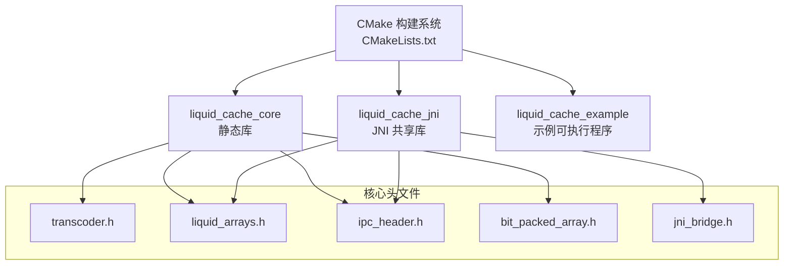
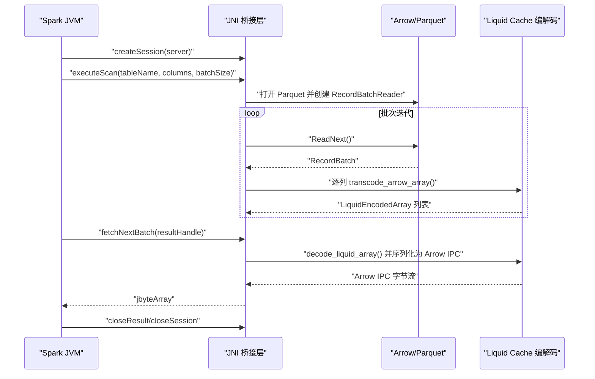
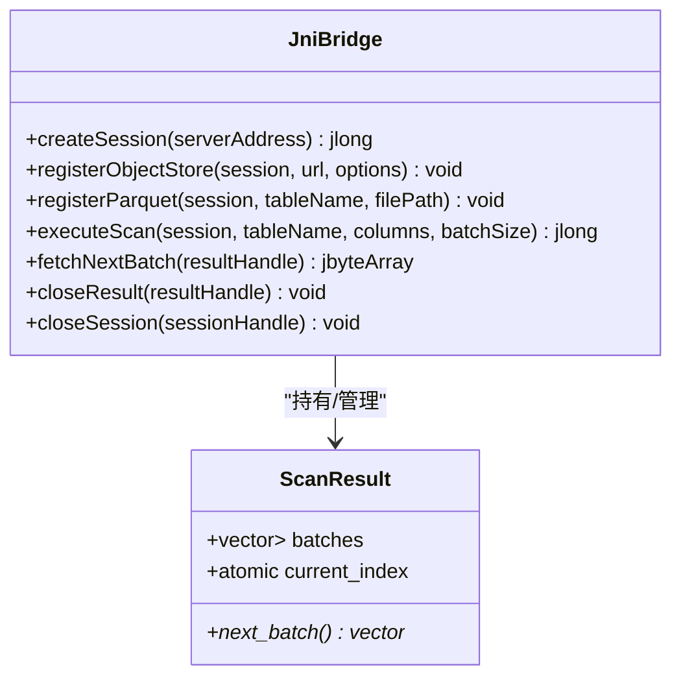
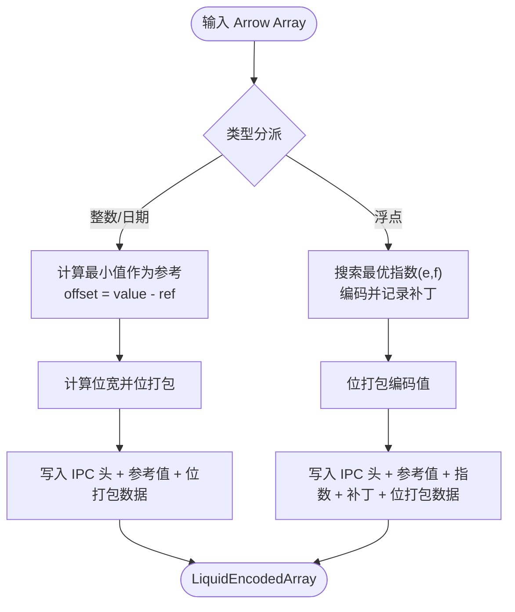
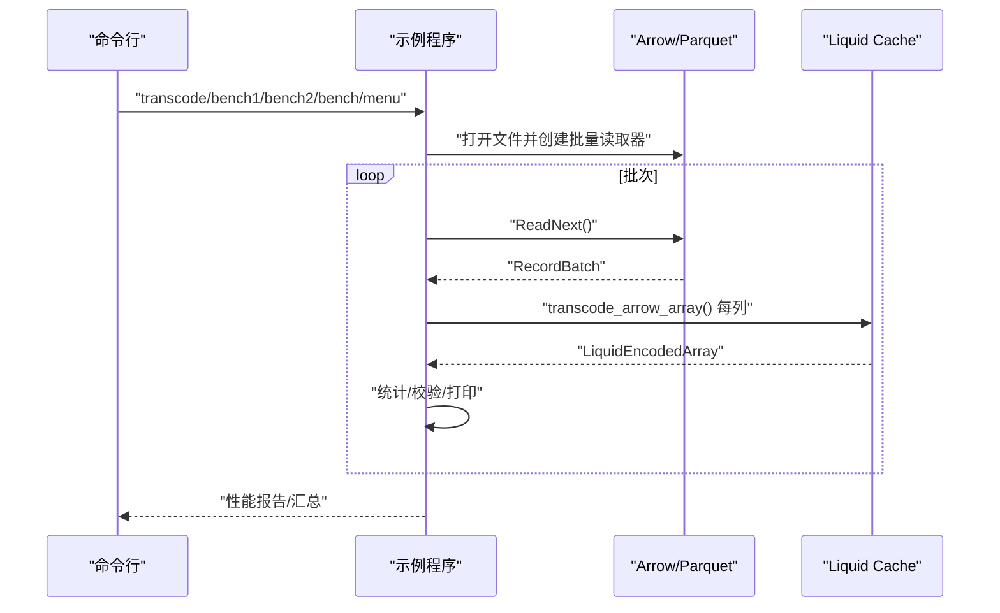
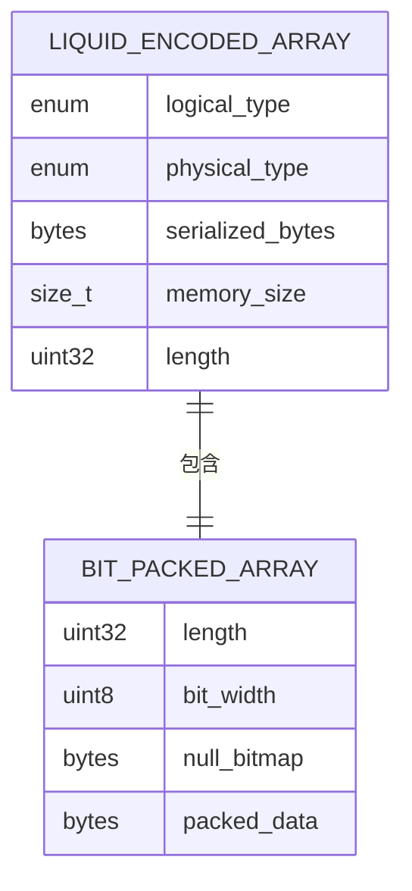
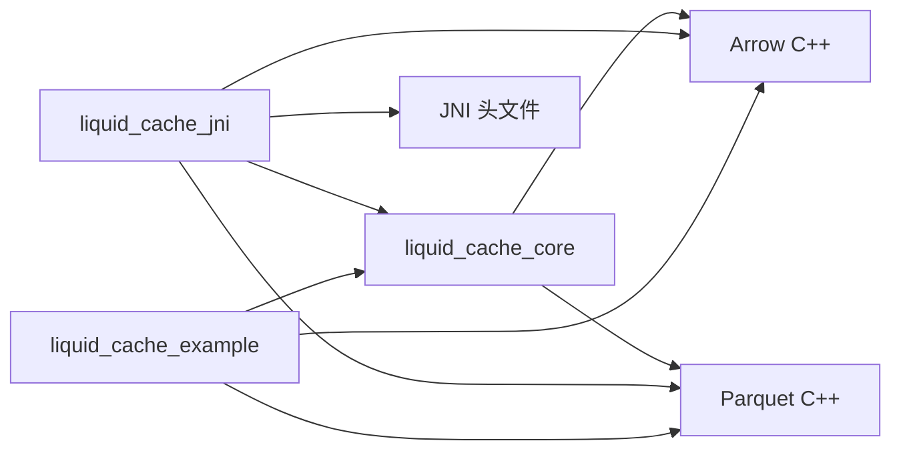

# Spark 集成示例

<cite>
**本文引用的文件**
- [CMakeLists.txt](file://CMakeLists.txt)
- [transcode_example.cpp](file://examples/transcode_example.cpp)
- [jni_bridge.cpp](file://src/jni_bridge.cpp)
- [transcoder_arrow.cpp](file://src/transcoder_arrow.cpp)
- [jni_bridge.h](file://include/liquid_cache/jni_bridge.h)
- [transcoder.h](file://include/liquid_cache/transcoder.h)
- [liquid_arrays.h](file://include/liquid_cache/liquid_arrays.h)
- [ipc_header.h](file://include/liquid_cache/ipc_header.h)
- [bit_packed_array.h](file://include/liquid_cache/bit_packed_array.h)
- [debug.txt](file://debug.txt)
</cite>

## 目录
1. [简介](#简介)
2. [项目结构](#项目结构)
3. [核心组件](#核心组件)
4. [架构总览](#架构总览)
5. [详细组件分析](#详细组件分析)
6. [依赖关系分析](#依赖关系分析)
7. [性能考量](#性能考量)
8. [故障排除指南](#故障排除指南)
9. [结论](#结论)
10. [附录](#附录)

## 简介
本文件面向在 Apache Spark 环境中集成 Liquid Cache 的开发者，提供从数据加载、转换到查询执行的端到端示例说明。基于仓库中的 JNI 桥接层与 Arrow/Parquet 编解码实现，展示如何在 Spark 中通过 JNI 调用 C++ 实现的 Liquid Cache 编解码能力，完成列式数据的高效压缩与快速读取。文档同时涵盖 Spark 应用配置、JVM 参数调优与内存管理策略，并给出与 Spark 生态（Delta Lake、Hive）的集成思路。

## 项目结构
该仓库采用 CMake 构建，主要目标包括：
- liquid_cache_core：纯 C++ 核心库（静态），提供 Arrow 无关的转码 API 与 Arrow 适配层
- liquid_cache_jni：JNI 共享库，暴露给 Spark JVM 使用
- liquid_cache_example：示例可执行程序，演示 Parquet → Liquid Cache 的转码与基准测试

**图表来源**
- [CMakeLists.txt:133-179](file://CMakeLists.txt#L133-L179)
- [transcoder.h:1-345](file://include/liquid_cache/transcoder.h#L1-L345)
- [liquid_arrays.h:1-580](file://include/liquid_cache/liquid_arrays.h#L1-L580)
- [ipc_header.h:1-118](file://include/liquid_cache/ipc_header.h#L1-L118)
- [bit_packed_array.h:1-176](file://include/liquid_cache/bit_packed_array.h#L1-L176)
- [jni_bridge.h:1-217](file://include/liquid_cache/jni_bridge.h#L1-L217)

**章节来源**
- [CMakeLists.txt:1-179](file://CMakeLists.txt#L1-L179)

## 核心组件
- IPC 头与类型枚举：定义二进制格式头部、逻辑类型与物理类型标识，确保跨语言兼容性
- 基础编码器：提供原始缓冲区转码接口（整型、浮点型），支持帧差参考 + 位打包
- Arrow 适配层：将 Arrow 数组转为 Liquid Cache 格式，支持多种整数、日期、时间戳与浮点类型
- JNI 桥接层：在 JVM 侧暴露原生方法，负责会话管理、扫描执行、批次拉取与资源清理
- 示例程序：演示 Parquet 文件批量读取、逐批转码、往返校验与性能对比

**章节来源**
- [ipc_header.h:12-118](file://include/liquid_cache/ipc_header.h#L12-L118)
- [transcoder.h:66-345](file://include/liquid_cache/transcoder.h#L66-L345)
- [liquid_arrays.h:77-580](file://include/liquid_cache/liquid_arrays.h#L77-L580)
- [jni_bridge.h:25-217](file://include/liquid_cache/jni_bridge.h#L25-L217)
- [transcoder_arrow.cpp:26-286](file://src/transcoder_arrow.cpp#L26-L286)
- [jni_bridge.cpp:36-320](file://src/jni_bridge.cpp#L36-L320)
- [transcode_example.cpp:140-800](file://examples/transcode_example.cpp#L140-L800)

## 架构总览
下图展示了 Spark JVM 通过 JNI 调用 C++ 实现的数据路径：Parquet 文件经 Arrow Reader 读取为 RecordBatch，随后逐列转码为 Liquid Cache 格式；在读取阶段，再将 Liquid Cache 解码为 Arrow 并序列化为 Arrow IPC 流返回给 JVM。

**图表来源**
- [jni_bridge.cpp:51-126](file://src/jni_bridge.cpp#L51-L126)
- [jni_bridge.cpp:246-302](file://src/jni_bridge.cpp#L246-L302)
- [transcoder_arrow.cpp:36-209](file://src/transcoder_arrow.cpp#L36-L209)
- [transcoder_arrow.cpp:236-283](file://src/transcoder_arrow.cpp#L236-L283)
- [jni_bridge.h:42-94](file://include/liquid_cache/jni_bridge.h#L42-L94)

## 详细组件分析

### JNI 桥接层（liquid_cache_jni）
- 会话与结果句柄管理：分配原子自增句柄，全局线程安全存储会话与扫描结果
- 扫描执行：根据表名（即 Parquet 文件路径）读取指定列，按批次转码为 Liquid Cache
- 批次拉取：将已转码的列序列化为 Arrow IPC 字节流返回 JVM
- 资源清理：关闭结果与会话时释放对应资源

**图表来源**
- [jni_bridge.h:42-94](file://include/liquid_cache/jni_bridge.h#L42-L94)
- [jni_bridge.cpp:183-320](file://src/jni_bridge.cpp#L183-L320)

**章节来源**
- [jni_bridge.h:25-217](file://include/liquid_cache/jni_bridge.h#L25-L217)
- [jni_bridge.cpp:36-320](file://src/jni_bridge.cpp#L36-L320)

### Arrow 适配层（transcoder_arrow）
- 类型分派：针对整数、日期、时间戳、浮点等 Arrow 类型进行独立转码
- 整型/日期：帧差参考 + 位打包，生成紧凑的二进制表示
- 浮点：ALP 自适应无损编码 + 位打包，带补丁记录以保证精度
- 解码：依据 IPC 头信息反序列化并重建 Arrow 数组

**图表来源**
- [transcoder_arrow.cpp:36-209](file://src/transcoder_arrow.cpp#L36-L209)
- [transcoder.h:78-342](file://include/liquid_cache/transcoder.h#L78-L342)
- [liquid_arrays.h:91-227](file://include/liquid_cache/liquid_arrays.h#L91-L227)
- [liquid_arrays.h:318-577](file://include/liquid_cache/liquid_arrays.h#L318-L577)

**章节来源**
- [transcoder_arrow.cpp:26-286](file://src/transcoder_arrow.cpp#L26-L286)
- [transcoder.h:66-345](file://include/liquid_cache/transcoder.h#L66-L345)
- [liquid_arrays.h:77-580](file://include/liquid_cache/liquid_arrays.h#L77-L580)

### 示例程序（liquid_cache_example）
- 支持模式：转码展示、直接读取 Parquet 基准、Liquid Cache 读取基准、交互菜单
- 功能：递归扫描 Parquet 文件、逐批读取、转码统计、往返校验、性能报告
- 输出：文件级与全局汇总、压缩率、吞吐量、迭代耗时统计

**图表来源**
- [transcode_example.cpp:175-340](file://examples/transcode_example.cpp#L175-L340)
- [transcode_example.cpp:516-733](file://examples/transcode_example.cpp#L516-L733)

**章节来源**
- [transcode_example.cpp:140-800](file://examples/transcode_example.cpp#L140-L800)

### 数据模型与 IPC 格式
- IPC 头：固定 16 字节，包含魔数、版本、逻辑类型与物理类型
- 位打包数组：以块为单位存储，支持空值位图与 8 字节对齐
- 编码数组：整型/日期使用帧差参考 + 位打包；浮点使用 ALP + 位打包 + 补丁

**图表来源**
- [ipc_header.h:46-106](file://include/liquid_cache/ipc_header.h#L46-L106)
- [bit_packed_array.h:28-176](file://include/liquid_cache/bit_packed_array.h#L28-L176)
- [transcoder.h:23-34](file://include/liquid_cache/transcoder.h#L23-L34)

**章节来源**
- [ipc_header.h:12-118](file://include/liquid_cache/ipc_header.h#L12-L118)
- [bit_packed_array.h:1-176](file://include/liquid_cache/bit_packed_array.h#L1-L176)
- [transcoder.h:17-345](file://include/liquid_cache/transcoder.h#L17-L345)

## 依赖关系分析
- 构建依赖：Arrow、Parquet、JNI、Abseil（可选静态）、第三方压缩/加密库
- 链接策略：优先使用静态库（Arrow/Parquet/.a），配合 Abseil 静态归档，减少运行时依赖
- 运行时依赖：示例程序在构建后存在部分 absl 动态库残留，可通过静态安装路径优化

**图表来源**
- [CMakeLists.txt:10-12](file://CMakeLists.txt#L10-L12)
- [CMakeLists.txt:16-179](file://CMakeLists.txt#L16-L179)
- [jni_bridge.cpp:17-28](file://src/jni_bridge.cpp#L17-L28)

**章节来源**
- [CMakeLists.txt:1-179](file://CMakeLists.txt#L1-L179)
- [debug.txt:114-186](file://debug.txt#L114-L186)

## 性能考量
- 批大小：示例与 JNI 实现默认使用 8192，可根据数据特征与内存压力调整
- 转码开销：Parquet → Liquid Cache 的一次性转换成本需与重复读取收益权衡
- 内存占用：Liquid Cache 编码后体积取决于数据分布与位宽；解码重建 Arrow 时需预留足够内存
- 并发与分区：在 Spark 中按分区并行执行扫描与转码，避免单点瓶颈

[本节为通用指导，无需特定文件引用]

## 故障排除指南
- JNI 方法签名不匹配：确认 JVM 侧声明与 C++ 导出符号一致
- Arrow/Parquet 版本不兼容：示例代码使用较新的 Result 接口，旧版 API 已弃用会产生告警
- 依赖缺失：构建日志提示缺少 lz4/re2/thrift 等模块，需安装开发包或设置相应 CMake 变量
- 运行时库问题：示例程序仍携带部分 absl 动态库，建议通过静态安装路径优化

**章节来源**
- [debug.txt:114-186](file://debug.txt#L114-L186)
- [transcoder_arrow.cpp:134-146](file://src/transcoder_arrow.cpp#L134-L146)
- [transcode_example.cpp:147-154](file://examples/transcode_example.cpp#L147-L154)

## 结论
通过 JNI 桥接层，Liquid Cache 能够无缝融入 Spark 生态，在数据扫描阶段完成高效的列式压缩与解码，显著降低网络传输与内存占用。结合合理的批大小、并行度与缓存策略，可在大规模数据处理场景中获得可观的性能提升。

[本节为总结性内容，无需特定文件引用]

## 附录

### Spark 应用配置与 JVM 调优要点
- Driver/Executor 内存：为 Arrow/Parquet 解码与 Liquid Cache 编解码预留充足堆外内存
- 并行度：按分区数量设置并行扫描，避免过小导致 CPU 空闲，过大导致上下文切换
- 序列化：使用 Arrow IPC 流格式，减少序列化开销
- 对象存储：在注册对象存储时传入凭证与参数，确保多节点访问一致性

[本节为通用指导，无需特定文件引用]

### 与 Spark 生态集成思路
- Delta Lake：在写入阶段可先将数据写为 Parquet，再通过 Liquid Cache 加速后续读取
- Hive：通过 Hive Metastore 将 Parquet 表映射为外部表，由 Spark 读取并转码

[本节为概念性内容，无需特定文件引用]