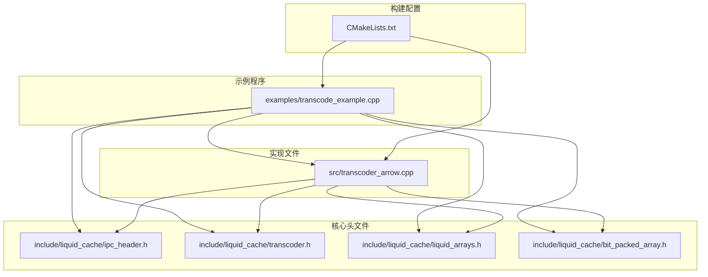
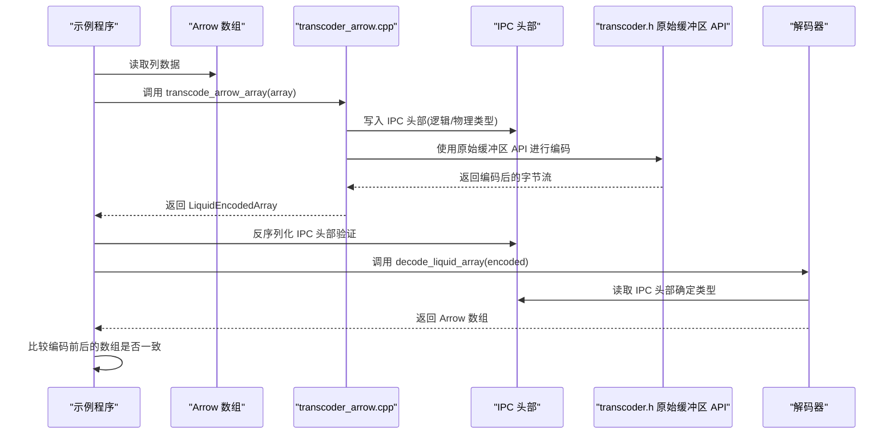
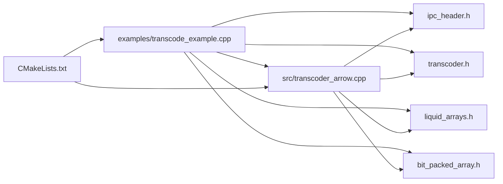

# 基础使用示例

<cite>
**本文引用的文件**
- [transcode_example.cpp](file://examples/transcode_example.cpp)
- [transcoder.h](file://include/liquid_cache/transcoder.h)
- [liquid_arrays.h](file://include/liquid_cache/liquid_arrays.h)
- [ipc_header.h](file://include/liquid_cache/ipc_header.h)
- [transcoder_arrow.cpp](file://src/transcoder_arrow.cpp)
- [bit_packed_array.h](file://include/liquid_cache/bit_packed_array.h)
- [CMakeLists.txt](file://CMakeLists.txt)
</cite>

## 目录
1. [简介](#简介)
2. [项目结构](#项目结构)
3. [核心组件](#核心组件)
4. [架构总览](#架构总览)
5. [详细组件分析](#详细组件分析)
6. [依赖关系分析](#依赖关系分析)
7. [性能考量](#性能考量)
8. [故障排查指南](#故障排查指南)
9. [结论](#结论)
10. [附录](#附录)

## 简介
本文件面向初学者，提供 Liquid Cache C++ 基础使用示例的详细文档，重点围绕如何使用 transcode_arrow_array() 函数进行 Arrow 数组到 Liquid Cache 格式的转换，并涵盖：
- 原始缓冲区编码示例：整数数组与浮点数组的编码流程
- IPC 头部解析与验证方法
- round-trip 验证的完整流程，确保编码解码一致性
- 逐步学习路径：从单个数组编码到复杂批量处理场景

目标是帮助开发者快速上手，理解每个步骤的作用与意义，并在实际项目中安全、高效地应用。

## 项目结构
该项目采用模块化设计，核心代码位于 include/liquid_cache 下，示例程序位于 examples/，实现逻辑位于 src/。CMake 构建系统支持静态链接第三方库，便于生成无外部共享库依赖的可执行文件。

图表来源
- [transcode_example.cpp:1-918](file://examples/transcode_example.cpp#L1-L918)
- [transcoder.h:1-345](file://include/liquid_cache/transcoder.h#L1-L345)
- [liquid_arrays.h:1-580](file://include/liquid_cache/liquid_arrays.h#L1-L580)
- [ipc_header.h:1-118](file://include/liquid_cache/ipc_header.h#L1-L118)
- [transcoder_arrow.cpp:1-286](file://src/transcoder_arrow.cpp#L1-L286)
- [CMakeLists.txt:1-179](file://CMakeLists.txt#L1-L179)

章节来源
- [CMakeLists.txt:1-179](file://CMakeLists.txt#L1-L179)
- [transcode_example.cpp:1-918](file://examples/transcode_example.cpp#L1-L918)

## 核心组件
- IPC 头部定义与序列化/反序列化：用于标识数据类型、物理类型与版本，保证跨语言兼容性。
- 原始缓冲区转码器：提供不依赖 Arrow 的原生缓冲区 API，支持整数与浮点数组的编码。
- Arrow 适配层：将 Arrow 数组转换为 Liquid Cache 格式，并提供解码回 Arrow 的能力。
- 位打包数组：以固定位宽存储整数，支持空值位图与对齐，便于高效压缩与访问。
- 示例程序：演示从 Parquet 文件读取、批量转码、IPC 头部验证与 round-trip 校验。

章节来源
- [ipc_header.h:1-118](file://include/liquid_cache/ipc_header.h#L1-L118)
- [transcoder.h:1-345](file://include/liquid_cache/transcoder.h#L1-L345)
- [transcoder_arrow.cpp:1-286](file://src/transcoder_arrow.cpp#L1-L286)
- [bit_packed_array.h:1-176](file://include/liquid_cache/bit_packed_array.h#L1-L176)
- [liquid_arrays.h:1-580](file://include/liquid_cache/liquid_arrays.h#L1-L580)

## 架构总览
下图展示了从 Arrow 数组到 Liquid Cache 编码、IPC 头部解析与 round-trip 解码的整体流程。

图表来源
- [transcoder_arrow.cpp:36-209](file://src/transcoder_arrow.cpp#L36-L209)
- [transcoder.h:86-156](file://include/liquid_cache/transcoder.h#L86-L156)
- [ipc_header.h:86-105](file://include/liquid_cache/ipc_header.h#L86-L105)
- [transcode_example.cpp:294-320](file://examples/transcode_example.cpp#L294-L320)

## 详细组件分析

### 组件一：IPC 头部解析与验证
- 作用：标识数据的逻辑类型、物理类型与版本，确保序列化格式一致。
- 关键点：
  - 魔术数字与版本校验，防止误读或版本不兼容。
  - 提供序列化与反序列化接口，保证二进制布局稳定。
- 在示例中的使用：
  - 对编码结果进行 IPC 头部解析，打印魔术数字与版本信息，验证格式正确性。

章节来源
- [ipc_header.h:12-118](file://include/liquid_cache/ipc_header.h#L12-L118)
- [transcode_example.cpp:156-162](file://examples/transcode_example.cpp#L156-L162)
- [transcode_example.cpp:294-302](file://examples/transcode_example.cpp#L294-L302)

### 组件二：原始缓冲区整数数组编码
- 入口函数：transcode_primitive<T>()，支持任意 C 原生整数类型。
- 编码流程要点：
  - 计算最小/最大值，确定参考值与范围，避免负偏移。
  - 将每个元素减去参考值得到无符号偏移，计算所需位宽。
  - 使用 BitPackedArray 存储偏移，支持空值位图与 8 字节对齐。
  - 序列化时先写 IPC 头部，再写参考值，最后写位打包数据。
- 参数说明：
  - values：原始数值指针，长度为 count。
  - null_bitmap：空值位图（每比特代表一个元素），可为空表示无空值。
  - count：元素数量。
  - physical：物理类型枚举，决定 IPC 物理类型字段。
- 示例调用位置：见“原始缓冲区转码演示”。

章节来源
- [transcoder.h:86-156](file://include/liquid_cache/transcoder.h#L86-L156)
- [bit_packed_array.h:28-128](file://include/liquid_cache/bit_packed_array.h#L28-L128)
- [transcode_example.cpp:141-173](file://examples/transcode_example.cpp#L141-L173)

### 组件三：原始缓冲区浮点数组编码
- 入口函数：transcode_float<T>()，支持 float 与 double。
- 编码流程要点：
  - 使用 ALP（自适应无损浮点）编码，搜索最佳指数对 (e, f)，使编码后整数更紧凑。
  - 对无法精确还原的值记录补丁（patch），并在解码时恢复。
  - 与整数类似，计算最小编码值作为参考，使用 BitPackedArray 存储偏移。
  - 序列化包含 IPC 头部、参考值、指数 (e, f)、补丁索引与值、以及位打包数据。
- 参数说明：
  - values：原始浮点值指针，长度为 count。
  - null_bitmap：空值位图，可为空。
  - count：元素数量。
  - physical：物理类型（Float32/Float64）。
- 示例调用位置：见“原始缓冲区转码演示”。

章节来源
- [transcoder.h:169-342](file://include/liquid_cache/transcoder.h#L169-L342)
- [transcode_example.cpp:164-173](file://examples/transcode_example.cpp#L164-L173)

### 组件四：Arrow 数组到 Liquid Cache 的桥接
- 入口函数：transcode_arrow_array()，根据 Arrow 类型分派到对应编码器。
- 支持类型：
  - 整数/日期：Frame-of-Reference + BitPacking（FoR + BP）
  - 浮点：ALP + BitPacking
  - 时间戳：按单位映射到对应的物理类型（Int64 存储）
  - 字符串/二进制：占位（尚未实现 FSST）
- 返回值：LiquidEncodedArray，包含序列化字节、逻辑/物理类型、长度与内存估算。
- 解码入口：decode_liquid_array()，解析 IPC 头部后按类型分派解码。

章节来源
- [transcoder_arrow.cpp:36-209](file://src/transcoder_arrow.cpp#L36-L209)
- [transcoder_arrow.cpp:236-283](file://src/transcoder_arrow.cpp#L236-L283)
- [liquid_arrays.h:91-227](file://include/liquid_cache/liquid_arrays.h#L91-L227)
- [liquid_arrays.h:318-574](file://include/liquid_cache/liquid_arrays.h#L318-L574)

### 组件五：位打包数组（BitPackedArray）
- 作用：以固定位宽存储无符号整数，支持空值位图与 8 字节对齐。
- 关键接口：
  - 构造：从原始值与空值位图构造位打包数组。
  - get：按索引读取元素；unpack_all：一次性解包所有元素。
  - serialize/deserialize：与 Rust 实现二进制兼容。
- 性能特性：块状布局便于后续 SIMD 扩展（当前为标量实现）。

章节来源
- [bit_packed_array.h:28-176](file://include/liquid_cache/bit_packed_array.h#L28-L176)

### 组件六：示例程序中的批量处理与 round-trip 验证
- 批量处理：
  - 递归扫描目录，收集 .parquet 文件。
  - 逐批读取 RecordBatch，逐列调用 transcode_arrow_array()。
  - 统计 Arrow 原始大小与 Liquid Cache 大小，计算压缩比。
- IPC 头部验证：
  - 从编码结果中解析 IPC 头部，检查魔术数字与版本。
- round-trip 验证：
  - 使用 decode_liquid_array() 将编码结果解码回 Arrow。
  - 比较编码前后的数组是否相等，统计通过/失败/未实现数量。

章节来源
- [transcode_example.cpp:94-121](file://examples/transcode_example.cpp#L94-L121)
- [transcode_example.cpp:177-340](file://examples/transcode_example.cpp#L177-L340)
- [transcode_example.cpp:307-320](file://examples/transcode_example.cpp#L307-L320)

## 依赖关系分析
- 示例程序依赖 IPC 头部、转码器、Arrow/Liquid 数组与位打包数组。
- Arrow 适配层依赖 IPC 头部与转码器，同时依赖 Arrow API 完成类型分派与计算。
- 构建系统通过 CMake 链接 Arrow、Parquet、JNI 以及一系列静态库，确保最终可执行文件无共享库依赖。

图表来源
- [transcode_example.cpp:1-918](file://examples/transcode_example.cpp#L1-L918)
- [transcoder_arrow.cpp:1-286](file://src/transcoder_arrow.cpp#L1-L286)
- [CMakeLists.txt:1-179](file://CMakeLists.txt#L1-L179)

章节来源
- [CMakeLists.txt:1-179](file://CMakeLists.txt#L1-L179)
- [transcoder_arrow.cpp:1-286](file://src/transcoder_arrow.cpp#L1-L286)
- [transcode_example.cpp:1-918](file://examples/transcode_example.cpp#L1-L918)

## 性能考量
- 编码策略选择：
  - 整数/日期：FoR + BP，适合连续分布的数据，压缩率高且解码快。
  - 浮点：ALP + BP，通过指数搜索提升整数化精度，补丁机制保证无损。
- 内存与对齐：
  - IPC 头部后紧跟参考值，随后进行 8 字节对齐，减少缓存碎片。
  - BitPackedArray 的位宽与空值位图占用空间较小，整体内存开销可控。
- 批处理优化：
  - 示例中按批读取 RecordBatch，减少重复 IO 与对象创建。
  - 统计阶段仅计算必要指标，避免不必要的数据拷贝。
- 注意事项：
  - 浮点解码目前为占位返回，完整实现需解析 ALP 结构体字段，建议在需要严格 round-trip 的场景谨慎使用。

[本节为通用指导，无需特定文件来源]

## 故障排查指南
- IPC 头部错误
  - 现象：解析 IPC 头部抛出异常或版本不匹配。
  - 排查：确认输入字节长度至少为头部大小；检查魔术数字与版本常量；确保序列化/反序列化顺序正确。
  - 参考位置：IPC 头部反序列化与校验逻辑。
- 类型不支持
  - 现象：返回的 LiquidEncodedArray 无效或长度为 0。
  - 排查：确认 Arrow 类型是否在支持列表中；字符串/二进制类型当前为占位。
  - 参考位置：类型分派与占位返回。
- round-trip 不一致
  - 现象：解码后的 Arrow 数组与原始数组不相等。
  - 排查：检查浮点解码占位实现；确认 IPC 头部解析成功；核对 BitPackedArray 的位宽与空值位图。
  - 参考位置：解码入口与比较逻辑。

章节来源
- [ipc_header.h:86-105](file://include/liquid_cache/ipc_header.h#L86-L105)
- [transcoder_arrow.cpp:188-209](file://src/transcoder_arrow.cpp#L188-L209)
- [transcoder_arrow.cpp:236-283](file://src/transcoder_arrow.cpp#L236-L283)
- [transcode_example.cpp:307-320](file://examples/transcode_example.cpp#L307-L320)

## 结论
通过本示例，开发者可以：
- 快速掌握 transcode_arrow_array() 的使用方式与适用场景
- 理解 IPC 头部的解析与验证流程
- 实现从 Arrow 到 Liquid Cache 的编码与 round-trip 验证
- 从单个数组编码逐步扩展到批量处理与性能对比

建议在生产环境中结合具体数据分布选择合适的编码策略，并关注浮点解码的完整实现以满足严格的一致性要求。

[本节为总结，无需特定文件来源]

## 附录

### A. 循序渐进学习路径
- 第一步：运行原始缓冲区转码演示
  - 目标：理解整数与浮点数组的编码流程与 IPC 头部结构
  - 参考位置：[transcode_example.cpp:141-173](file://examples/transcode_example.cpp#L141-L173)
- 第二步：集成 Arrow 数组转码
  - 目标：掌握 Arrow 类型分派与 LiquidEncodedArray 的使用
  - 参考位置：[transcoder_arrow.cpp:36-209](file://src/transcoder_arrow.cpp#L36-L209)
- 第三步：批量处理与 IPC 验证
  - 目标：实现多文件、多批次的转码与 IPC 头部验证
  - 参考位置：[transcode_example.cpp:177-340](file://examples/transcode_example.cpp#L177-L340)
- 第四步：round-trip 验证与性能对比
  - 目标：比较 Parquet 与 Liquid Cache 的读取性能
  - 参考位置：[transcode_example.cpp:516-733](file://examples/transcode_example.cpp#L516-L733)

### B. 关键 API 一览
- 原始缓冲区整数编码：transcode_primitive<T>()
  - 参考位置：[transcoder.h:86-156](file://include/liquid_cache/transcoder.h#L86-L156)
- 原始缓冲区浮点编码：transcode_float<T>()
  - 参考位置：[transcoder.h:169-342](file://include/liquid_cache/transcoder.h#L169-L342)
- Arrow 数组转码：transcode_arrow_array()
  - 参考位置：[transcoder_arrow.cpp:36-209](file://src/transcoder_arrow.cpp#L36-L209)
- IPC 头部解析：LiquidIPCHeader::deserialize()
  - 参考位置：[ipc_header.h:86-105](file://include/liquid_cache/ipc_header.h#L86-L105)
- round-trip 解码：decode_liquid_array()
  - 参考位置：[transcoder_arrow.cpp:236-283](file://src/transcoder_arrow.cpp#L236-L283)