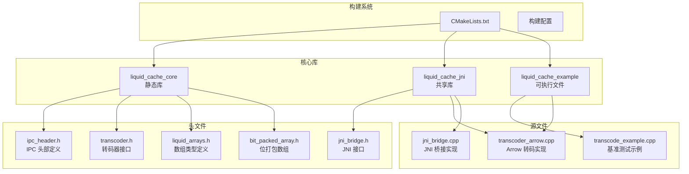
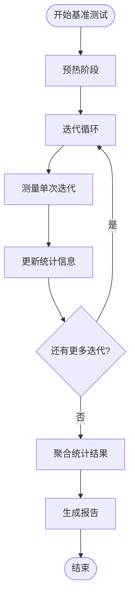
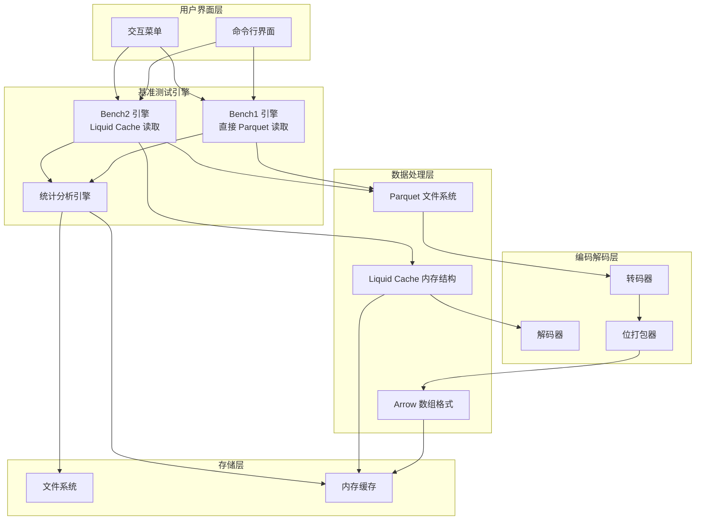
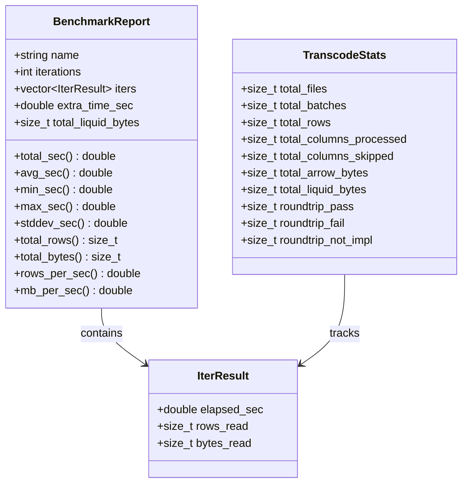
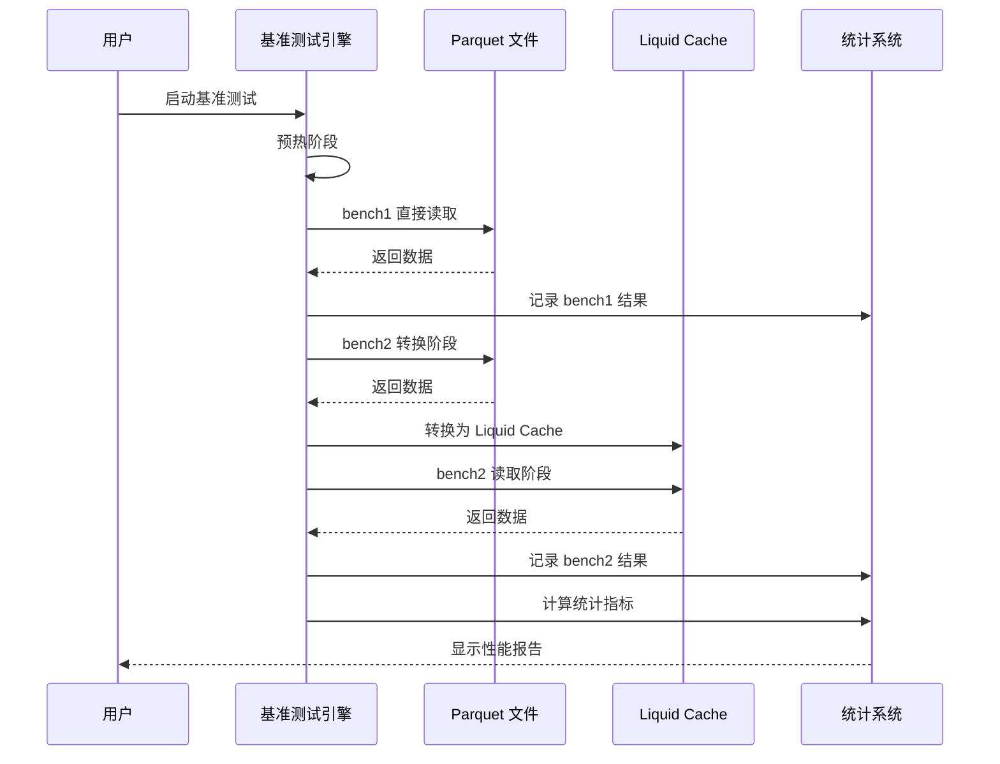
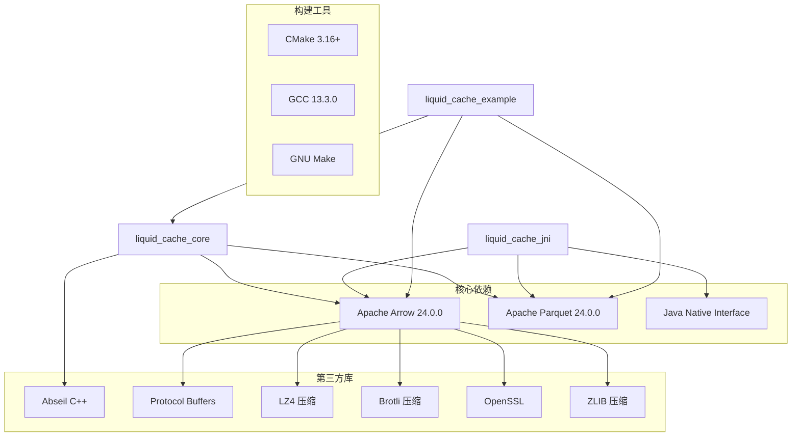
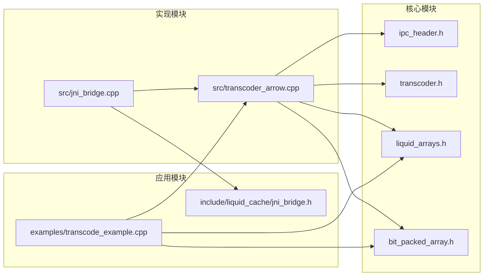

# 性能基准测试

<cite>
**本文档引用的文件**
- [CMakeLists.txt](file://CMakeLists.txt)
- [transcode_example.cpp](file://examples/transcode_example.cpp)
- [transcoder_arrow.cpp](file://src/transcoder_arrow.cpp)
- [transcoder.h](file://include/liquid_cache/transcoder.h)
- [liquid_arrays.h](file://include/liquid_cache/liquid_arrays.h)
- [bit_packed_array.h](file://include/liquid_cache/bit_packed_array.h)
- [ipc_header.h](file://include/liquid_cache/ipc_header.h)
- [jni_bridge.cpp](file://src/jni_bridge.cpp)
- [jni_bridge.h](file://include/liquid_cache/jni_bridge.h)
- [debug.txt](file://debug.txt)
</cite>

## 目录
1. [简介](#简介)
2. [项目结构](#项目结构)
3. [核心组件](#核心组件)
4. [架构概览](#架构概览)
5. [详细组件分析](#详细组件分析)
6. [依赖关系分析](#依赖关系分析)
7. [性能考虑因素](#性能考虑因素)
8. [故障排除指南](#故障排除指南)
9. [结论](#结论)
10. [附录](#附录)

## 简介

Liquid Cache C++ 性能基准测试是一个专门设计用于比较不同数据读取策略性能的测试框架。该基准测试主要包含两个核心场景：

- **bench1（直接读取 Parquet）**：直接从 Parquet 文件系统中读取数据，绕过任何中间格式转换
- **bench2（从 Liquid Cache 读取）**：先将 Parquet 数据转换为 Liquid Cache 格式，然后从内存中的 Liquid Cache 结构读取

该基准测试框架提供了详细的性能统计指标，包括平均时间、最小/最大值、标准差、吞吐量等，并支持一次性测试和多次迭代的稳定性评估。

## 项目结构

该项目采用模块化设计，主要分为以下几个核心部分：



**图表来源**
- [CMakeLists.txt:135-179](file://CMakeLists.txt#L135-L179)
- [transcoder_arrow.cpp:1-286](file://src/transcoder_arrow.cpp#L1-L286)

**章节来源**
- [CMakeLists.txt:1-179](file://CMakeLists.txt#L1-L179)

## 核心组件

### 基准测试基础设施

基准测试框架的核心由以下组件构成：

#### 统计数据结构
- **IterResult**：单次迭代的结果，包含耗时、读取行数和字节数
- **BenchmarkReport**：聚合的基准测试报告，包含所有统计指标
- **TranscodeStats**：转码统计信息，用于整体性能分析

#### 性能指标计算
基准测试框架实现了完整的统计分析功能：



**图表来源**
- [transcode_example.cpp:351-407](file://examples/transcode_example.cpp#L351-L407)

#### 基准测试场景

**bench1 场景**：
- 直接从 Parquet 文件系统读取
- 遍历所有记录批次
- 计算总字节数和行数
- 不进行任何格式转换

**bench2 场景**：
- 分为两个阶段：转换阶段和读取阶段
- 转换阶段：将 Parquet 数据转换为 Liquid Cache 格式
- 读取阶段：从内存中的 Liquid Cache 结构读取数据
- 支持解码回 Arrow 格式进行验证

**章节来源**
- [transcode_example.cpp:346-733](file://examples/transcode_example.cpp#L346-L733)

## 架构概览

Liquid Cache 性能基准测试的整体架构如下：



**图表来源**
- [transcode_example.cpp:515-733](file://examples/transcode_example.cpp#L515-L733)
- [transcoder_arrow.cpp:26-286](file://src/transcoder_arrow.cpp#L26-L286)

## 详细组件分析

### 基准测试报告系统

基准测试报告系统提供了丰富的性能分析功能：

#### 报告结构


**图表来源**
- [transcode_example.cpp:352-407](file://examples/transcode_example.cpp#L352-L407)
- [transcode_example.cpp:127-138](file://examples/transcode_example.cpp#L127-L138)

#### 性能指标计算

基准测试框架实现了多种性能指标的计算：

| 指标类型 | 计算公式 | 用途 |
|---------|---------|------|
| 平均时间 | 总时间/迭代次数 | 衡量典型性能 |
| 最小/最大时间 | 各迭代中的最短/最长时间 | 识别异常值 |
| 标准差 | sqrt(Σ(xi-mean)²/(n-1)) | 衡量稳定性 |
| 吞吐量(行/秒) | 总行数/总时间 | 衡量处理能力 |
| 吞吐量(MB/秒) | (总字节/1024²)/总时间 | 衡量带宽利用率 |

**章节来源**
- [transcode_example.cpp:358-407](file://examples/transcode_example.cpp#L358-L407)

### Liquid Cache 编码系统

Liquid Cache 的编码系统是性能基准测试的核心组件之一：

#### 编码策略
```mermaid
flowchart TD
Input[输入 Arrow 数组] --> TypeCheck{类型检查}
TypeCheck --> |整数类型| IntegerPath[整数编码路径]
TypeCheck --> |浮点类型| FloatPath[浮点编码路径]
TypeCheck --> |字符串类型| StringPath[字符串编码路径]
IntegerPath --> FoR[帧参考(FoR)]
FoR --> BitPack[位打包]
BitPack --> IPC[IPC 头部]
FloatPath --> ALP[自适应无损浮点]
ALP --> BitPack2[位打包]
BitPack2 --> IPC2[IPC 头部]
StringPath --> Placeholder[占位符]
IPC --> Output[Liquid Cache 输出]
IPC2 --> Output
Placeholder --> Output
```

**图表来源**
- [transcoder_arrow.cpp:36-209](file://src/transcoder_arrow.cpp#L36-L209)
- [transcoder.h:86-156](file://include/liquid_cache/transcoder.h#L86-L156)

#### 编码算法细节

**整数类型编码**：
- 使用帧参考(FoR)减少数值范围
- 通过位打包压缩存储空间
- 支持有符号和无符号整数类型

**浮点类型编码**：
- 实现自适应无损浮点(ALP)编码
- 通过指数和小数位优化存储
- 支持单精度和双精度浮点数

**位打包数组**：
- 支持任意位宽的数据存储
- 提供高效的序列化和反序列化
- 支持空值位图

**章节来源**
- [transcoder_arrow.cpp:26-286](file://src/transcoder_arrow.cpp#L26-L286)
- [liquid_arrays.h:91-227](file://include/liquid_cache/liquid_arrays.h#L91-L227)

### 性能基准测试流程

基准测试的完整流程如下：



**图表来源**
- [transcode_example.cpp:559-733](file://examples/transcode_example.cpp#L559-L733)

**章节来源**
- [transcode_example.cpp:515-733](file://examples/transcode_example.cpp#L515-L733)

## 依赖关系分析

### 外部依赖

项目的主要外部依赖包括：



**图表来源**
- [CMakeLists.txt:9-12](file://CMakeLists.txt#L9-L12)
- [CMakeLists.txt:16-53](file://CMakeLists.txt#L16-L53)

### 内部模块依赖



**图表来源**
- [transcoder_arrow.cpp:15-18](file://src/transcoder_arrow.cpp#L15-L18)
- [jni_bridge.cpp:24-26](file://src/jni_bridge.cpp#L24-L26)

**章节来源**
- [CMakeLists.txt:135-179](file://CMakeLists.txt#L135-L179)

## 性能考虑因素

### 内存使用分析

基准测试框架提供了详细的内存使用监控：

#### 内存使用指标
- **总字节数**：原始 Arrow 数据大小
- **Liquid Cache 字节**：转换后的数据大小
- **压缩率**：Liquid Cache 大小与原始大小的比率
- **内存估算**：编码后数组的近似内存占用

#### 内存优化策略
- 使用位打包减少存储空间
- 支持空值压缩
- 内存对齐优化
- 批处理读取减少内存碎片

### CPU 占用监控

基准测试通过高精度时钟测量 CPU 时间：

#### 时间测量精度
- 使用 `std::chrono::steady_clock`
- 精确到纳秒级别
- 支持多次迭代统计分析
- 自动排除系统开销

#### 性能热点识别
- 预热阶段避免缓存影响
- 迭代间断开测量
- 支持不同批大小的性能分析

### I/O 性能优化建议

#### 文件系统优化
- 使用适当的批大小(默认8192)
- 预读机制减少磁盘访问
- 并行读取多个文件
- SSD 存储提升随机访问性能

#### 缓存策略
- 内存中缓存转换后的数据
- 避免重复转换相同数据
- 合理的缓存淘汰策略
- 多次读取场景下的缓存复用

**章节来源**
- [transcode_example.cpp:346-407](file://examples/transcode_example.cpp#L346-L407)
- [transcoder_arrow.cpp:36-209](file://src/transcoder_arrow.cpp#L36-L209)

## 故障排除指南

### 常见问题及解决方案

#### 构建问题
- **依赖缺失**：确保安装所有必需的开发包
- **版本不兼容**：检查 Arrow 和 Parquet 版本匹配
- **静态链接问题**：确认所有依赖库都可用

#### 运行时错误
- **文件权限**：确保对 Parquet 文件有读取权限
- **内存不足**：调整批大小或增加系统内存
- **JNI 错误**：检查 Java 环境配置

#### 性能异常
- **数据倾斜**：检查数据分布是否均匀
- **缓存失效**：优化缓存策略
- **I/O 瓶颈**：升级存储硬件

### 调试工具

基准测试框架提供了多种调试功能：

#### 详细日志
- 文件扫描进度
- 转码过程详情
- 性能统计输出
- 错误信息追踪

#### 统计分析
- 迭代间差异分析
- 性能趋势识别
- 异常值检测
- 稳定性评估

**章节来源**
- [debug.txt:1-186](file://debug.txt#L1-L186)

## 结论

Liquid Cache C++ 性能基准测试框架提供了一个全面、精确的性能分析工具。通过对比直接 Parquet 读取和 Liquid Cache 读取两种方式，用户可以：

1. **量化性能改进**：准确测量 Liquid Cache 相比直接读取的性能提升
2. **深入分析瓶颈**：识别内存、CPU 和 I/O 方面的性能瓶颈
3. **优化系统配置**：根据基准测试结果调整系统参数
4. **指导架构决策**：为数据存储和处理架构选择提供数据支撑

该框架的模块化设计使其易于扩展和维护，同时提供了丰富的统计分析功能，能够满足从开发调试到生产监控的各种需求。

## 附录

### 测试环境配置

#### 系统要求
- Linux x86_64 系统
- GCC 13.3.0 或更高版本
- CMake 3.16 或更高版本
- 至少 8GB RAM（推荐 16GB+）

#### 依赖安装
```bash
# Ubuntu/Debian
sudo apt-get update
sudo apt-get install \
    cmake \
    g++ \
    libarrow-dev \
    libparquet-dev \
    libabsl-dev \
    openjdk-11-jdk
```

#### 构建步骤
```bash
mkdir build && cd build
cmake .. -DCMAKE_BUILD_TYPE=Release
cmake --build .
```

### 结果重现方法

#### 基准测试运行
```bash
# 直接读取 Parquet
./liquid_cache_example path/to/data.parquet bench1

# 从 Liquid Cache 读取  
./liquid_cache_example path/to/data.parquet bench2

# 两者对比
./liquid_cache_example path/to/data.parquet bench
```

#### 性能报告解读
- **平均时间**：典型性能表现
- **最小/最大时间**：性能波动范围
- **标准差**：稳定性指标
- **吞吐量**：处理能力衡量
- **速度提升**：Liquid Cache 相比直接读取的改进

### 最佳实践

#### 一次性测试
- 使用较大的批大小减少系统开销
- 包含预热阶段消除冷启动影响
- 在相同条件下重复测试

#### 多次迭代稳定性评估
- 至少运行10次迭代
- 分析标准差评估稳定性
- 识别异常值并排除
- 考虑数据分布特征

#### 性能优化建议
- 根据数据特征选择合适的批大小
- 利用缓存机制提升重复读取性能
- 优化存储布局减少 I/O 操作
- 考虑硬件特性进行针对性优化