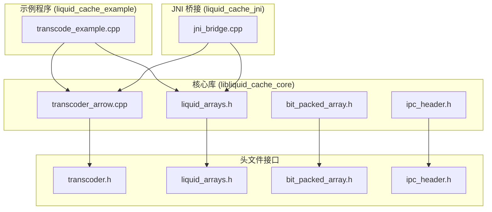
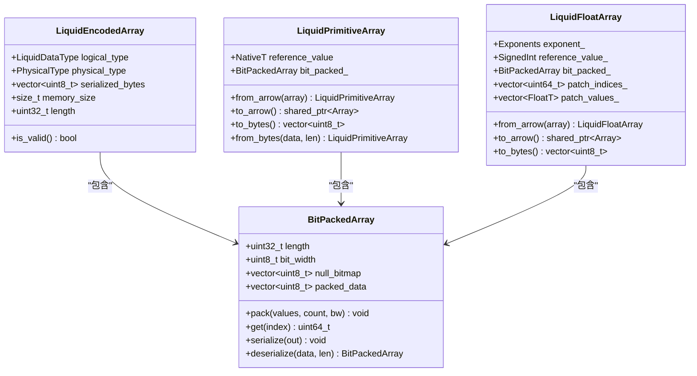
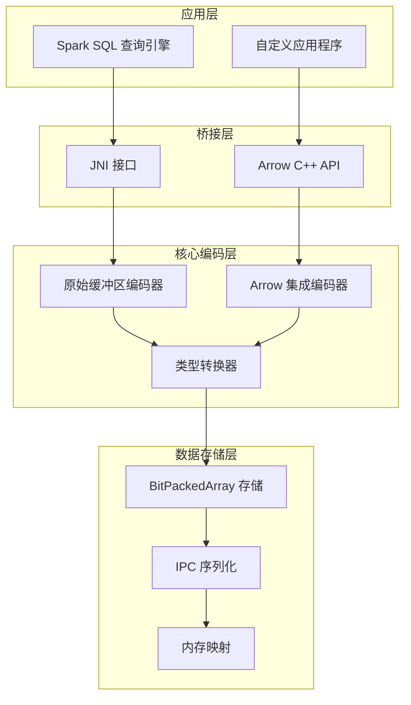
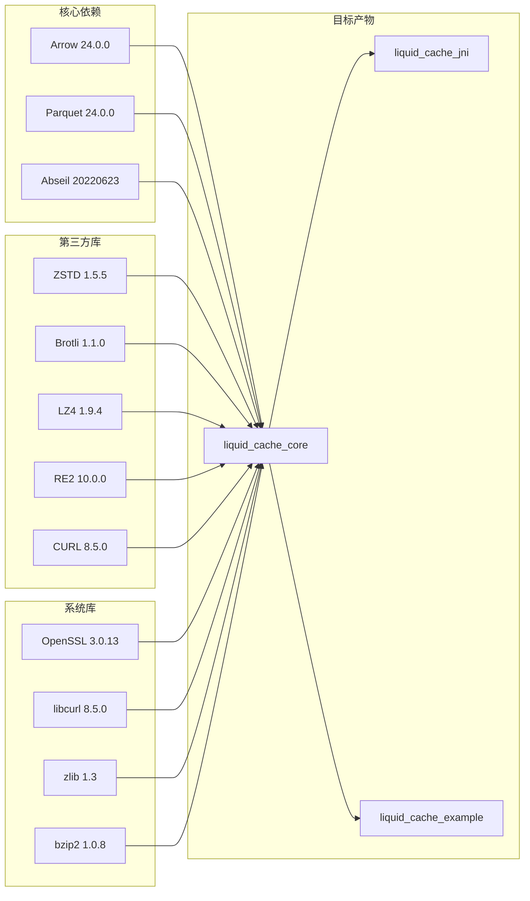

# Liquid Cache C++ 使用的最佳实践指南

<cite>
**本文档中引用的文件**
- [CMakeLists.txt](file://CMakeLists.txt)
- [transcoder.h](file://include/liquid_cache/transcoder.h)
- [transcoder_arrow.cpp](file://src/transcoder_arrow.cpp)
- [bit_packed_array.h](file://include/liquid_cache/bit_packed_array.h)
- [ipc_header.h](file://include/liquid_cache/ipc_header.h)
- [liquid_arrays.h](file://include/liquid_cache/liquid_arrays.h)
- [jni_bridge.cpp](file://src/jni_bridge.cpp)
- [transcode_example.cpp](file://examples/transcode_example.cpp)
- [debug.txt](file://debug.txt)
</cite>

## 目录
1. [简介](#简介)
2. [项目结构](#项目结构)
3. [核心组件](#核心组件)
4. [架构概览](#架构概览)
5. [详细组件分析](#详细组件分析)
6. [依赖关系分析](#依赖关系分析)
7. [性能考虑](#性能考虑)
8. [故障排除指南](#故障排除指南)
9. [结论](#结论)
10. [附录](#附录)

## 简介

Liquid Cache C++ 是一个高性能的数据压缩和序列化库，专门用于优化 Arrow 数据格式的存储和传输。该项目提供了从原始缓冲区到 Arrow 数组的完整转换管道，支持多种数据类型的高效编码，包括整数、浮点数、日期时间等。

该库的核心优势在于其创新的压缩算法组合：
- **Frame-of-Reference + BitPacking**：用于整数和日期类型
- **ALP (Adaptive Lossless floating-Point)**：用于浮点数的无损压缩
- **SIMD 友好的位打包存储**：优化内存访问模式

## 项目结构

项目采用清晰的模块化设计，按照功能和职责进行分离：



**图表来源**
- [CMakeLists.txt:160-206](file://CMakeLists.txt#L160-L206)
- [transcoder_arrow.cpp:1-286](file://src/transcoder_arrow.cpp#L1-L286)
- [transcode_example.cpp:1-918](file://examples/transcode_example.cpp#L1-L918)

**章节来源**
- [CMakeLists.txt:1-206](file://CMakeLists.txt#L1-L206)

## 核心组件

### 1. 编码器 (Transcoder)

Liquid Cache 提供了两层编码器架构：

#### 原始缓冲区编码器
- 支持直接从原始 C 类型数组进行编码
- 适用于 JNI 或 Velox 等环境
- 提供模板化接口以支持不同数据类型

#### Arrow 集成编码器
- 基于 Arrow C++ API 的完整集成
- 自动类型推断和转换
- 支持复杂的 Arrow 数据结构

**章节来源**
- [transcoder.h:66-156](file://include/liquid_cache/transcoder.h#L66-L156)
- [transcoder_arrow.cpp:26-209](file://src/transcoder_arrow.cpp#L26-L209)

### 2. 数据类型系统



**图表来源**
- [transcoder.h:25-33](file://include/liquid_cache/transcoder.h#L25-L33)
- [bit_packed_array.h:28-173](file://include/liquid_cache/bit_packed_array.h#L28-L173)
- [liquid_arrays.h:91-227](file://include/liquid_cache/liquid_arrays.h#L91-L227)
- [liquid_arrays.h:318-574](file://include/liquid_cache/liquid_arrays.h#L318-L574)

### 3. IPC 头部系统

IPC 头部确保跨语言兼容性和数据完整性：

- **魔数验证**：确保数据格式正确性
- **版本控制**：支持未来格式演进
- **类型标识**：明确逻辑和物理类型
- **二进制兼容**：与 Rust 实现完全兼容

**章节来源**
- [ipc_header.h:12-106](file://include/liquid_cache/ipc_header.h#L12-L106)

## 架构概览

Liquid Cache 采用分层架构设计，每层都有明确的职责：



**图表来源**
- [jni_bridge.cpp:10-16](file://src/jni_bridge.cpp#L10-L16)
- [transcoder_arrow.cpp:26-209](file://src/transcoder_arrow.cpp#L26-L209)
- [transcode_example.cpp:175-340](file://examples/transcode_example.cpp#L175-L340)

## 详细组件分析

### 1. 整数编码器 (Primitive Encoder)

整数编码器使用 Frame-of-Reference + BitPacking 算法：

#### 算法流程
1. **最小值查找**：计算所有非空值的最小值作为参考点
2. **偏移量计算**：每个值减去参考值得到无符号偏移量
3. **位宽计算**：确定存储最大偏移量所需的位数
4. **位打包存储**：使用 BitPackedArray 进行高效存储

#### 性能特征
- **压缩率**：对于连续或有偏移的数据效果最佳
- **解码速度**：O(1) 访问时间，支持 SIMD 优化
- **内存效率**：按需分配，避免额外的元数据开销

**章节来源**
- [transcoder.h:78-156](file://include/liquid_cache/transcoder.h#L78-L156)
- [liquid_arrays.h:99-161](file://include/liquid_cache/liquid_arrays.h#L99-L161)

### 2. 浮点数编码器 (Float Encoder)

浮点数编码器采用 ALP (Adaptive Lossless) 算法：

#### ALP 算法原理
1. **指数搜索**：通过穷举搜索找到最优的 (e, f) 参数对
2. **快速舍入**：使用特殊常数实现高效的浮点到整数转换
3. **补丁机制**：记录无法精确表示的值并单独存储
4. **位打包**：对编码后的整数进行 BitPacking

#### 优化策略
- **采样搜索**：对大数组使用采样策略减少计算开销
- **填充策略**：用填充值替换补丁值以提高压缩率
- **动态调整**：根据数据分布自动调整编码参数

**章节来源**
- [transcoder.h:158-342](file://include/liquid_cache/transcoder.h#L158-L342)
- [liquid_arrays.h:344-430](file://include/liquid_cache/liquid_arrays.h#L344-L430)

### 3. BitPackedArray 实现

BitPackedArray 提供了高效的位打包存储：

#### 存储布局
```
[长度: 4字节] [位宽: 1字节] [填充: 3字节]
[空值位图: 可选] [8字节对齐填充]
[位打包数据: 变长]
```

#### 关键特性
- **SIMD 友好**：1024元素块的设计便于向量化操作
- **内存对齐**：8字节对齐优化缓存性能
- **空值支持**：可选的空值位图支持 Arrow 空值语义

**章节来源**
- [bit_packed_array.h:28-173](file://include/liquid_cache/bit_packed_array.h#L28-L173)

### 4. JNI 桥接层

JNI 桥接层实现了与 Spark SQL 的无缝集成：

#### 数据流处理
1. **会话管理**：创建和管理查询会话
2. **扫描执行**：读取 Parquet 文件并执行查询计划
3. **批量传输**：将结果以 Arrow IPC 格式传输给 JVM
4. **资源清理**：确保所有资源得到正确释放

#### 错误处理
- **异常转换**：C++ 异常转换为 Java 异常
- **状态检查**：使用 ARROW_CHECK_OK 宏进行状态验证
- **资源管理**：RAII 模式确保资源自动清理

**章节来源**
- [jni_bridge.cpp:40-172](file://src/jni_bridge.cpp#L40-L172)

## 依赖关系分析

项目采用静态链接策略以确保可移植性：



**图表来源**
- [CMakeLists.txt:8-157](file://CMakeLists.txt#L8-L157)

**章节来源**
- [CMakeLists.txt:132-157](file://CMakeLists.txt#L132-L157)

## 性能考虑

### 1. 内存管理策略

#### 预分配优化
- **容量预留**：使用 `reserve()` 预分配容器容量
- **零拷贝传输**：利用 `std::vector` 的连续内存布局
- **移动语义**：大量使用 `std::move()` 减少不必要的复制

#### 缓存友好的设计
- **局部性优化**：BitPackedArray 采用 1024 元素块设计
- **内存对齐**：8 字节对齐减少缓存未命中
- **顺序访问**：优化数据访问模式以提高缓存效率

### 2. 并发处理

#### 线程安全
- **无状态函数**：大多数编码函数都是纯函数
- **RAII 资源管理**：自动资源清理避免泄漏
- **原子操作**：必要的共享状态使用原子类型

#### 批处理优化
- **批量大小调优**：默认 8192 行批次平衡内存和吞吐量
- **流水线处理**：编码和解码可以并行进行
- **内存池**：使用 Arrow 默认内存池优化分配

### 3. I/O 性能

#### 零拷贝读取
- **内存映射**：支持直接内存映射文件
- **流式处理**：RecordBatch 流式读取避免全量加载
- **缓冲优化**：合理设置缓冲区大小减少系统调用

**章节来源**
- [transcode_example.cpp:198](file://examples/transcode_example.cpp#L198)
- [transcode_example.cpp:622](file://examples/transcode_example.cpp#L622)

## 故障排除指南

### 1. 常见编译问题

#### 依赖库缺失
- **Arrow/Parquet 版本不匹配**：确保版本为 24.0.0
- **静态库链接问题**：检查 `.a` 文件是否可用
- **Abseil 静态链接**：使用 `ABSL_STATIC_PREFIX` 指定静态安装路径

#### 编译器兼容性
- **C++20 标准**：需要支持 C++20 的编译器
- **内联汇编**：某些平台可能不支持 `__builtin_clzll`
- **SIMD 指令**：检查 CPU 是否支持所需的 SIMD 指令集

### 2. 运行时错误处理

#### 类型转换错误
- **不支持的数据类型**：检查 Arrow 类型是否在支持列表中
- **空值处理**：确保空值位图正确传递
- **边界检查**：验证输入数据的边界条件

#### 内存不足
- **预分配策略**：使用 `reserve()` 避免多次重分配
- **流式处理**：对于大数据集使用流式处理模式
- **资源监控**：定期检查内存使用情况

### 3. 性能诊断

#### 基准测试
- **内置基准工具**：使用示例程序的基准测试功能
- **自定义测试**：编写针对特定场景的性能测试
- **内存分析**：使用 Valgrind 或 AddressSanitizer 分析内存问题

#### 调试技巧
- **日志记录**：启用详细的日志输出
- **统计信息**：收集编码前后的数据对比
- **可视化工具**：使用性能分析工具识别瓶颈

**章节来源**
- [debug.txt:133-186](file://debug.txt#L133-L186)
- [transcode_example.cpp:559-733](file://examples/transcode_example.cpp#L559-L733)

## 结论

Liquid Cache C++ 提供了一个高性能、可扩展的数据压缩和序列化解决方案。通过精心设计的算法和架构，它能够在保证数据完整性的同时实现显著的存储和传输优化。

### 主要优势
- **算法创新**：结合多种压缩技术实现最佳压缩率
- **性能卓越**：优化的内存布局和访问模式
- **兼容性强**：与 Arrow 生态系统完全兼容
- **部署简单**：静态链接确保可移植性

### 最佳实践总结
1. **数据类型选择**：根据数据特征选择合适的编码器
2. **内存管理**：采用预分配和移动语义优化内存使用
3. **批处理模式**：合理设置批次大小平衡性能和内存
4. **错误处理**：完善的异常处理和资源清理机制
5. **性能监控**：建立全面的性能监控和诊断体系

## 附录

### 1. 大数据处理模式

#### 批处理模式
适用于离线处理和批量转换场景：
- **固定批次大小**：8192 行作为默认批次
- **内存预分配**：提前估算内存需求
- **渐进式处理**：逐步处理大型文件

#### 流式处理模式
适用于实时处理和低延迟场景：
- **RecordBatch 流**：Arrow 的原生流式接口
- **增量编码**：边读取边编码减少内存占用
- **背压处理**：根据下游处理能力调整读取速度

### 2. 安全性考虑

#### 数据保护
- **传输加密**：支持 HTTPS 和 SSL/TLS 加密
- **访问控制**：通过对象存储的认证机制控制访问
- **数据完整性**：使用校验和确保数据传输正确性

#### 隐私保护
- **数据脱敏**：在编码前进行必要的数据脱敏
- **最小权限**：遵循最小权限原则限制数据访问
- **审计日志**：记录重要的数据访问和修改操作

### 3. 监控和运维

#### 性能指标
- **编码率**：压缩前后数据大小比值
- **吞吐量**：每秒处理的行数和字节数
- **内存使用**：峰值内存和平均内存使用情况
- **CPU 利用率**：编码过程中的 CPU 占用情况

#### 告警机制
- **阈值告警**：设置关键指标的告警阈值
- **异常检测**：自动检测异常的性能模式
- **健康检查**：定期检查系统的健康状态