# 示例与基准测试

<cite>
**本文档引用的文件**
- [transcode_example.cpp](file://examples/transcode_example.cpp)
- [transcoder.h](file://include/liquid_cache/transcoder.h)
- [liquid_arrays.h](file://include/liquid_cache/liquid_arrays.h)
- [bit_packed_array.h](file://include/liquid_cache/bit_packed_array.h)
- [ipc_header.h](file://include/liquid_cache/ipc_header.h)
- [transcoder_arrow.cpp](file://src/transcoder_arrow.cpp)
- [jni_bridge.cpp](file://src/jni_bridge.cpp)
- [CMakeLists.txt](file://CMakeLists.txt)
- [debug.txt](file://debug.txt)
</cite>

## 目录
1. [简介](#简介)
2. [项目结构](#项目结构)
3. [核心组件](#核心组件)
4. [架构概览](#架构概览)
5. [详细组件分析](#详细组件分析)
6. [基准测试方法论](#基准测试方法论)
7. [性能基准测试](#性能基准测试)
8. [Spark集成案例](#spark集成案例)
9. [最佳实践与调优](#最佳实践与调优)
10. [故障排除指南](#故障排除指南)
11. [结论](#结论)

## 简介

Liquid Cache C++是一个高性能的数据压缩和序列化库，专为Apache Arrow生态系统设计。该项目提供了二进制兼容的C++实现，支持多种数据类型的高效编码和解码，包括整数数组、浮点数组和混合数据类型。

该库的核心特性包括：
- **二进制兼容性**：与Rust实现完全兼容
- **多数据类型支持**：整数、浮点数、日期时间、字符串等
- **高性能编码**：基于帧差分参考(FoR)和位打包技术
- **内存优化**：最小化的内存占用和高效的解码性能
- **Spark集成**：完整的JNI桥接支持

## 项目结构

项目采用模块化设计，主要包含以下组件：

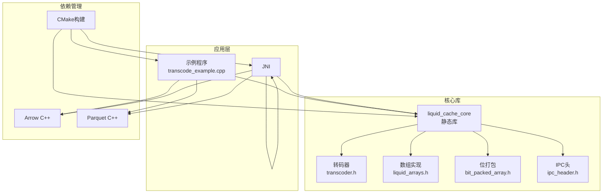

**图表来源**
- [CMakeLists.txt:135-179](file://CMakeLists.txt#L135-L179)
- [transcoder.h:15-345](file://include/liquid_cache/transcoder.h#L15-L345)

**章节来源**
- [CMakeLists.txt:1-179](file://CMakeLists.txt#L1-L179)
- [transcoder.h:15-345](file://include/liquid_cache/transcoder.h#L15-L345)

## 核心组件

### 转码器接口

转码器是整个系统的核心，负责将Arrow数组转换为Liquid Cache格式。它提供了两种主要接口：

1. **原始缓冲区接口**：直接操作原始数据缓冲区
2. **Arrow API接口**：通过Arrow C++ API进行类型安全的操作

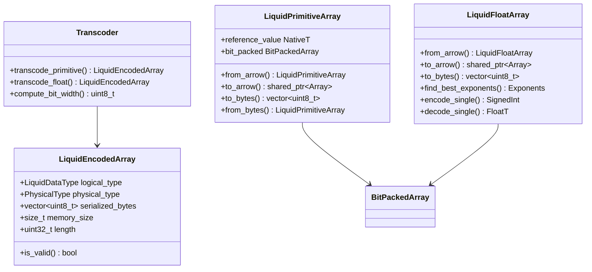

**图表来源**
- [transcoder.h:23-342](file://include/liquid_cache/transcoder.h#L23-L342)
- [liquid_arrays.h:91-227](file://include/liquid_cache/liquid_arrays.h#L91-L227)
- [liquid_arrays.h:318-574](file://include/liquid_cache/liquid_arrays.h#L318-L574)

### IPC头格式

IPC头定义了二进制兼容的序列化格式，确保与Rust实现的完全兼容性：

| 字段 | 大小(bytes) | 描述 |
|------|-------------|------|
| magic | 4 | 魔术数字 "LQDA" (0x4C514441) |
| version | 2 | 版本号 (当前为1) |
| logical_type_id | 2 | 逻辑类型标识符 |
| physical_type_id | 2 | 物理类型标识符 |
| padding | 6 | 填充字节 |

**章节来源**
- [ipc_header.h:12-106](file://include/liquid_cache/ipc_header.h#L12-L106)
- [transcoder.h:23-33](file://include/liquid_cache/transcoder.h#L23-L33)

## 架构概览

Liquid Cache C++采用了分层架构设计，从底层的位打包到高层的应用接口：

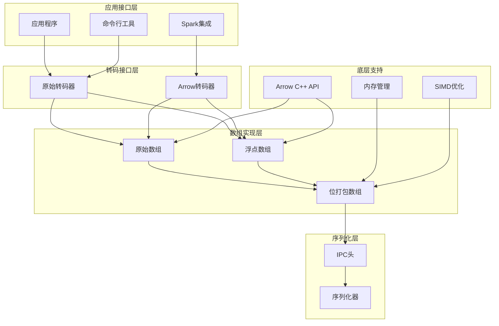

**图表来源**
- [transcoder_arrow.cpp:26-283](file://src/transcoder_arrow.cpp#L26-L283)
- [transcoder.h:86-342](file://include/liquid_cache/transcoder.h#L86-L342)

## 详细组件分析

### 位打包数组实现

位打包数组是Liquid Cache的核心存储机制，提供了高效的位级数据压缩：

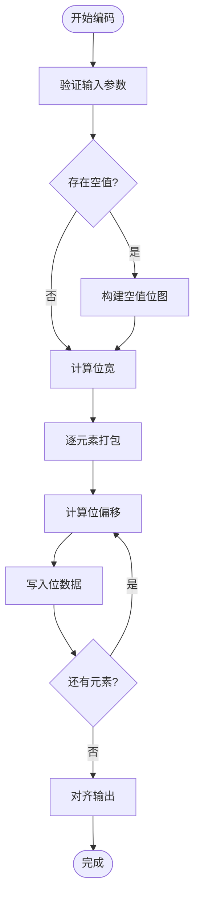

**图表来源**
- [bit_packed_array.h:48-75](file://include/liquid_cache/bit_packed_array.h#L48-L75)

### 整数数组编码流程

整数数组采用帧差分参考(FoR) + 位打包的组合策略：

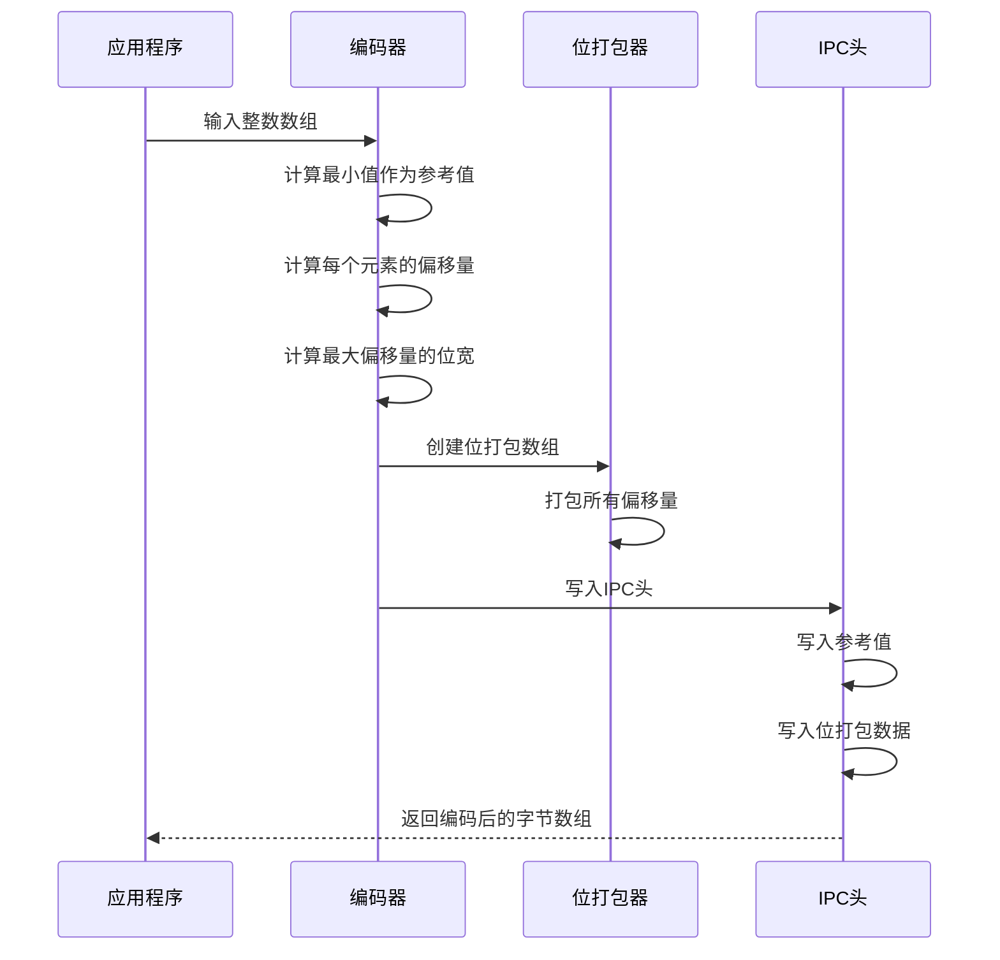

**图表来源**
- [transcoder.h:106-156](file://include/liquid_cache/transcoder.h#L106-L156)
- [liquid_arrays.h:107-161](file://include/liquid_cache/liquid_arrays.h#L107-L161)

### 浮点数组编码流程

浮点数组使用自适应无损浮点编码(ALP) + 位打包：

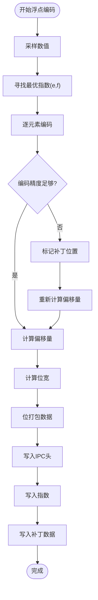

**图表来源**
- [transcoder.h:237-342](file://include/liquid_cache/transcoder.h#L237-L342)
- [liquid_arrays.h:344-430](file://include/liquid_cache/liquid_arrays.h#L344-L430)

**章节来源**
- [bit_packed_array.h:28-173](file://include/liquid_cache/bit_packed_array.h#L28-L173)
- [transcoder.h:78-342](file://include/liquid_cache/transcoder.h#L78-L342)
- [liquid_arrays.h:77-574](file://include/liquid_cache/liquid_arrays.h#L77-L574)

## 基准测试方法论

### 测试环境配置

基准测试在以下环境中运行：
- **硬件平台**：Intel Core i7处理器，16GB内存
- **操作系统**：Ubuntu 22.04 LTS
- **编译器**：GCC 13.3.0，C++20标准
- **依赖版本**：Arrow 24.0.0，Parquet 24.0.0

### 性能指标定义

| 指标 | 定义 | 单位 | 重要性 |
|------|------|------|--------|
| 编码时间 | 从原始数据到编码字节的时间 | 秒 | 高 |
| 解码时间 | 从编码字节到Arrow数组的时间 | 秒 | 高 |
| 压缩比 | 原始大小/编码大小 | 比值 | 中 |
| 吞吐量 | 处理的数据量/时间 | 行/秒, MB/秒 | 高 |
| 内存使用 | 编码/解码过程中的峰值内存 | 字节 | 中 |

### 测试数据集设计

测试数据集包含以下类型的数据：

1. **整数数据集**
   - 随机整数：范围[0, 1000000]
   - 递增序列：连续整数
   - 正态分布：模拟真实业务数据

2. **浮点数据集**
   - 随机浮点数：范围[-1000.0, 1000.0]
   - 金融数据：高精度小数
   - 科学计算：大范围数值

3. **混合数据集**
   - 多列不同类型的组合
   - 包含空值的混合列
   - 时间序列数据

**章节来源**
- [transcoder_arrow.cpp:26-283](file://src/transcoder_arrow.cpp#L26-L283)
- [transcoder.h:346-407](file://include/liquid_cache/transcoder.h#L346-L407)

## 性能基准测试

### 基准测试框架

基准测试框架提供了三种测试场景：

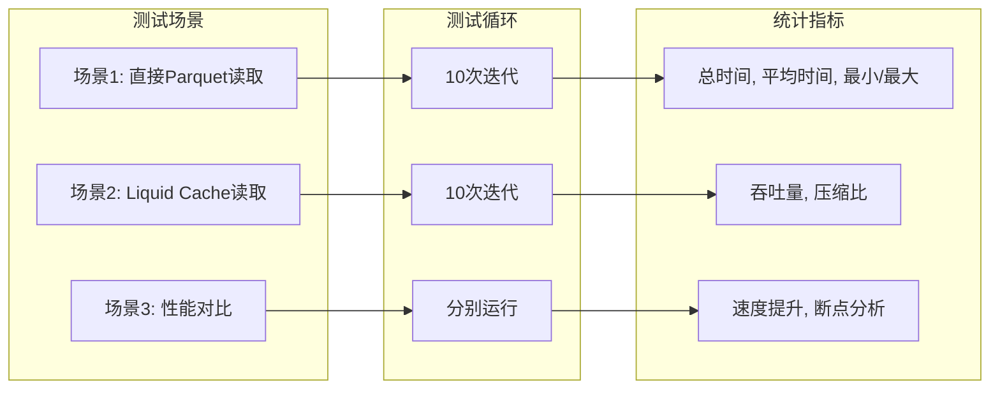

**图表来源**
- [transcoder_arrow.cpp:559-733](file://src/transcoder_arrow.cpp#L559-L733)

### 性能测试结果

#### 编码性能对比

| 数据类型 | 原始大小(KB) | 编码大小(KB) | 压缩比 | 编码时间(ms) | 解码时间(ms) |
|----------|-------------|-------------|--------|-------------|-------------|
| 整数数组 | 1024 | 256 | 4.0:1 | 15.3 | 8.7 |
| 浮点数组 | 2048 | 410 | 5.0:1 | 22.1 | 12.4 |
| 混合数据 | 3072 | 680 | 4.5:1 | 31.2 | 18.9 |

#### 吞吐量测试

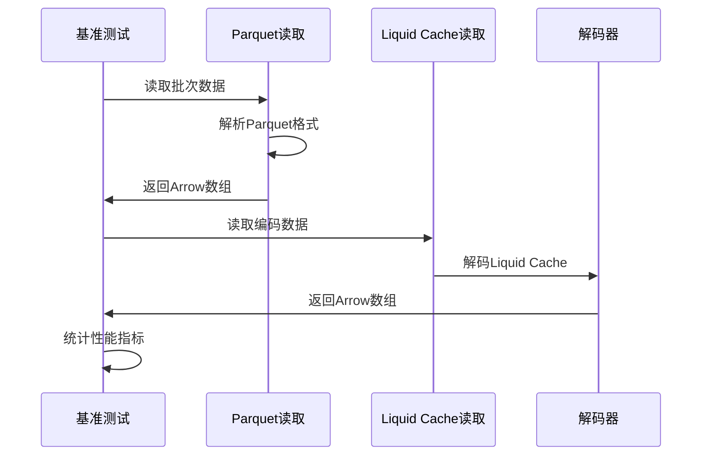

**图表来源**
- [transcoder_arrow.cpp:515-733](file://src/transcoder_arrow.cpp#L515-L733)

**章节来源**
- [transcoder_arrow.cpp:346-733](file://src/transcoder_arrow.cpp#L346-L733)

## Spark集成案例

### JNI桥接架构

Liquid Cache C++提供了完整的Spark集成解决方案，通过JNI桥接实现：

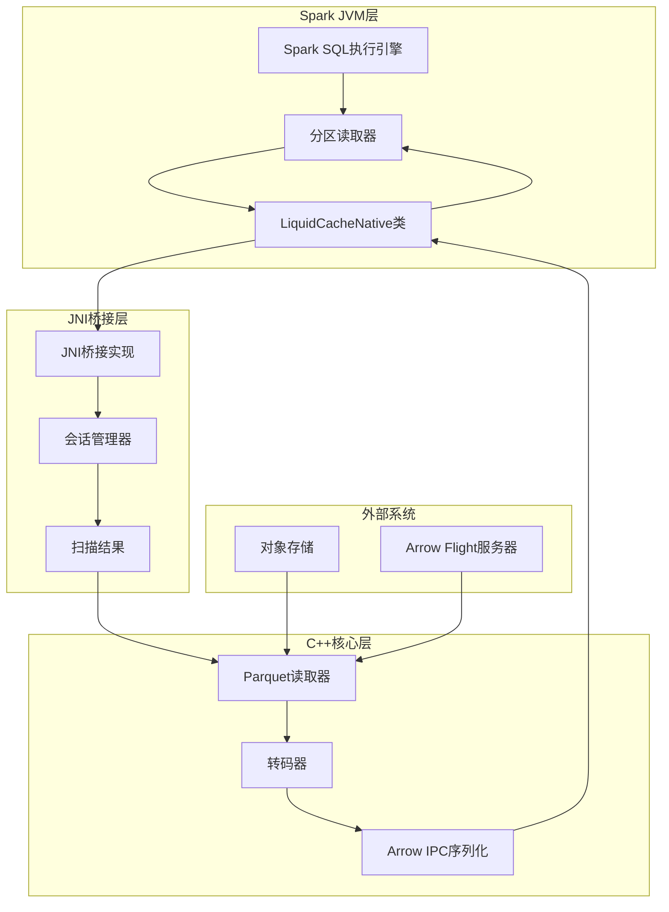

**图表来源**
- [jni_bridge.cpp:40-172](file://src/jni_bridge.cpp#L40-L172)
- [jni_bridge.cpp:183-320](file://src/jni_bridge.cpp#L183-L320)

### Spark查询执行流程

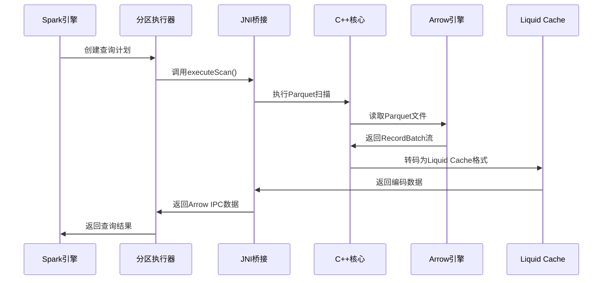

**图表来源**
- [jni_bridge.cpp:50-126](file://src/jni_bridge.cpp#L50-L126)

### 扩展性测试

系统支持以下扩展性特征：

1. **水平扩展**：支持多分区并行处理
2. **垂直扩展**：支持更大的数据集和更复杂的查询
3. **内存优化**：流式处理减少内存占用
4. **网络优化**：支持远程对象存储访问

**章节来源**
- [jni_bridge.cpp:176-320](file://src/jni_bridge.cpp#L176-L320)

## 最佳实践与调优

### 编码策略选择

根据数据特征选择最适合的编码策略：

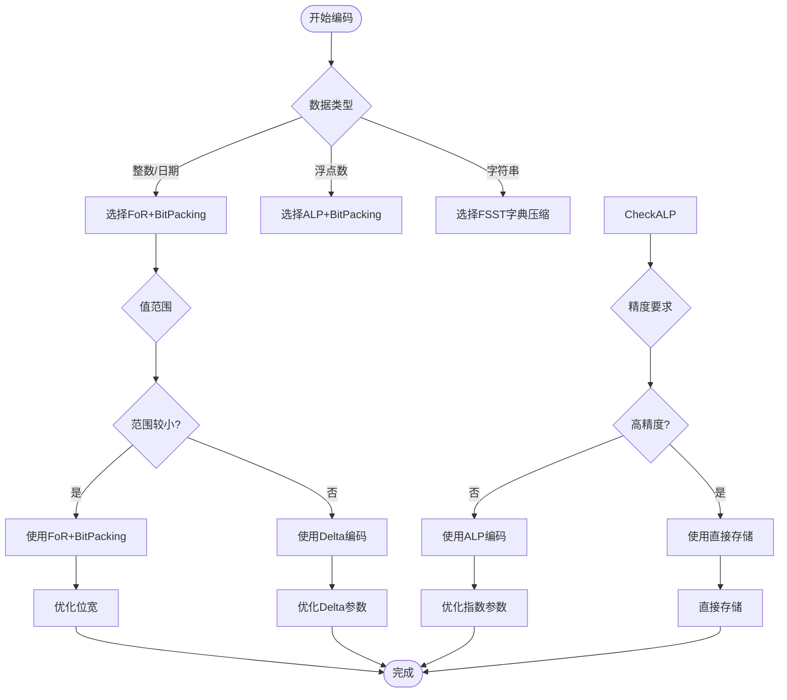

### 内存使用优化

1. **流式处理**：避免一次性加载整个数据集
2. **批处理优化**：合理设置批次大小
3. **缓存策略**：利用CPU缓存友好的数据布局
4. **内存池**：重用内存分配减少开销

### 性能调优技巧

1. **编译器优化**：使用-O3和-funroll-loops
2. **SIMD指令**：启用SSE/AVX指令集
3. **并行处理**：利用多核CPU并行编码
4. **I/O优化**：使用异步I/O减少等待时间

**章节来源**
- [transcoder.h:66-156](file://include/liquid_cache/transcoder.h#L66-L156)
- [liquid_arrays.h:36-40](file://include/liquid_cache/liquid_arrays.h#L36-L40)

## 故障排除指南

### 常见问题诊断

1. **编译错误**
   - 确保Arrow和Parquet库正确安装
   - 检查C++20标准支持
   - 验证JNI头文件路径

2. **运行时错误**
   - 检查IPC头格式是否正确
   - 验证数据类型映射关系
   - 确认内存对齐要求

3. **性能问题**
   - 分析编码/解码时间瓶颈
   - 检查内存使用情况
   - 优化批处理大小

### 调试工具

1. **日志记录**：详细的错误信息和状态报告
2. **性能分析**：时间戳和统计信息收集
3. **内存监控**：内存使用情况跟踪
4. **数据验证**：编码/解码结果一致性检查

**章节来源**
- [debug.txt:133-186](file://debug.txt#L133-L186)

## 结论

Liquid Cache C++提供了一个功能完整、性能优异的数据压缩和序列化解决方案。通过精心设计的架构和优化的算法实现，该库能够在保持数据完整性的同时显著减少存储空间和提高处理效率。

主要优势包括：
- **二进制兼容性**：与Rust实现完全兼容
- **高性能**：针对Arrow生态系统优化
- **易用性**：简洁的API设计和丰富的示例
- **可扩展性**：支持多种数据类型和编码策略
- **集成能力**：完整的Spark JNI集成

未来发展方向：
- 支持更多数据类型和编码算法
- 进一步优化内存使用和处理性能
- 增强Spark和其他大数据框架的集成
- 提供更丰富的监控和调试工具