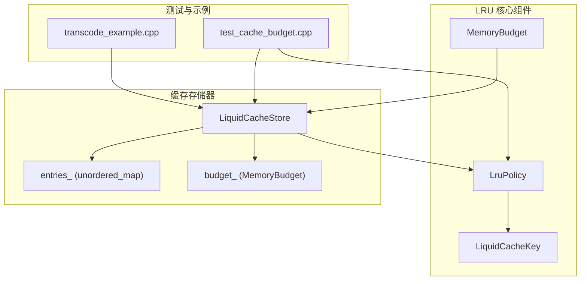
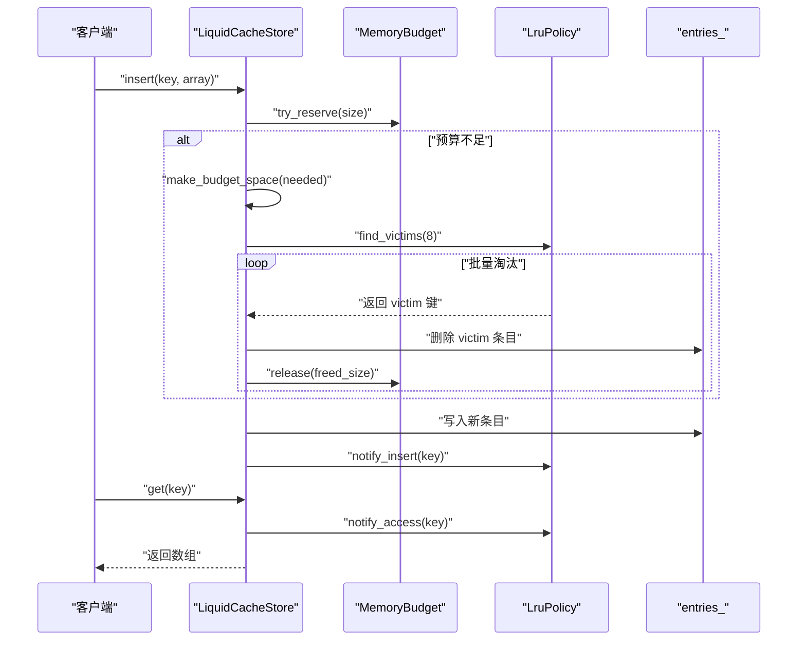
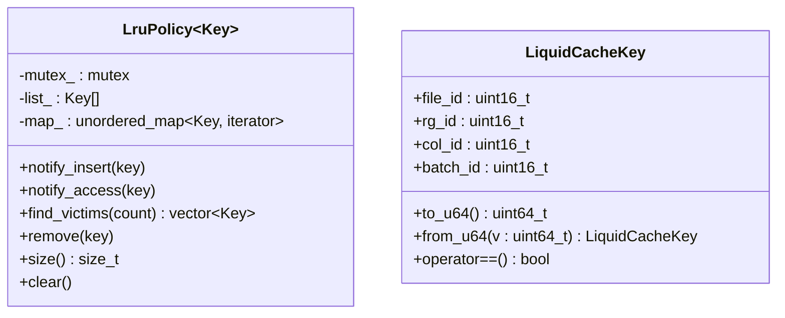

# LRU 淘汰策略

<cite>
**本文引用的文件**
- [lru_policy.h](file://include/liquid_cache/lru_policy.h)
- [liquid_cache_store.h](file://include/liquid_cache/liquid_cache_store.h)
- [test_cache_budget.cpp](file://tests/test_cache_budget.cpp)
- [transcode_example.cpp](file://examples/transcode_example.cpp)
</cite>

## 更新摘要
**变更内容**
- 新增 LRU 淘汰策略的完整实现文档
- 更新了 LruPolicy 模板类的详细分析
- 增强了与 LiquidCacheStore 的集成说明
- 添加了 MemoryBudget 的详细实现分析
- 更新了测试用例和使用示例

## 目录
1. [简介](#简介)
2. [项目结构](#项目结构)
3. [核心组件](#核心组件)
4. [架构总览](#架构总览)
5. [详细组件分析](#详细组件分析)
6. [依赖关系分析](#依赖关系分析)
7. [性能考量](#性能考量)
8. [故障排查指南](#故障排查指南)
9. [结论](#结论)
10. [附录](#附录)

## 简介
本文档深入解析 LRU（最近最少使用）淘汰策略在 LiquidCacheCpp 中的实现，重点涵盖：
- LRU 链表的数据结构设计与访问顺序维护
- MemoryBudget 的无锁原子预算管理机制
- LruPolicy 模板类的完整实现原理
- 与 LiquidCacheStore 的深度集成方案
- 批量淘汰算法与性能优化策略
- 多线程环境下的线程安全保证
- 实际使用示例与最佳实践

## 项目结构
LRU 淘汰策略作为核心组件集成在 LiquidCacheCpp 项目中，主要文件结构如下：



**图表来源**
- [lru_policy.h:111-188](file://include/liquid_cache/lru_policy.h#L111-L188)
- [liquid_cache_store.h:188-524](file://include/liquid_cache/liquid_cache_store.h#L188-L524)
- [test_cache_budget.cpp:1-393](file://tests/test_cache_budget.cpp#L1-L393)

**章节来源**
- [lru_policy.h:1-191](file://include/liquid_cache/lru_policy.h#L1-L191)
- [liquid_cache_store.h:1-527](file://include/liquid_cache/liquid_cache_store.h#L1-L527)

## 核心组件

### LruPolicy 模板类
LruPolicy 是基于双向链表和哈希映射的经典 LRU 实现，提供以下核心功能：
- **访问顺序维护**：通过双向链表维护 MRU（最经常使用）到 LRU（最少使用）的顺序
- **快速定位**：使用哈希映射实现 O(1) 的键查找
- **线程安全**：每个公共方法都包含互斥锁保护
- **批量淘汰**：支持批量获取淘汰候选键

### MemoryBudget 类
MemoryBudget 提供无锁的原子内存预算管理：
- **原子预留**：使用 compare_exchange_weak 实现无锁原子预留
- **预算查询**：提供当前使用量和最大限额查询
- **动态调整**：支持运行时修改预算上限
- **更新支持**：提供 try_update 方法支持大小变化的原子更新

### LiquidCacheStore 集成
LiquidCacheStore 将 LRU 策略与内存预算管理深度集成：
- **预算约束**：通过 MemoryBudget 限制总内存使用
- **智能淘汰**：在插入新条目前自动触发 LRU 淘汰
- **访问提升**：读取命中时自动提升键的优先级
- **统计监控**：提供详细的缓存使用统计信息

**章节来源**
- [lru_policy.h:111-188](file://include/liquid_cache/lru_policy.h#L111-L188)
- [lru_policy.h:30-96](file://include/liquid_cache/lru_policy.h#L30-L96)
- [liquid_cache_store.h:188-524](file://include/liquid_cache/liquid_cache_store.h#L188-L524)

## 架构总览
LRU 淘汰策略在缓存系统中的工作流程：



**图表来源**
- [liquid_cache_store.h:222-245](file://include/liquid_cache/liquid_cache_store.h#L222-L245)
- [liquid_cache_store.h:491-517](file://include/liquid_cache/liquid_cache_store.h#L491-L517)
- [lru_policy.h:118-141](file://include/liquid_cache/lru_policy.h#L118-L141)

## 详细组件分析

### LruPolicy 模板类实现

#### 数据结构设计
LruPolicy 采用经典的"链表 + 哈希映射"组合：
- **list_**：std::list<Key> 维护访问顺序，front 为 MRU，back 为 LRU
- **map_**：std::unordered_map<Key, iterator> 提供 O(1) 快速定位
- **mutex_**：std::mutex 保护所有公共操作，确保线程安全

#### 核心方法实现

**notify_insert 方法**
- 如果键已存在：使用 splice 将其移动到 front（提升为 MRU）
- 如果键不存在：push_front 插入到最前面，并建立映射关系
- 时间复杂度：O(1)

**notify_access 方法**
- 仅在键存在时将其移动到 MRU
- 用于读取命中后的访问提升
- 时间复杂度：O(1)

**find_victims 方法**
- 从 LRU 末端批量取出最多 count 个键
- 每次取出时同时从 map 中擦除，保持数据一致性
- 支持空集合安全处理
- 时间复杂度：O(k)，k 为淘汰数量



**图表来源**
- [lru_policy.h:111-188](file://include/liquid_cache/lru_policy.h#L111-L188)
- [lru_policy.h:48-78](file://include/liquid_cache/lru_policy.h#L48-L78)

**章节来源**
- [lru_policy.h:111-188](file://include/liquid_cache/lru_policy.h#L111-L188)

### MemoryBudget 原子预算管理

#### 原子预留机制
MemoryBudget 使用 compare_exchange_weak 实现无锁原子预留：
- **无限预算**：max_bytes_ 为 0 时，直接累加使用量
- **有限预算**：使用 compare_exchange_weak 循环确保原子性
- **CAS 循环**：失败时重新加载当前值并重试

#### 关键方法分析

**try_reserve 方法**
- 原子性地尝试预留指定字节数
- 返回布尔值指示成功与否
- 支持预算超限检测

**try_update 方法**
- 支持从旧大小原子性更新到新大小
- 自动处理增长和收缩两种情况
- 提供预算检查和释放逻辑

**release 方法**
- 原子性释放已预留的内存
- 使用 fetch_sub 实现无锁减法

**章节来源**
- [lru_policy.h:30-96](file://include/liquid_cache/lru_policy.h#L30-L96)

### 与 LiquidCacheStore 的深度集成

#### 插入流程优化
LiquidCacheStore 在插入新条目时的完整流程：
1. **预算检查**：使用 make_budget_space 确保有足够的空间
2. **批量淘汰**：调用 LruPolicy::find_victims(8) 进行批量淘汰
3. **原子预留**：通过 MemoryBudget::try_reserve 完成最终预留
4. **写入数据**：将新条目写入 entries_ 映射
5. **更新 LRU**：调用 LruPolicy::notify_insert 更新访问顺序

#### 读取流程优化
读取命中时的访问提升机制：
- **命中检测**：在 get_unlocked 中找到对应的缓存条目
- **LRU提升**：调用 LruPolicy::notify_access 将键提升到 MRU
- **原子更新**：通过锁保护整个读取过程

#### 批量淘汰策略
make_budget_space 方法实现的批量淘汰：
- **批量大小**：默认每次淘汰 8 个键，平衡性能和延迟
- **尝试限制**：最多尝试 1024 次，防止无限循环
- **预算检查**：在每次淘汰后检查预算是否满足需求

**章节来源**
- [liquid_cache_store.h:222-245](file://include/liquid_cache/liquid_cache_store.h#L222-L245)
- [liquid_cache_store.h:491-517](file://include/liquid_cache/liquid_cache_store.h#L491-L517)

## 依赖关系分析

### 组件依赖图
LRU 淘汰策略的依赖关系清晰明确：

```mermaid
graph LR
subgraph "外部依赖"
STD["std::list"]
UMAP["std::unordered_map"]
MUTEX["std::mutex"]
ATOMIC["std::atomic<size_t>"]
END
subgraph "LRU 核心"
LRU["LruPolicy<T>"]
MB["MemoryBudget"]
LCK["LiquidCacheKey"]
END
subgraph "缓存存储器"
LCS["LiquidCacheStore"]
ENT["entries_"]
END
LCS --> LRU
LCS --> MB
LCS --> ENT
LRU --> STD
LRU --> UMAP
LRU --> MUTEX
MB --> ATOMIC
LCK --> STD
```

**图表来源**
- [lru_policy.h:13-18](file://include/liquid_cache/lru_policy.h#L13-L18)
- [liquid_cache_store.h:19-31](file://include/liquid_cache/liquid_cache_store.h#L19-L31)

### 关键耦合点
- **类型耦合**：LruPolicy 与 LiquidCacheStore 通过 LiquidCacheKey 类型耦合
- **方法耦合**：make_budget_space 直接调用 LruPolicy::find_victims
- **内存耦合**：LRU 策略与 MemoryBudget 通过预算约束紧密集成

**章节来源**
- [liquid_cache_store.h:519-524](file://include/liquid_cache/liquid_cache_store.h#L519-L524)
- [lru_policy.h:184-188](file://include/liquid_cache/lru_policy.h#L184-L188)

## 性能考量

### 时间复杂度分析
- **notify_insert/notify_access**：O(1) - splice + map 查找
- **find_victims**：O(k) - k 为淘汰数量，从 LRU 末端弹出
- **make_budget_space**：平均 O(k·m) - m 为需要淘汰的轮数，k 为每轮批量大小
- **MemoryBudget::try_reserve**：摊销 O(1) - CAS 循环期望常数次重试

### 空间复杂度
- **LruPolicy**：O(n) - n 为键数量，链表和哈希映射各占一部分
- **MemoryBudget**：O(1) - 仅使用原子变量存储使用量
- **LiquidCacheStore**：O(n) - entries_ 映射存储缓存条目

### 并发特性
- **细粒度锁**：LruPolicy 的锁粒度覆盖单次操作，避免长时间持有
- **原子操作**：MemoryBudget 使用 compare_exchange_weak 减少锁竞争
- **批量优化**：批量淘汰减少锁竞争频率，提高整体吞吐量

### 性能优化建议
- **批量大小调优**：根据系统负载调整 make_budget_space 的批量大小
- **预算上限设置**：根据内存容量和工作集大小合理设置预算上限
- **访问模式优化**：利用 notify_access 的访问提升特性，减少不必要的淘汰

## 故障排查指南

### 常见问题诊断

#### 插入失败（预算不足）
**症状**：insert 或 insert_arrow 返回 false
**可能原因**：
- max_cache_bytes 设置过小
- 单个条目大小超过预算上限
- 内存泄漏导致使用量异常

**排查步骤**：
1. 检查 max_cache_bytes 设置
2. 验证条目大小是否合理
3. 使用 stats() 方法检查当前使用量

#### 读取未命中
**症状**：get 返回 nullptr
**可能原因**：
- 键构建不正确（file_id/rg_id/col_id/batch_id）
- 缓存条目已被淘汰
- 并发访问导致的竞争条件

**排查步骤**：
1. 验证 LiquidCacheKey 的构建
2. 检查 entries_ 中是否存在对应键
3. 确认 LRU 中的键集合状态

#### 访问未提升
**症状**：读取后条目仍被优先淘汰
**可能原因**：
- get 调用后未正确调用 notify_access
- LRU 策略被意外清除
- 并发访问导致的状态不一致

**排查步骤**：
1. 确认 get_unlocked 调用后确实调用了 notify_access
2. 检查 LRU 的 size() 和内容
3. 验证锁的使用是否正确

#### 淘汰异常
**症状**：淘汰顺序不符合预期
**可能原因**：
- find_victims 返回数量异常
- entries_ 与 LRU 的键集合不一致
- 批量淘汰过程中出现竞态

**排查步骤**：
1. 检查 find_victims 的返回值
2. 验证 entries_ 和 LRU 的同步状态
3. 分析批量淘汰的执行流程

**章节来源**
- [test_cache_budget.cpp:166-256](file://tests/test_cache_budget.cpp#L166-L256)
- [test_cache_budget.cpp:357-388](file://tests/test_cache_budget.cpp#L357-L388)

## 结论
LRU 淘汰策略通过"链表 + 哈希映射"的经典组合实现了高效的访问顺序维护与淘汰选择。在 LiquidCacheCpp 中，LruPolicy 与 MemoryBudget 的深度集成提供了：
- **线程安全**：通过细粒度互斥和原子操作确保并发安全
- **高性能**：批量淘汰和原子预留机制优化了整体性能
- **智能化**：与 LiquidCacheStore 的无缝集成实现了智能内存管理
- **可扩展性**：模板化设计支持多种键类型，易于扩展

通过合理的批量大小配置和预算上限设置，LRU 策略能够在不同负载场景下实现良好的吞吐与延迟平衡，为大数据缓存系统提供了可靠的基础组件。

## 附录

### 与其他淘汰策略的对比分析

#### LRU vs FIFO
- **实现复杂度**：FIFO 更简单，但无法反映访问模式
- **性能表现**：LRU 更贴近真实访问分布，命中率更高
- **适用场景**：LRU 适用于具有明显局部性的访问模式

#### LRU vs LFU
- **实现复杂度**：LFU 需要维护访问频次，实现更复杂
- **内存开销**：LFU 需要额外的计数器存储
- **适应性**：LFU 对长期趋势敏感，LRU 对近期访问敏感

#### LRU vs Random
- **公平性**：Random 策略相对公平，但缺乏历史感知
- **性能稳定性**：LRU 具备明确的局部性优势，性能更稳定
- **实现成本**：Random 实现简单，但效果不如 LRU

### 最佳实践建议

#### 配置优化
- **批量大小**：根据系统吞吐量调整批量淘汰数量（默认 8）
- **预算上限**：根据可用内存和工作集大小设置合理上限
- **监控指标**：定期检查命中率、淘汰率和内存使用情况

#### 使用建议
- **访问提升**：充分利用 get() 后的访问提升机制
- **批量操作**：对于大量插入场景，考虑分批处理以减少锁竞争
- **内存管理**：及时清理不需要的缓存条目，避免内存泄漏

#### 性能调优
- **锁优化**：避免在持有锁的情况下进行耗时操作
- **批量处理**：利用批量淘汰减少锁持有时间
- **内存对齐**：合理设置缓存大小，避免频繁的内存分配和释放