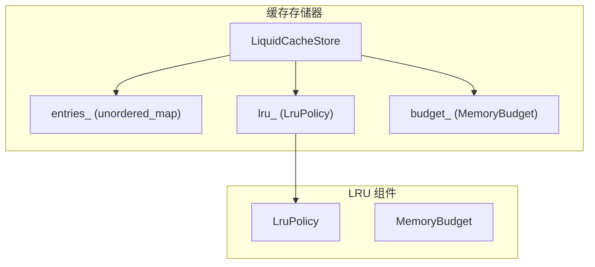
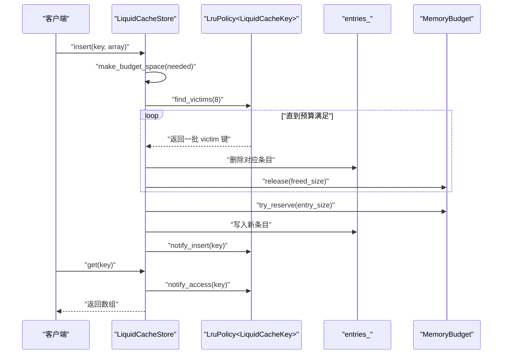
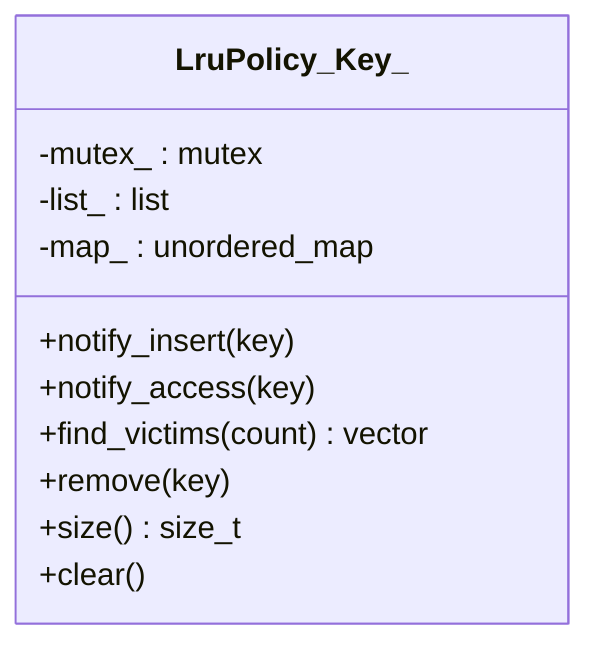
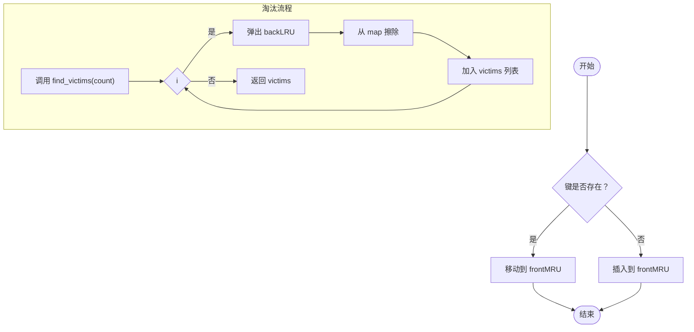
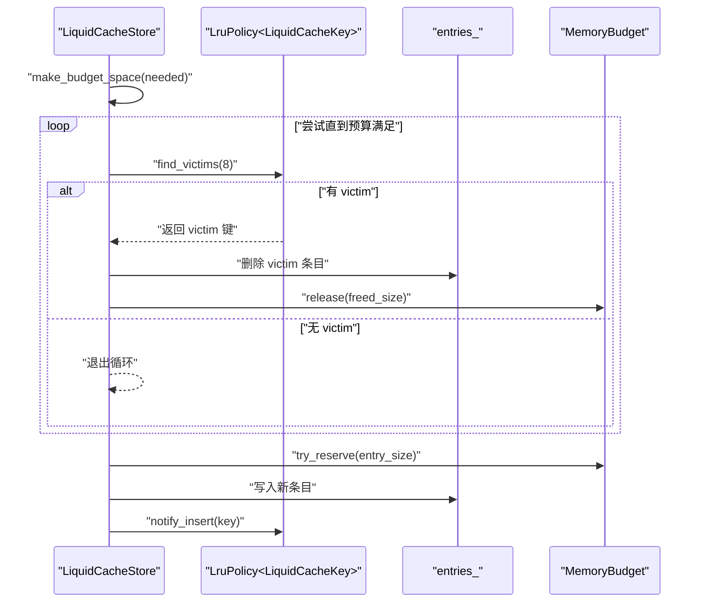
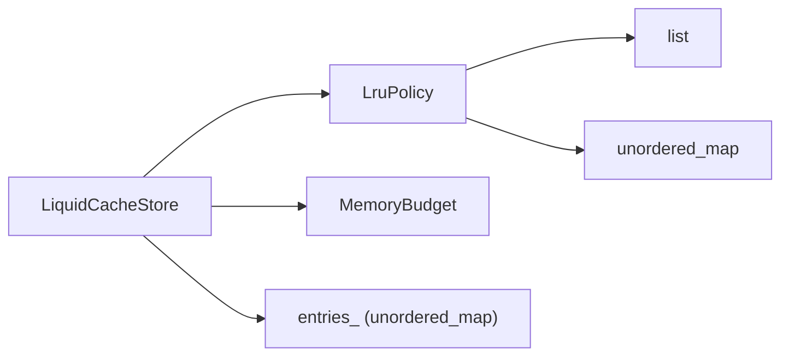

# LRU 淘汰策略

<cite>
**本文引用的文件**
- [lru_policy.h](file://include/liquid_cache/lru_policy.h)
- [liquid_cache_store.h](file://include/liquid_cache/liquid_cache_store.h)
- [test_cache_budget.cpp](file://tests/test_cache_budget.cpp)
</cite>

## 目录
1. [简介](#简介)
2. [项目结构](#项目结构)
3. [核心组件](#核心组件)
4. [架构总览](#架构总览)
5. [详细组件分析](#详细组件分析)
6. [依赖关系分析](#依赖关系分析)
7. [性能考量](#性能考量)
8. [故障排查指南](#故障排查指南)
9. [结论](#结论)
10. [附录](#附录)

## 简介
本文件围绕 LRU（最近最少使用）淘汰策略进行深入技术说明，重点解析 LruPolicy 模板类的实现原理与使用方式，涵盖：
- LRU 链表的数据结构设计与访问顺序维护
- 访问时间记录机制与淘汰算法实现
- notify_insert 与 notify_access 如何维护访问顺序
- find_victims 如何选择待淘汰缓存项
- 多线程环境下的线程安全保证与并发控制
- 配置参数与批量淘汰数量控制
- 性能调优建议与使用示例
- 与其他淘汰策略的对比分析

## 项目结构
LRU 淘汰策略位于头文件中，作为独立模板类提供通用的 LRU 行为，并被缓存存储器集成使用：
- LruPolicy：LRU 淘汰策略的核心实现
- LiquidCacheStore：缓存存储器，负责内存预算与 LRU 策略的集成
- 测试用例：验证 LRU 行为与预算约束

图表来源
- [lru_policy.h:30-96](file://include/liquid_cache/lru_policy.h#L30-L96)
- [lru_policy.h:111-188](file://include/liquid_cache/lru_policy.h#L111-L188)
- [liquid_cache_store.h:188-524](file://include/liquid_cache/liquid_cache_store.h#L188-L524)

章节来源
- [lru_policy.h:1-191](file://include/liquid_cache/lru_policy.h#L1-L191)
- [liquid_cache_store.h:1-527](file://include/liquid_cache/liquid_cache_store.h#L1-L527)

## 核心组件
- LruPolicy<Key>：基于双向链表与哈希映射的 LRU 实现，维护键的最近使用顺序，支持插入通知、访问通知与批量淘汰。
- MemoryBudget：内存预算跟踪器，提供无锁原子预留与释放能力，用于限制缓存总内存占用。
- LiquidCacheStore：缓存存储器，封装键值映射、内存预算与 LRU 策略，提供插入、读取、统计与清理等接口。

章节来源
- [lru_policy.h:30-96](file://include/liquid_cache/lru_policy.h#L30-L96)
- [lru_policy.h:111-188](file://include/liquid_cache/lru_policy.h#L111-L188)
- [liquid_cache_store.h:188-524](file://include/liquid_cache/liquid_cache_store.h#L188-L524)

## 架构总览
LRU 策略在缓存存储器中的工作流程如下：
- 插入新条目或更新现有条目时，先通过 make_budget_space 触发 LRU 批量淘汰，确保预算可用
- 成功预留内存后，记录条目并调用 lru_.notify_insert 更新访问顺序
- 读取条目时，若命中则调用 lru_.notify_access 将其提升至 MRU
- 清理或容量不足时，通过 lru_.find_victims 获取待淘汰键集合，逐个删除并释放内存

图表来源
- [liquid_cache_store.h:222-245](file://include/liquid_cache/liquid_cache_store.h#L222-L245)
- [liquid_cache_store.h:250-274](file://include/liquid_cache/liquid_cache_store.h#L250-L274)
- [liquid_cache_store.h:286-295](file://include/liquid_cache/liquid_cache_store.h#L286-L295)
- [liquid_cache_store.h:491-517](file://include/liquid_cache/liquid_cache_store.h#L491-L517)
- [lru_policy.h:118-141](file://include/liquid_cache/lru_policy.h#L118-L141)

## 详细组件分析

### LruPolicy 模板类
- 数据结构
  - 双向链表 list_：front 为 MRU（最经常使用），back 为 LRU（最少使用）
  - 哈希映射 map_：键到链表迭代器的映射，便于 O(1) 定位
  - 互斥锁 mutex_：保护所有公共方法，确保线程安全
- 关键方法
  - notify_insert(key)：插入或重插时将键移动到 MRU；若为新键则插入 front
  - notify_access(key)：仅当键存在时将其移动到 MRU
  - find_victims(count)：从 LRU 末端批量取出最多 count 个键，按 LRU 顺序返回
  - remove(key)/size()/clear()：辅助管理与调试

图表来源
- [lru_policy.h:111-188](file://include/liquid_cache/lru_policy.h#L111-L188)

章节来源
- [lru_policy.h:111-188](file://include/liquid_cache/lru_policy.h#L111-L188)

### 访问顺序维护与淘汰算法
- 访问顺序维护
  - notify_insert：若键已存在，使用 splice 将其移动到 front；否则 push_front 并建立映射
  - notify_access：若键存在，同样移动到 front
- 淘汰算法
  - find_victims：循环从 back 取出键，同时从 map 中擦除，保证 LRU 优先级
  - 批量淘汰：每次从 LRU 取出固定数量（如 8），减少多次锁竞争

图表来源
- [lru_policy.h:118-141](file://include/liquid_cache/lru_policy.h#L118-L141)
- [lru_policy.h:146-159](file://include/liquid_cache/lru_policy.h#L146-L159)

章节来源
- [lru_policy.h:118-159](file://include/liquid_cache/lru_policy.h#L118-L159)

### 与缓存存储器的集成
- 插入流程
  - make_budget_space：循环调用 lru_.find_victims(8)，逐个删除并释放内存，直至预算满足
  - 成功预留后写入 entries_，并调用 lru_.notify_insert
- 读取流程
  - 命中时调用 lru_.notify_access，避免被后续淘汰
- 清理与统计
  - clear：清空 entries、重置预算、清空 LRU
  - stats：汇总条目数、内存使用、预算上限等信息

图表来源
- [liquid_cache_store.h:491-517](file://include/liquid_cache/liquid_cache_store.h#L491-L517)
- [liquid_cache_store.h:222-245](file://include/liquid_cache/liquid_cache_store.h#L222-L245)
- [lru_policy.h:146-159](file://include/liquid_cache/lru_policy.h#L146-L159)

章节来源
- [liquid_cache_store.h:222-245](file://include/liquid_cache/liquid_cache_store.h#L222-L245)
- [liquid_cache_store.h:286-295](file://include/liquid_cache/liquid_cache_store.h#L286-L295)
- [liquid_cache_store.h:491-517](file://include/liquid_cache/liquid_cache_store.h#L491-L517)

### 线程安全与并发控制
- LruPolicy
  - 所有公共方法均使用 std::lock_guard<std::mutex> 包裹，确保互斥访问
  - list_ 与 map_ 在单锁保护下操作，避免竞态条件
- LiquidCacheStore
  - 整体使用 std::mutex_ 保护内部状态
  - 插入/更新/读取/清理等路径均持有锁，避免与 LRU 操作并发冲突
- MemoryBudget
  - 使用 std::atomic<size_t> 实现无锁预留与释放，适合高并发场景的预算检查
  - try_reserve 内部采用 compare_exchange_weak 循环，保证原子性与可重试性

章节来源
- [lru_policy.h:118-159](file://include/liquid_cache/lru_policy.h#L118-L159)
- [lru_policy.h:52-72](file://include/liquid_cache/lru_policy.h#L52-L72)
- [liquid_cache_store.h:222-245](file://include/liquid_cache/liquid_cache_store.h#L222-L245)
- [liquid_cache_store.h:491-517](file://include/liquid_cache/liquid_cache_store.h#L491-L517)

### 配置参数与性能调优
- 批量淘汰数量
  - make_budget_space 默认每次批量淘汰 8 个键，可在实现中调整该常量以平衡吞吐与延迟
- 内存预算
  - set_max_cache_bytes 设置上限；0 表示不限制
  - MemoryBudget 提供 try_reserve/try_update/release，配合 LRU 实现预算约束
- 性能调优建议
  - 适度增大批量淘汰数量可降低锁竞争频率，但会增加单次淘汰开销
  - 对于热点数据较多的场景，适当提高预算上限可减少频繁淘汰
  - 使用 MemoryBudget 的原子预留可显著降低锁持有时间

章节来源
- [liquid_cache_store.h:198-205](file://include/liquid_cache/liquid_cache_store.h#L198-L205)
- [liquid_cache_store.h:497-502](file://include/liquid_cache/liquid_cache_store.h#L497-L502)
- [lru_policy.h:52-91](file://include/liquid_cache/lru_policy.h#L52-L91)

### 使用示例与行为验证
- 插入顺序淘汰：连续插入多个键，随后批量淘汰应按插入顺序从最早者开始
- 访问提升：对已存在的键执行访问通知后，其应被提升至 MRU，后续淘汰优先级下降
- 重新插入提升：对已存在键再次插入，应同样提升至 MRU
- 空集合处理：对空 LRU 调用 find_victims 应返回空列表
- 集成测试：缓存存储器在预算超限时触发 LRU 淘汰，读取命中时通过访问通知避免被淘汰

章节来源
- [test_cache_budget.cpp:100-148](file://tests/test_cache_budget.cpp#L100-L148)
- [test_cache_budget.cpp:166-256](file://tests/test_cache_budget.cpp#L166-L256)
- [test_cache_budget.cpp:357-388](file://tests/test_cache_budget.cpp#L357-L388)

## 依赖关系分析
- LruPolicy 依赖
  - std::list、std::unordered_map、std::mutex、std::vector
- LiquidCacheStore 依赖
  - LruPolicy<LiquidCacheKey>、MemoryBudget、std::unordered_map<LiquidCacheKey,...>
- 关键耦合点
  - LRU 与存储器通过键类型一致（LiquidCacheKey）耦合
  - 存储器在 make_budget_space 中直接调用 LruPolicy 的 find_victims

图表来源
- [liquid_cache_store.h:519-524](file://include/liquid_cache/liquid_cache_store.h#L519-L524)
- [lru_policy.h:184-188](file://include/liquid_cache/lru_policy.h#L184-L188)

章节来源
- [liquid_cache_store.h:519-524](file://include/liquid_cache/liquid_cache_store.h#L519-L524)
- [lru_policy.h:184-188](file://include/liquid_cache/lru_policy.h#L184-L188)

## 性能考量
- 时间复杂度
  - notify_insert/notify_access：O(1)（splice + map 查找）
  - find_victims：O(k)（k 为淘汰数量），每次从 LRU 末端弹出
  - make_budget_space：平均 O(k·m)（m 为需要淘汰的轮数，k 为每轮批量大小）
- 空间复杂度
  - LruPolicy：O(n)（n 为键数量）
  - MemoryBudget：O(1)（原子计数）
- 并发特性
  - LruPolicy 的锁粒度覆盖单次操作，避免长持有
  - MemoryBudget 的原子预留减少锁竞争
- 优化建议
  - 合理设置批量淘汰数量，权衡单次开销与锁次数
  - 对热点键频繁访问的场景，考虑增大预算上限
  - 使用原子预留与批量淘汰结合，降低锁争用

## 故障排查指南
- 插入失败（预算不足）
  - 检查 max_cache_bytes 是否过小或单条目过大
  - 确认 make_budget_space 是否正确调用并成功释放足够空间
- 读取未命中
  - 确认键是否正确构建（file_id/rg_id/col_id/batch_id）
  - 检查 entries_ 是否存在对应键
- 访问未提升
  - 确认 get 调用后是否调用了 notify_access
  - 检查 LRU 是否为空或键不存在
- 淘汰异常
  - 检查 find_victims 返回数量是否符合预期
  - 确认 entries_ 与 LRU 的键集合一致性

章节来源
- [liquid_cache_store.h:286-295](file://include/liquid_cache/liquid_cache_store.h#L286-L295)
- [liquid_cache_store.h:491-517](file://include/liquid_cache/liquid_cache_store.h#L491-L517)
- [test_cache_budget.cpp:166-256](file://tests/test_cache_budget.cpp#L166-L256)

## 结论
LRU 淘汰策略通过“链表 + 哈希映射”的组合实现了高效的访问顺序维护与淘汰选择。在多线程环境下，LruPolicy 以细粒度互斥保障线程安全，而 MemoryBudget 的原子预留进一步提升了并发性能。LiquidCacheStore 将 LRU 与内存预算无缝集成，形成稳定可靠的缓存淘汰闭环。通过合理配置批量淘汰数量与预算上限，可在不同负载场景下取得良好的吞吐与延迟平衡。

## 附录
- 与其他淘汰策略的对比
  - FIFO：实现简单，但无法反映访问模式；LRU 更贴近真实访问分布
  - LFU：需维护访问频次，实现更复杂；LRU 仅需顺序维护，成本更低
  - Random：随机淘汰，缺乏历史感知；LRU 具备明确的局部性优势
- 最佳实践
  - 对热点列与批处理场景，适当提高预算上限
  - 频繁读取的键可通过访问通知避免被误淘汰
  - 批量淘汰数量应根据系统吞吐与延迟目标进行调优