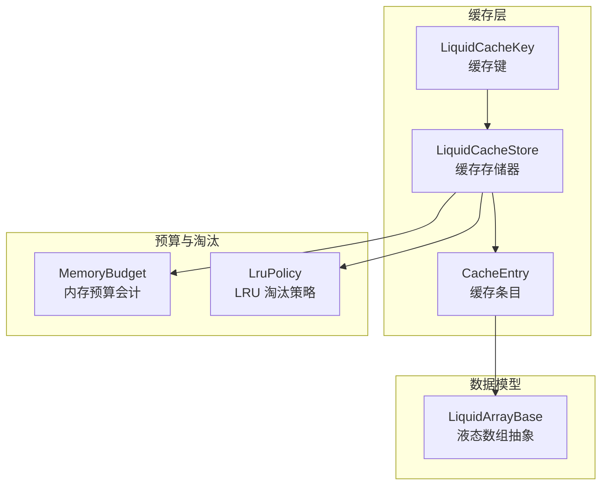
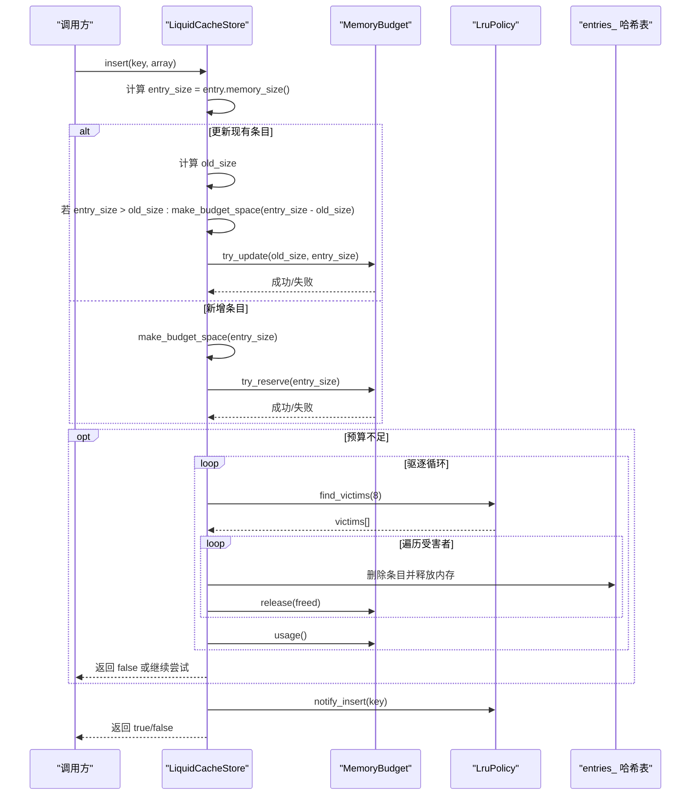
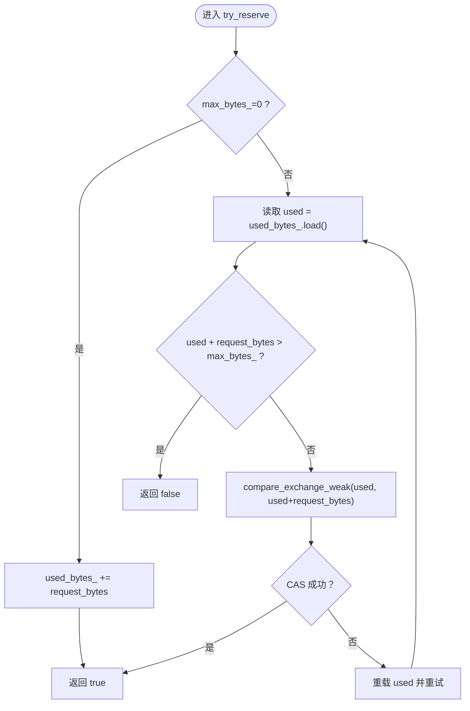
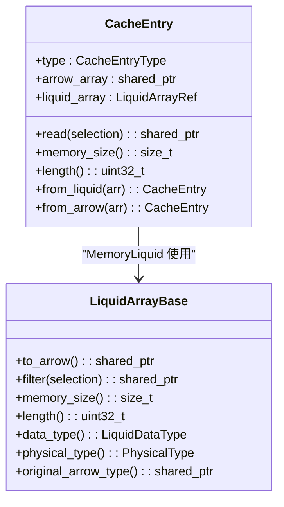
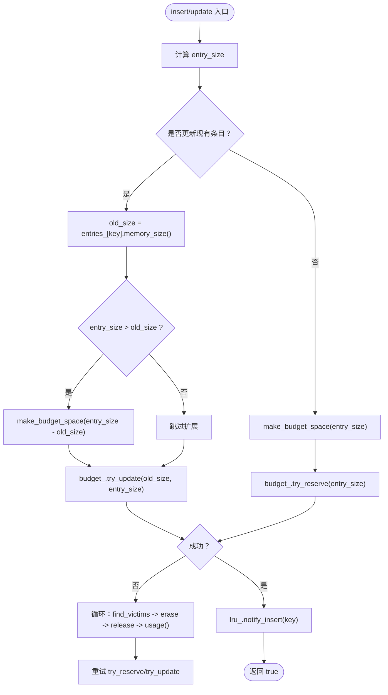
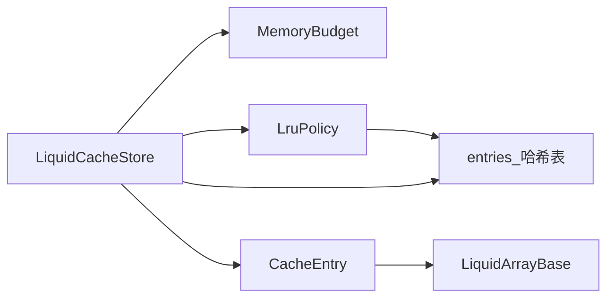

# 内存管理策略

<cite>
**本文引用的文件**
- [liquid_cache_store.h](file://include/liquid_cache/liquid_cache_store.h)
- [lru_policy.h](file://include/liquid_cache/lru_policy.h)
- [liquid_array.h](file://include/liquid_cache/liquid_array.h)
- [test_cache_budget.cpp](file://tests/test_cache_budget.cpp)
</cite>

## 目录
1. [简介](#简介)
2. [项目结构](#项目结构)
3. [核心组件](#核心组件)
4. [架构总览](#架构总览)
5. [详细组件分析](#详细组件分析)
6. [依赖关系分析](#依赖关系分析)
7. [性能考量](#性能考量)
8. [故障排查指南](#故障排查指南)
9. [结论](#结论)
10. [附录：配置与最佳实践](#附录配置与最佳实践)

## 简介
本文件聚焦于 LiquidCacheStore 的内存管理策略，系统性阐述 MemoryBudget 原子性会计系统（try_reserve、try_update、release）的工作原理，以及内存预算控制算法与动态内存分配策略。同时，详细说明内存追踪机制（缓存条目内存占用计算、使用统计与实时监控），并给出内存管理配置的最佳实践与性能优化建议。内容面向具备不同技术背景的读者，既提供高层概览，也包含代码级细节与可视化图示。

## 项目结构
本仓库围绕“列式缓存 + 列投影 + 行过滤”的设计目标构建，内存管理的关键实现集中在以下文件：
- include/liquid_cache/liquid_cache_store.h：缓存存储器主体，负责键值管理、插入/读取、批量读取、统计信息与预算控制集成。
- include/liquid_cache/lru_policy.h：内存预算与 LRU 淘汰策略，包含 MemoryBudget 原子会计与 LruPolicy 驱逐队列。
- include/liquid_cache/liquid_array.h：液态数组抽象接口，定义内存大小查询等能力，供缓存条目统一计量。
- tests/test_cache_budget.cpp：针对 MemoryBudget、LRU 与缓存淘汰的端到端测试，验证预算控制与行为一致性。

图表来源
- [liquid_cache_store.h:188-524](file://include/liquid_cache/liquid_cache_store.h#L188-L524)
- [lru_policy.h:30-96](file://include/liquid_cache/lru_policy.h#L30-L96)
- [liquid_array.h:29-85](file://include/liquid_cache/liquid_array.h#L29-L85)

章节来源
- [liquid_cache_store.h:1-527](file://include/liquid_cache/liquid_cache_store.h#L1-L527)
- [lru_policy.h:1-191](file://include/liquid_cache/lru_policy.h#L1-L191)
- [liquid_array.h:1-159](file://include/liquid_cache/liquid_array.h#L1-L159)

## 核心组件
- MemoryBudget：线程安全的内存预算会计系统，基于原子操作实现 lock-free 预算预留与更新，支持无上限模式（max_bytes=0）。
- LruPolicy：经典 LRU 淘汰策略，维护 MRU/LRU 序列，提供 find_victims 选择待驱逐项。
- CacheEntry：缓存条目包装器，统一管理 MemoryArrow 与 MemoryLiquid 两种类型，并提供 memory_size 计算。
- LiquidCacheStore：缓存存储器，整合预算与淘汰，提供插入、读取、批量读取、统计与清理等能力。

章节来源
- [lru_policy.h:30-96](file://include/liquid_cache/lru_policy.h#L30-L96)
- [lru_policy.h:111-188](file://include/liquid_cache/lru_policy.h#L111-L188)
- [liquid_cache_store.h:111-173](file://include/liquid_cache/liquid_cache_store.h#L111-L173)
- [liquid_cache_store.h:188-524](file://include/liquid_cache/liquid_cache_store.h#L188-L524)

## 架构总览
LiquidCacheStore 的内存管理采用“预算优先 + LRU 驱逐”的双层控制：
- 预算层：通过 MemoryBudget 提供原子性会计，确保并发插入时不会超过 max_bytes。
- 淘汰层：当新条目或更新导致预算不足时，由 LruPolicy 选择 LRU 条目进行驱逐，释放内存后重试。

图表来源
- [liquid_cache_store.h:222-245](file://include/liquid_cache/liquid_cache_store.h#L222-L245)
- [liquid_cache_store.h:250-274](file://include/liquid_cache/liquid_cache_store.h#L250-L274)
- [liquid_cache_store.h:491-517](file://include/liquid_cache/liquid_cache_store.h#L491-L517)
- [lru_policy.h:146-159](file://include/liquid_cache/lru_policy.h#L146-L159)
- [lru_policy.h:74-91](file://include/liquid_cache/lru_policy.h#L74-L91)

## 详细组件分析

### MemoryBudget 原子性会计系统
- try_reserve(request_bytes)：在有上限时，使用 compare_exchange_weak 循环尝试原子增加 used_bytes_；无上限时直接累加并返回成功。
- release(bytes)：原子减法，用于归还已预留但未使用的内存。
- try_update(old_size, new_size)：根据差值决定是 try_reserve 还是 release，保证预算变更的原子性与一致性。

图表来源
- [lru_policy.h:52-72](file://include/liquid_cache/lru_policy.h#L52-L72)

章节来源
- [lru_policy.h:30-96](file://include/liquid_cache/lru_policy.h#L30-L96)

### CacheEntry 内存追踪机制
- MemoryLiquid：通过 LiquidArrayBase::memory_size() 获取内存大小，该方法由具体液态数组类型实现，返回编码后的内存字节数。
- MemoryArrow：遍历 arrow::Array::data()->buffers，累加所有缓冲区大小，得到内存占用字节数。
- length()：统一返回元素个数，便于统计与调试。

图表来源
- [liquid_cache_store.h:111-173](file://include/liquid_cache/liquid_cache_store.h#L111-L173)
- [liquid_array.h:29-85](file://include/liquid_cache/liquid_array.h#L29-L85)

章节来源
- [liquid_cache_store.h:111-173](file://include/liquid_cache/liquid_cache_store.h#L111-L173)
- [liquid_array.h:29-85](file://include/liquid_cache/liquid_array.h#L29-L85)

### 动态内存分配策略与预算控制算法
- 插入流程（新增/更新）：
  - 计算新条目内存大小。
  - 若为更新且变大，先调用 make_budget_space 扩展空间；否则直接尝试预算更新。
  - 若为新增，先尝试 make_budget_space，再 try_reserve。
- make_budget_space 算法：
  - 在 max_cache_bytes_ 允许范围内，反复从 LRU 取出 victims，删除对应条目并调用 budget_.release 释放内存，直到满足 needed_bytes 或穷尽 victims。
  - 该过程不直接修改预算，仅释放内存，后续由调用方执行 try_reserve/try_update。
- try_update 与 try_reserve 的组合：
  - 更新场景下，先释放旧大小，再按差值预留新大小，保证原子性。
  - 新增场景下，先预留，再写入，失败则回滚（由上层逻辑处理）。

图表来源
- [liquid_cache_store.h:222-245](file://include/liquid_cache/liquid_cache_store.h#L222-L245)
- [liquid_cache_store.h:250-274](file://include/liquid_cache/liquid_cache_store.h#L250-L274)
- [liquid_cache_store.h:491-517](file://include/liquid_cache/liquid_cache_store.h#L491-L517)
- [lru_policy.h:146-159](file://include/liquid_cache/lru_policy.h#L146-L159)

章节来源
- [liquid_cache_store.h:222-274](file://include/liquid_cache/liquid_cache_store.h#L222-L274)
- [liquid_cache_store.h:491-517](file://include/liquid_cache/liquid_cache_store.h#L491-L517)

### 内存使用统计与实时监控
- stats()：聚合 entries_ 中每个条目的 memory_size，统计条目总数、箭头/液态条目数量、预算使用与上限。
- total_memory_size()：对 entries_ 统计求和，便于外部监控。
- memory_budget_usage()/max_cache_bytes()：直接暴露预算当前使用与上限。
- LRU 尺寸：lru_size()，用于评估淘汰压力。

章节来源
- [liquid_cache_store.h:396-422](file://include/liquid_cache/liquid_cache_store.h#L396-L422)
- [liquid_cache_store.h:198-215](file://include/liquid_cache/liquid_cache_store.h#L198-L215)

### 测试验证与行为边界
- MemoryBudget 基本预留、超限拒绝、try_update 增长/收缩、释放、无上限模式均通过单元测试覆盖。
- LRU 行为：插入顺序淘汰、访问提升至 MRU、重复插入移动至 MRU、空集合 find_victims。
- 缓存集成测试：预算内插入、预算超限时的逐次驱逐、get 访问防止被驱逐、单条目过大拒绝、更新条目大小变化、统计信息正确、无上限默认、运行时调整上限、清空重置、多次驱逐。

章节来源
- [test_cache_budget.cpp:30-393](file://tests/test_cache_budget.cpp#L30-L393)

## 依赖关系分析
- LiquidCacheStore 依赖 MemoryBudget 与 LruPolicy 实现预算与淘汰控制。
- CacheEntry 依赖 LiquidArrayBase 提供统一内存大小与读取接口。
- LruPolicy 与 MemoryBudget 之间通过 entries_ 与 budget_.release 协作完成驱逐与预算回收。

图表来源
- [liquid_cache_store.h:188-524](file://include/liquid_cache/liquid_cache_store.h#L188-L524)
- [lru_policy.h:111-188](file://include/liquid_cache/lru_policy.h#L111-L188)
- [liquid_array.h:29-85](file://include/liquid_cache/liquid_array.h#L29-L85)

章节来源
- [liquid_cache_store.h:188-524](file://include/liquid_cache/liquid_cache_store.h#L188-L524)
- [lru_policy.h:111-188](file://include/liquid_cache/lru_policy.h#L111-L188)
- [liquid_array.h:29-85](file://include/liquid_cache/liquid_array.h#L29-L85)

## 性能考量
- 原子预算预留：使用 compare_exchange_weak 循环，避免锁竞争，适合高并发插入场景。
- 驱逐粒度：find_victims(8) 批量驱逐，减少多次迭代成本，提高吞吐。
- 内存追踪开销：CacheEntry::memory_size 对 Arrow 条目遍历缓冲区，对大数组存在线性成本；建议在批量加载时合并小批次，降低统计频率。
- 无上限模式：max_bytes_=0 时，try_reserve 直接累加，避免 CAS 开销，适合测试或内存充足场景。
- 读路径优化：get() 后通知 LRU，可有效保护热点条目，降低不必要的驱逐。

[本节为通用性能讨论，无需特定文件来源]

## 故障排查指南
- 插入返回 false：
  - 检查 max_cache_bytes 是否过小或 entry_size 是否过大。
  - 观察 make_budget_space 是否穷尽 victims 仍未满足，确认 LRU 是否为空或 entries_ 是否异常。
- 预算使用与统计不一致：
  - 确认是否在多线程环境下正确持有互斥锁。
  - 检查是否有未释放的内存（如更新场景中未调用 try_update）。
- 驱逐策略不符合预期：
  - 确认 get() 是否被频繁调用以提升 MRU。
  - 检查 find_victims 的返回数量与顺序是否符合 LRU 规则。
- 清理后仍显示占用：
  - 调用 clear() 后检查 entries_、budget_、lru_ 是否均已重置。

章节来源
- [liquid_cache_store.h:491-517](file://include/liquid_cache/liquid_cache_store.h#L491-L517)
- [test_cache_budget.cpp:166-388](file://tests/test_cache_budget.cpp#L166-L388)

## 结论
LiquidCacheStore 的内存管理通过 MemoryBudget 的原子会计与 LruPolicy 的经典淘汰策略，实现了高并发下的稳定预算控制与高效驱逐。CacheEntry 的统一内存追踪使不同类型的缓存条目可以被一致计量。结合测试用例与统计接口，用户可以在生产环境中可靠地监控与调优内存使用，避免内存泄漏并获得良好性能。

[本节为总结性内容，无需特定文件来源]

## 附录：配置与最佳实践

### 如何设置合理的内存上限
- 估算方式：
  - 基于工作集大小：观察典型查询的列投影与行过滤后，估算 Arrow/液态数组的内存占用。
  - 预留冗余：考虑峰值并发与临时中间结果，通常设置为工作集的 1.5–2 倍。
  - 分层预算：若系统包含多个缓存实例，按职责划分预算，避免相互影响。
- 默认行为：max_bytes_=0 表示无上限，适合开发与测试环境。

章节来源
- [lru_policy.h:32-37](file://include/liquid_cache/lru_policy.h#L32-L37)
- [liquid_cache_store.h:194-205](file://include/liquid_cache/liquid_cache_store.h#L194-L205)

### 预估内存使用量
- 液态数组：使用 LiquidArrayBase::memory_size() 获取编码后内存大小。
- Arrow 数组：遍历 data()->buffers 累加缓冲区大小。
- 批量统计：使用 stats() 或 total_memory_size() 获取当前总占用。

章节来源
- [liquid_cache_store.h:140-153](file://include/liquid_cache/liquid_cache_store.h#L140-L153)
- [liquid_cache_store.h:396-422](file://include/liquid_cache/liquid_cache_store.h#L396-L422)

### 避免内存泄漏
- 更新条目：务必使用 try_update(old_size, new_size)，确保预算变更原子性。
- 及时释放：在驱逐后立即调用 budget_.release，保持 used_bytes_ 准确。
- 清理缓存：必要时调用 clear() 重置 entries_、budget_ 与 LRU。

章节来源
- [lru_policy.h:74-91](file://include/liquid_cache/lru_policy.h#L74-L91)
- [liquid_cache_store.h:424-429](file://include/liquid_cache/liquid_cache_store.h#L424-L429)

### 实际内存使用示例
- 插入 Arrow 数组：参考测试用例中的 insert_arrow 场景，观察预算使用与驱逐行为。
- 更新条目：参考测试用例中的更新场景，验证 total_memory_size 与长度变化。
- 统计监控：使用 stats() 输出预算上限、使用量、条目数与类型分布。

章节来源
- [test_cache_budget.cpp:166-388](file://tests/test_cache_budget.cpp#L166-L388)
- [liquid_cache_store.h:396-422](file://include/liquid_cache/liquid_cache_store.h#L396-L422)

### 性能优化建议
- 合理批量化：减少小批次插入带来的统计与驱逐开销。
- 控制并发：在高并发场景下，尽量避免同时大量写入，必要时分时段或分桶。
- 热点保护：通过 get() 访问热点条目，使其成为 MRU，降低被驱逐概率。
- 定期清理：在长时间运行的服务中，定期调用 clear() 或设置生命周期策略，防止碎片化。

[本节为通用优化建议，无需特定文件来源]