# 线程安全机制

<cite>
**本文档引用的文件**
- [liquid_cache_store.h](file://include/liquid_cache/liquid_cache_store.h)
- [lru_policy.h](file://include/liquid_cache/lru_policy.h)
- [transcoder_arrow.cpp](file://src/transcoder_arrow.cpp)
- [liquid_array.h](file://include/liquid_cache/liquid_array.h)
- [test_cache_budget.cpp](file://tests/test_cache_budget.cpp)
- [CMakeLists.txt](file://CMakeLists.txt)
</cite>

## 目录
1. [简介](#简介)
2. [项目结构](#项目结构)
3. [核心组件](#核心组件)
4. [架构概览](#架构概览)
5. [详细组件分析](#详细组件分析)
6. [依赖关系分析](#依赖关系分析)
7. [性能考虑](#性能考虑)
8. [故障排除指南](#故障排除指南)
9. [结论](#结论)

## 简介

本文档深入分析了 LiquidCacheStore 中的线程安全机制，重点解释了并发控制策略、锁粒度设计和死锁避免机制。LiquidCacheStore 是一个高性能的列式内存缓存系统，采用 C++20 标准实现，支持多线程环境下的安全操作。

该系统的核心特点包括：
- 基于 `std::mutex` 的细粒度并发控制
- 内存预算的无锁原子操作
- LRU 淘汰策略的线程安全实现
- 零序列化读取的高性能设计

## 项目结构

项目采用模块化设计，主要包含以下核心组件：

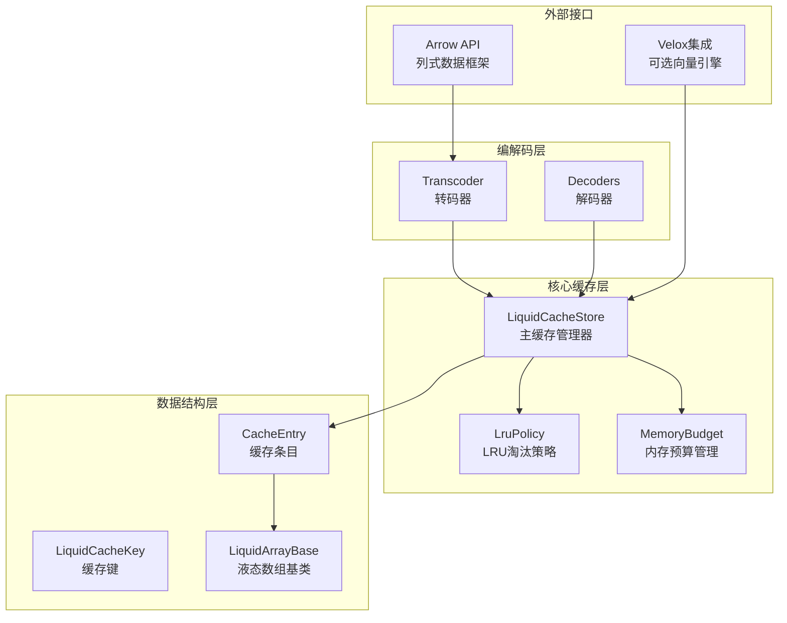

**图表来源**
- [liquid_cache_store.h:188-527](file://include/liquid_cache/liquid_cache_store.h#L188-L527)
- [lru_policy.h:30-191](file://include/liquid_cache/lru_policy.h#L30-L191)

**章节来源**
- [CMakeLists.txt:1-563](file://CMakeLists.txt#L1-L563)

## 核心组件

### LiquidCacheStore - 主缓存管理器

LiquidCacheStore 是整个系统的中心组件，负责管理缓存条目、内存预算和 LRU 淘汰策略。其线程安全设计基于以下原则：

#### 并发控制策略

1. **全局互斥锁保护**：所有公共接口都通过 `std::mutex` 保护
2. **细粒度操作**：每个操作都在独立的锁作用域内执行
3. **无锁预算管理**：内存预算使用原子操作实现无锁特性

#### 关键数据结构

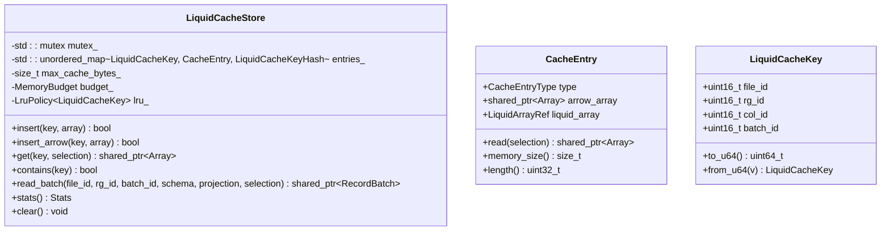

**图表来源**
- [liquid_cache_store.h:188-527](file://include/liquid_cache/liquid_cache_store.h#L188-L527)
- [liquid_cache_store.h:111-173](file://include/liquid_cache/liquid_cache_store.h#L111-L173)
- [liquid_cache_store.h:48-78](file://include/liquid_cache/liquid_cache_store.h#L48-L78)

**章节来源**
- [liquid_cache_store.h:188-527](file://include/liquid_cache/liquid_cache_store.h#L188-L527)

### MemoryBudget - 无锁内存预算管理

MemoryBudget 实现了线程安全的内存预算跟踪，采用原子操作避免锁竞争：

#### 无锁设计原理

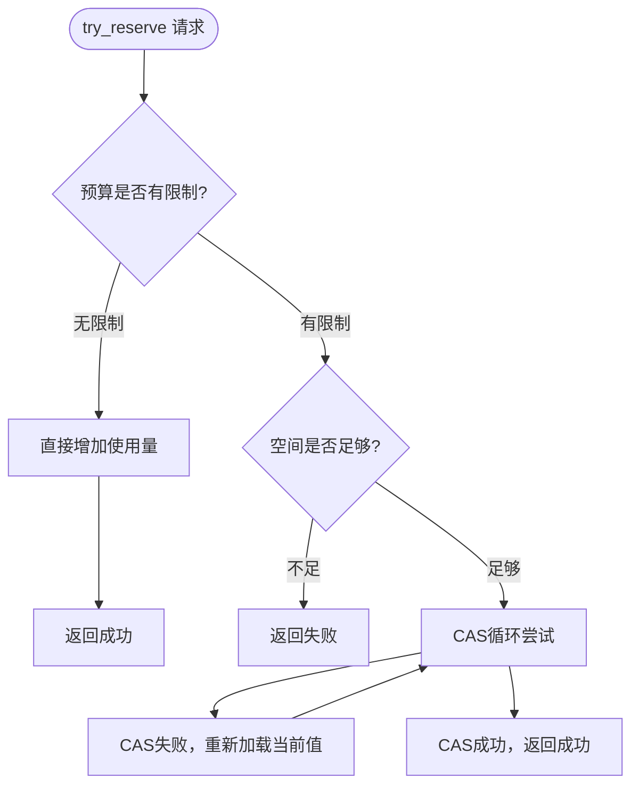

**图表来源**
- [lru_policy.h:52-72](file://include/liquid_cache/lru_policy.h#L52-L72)

#### 原子操作优势

- **高并发性能**：避免锁竞争，提升多线程环境下的吞吐量
- **无阻塞更新**：使用 `compare_exchange_weak` 实现无阻塞的原子更新
- **内存序保证**：使用 `memory_order_relaxed` 降低内存屏障开销

**章节来源**
- [lru_policy.h:30-96](file://include/liquid_cache/lru_policy.h#L30-L96)

### LruPolicy - 线程安全的LRU策略

LruPolicy 使用 `std::list` + `std::unordered_map` 实现经典 LRU 算法，并提供线程安全的访问接口：

#### 线程安全实现

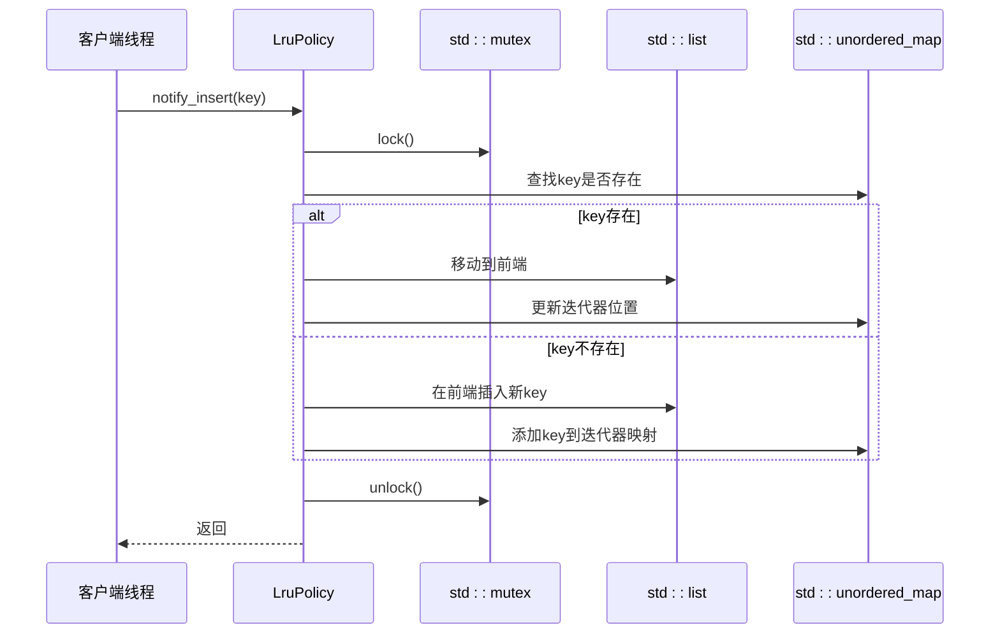

**图表来源**
- [lru_policy.h:118-130](file://include/liquid_cache/lru_policy.h#L118-L130)

**章节来源**
- [lru_policy.h:111-188](file://include/liquid_cache/lru_policy.h#L111-L188)

## 架构概览

LiquidCacheStore 的整体架构体现了良好的并发设计原则：

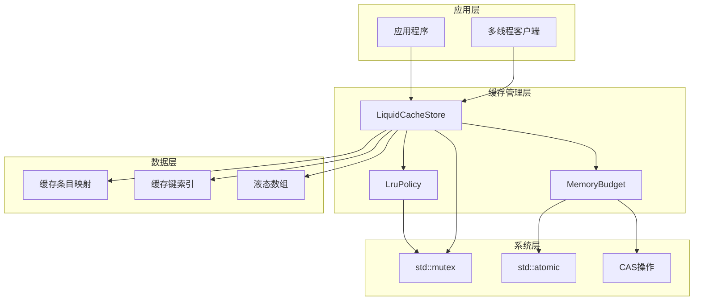

**图表来源**
- [liquid_cache_store.h:519-523](file://include/liquid_cache/liquid_cache_store.h#L519-L523)
- [lru_policy.h:185](file://include/liquid_cache/lru_policy.h#L185)

## 详细组件分析

### 插入操作的线程安全保证

插入操作是系统中最复杂的并发操作，需要同时处理内存预算检查、LRU 淘汰和数据更新：

#### 插入流程分析

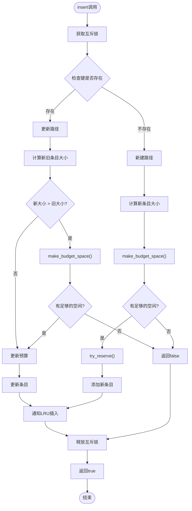

**图表来源**
- [liquid_cache_store.h:222-245](file://include/liquid_cache/liquid_cache_store.h#L222-L245)
- [liquid_cache_store.h:250-274](file://include/liquid_cache/liquid_cache_store.h#L250-L274)

#### 原子性保证

插入操作的原子性通过以下机制保证：

1. **单锁作用域**：整个插入过程在一个 `std::lock_guard` 作用域内完成
2. **预算一致性**：内存预算的检查和更新在同一个锁保护下进行
3. **LRU同步**：LRU 通知与条目更新在同一锁作用域内完成

**章节来源**
- [liquid_cache_store.h:222-274](file://include/liquid_cache/liquid_cache_store.h#L222-L274)

### 查询操作的线程安全保证

查询操作相对简单，但仍需确保数据一致性：

#### 查询流程

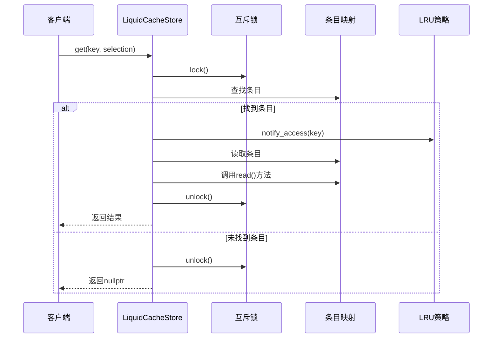

**图表来源**
- [liquid_cache_store.h:288-295](file://include/liquid_cache/liquid_cache_store.h#L288-L295)

**章节来源**
- [liquid_cache_store.h:279-295](file://include/liquid_cache/liquid_cache_store.h#L279-L295)

### 删除操作的线程安全保证

删除操作包括单个条目的删除和批量清理：

#### 清理流程

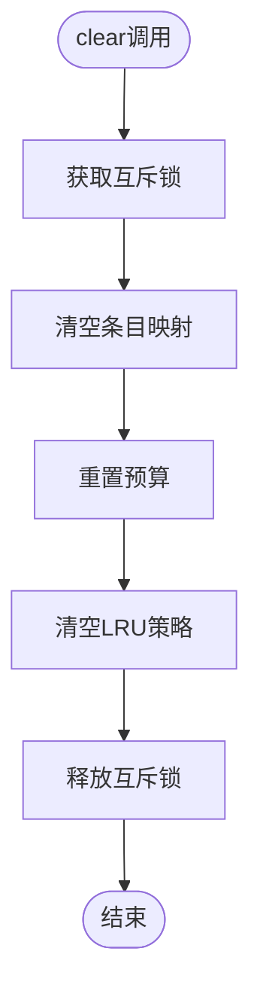

**图表来源**
- [liquid_cache_store.h:424-429](file://include/liquid_cache/liquid_cache_store.h#L424-L429)

**章节来源**
- [liquid_cache_store.h:424-429](file://include/liquid_cache/liquid_cache_store.h#L424-L429)

### 读写锁的使用场景分析

虽然当前实现使用 `std::mutex` 而非读写锁，但在某些场景下读写锁可能更合适：

#### 适用场景对比

| 场景 | 当前实现 | 读写锁优势 | 选择理由 |
|------|----------|------------|----------|
| 插入操作 | 单独互斥锁 | 写者优先 | 需要独占访问以维护一致性 |
| 查询操作 | 单独互斥锁 | 多读者共享 | 读操作较多且无修改 |
| 统计查询 | 单独互斥锁 | 多读者共享 | 只读操作，无修改 |
| 批量操作 | 单独互斥锁 | 写者优先 | 需要独占访问 |

#### 性能影响分析

读写锁的引入可能带来的性能改进：
- **读多写少场景**：多个读线程可以并发执行，提升吞吐量
- **写操作阻塞**：写操作需要等待所有读操作完成，可能增加延迟
- **复杂性增加**：实现和维护成本更高

**章节来源**
- [liquid_cache_store.h:201-205](file://include/liquid_cache/liquid_cache_store.h#L201-L205)

### 死锁避免机制

系统通过以下机制避免死锁：

#### 锁获取顺序规则

1. **单一锁原则**：每个操作只获取一个互斥锁
2. **锁范围最小化**：锁的作用域尽可能小
3. **避免嵌套锁**：不在持有锁的情况下调用外部函数

#### 死锁预防策略

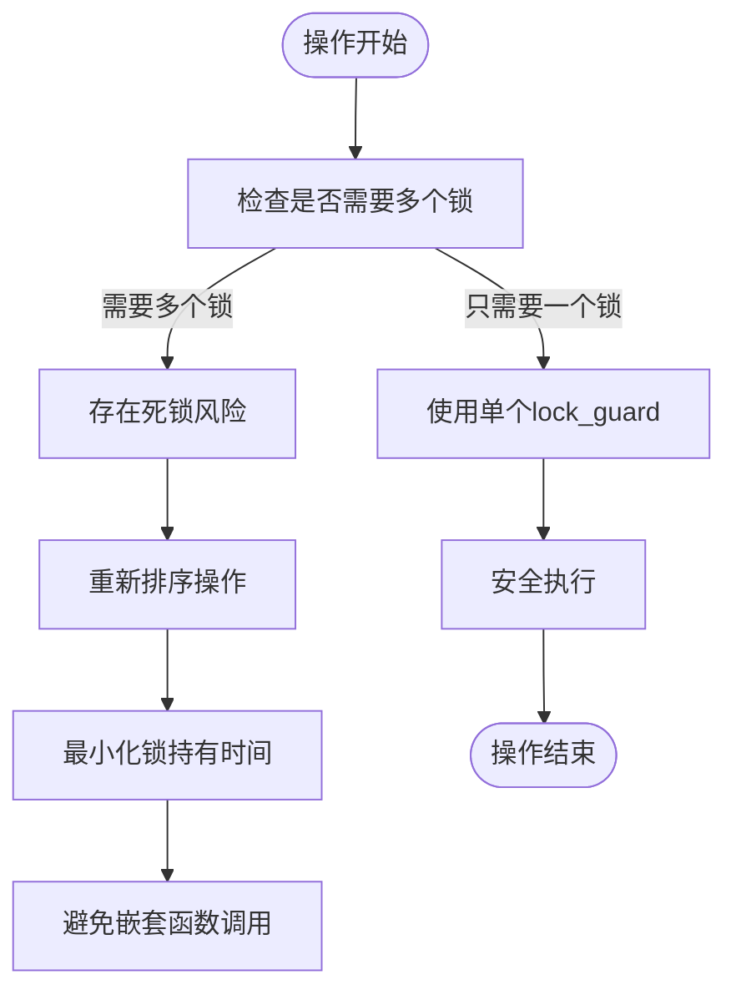

**章节来源**
- [liquid_cache_store.h:222-245](file://include/liquid_cache/liquid_cache_store.h#L222-L245)

## 依赖关系分析

系统各组件之间的依赖关系体现了清晰的分层设计：

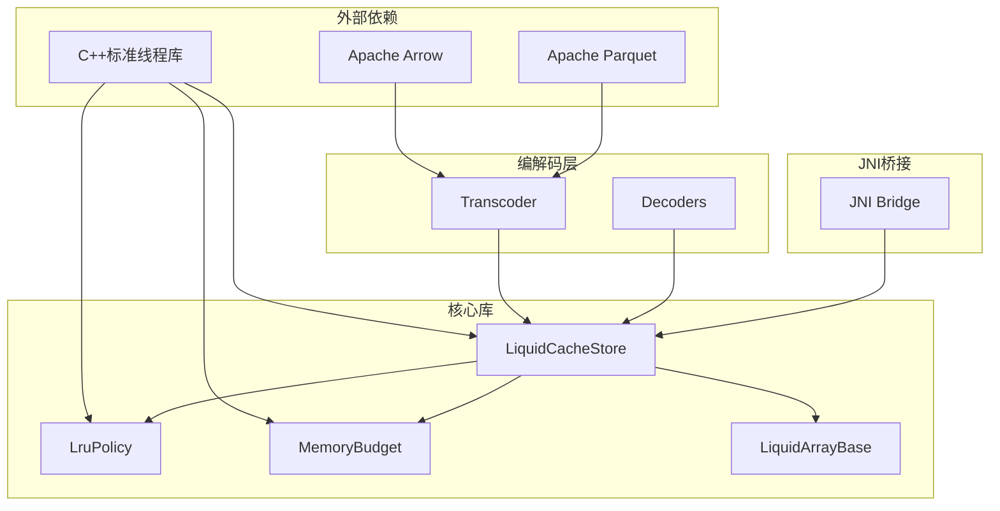

**图表来源**
- [CMakeLists.txt:15-18](file://CMakeLists.txt#L15-L18)
- [transcoder_arrow.cpp:28-26](file://src/transcoder_arrow.cpp#L28-L26)

**章节来源**
- [CMakeLists.txt:15-18](file://CMakeLists.txt#L15-L18)

## 性能考虑

### 并发性能优化

#### 锁粒度优化

1. **无锁预算管理**：MemoryBudget 使用原子操作避免锁竞争
2. **细粒度锁定**：每个操作都在独立的锁作用域内执行
3. **最小化锁持有时间**：尽快释放互斥锁

#### 内存管理优化

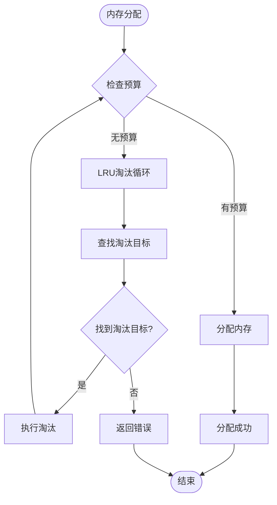

**图表来源**
- [liquid_cache_store.h:491-517](file://include/liquid_cache/liquid_cache_store.h#L491-L517)

### 性能监控和调优

#### 关键性能指标

| 指标 | 描述 | 监控方法 |
|------|------|----------|
| 命中率 | 缓存命中次数/总查询次数 | `stats()` 方法 |
| 内存使用 | 当前内存使用量 | `memory_budget_usage()` |
| 淘汰率 | LRU淘汰频率 | `lru_size()` |
| 并发度 | 同时访问的线程数 | 系统监控 |

**章节来源**
- [liquid_cache_store.h:396-422](file://include/liquid_cache/liquid_cache_store.h#L396-L422)

## 故障排除指南

### 常见并发问题及解决方案

#### 问题1：内存泄漏

**症状**：内存使用持续增长，即使调用了 `clear()`

**诊断**：
1. 检查是否有外部引用未释放
2. 确认 `shared_ptr` 的生命周期管理
3. 验证 `LiquidArrayRef` 的正确使用

**解决方案**：
- 确保所有 `shared_ptr` 在适当时候释放
- 使用智能指针管理器监控引用计数
- 定期调用 `clear()` 清理缓存

#### 问题2：数据竞争

**症状**：多线程环境下出现数据不一致

**诊断**：
1. 检查所有公共接口是否正确加锁
2. 确认没有在持有锁的情况下调用外部函数
3. 验证锁的获取顺序是否一致

**解决方案**：
- 确保每个公共方法都有对应的锁保护
- 避免在锁作用域内进行阻塞操作
- 使用 RAII 确保锁的正确释放

#### 问题3：性能下降

**症状**：多线程环境下吞吐量不如预期

**诊断**：
1. 检查锁竞争情况
2. 分析内存分配模式
3. 评估 LRU 淘汰频率

**解决方案**：
- 优化锁粒度，减少锁持有时间
- 调整内存预算参数
- 评估是否需要读写锁

**章节来源**
- [test_cache_budget.cpp:23-393](file://tests/test_cache_budget.cpp#L23-L393)

### 最佳实践建议

#### 锁获取最佳实践

1. **锁范围最小化**：只在必要时持有锁
2. **避免嵌套锁**：不要在持有锁的情况下再次获取锁
3. **使用RAII**：始终使用 `std::lock_guard` 确保锁的正确释放

#### 内存管理最佳实践

1. **智能指针使用**：优先使用 `std::shared_ptr` 管理资源
2. **避免循环引用**：注意 `shared_ptr` 的循环引用问题
3. **及时释放**：在不需要时及时释放资源

#### 并发编程最佳实践

1. **单一职责**：每个线程只负责特定任务
2. **无阻塞设计**：避免在锁作用域内进行阻塞操作
3. **异常安全**：确保异常情况下锁也能正确释放

## 结论

LiquidCacheStore 的线程安全机制体现了现代 C++ 并发编程的最佳实践：

### 设计优势

1. **简洁性**：使用单一 `std::mutex` 简化了并发控制逻辑
2. **性能**：MemoryBudget 的无锁设计提升了多线程性能
3. **可靠性**：完整的锁保护确保了数据一致性
4. **扩展性**：模块化设计便于功能扩展

### 技术亮点

1. **无锁预算管理**：通过原子操作实现了高效的内存管理
2. **细粒度锁定**：每个操作都有独立的锁保护
3. **LRU线程安全**：使用互斥锁保护了 LRU 数据结构
4. **零序列化读取**：直接访问内存中的结构体，避免了序列化开销

### 改进建议

1. **读写锁优化**：在读多写少场景下考虑使用读写锁
2. **条件变量**：考虑使用条件变量优化等待机制
3. **内存池**：实现内存池减少频繁的内存分配
4. **性能监控**：添加更详细的性能监控和调优工具

该系统为高性能缓存提供了可靠的并发安全保障，是 C++ 并发编程的优秀实践案例。