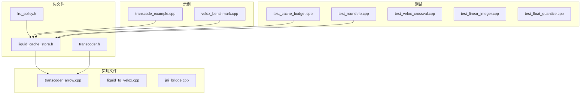
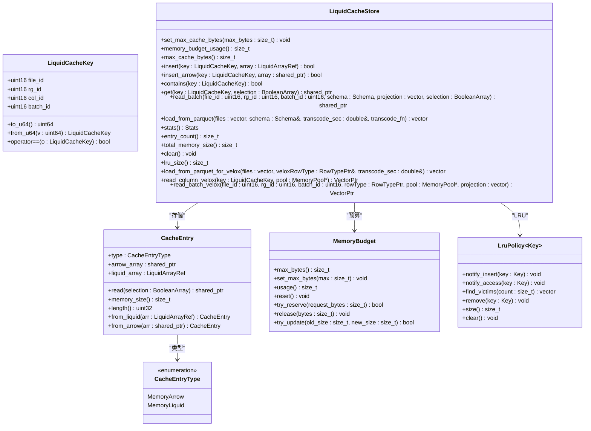
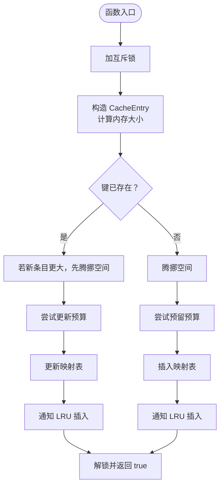
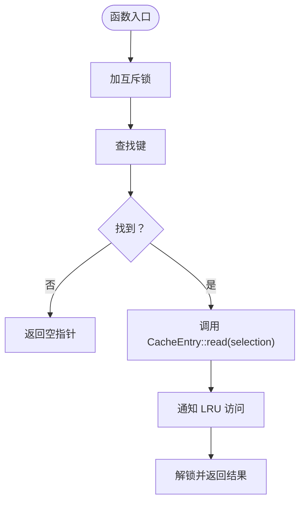
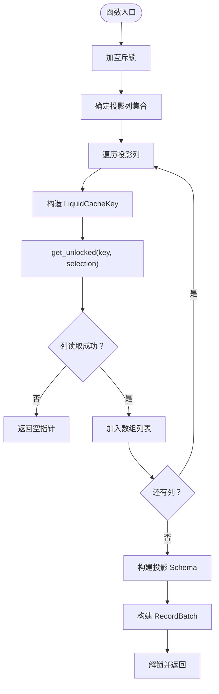
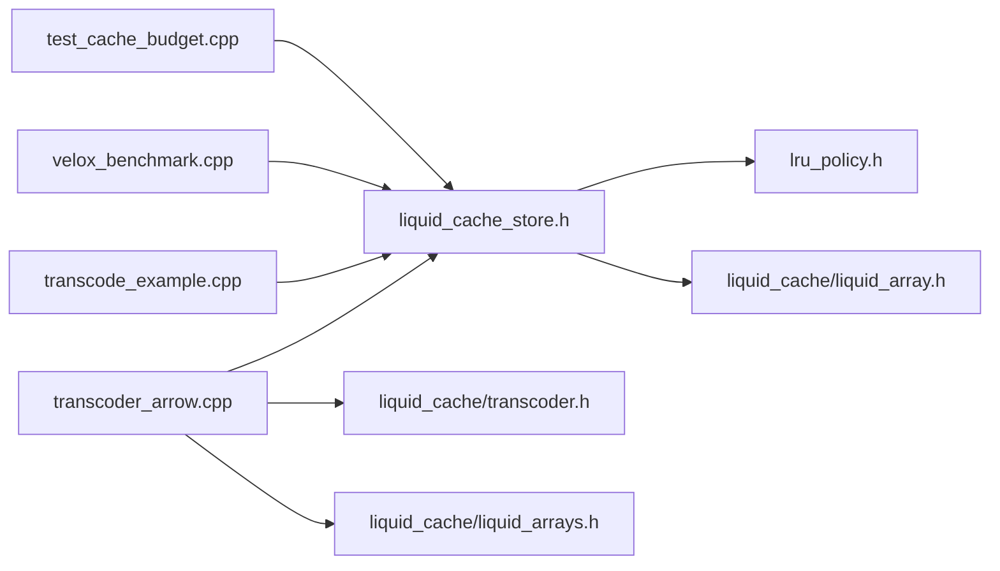

# 缓存操作接口

<cite>
**本文档引用的文件**
- [liquid_cache_store.h](file://include/liquid_cache/liquid_cache_store.h)
- [lru_policy.h](file://include/liquid_cache/lru_policy.h)
- [transcoder_arrow.cpp](file://src/transcoder_arrow.cpp)
- [test_cache_budget.cpp](file://tests/test_cache_budget.cpp)
- [transcode_example.cpp](file://examples/transcode_example.cpp)
- [velox_benchmark.cpp](file://examples/velox_benchmark.cpp)
- [README.md](file://README.md)
</cite>

## 目录
1. [简介](#简介)
2. [项目结构](#项目结构)
3. [核心组件](#核心组件)
4. [架构总览](#架构总览)
5. [详细组件分析](#详细组件分析)
6. [依赖关系分析](#依赖关系分析)
7. [性能考量](#性能考量)
8. [故障排查指南](#故障排查指南)
9. [结论](#结论)
10. [附录](#附录)

## 简介
本文件面向使用 LiquidCacheStore 的开发者，系统性阐述其公共接口、行为语义、异常处理与错误策略，并结合仓库中的示例与测试，给出缓存状态管理、生命周期、自动清理与手动清理的操作建议，以及性能特征与最佳实践。重点覆盖以下方法族：
- 插入类：insert、insert_arrow
- 查询类：get、contains
- 批量读取：read_batch
- 统计与控制：stats、entry_count、total_memory_size、clear、set_max_cache_bytes、memory_budget_usage、max_cache_bytes、lru_size
- 与 Arrow/Parquet 的集成：load_from_parquet、load_from_parquet_for_velox
- 可选 Velox 接口：read_column_velox、read_batch_velox（条件编译）

## 项目结构
仓库采用“头文件 + 实现文件 + 示例 + 测试”的组织方式，核心缓存接口集中在头文件中，具体实现位于源文件，示例与测试用于演示与验证。

图表来源
- [liquid_cache_store.h](file://include/liquid_cache/liquid_cache_store.h)
- [lru_policy.h](file://include/liquid_cache/lru_policy.h)
- [transcoder_arrow.cpp](file://src/transcoder_arrow.cpp)
- [transcode_example.cpp](file://examples/transcode_example.cpp)
- [velox_benchmark.cpp](file://examples/velox_benchmark.cpp)
- [test_cache_budget.cpp](file://tests/test_cache_budget.cpp)

章节来源
- [README.md](file://README.md)

## 核心组件
- LiquidCacheStore：列式缓存存储，按列缓存 Arrow 或 Liquid 结构，支持投影与过滤，内置 LRU 淘汰与内存预算控制。
- CacheEntry：缓存条目包装，支持从 Arrow 原始数组或 Liquid 内存结构读取，并计算内存占用与长度。
- MemoryBudget：线程安全内存预算跟踪，基于原子操作的无锁预留与更新。
- LruPolicy：LRU 淘汰策略，维护访问顺序并按需选择淘汰键集合。
- LiquidCacheKey：缓存键，由文件 ID、行组 ID、列索引、批次 ID 组合而成，便于定位具体列批次。

章节来源
- [liquid_cache_store.h](file://include/liquid_cache/liquid_cache_store.h)
- [lru_policy.h](file://include/liquid_cache/lru_policy.h)

## 架构总览
LiquidCacheStore 以“列主存储 + LRU + 内存预算”为核心设计，支持两类缓存条目：
- MemoryArrow：直接缓存 Arrow 原始数组（无压缩）
- MemoryLiquid：缓存 Liquid 内存结构（压缩，但不序列化）

图表来源
- [liquid_cache_store.h](file://include/liquid_cache/liquid_cache_store.h)
- [lru_policy.h](file://include/liquid_cache/lru_policy.h)

## 详细组件分析

### 接口概览与返回值语义
- insert(key, array)
  - 返回值：成功插入返回 true；若条目过大超过预算上限，返回 false，且不插入。
  - 语义：若键已存在，先尝试扩容空间，不足则触发 LRU 淘汰；随后更新预算；最后更新 LRU。
- insert_arrow(key, array)
  - 返回值：成功插入返回 true；若条目过大超过预算上限，返回 false，且不插入。
  - 语义：与 insert 类似，但缓存的是 Arrow 原始数组。
- contains(key)
  - 返回值：存在返回 true，否则 false。
- get(key, selection=nullptr)
  - 返回值：命中返回 Arrow Array；未命中返回空指针；内部可能抛出异常（例如过滤时 Arrow 计算内核失败）。
  - 语义：命中后通知 LRU 更新访问顺序。
- read_batch(file_id, rg_id, batch_id, schema, projection=[], selection=nullptr)
  - 返回值：成功返回 Arrow RecordBatch；任一列缺失则返回空指针。
  - 语义：按投影列读取，应用布尔掩码过滤，构建投影后的 Schema。
- load_from_parquet(...)
  - 返回值：RowGroupInfo 列表；transcode_sec 输出转码耗时。
  - 语义：逐列转码为 Liquid 结构或回退为 Arrow 原始数组，填充缓存。
- stats()
  - 返回值：包含条目数、总内存、各类条目数、预算用量与上限等统计。
- entry_count()/total_memory_size()
  - 返回值：当前缓存条目数量与总内存字节。
- clear()
  - 语义：清空缓存、重置预算、清空 LRU。
- set_max_cache_bytes(max_bytes)
  - 语义：设置预算上限；0 表示不限制；不影响已有条目，仅影响后续插入。
- memory_budget_usage()/max_cache_bytes()/lru_size()
  - 返回值：预算使用量、预算上限、LRU 条目数。

章节来源
- [liquid_cache_store.h](file://include/liquid_cache/liquid_cache_store.h)

### 异常与错误处理
- get 内部在对 MemoryArrow 应用过滤时，若 Arrow 计算内核失败，会抛出异常。调用方应捕获并处理。
- load_from_parquet 在打开文件、读取 Schema、创建 RecordBatchReader 等环节可能失败，返回空结果或跳过文件。
- insert/insert_arrow 返回 false 的情形：
  - 预算上限为 0（不限制）时不会因预算不足而失败；
  - 当条目大小超过 max_cache_bytes_ 时，直接拒绝插入；
  - 其他情况下，若 make_budget_space 无法腾挪足够空间，也会返回 false。
- contains/get/read_batch 在未命中时返回空指针，属于正常行为，非异常。

章节来源
- [liquid_cache_store.h](file://include/liquid_cache/liquid_cache_store.h)
- [transcoder_arrow.cpp](file://src/transcoder_arrow.cpp)

### 缓存状态管理与生命周期
- 生命周期
  - 插入：insert/insert_arrow 成功后，条目进入缓存；若预算不足，触发 LRU 淘汰直至满足需求。
  - 访问：get 命中后通知 LRU，将其提升至最近使用位置。
  - 淘汰：make_budget_space 从 LRU 尾部挑选受害者，逐个移除并释放预算。
  - 清理：clear 清空缓存、预算与 LRU。
- 自动清理
  - 通过 MemoryBudget 与 LruPolicy 的协作实现；当新条目插入或更新时，若预算超限，自动触发淘汰。
- 手动清理
  - clear：一次性清空；
  - set_max_cache_bytes：调整预算上限，影响后续插入行为；
  - stats/entry_count/total_memory_size：监控状态，辅助决策是否主动清理。

章节来源
- [liquid_cache_store.h](file://include/liquid_cache/liquid_cache_store.h)
- [lru_policy.h](file://include/liquid_cache/lru_policy.h)
- [test_cache_budget.cpp](file://tests/test_cache_budget.cpp)

### 关键流程图

#### 插入流程（insert/insert_arrow）

图表来源
- [liquid_cache_store.h](file://include/liquid_cache/liquid_cache_store.h)

#### 读取流程（get）

图表来源
- [liquid_cache_store.h](file://include/liquid_cache/liquid_cache_store.h)

#### 批量读取流程（read_batch）

图表来源
- [liquid_cache_store.h](file://include/liquid_cache/liquid_cache_store.h)

### API 使用示例与最佳实践

#### 基本使用（示例参考）
- 从 Parquet 加载并缓存：参考示例程序中对 load_from_parquet 的调用与统计输出。
- 单列读取：使用 get(key, selection) 获取 Arrow Array。
- 批量读取：使用 read_batch 投影列并应用过滤。
- 预算与清理：通过 set_max_cache_bytes 控制上限，必要时调用 clear 清空。

章节来源
- [transcode_example.cpp](file://examples/transcode_example.cpp)
- [velox_benchmark.cpp](file://examples/velox_benchmark.cpp)

#### 常见场景与最佳实践
- 批量加载与预热
  - 使用 load_from_parquet 一次性将多列数据转码并缓存，避免多次 IO。
  - 预估内存占用，合理设置 max_cache_bytes，避免频繁淘汰。
- 列投影与行过滤
  - read_batch 支持投影列与布尔掩码过滤，减少不必要的解码与内存拷贝。
- 预算与 LRU 协作
  - 高频访问的数据会被 LRU 提升，降低被优先淘汰的概率；合理利用 get 的访问通知。
- 与 Velox 集成
  - 若启用 LIQUID_ENABLE_VELOX，可使用 load_from_parquet_for_velox 与 read_batch_velox，获得更高效的向量读取路径。

章节来源
- [liquid_cache_store.h](file://include/liquid_cache/liquid_cache_store.h)
- [transcoder_arrow.cpp](file://src/transcoder_arrow.cpp)
- [README.md](file://README.md)

## 依赖关系分析

图表来源
- [liquid_cache_store.h](file://include/liquid_cache/liquid_cache_store.h)
- [lru_policy.h](file://include/liquid_cache/lru_policy.h)
- [transcoder_arrow.cpp](file://src/transcoder_arrow.cpp)
- [transcode_example.cpp](file://examples/transcode_example.cpp)
- [velox_benchmark.cpp](file://examples/velox_benchmark.cpp)
- [test_cache_budget.cpp](file://tests/test_cache_budget.cpp)

章节来源
- [liquid_cache_store.h](file://include/liquid_cache/liquid_cache_store.h)
- [lru_policy.h](file://include/liquid_cache/lru_policy.h)
- [transcoder_arrow.cpp](file://src/transcoder_arrow.cpp)

## 性能考量
- 编解码与内存布局
  - Liquid 内存结构避免序列化开销，直接以结构体形式访问，解码更快。
  - MemoryArrow 适合临时过渡或不支持的类型回退。
- 预算与淘汰
  - MemoryBudget 基于原子操作，尽量减少锁竞争；make_budget_space 限制最大尝试次数，避免长时间阻塞。
  - LruPolicy 使用双向链表 + 哈希表，find_victims 一次批量淘汰多个键，提高效率。
- 批量操作优化
  - read_batch 一次性读取多列，减少锁持有时间与重复查找。
  - 投影列与布尔过滤在 Arrow 层完成，避免不必要的数据传输。
- 预热与热点处理
  - 预先 load_from_parquet 将热点列加载到缓存，结合 get 的访问通知，降低后续访问延迟。
- 建议
  - 根据数据分布与内存预算，合理设置 max_cache_bytes，避免频繁淘汰。
  - 对高频列进行预热，减少冷启动成本。
  - 使用投影与过滤减少解码与内存占用。

[本节为通用性能讨论，不直接分析具体文件]

## 故障排查指南
- get 抛出异常
  - 现象：对 MemoryArrow 应用过滤时失败。
  - 排查：检查 selection 是否有效，确认 Arrow 计算内核可用。
- 插入返回 false
  - 现象：insert/insert_arrow 返回 false。
  - 排查：检查 max_cache_bytes 是否为 0（不限制）；若条目过大，直接拒绝；否则检查 make_budget_space 是否能腾挪空间。
- 读取为空指针
  - 现象：get/read_batch 返回空指针。
  - 排查：确认键是否存在（contains）；read_batch 中任一列缺失会导致整体失败。
- 预算与 LRU 不一致
  - 现象：stats 显示的预算使用与实际不符。
  - 排查：确认是否在并发环境下正确持有互斥锁；检查 clear 是否被调用重置。

章节来源
- [liquid_cache_store.h](file://include/liquid_cache/liquid_cache_store.h)
- [test_cache_budget.cpp](file://tests/test_cache_budget.cpp)

## 结论
LiquidCacheStore 提供了高性能、低序列化开销的列式缓存能力，结合 MemoryBudget 与 LruPolicy 实现可靠的内存控制与淘汰策略。通过 insert/insert_arrow、get、contains、read_batch 等接口，用户可以灵活地进行缓存预热、投影读取与过滤读取。配合合理的预算设置与预热策略，可在大规模数据分析场景中显著降低解码与传输成本，提升整体吞吐与响应速度。

[本节为总结性内容，不直接分析具体文件]

## 附录

### API 一览与参数说明（摘要）
- set_max_cache_bytes(max_bytes)
  - 设置预算上限；0 表示不限制；不影响现有条目。
- memory_budget_usage()/max_cache_bytes()
  - 查询预算使用量与上限。
- insert(key, array)
  - 插入 Liquid 内存结构；返回是否成功。
- insert_arrow(key, array)
  - 插入 Arrow 原始数组；返回是否成功。
- contains(key)
  - 查询键是否存在。
- get(key, selection=nullptr)
  - 获取 Arrow Array；可能抛出异常。
- read_batch(file_id, rg_id, batch_id, schema, projection=[], selection=nullptr)
  - 返回投影后的 RecordBatch；任一列缺失返回空指针。
- load_from_parquet(files, schema&, transcode_sec, transcode_fn)
  - 返回 RowGroupInfo 列表；transcode_sec 输出转码耗时。
- stats()/entry_count()/total_memory_size()
  - 返回统计信息与内存占用。
- clear()
  - 清空缓存、预算与 LRU。
- lru_size()
  - 返回 LRU 条目数。

章节来源
- [liquid_cache_store.h](file://include/liquid_cache/liquid_cache_store.h)