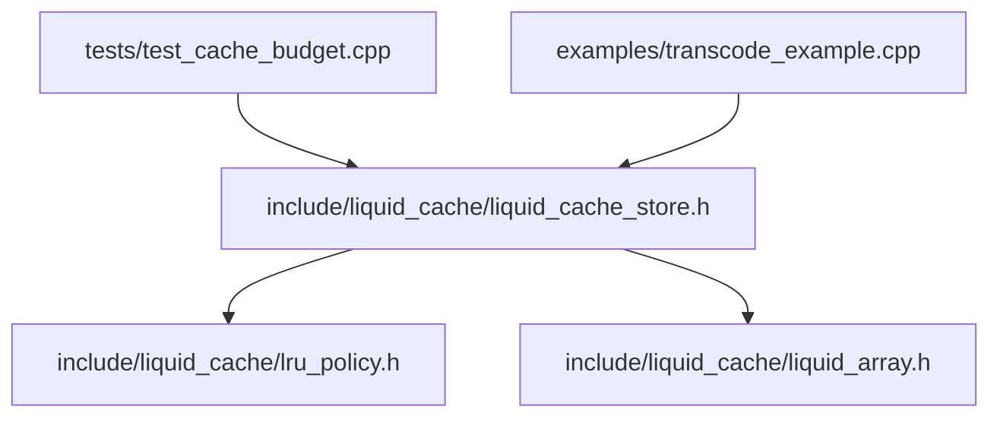
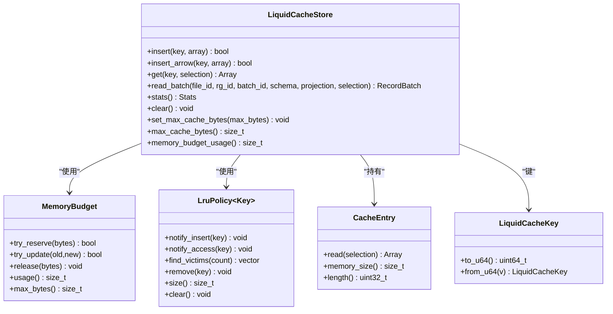
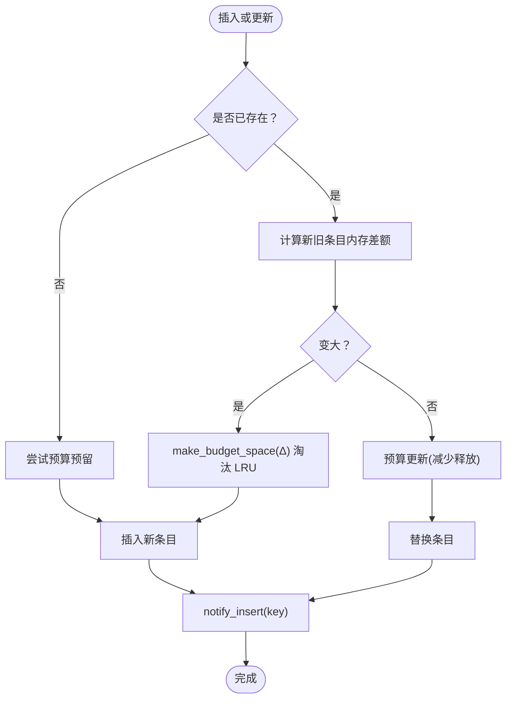
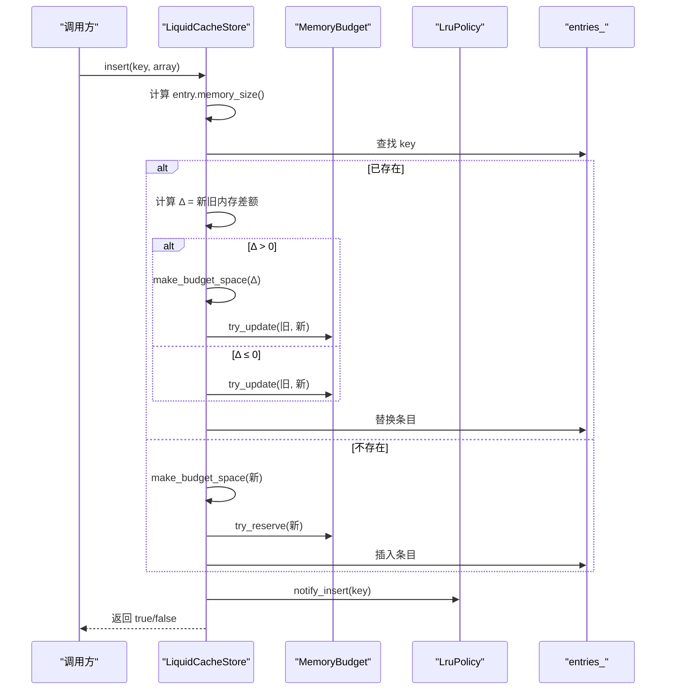
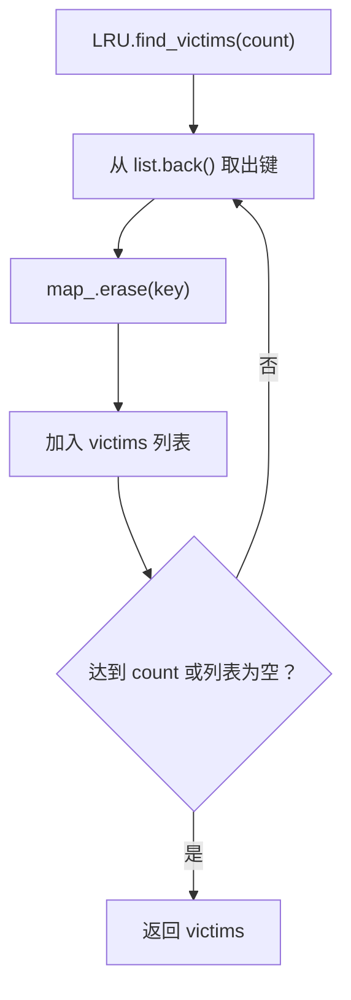
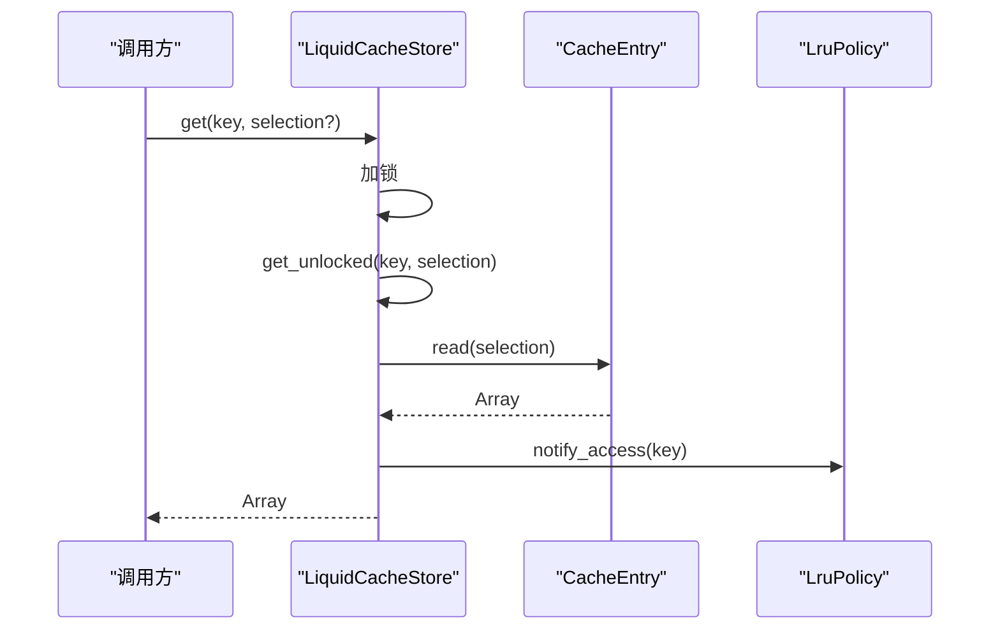
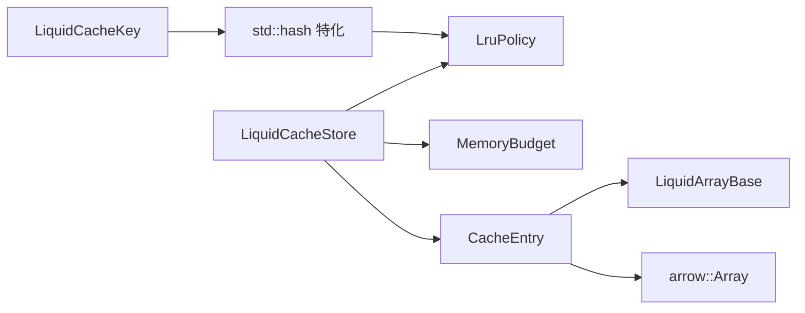

# 缓存系统详解

<cite>
**本文档引用的文件**
- [liquid_cache_store.h](file://include/liquid_cache/liquid_cache_store.h)
- [lru_policy.h](file://include/liquid_cache/lru_policy.h)
- [liquid_array.h](file://include/liquid_cache/liquid_array.h)
- [test_cache_budget.cpp](file://tests/test_cache_budget.cpp)
- [transcode_example.cpp](file://examples/transcode_example.cpp)
</cite>

## 目录
1. [简介](#简介)
2. [项目结构](#项目结构)
3. [核心组件](#核心组件)
4. [架构总览](#架构总览)
5. [详细组件分析](#详细组件分析)
6. [依赖关系分析](#依赖关系分析)
7. [性能考量](#性能考量)
8. [故障排查指南](#故障排查指南)
9. [结论](#结论)
10. [附录](#附录)

## 简介
本文件面向开发者与运维人员，系统性解析 LiquidCacheStore 的实现细节，重点覆盖：
- 内存管理策略与预算控制
- LRU 淘汰算法的具体实现
- 缓存键设计与生命周期管理
- 线程安全机制
- 内存追踪与统计信息（命中率、内存使用监控）
- 配置选项与最佳实践（最大内存限制、预估大小、清理策略）

目标是帮助读者在不同应用场景下，合理配置与调优缓存参数，获得最佳性能表现。

## 项目结构
仓库采用头文件驱动的 C++ 设计，核心位于 include/liquid_cache 目录，测试与示例分别位于 tests 与 examples。关键文件如下：
- include/liquid_cache/liquid_cache_store.h：缓存存储器主体，负责键管理、插入/读取、批量读取、统计与清理
- include/liquid_cache/lru_policy.h：内存预算与 LRU 策略实现
- include/liquid_cache/liquid_array.h：液态数组抽象接口，统一内存大小估算与解码
- tests/test_cache_budget.cpp：预算与 LRU 行为的单元测试
- examples/transcode_example.cpp：加载 Parquet 并基准测试缓存读取性能

**图表来源**
- [liquid_cache_store.h:188-527](file://include/liquid_cache/liquid_cache_store.h#L188-L527)
- [lru_policy.h:30-191](file://include/liquid_cache/lru_policy.h#L30-L191)
- [liquid_array.h:29-85](file://include/liquid_cache/liquid_array.h#L29-L85)
- [test_cache_budget.cpp:23-393](file://tests/test_cache_budget.cpp#L23-L393)
- [transcode_example.cpp:364-489](file://examples/transcode_example.cpp#L364-L489)

**章节来源**
- [liquid_cache_store.h:1-527](file://include/liquid_cache/liquid_cache_store.h#L1-L527)
- [lru_policy.h:1-191](file://include/liquid_cache/lru_policy.h#L1-L191)
- [liquid_array.h:1-159](file://include/liquid_cache/liquid_array.h#L1-L159)
- [test_cache_budget.cpp:1-393](file://tests/test_cache_budget.cpp#L1-L393)
- [transcode_example.cpp:1-550](file://examples/transcode_example.cpp#L1-L550)

## 核心组件
- LiquidCacheStore：列式缓存存储器，支持列投影与行过滤，零反序列化访问
- MemoryBudget：无锁原子预算跟踪，支持并发预留与更新
- LruPolicy：基于双向链表与哈希映射的经典 LRU 实现
- CacheEntry：缓存条目包装，支持 Arrow 与 Liquid 两种内存表示
- LiquidCacheKey：缓存键，紧凑打包为 uint64_t，便于哈希与比较

**章节来源**
- [liquid_cache_store.h:188-527](file://include/liquid_cache/liquid_cache_store.h#L188-L527)
- [lru_policy.h:30-191](file://include/liquid_cache/lru_policy.h#L30-L191)
- [liquid_array.h:29-85](file://include/liquid_cache/liquid_array.h#L29-L85)

## 架构总览
LiquidCacheStore 将每个列批次独立缓存，支持：
- 列投影：仅解码请求的列
- 行过滤：在解码时应用布尔掩码
- 零反序列化读取：直接访问内存中的 Liquid 结构对象

**图表来源**
- [liquid_cache_store.h:188-527](file://include/liquid_cache/liquid_cache_store.h#L188-L527)
- [lru_policy.h:30-191](file://include/liquid_cache/lru_policy.h#L30-L191)
- [liquid_cache_store.h:111-173](file://include/liquid_cache/liquid_cache_store.h#L111-L173)
- [liquid_cache_store.h:48-78](file://include/liquid_cache/liquid_cache_store.h#L48-L78)

## 详细组件分析

### 缓存键设计与生命周期管理
- 键结构：由 file_id、rg_id、col_id、batch_id 组成，均使用 16 位整型，打包为 uint64_t，便于哈希与比较
- 生命周期：
  - 插入：notify_insert(key) 将键移动到 LRU 前端（最近使用）
  - 访问：get() 后 notify_access(key) 将键再次提升至前端
  - 更新：相同键插入新数组时，先按差值尝试预算更新，再替换条目
  - 淘汰：make_budget_space() 通过 LruPolicy.find_victims() 从后端逐个移除最久未使用项

**图表来源**
- [liquid_cache_store.h:222-245](file://include/liquid_cache/liquid_cache_store.h#L222-L245)
- [liquid_cache_store.h:250-274](file://include/liquid_cache/liquid_cache_store.h#L250-L274)
- [liquid_cache_store.h:491-517](file://include/liquid_cache/liquid_cache_store.h#L491-L517)
- [lru_policy.h:118-141](file://include/liquid_cache/lru_policy.h#L118-L141)

**章节来源**
- [liquid_cache_store.h:48-78](file://include/liquid_cache/liquid_cache_store.h#L48-L78)
- [liquid_cache_store.h:222-274](file://include/liquid_cache/liquid_cache_store.h#L222-L274)
- [lru_policy.h:118-141](file://include/liquid_cache/lru_policy.h#L118-L141)

### 内存管理策略与预算控制
- MemoryBudget 使用原子操作进行无锁预留与更新，避免全局锁竞争
- 预算上限为 0 表示不限制；否则在插入前检查是否超过上限
- try_update 支持“增长则预留，缩小则释放”，保证预算一致性
- make_budget_space 在预算不足时，循环调用 LruPolicy.find_victims() 逐个淘汰，直到满足需求

**图表来源**
- [liquid_cache_store.h:222-245](file://include/liquid_cache/liquid_cache_store.h#L222-L245)
- [liquid_cache_store.h:250-274](file://include/liquid_cache/liquid_cache_store.h#L250-L274)
- [liquid_cache_store.h:491-517](file://include/liquid_cache/liquid_cache_store.h#L491-L517)
- [lru_policy.h:118-141](file://include/liquid_cache/lru_policy.h#L118-L141)
- [lru_policy.h:84-91](file://include/liquid_cache/lru_policy.h#L84-L91)

**章节来源**
- [lru_policy.h:30-96](file://include/liquid_cache/lru_policy.h#L30-L96)
- [liquid_cache_store.h:491-517](file://include/liquid_cache/liquid_cache_store.h#L491-L517)

### LRU 淘汰算法实现
- 数据结构：std::list 存放键（前端 MRU，后端 LRU），std::unordered_map 提供 O(1) 定位
- 操作语义：
  - notify_insert：若键已存在则移动到前端；否则在前端插入
  - notify_access：若键存在则移动到前端
  - find_victims：从后端取出最多 count 个键，用于淘汰
- 与预算配合：每次淘汰释放对应条目的内存占用，使 make_budget_space 可继续推进

**图表来源**
- [lru_policy.h:146-159](file://include/liquid_cache/lru_policy.h#L146-L159)

**章节来源**
- [lru_policy.h:111-188](file://include/liquid_cache/lru_policy.h#L111-L188)

### 缓存条目生命周期与读取路径
- CacheEntry 支持两种类型：
  - MemoryLiquid：内存中存储的 Liquid 结构（压缩，无需反序列化）
  - MemoryArrow：内存中存储的 Arrow 数组（原始缓冲区）
- 读取流程：
  - get()：加锁查找，命中则调用 entry.read(selection)，支持可选行过滤
  - read_batch()：按列投影批量读取，构建 RecordBatch
- 内存大小估算：
  - Liquid：调用 entry.memory_size() 获取压缩表示的字节大小
  - Arrow：遍历所有缓冲区累加大小

**图表来源**
- [liquid_cache_store.h:286-295](file://include/liquid_cache/liquid_cache_store.h#L286-L295)
- [liquid_cache_store.h:472-478](file://include/liquid_cache/liquid_cache_store.h#L472-L478)
- [liquid_cache_store.h:118-138](file://include/liquid_cache/liquid_cache_store.h#L118-L138)

**章节来源**
- [liquid_cache_store.h:111-173](file://include/liquid_cache/liquid_cache_store.h#L111-L173)
- [liquid_cache_store.h:286-356](file://include/liquid_cache/liquid_cache_store.h#L286-L356)

### 线程安全机制
- 全局互斥锁：对 entries_、预算与 LRU 的所有写操作加锁
- 读操作：get() 对内部状态加锁，但不阻塞其他读
- 预算更新：try_update 通过原子 CAS 保证并发安全
- LRU 操作：notify_insert/notify_access/find_victims 内部加锁

**章节来源**
- [liquid_cache_store.h:519-523](file://include/liquid_cache/liquid_cache_store.h#L519-L523)
- [lru_policy.h:118-141](file://include/liquid_cache/lru_policy.h#L118-L141)
- [lru_policy.h:52-91](file://include/liquid_cache/lru_policy.h#L52-L91)

### 内存追踪与统计信息
- 统计字段：
  - entry_count：缓存条目数量
  - total_memory_bytes：所有条目内存总和
  - liquid_entries/arrow_entries：两类条目计数
  - budget_usage_bytes/budget_max_bytes：预算使用量与上限
- 清理：clear() 同时清空 entries、重置预算并清空 LRU

**章节来源**
- [liquid_cache_store.h:387-429](file://include/liquid_cache/liquid_cache_store.h#L387-L429)

### 缓存配置选项与最佳实践
- 最大内存限制
  - 构造函数：指定 max_cache_bytes（0 表示不限制）
  - 运行时修改：set_max_cache_bytes() 不会立即驱逐现有条目，仅影响后续插入
- 预估大小计算
  - Liquid：通过 LiquidArrayBase.memory_size() 获取压缩表示的内存大小
  - Arrow：遍历 ArrayData 的所有缓冲区累加大小
- 清理策略
  - LRU：find_victims() 从后端逐个淘汰
  - 驱逐条件：当预算使用量 + 新条目所需空间超过上限时触发
- 最佳实践
  - 大数据集场景：设置合理的 max_cache_bytes，避免 OOM
  - 高并发场景：尽量复用相同键，利用 get() 的 LRU 提升效果
  - 列投影：只读取需要的列，降低内存占用与解码成本
  - 批量读取：使用 read_batch() 减少多次锁竞争

**章节来源**
- [liquid_cache_store.h:192-215](file://include/liquid_cache/liquid_cache_store.h#L192-L215)
- [liquid_cache_store.h:491-517](file://include/liquid_cache/liquid_cache_store.h#L491-L517)
- [liquid_array.h:61-78](file://include/liquid_cache/liquid_array.h#L61-L78)

## 依赖关系分析
- LiquidCacheStore 依赖 MemoryBudget 与 LruPolicy，二者共同保障预算与淘汰
- CacheEntry 作为统一接口，屏蔽底层 Arrow 与 Liquid 的差异
- LiquidCacheKey 通过 std::hash 适配 LruPolicy 内部使用的哈希表

**图表来源**
- [liquid_cache_store.h:48-97](file://include/liquid_cache/liquid_cache_store.h#L48-L97)
- [lru_policy.h:111-188](file://include/liquid_cache/lru_policy.h#L111-L188)
- [liquid_cache_store.h:111-173](file://include/liquid_cache/liquid_cache_store.h#L111-L173)
- [liquid_array.h:29-85](file://include/liquid_cache/liquid_array.h#L29-L85)

**章节来源**
- [liquid_cache_store.h:48-97](file://include/liquid_cache/liquid_cache_store.h#L48-L97)
- [lru_policy.h:111-188](file://include/liquid_cache/lru_policy.h#L111-L188)
- [liquid_cache_store.h:111-173](file://include/liquid_cache/liquid_cache_store.h#L111-L173)

## 性能考量
- 零反序列化读取：直接访问内存中的 Liquid 结构，避免序列化开销
- 列投影与行过滤：减少解码与内存分配
- 原子预算预留：降低锁竞争，提高并发吞吐
- LRU 提升：热点数据常驻，降低重复解码成本
- 示例基准：示例程序对比了缓存读取与 Parquet 读取的性能，展示了缓存的优势

**章节来源**
- [transcode_example.cpp:364-489](file://examples/transcode_example.cpp#L364-L489)

## 故障排查指南
- 插入失败且返回 false
  - 可能原因：条目过大超出预算上限；或 make_budget_space 无法腾出足够空间
  - 排查步骤：检查 max_cache_bytes、entries 内存占用、LRU 大小
- get() 命中但未提升
  - 可能原因：未正确调用 get()（仅 contains() 不会提升）
  - 排查步骤：确认调用链路是否包含 get() 调用
- 预算使用异常
  - 可能原因：try_update 与 try_reserve 的使用不当
  - 排查步骤：核对更新前后内存大小变化与预算上限
- 清理后仍占用内存
  - 可能原因：仍有外部强引用持有 Arrow/Liquid 对象
  - 排查步骤：调用 clear() 后检查引用计数与共享指针生命周期

**章节来源**
- [test_cache_budget.cpp:166-388](file://tests/test_cache_budget.cpp#L166-L388)
- [liquid_cache_store.h:491-517](file://include/liquid_cache/liquid_cache_store.h#L491-L517)

## 结论
LiquidCacheStore 通过“列式缓存 + LRU + 原子预算”的组合，在保证线程安全的同时实现了高性能的零反序列化读取。其键设计简洁高效，内存估算统一，统计接口完善，适合在大数据分析与查询引擎中作为内存层加速方案。建议结合业务场景合理设置预算上限与列投影策略，以获得最佳性能与稳定性。

## 附录
- 使用示例与基准测试：参考 examples/transcode_example.cpp 中的 run_bench() 与 run_verify()，了解如何加载数据、验证正确性与进行性能对比
- 单元测试：参考 tests/test_cache_budget.cpp，验证预算与 LRU 的行为边界

**章节来源**
- [transcode_example.cpp:364-489](file://examples/transcode_example.cpp#L364-L489)
- [test_cache_budget.cpp:23-393](file://tests/test_cache_budget.cpp#L23-L393)