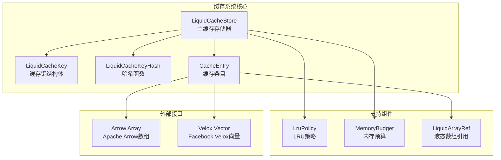
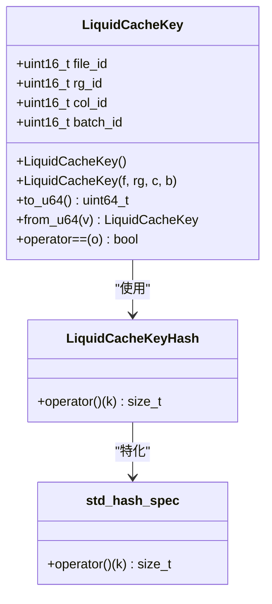
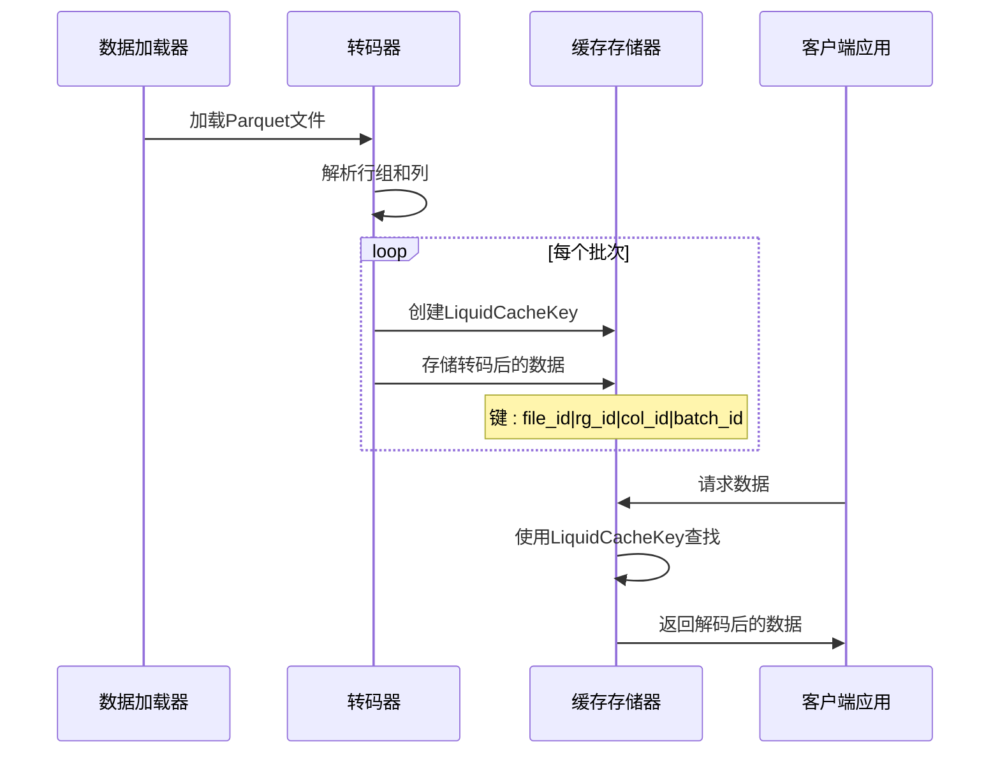
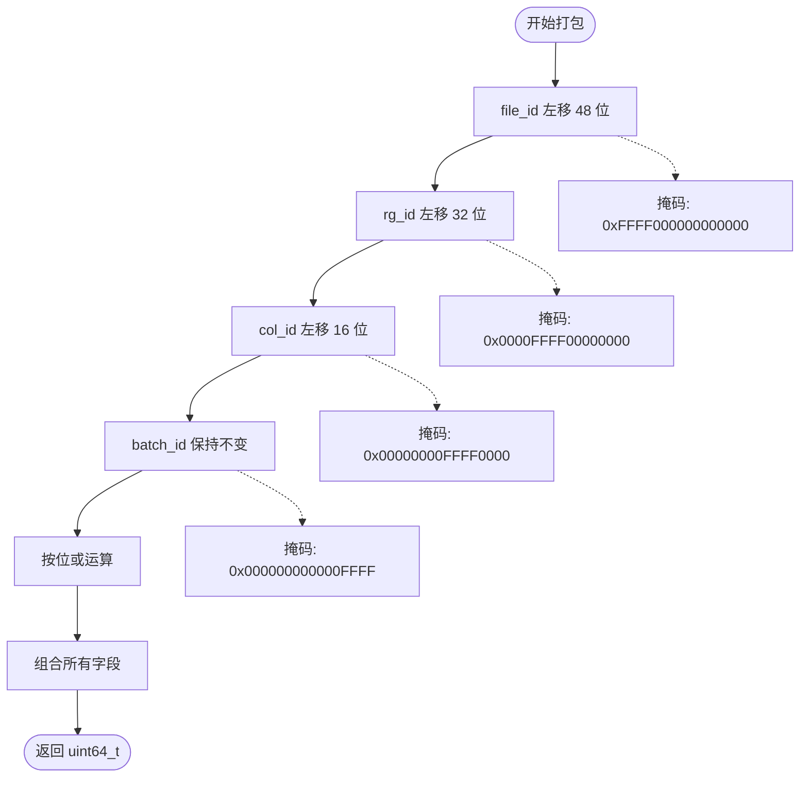
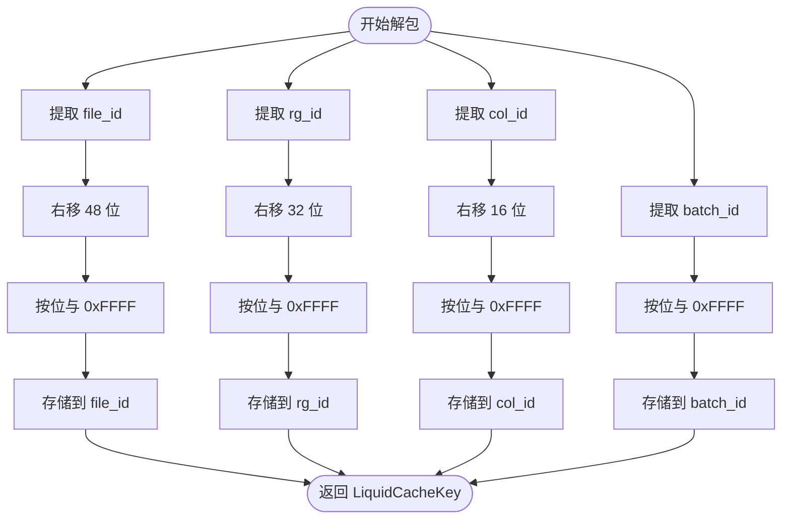
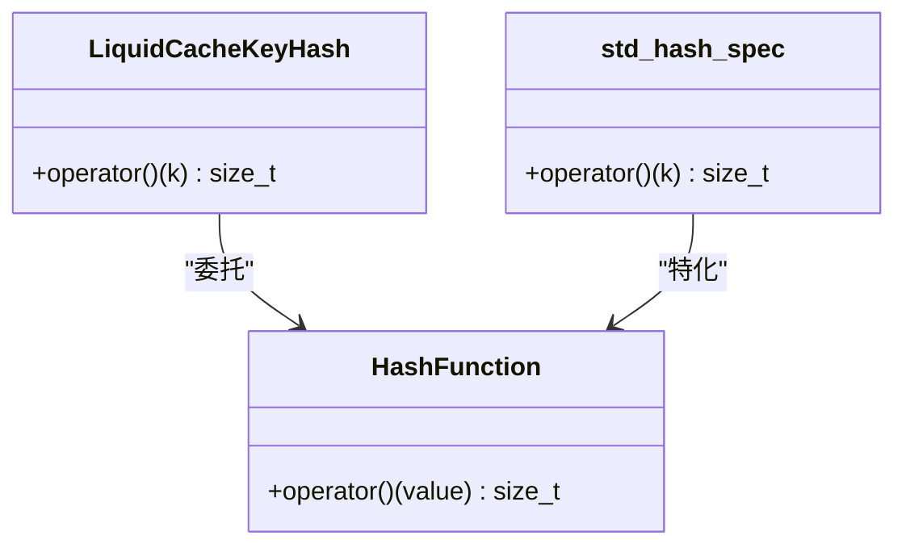
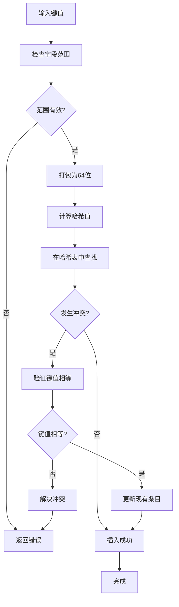
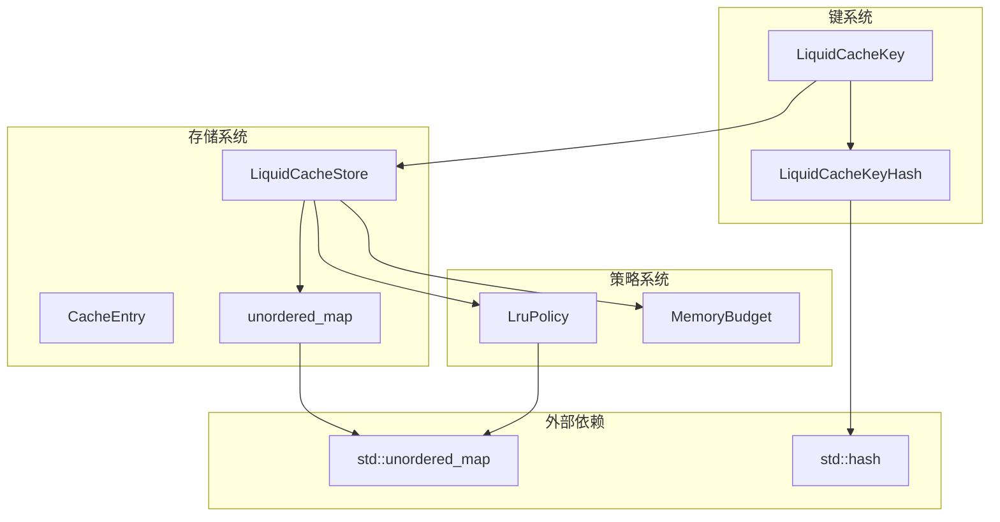

# 缓存键设计

<cite>
**本文档引用的文件**
- [liquid_cache_store.h](file://include/liquid_cache/liquid_cache_store.h)
- [lru_policy.h](file://include/liquid_cache/lru_policy.h)
- [test_cache_budget.cpp](file://tests/test_cache_budget.cpp)
- [transcode_example.cpp](file://examples/transcode_example.cpp)
- [liquid_to_velox.cpp](file://src/liquid_to_velox.cpp)
- [transcoder_arrow.cpp](file://src/transcoder_arrow.cpp)
</cite>

## 目录
1. [简介](#简介)
2. [项目结构](#项目结构)
3. [核心组件](#核心组件)
4. [架构概览](#架构概览)
5. [详细组件分析](#详细组件分析)
6. [依赖关系分析](#依赖关系分析)
7. [性能考量](#性能考量)
8. [故障排除指南](#故障排除指南)
9. [结论](#结论)

## 简介

本文档深入解析了 LiquidCacheKey 结构体的设计理念和实现细节，这是一个关键的缓存键设计组件。该设计采用四段式标识符系统，将文件标识符、行组标识符、列标识符和批次标识符组合在一个 64 位整数中，实现了高效的内存存储和快速的键比较操作。

LiquidCacheKey 的设计目标是在保证唯一性的同时，最大化缓存命中率，并提供最优的性能表现。通过精心设计的打包和解包机制，该实现能够在内存中高效地存储和检索缓存条目。

## 项目结构

该项目采用模块化的 C++ 架构，主要包含以下核心组件：

**图表来源**
- [liquid_cache_store.h:47-97](file://include/liquid_cache/liquid_cache_store.h#L47-L97)
- [lru_policy.h:111-188](file://include/liquid_cache/lru_policy.h#L111-L188)

**章节来源**
- [liquid_cache_store.h:1-527](file://include/liquid_cache/liquid_cache_store.h#L1-L527)
- [lru_policy.h:1-191](file://include/liquid_cache/lru_policy.h#L1-L191)

## 核心组件

### LiquidCacheKey 结构体

LiquidCacheKey 是整个缓存系统的核心数据结构，采用四段式标识符设计：

**图表来源**
- [liquid_cache_store.h:47-97](file://include/liquid_cache/liquid_cache_store.h#L47-L97)

该结构体包含四个 16 位字段，每个字段都占用 16 位，总共 64 位：

- **file_id (16 位)**: 文件标识符，用于区分不同的数据文件
- **rg_id (16 位)**: 行组标识符，用于区分文件中的不同行组
- **col_id (16 位)**: 列标识符，用于区分行组中的不同列
- **batch_id (16 位)**: 批次标识符，用于区分列中的不同批次

**章节来源**
- [liquid_cache_store.h:47-78](file://include/liquid_cache/liquid_cache_store.h#L47-L78)

## 架构概览

缓存键系统在整个数据处理管道中扮演着关键角色：

**图表来源**
- [transcoder_arrow.cpp:721-723](file://src/transcoder_arrow.cpp#L721-L723)
- [liquid_cache_store.h:333-335](file://include/liquid_cache/liquid_cache_store.h#L333-L335)

## 详细组件分析

### 键值打包和解包机制

LiquidCacheKey 的核心功能是提供高效的键值打包和解包能力：

#### 打包机制 (to_u64)

打包过程将四个 16 位字段组合成一个 64 位整数：

**图表来源**
- [liquid_cache_store.h:58-64](file://include/liquid_cache/liquid_cache_store.h#L58-L64)

#### 解包机制 (from_u64)

解包过程从 64 位整数中提取原始的四个 16 位字段：

**图表来源**
- [liquid_cache_store.h:66-73](file://include/liquid_cache/liquid_cache_store.h#L66-L73)

#### 性能考虑

这种打包解包机制具有以下性能优势：

1. **内存效率**: 将四个 16 位字段压缩为单个 64 位整数，减少内存占用
2. **比较效率**: 直接比较 64 位整数比比较四个独立字段更快
3. **哈希效率**: 单次哈希计算覆盖所有字段信息
4. **缓存友好**: 连续的内存布局提高缓存局部性

**章节来源**
- [liquid_cache_store.h:58-77](file://include/liquid_cache/liquid_cache_store.h#L58-L77)

### 哈希函数实现

LiquidCacheKey 的哈希函数设计确保了高效的键值分布和查找性能：

#### LiquidCacheKeyHash 结构体

**图表来源**
- [liquid_cache_store.h:80-96](file://include/liquid_cache/liquid_cache_store.h#L80-L96)

#### 哈希算法原理

哈希函数的工作流程：

1. **转换为 64 位**: 使用 `to_u64()` 方法将键转换为 64 位整数
2. **标准哈希**: 调用 `std::hash<uint64_t>` 对 64 位整数进行哈希
3. **返回结果**: 返回哈希值作为键的哈希码

这种设计的优势：
- **一致性**: 相同的键总是产生相同的哈希值
- **均匀分布**: 64 位整数的哈希值分布更加均匀
- **性能**: 避免了复杂的多字段哈希计算

**章节来源**
- [liquid_cache_store.h:80-96](file://include/liquid_cache/liquid_cache_store.h#L80-L96)

### 键冲突避免策略

为了确保缓存键的唯一性和避免冲突，系统采用了多重策略：

#### 字段范围设计

每个 16 位字段的设计考虑了实际应用场景：

- **file_id**: 支持最多 65,536 个不同的文件
- **rg_id**: 支持最多 65,536 个行组
- **col_id**: 支持最多 65,536 列
- **batch_id**: 支持最多 65,536 个批次

#### 冲突检测机制

**图表来源**
- [liquid_cache_store.h:75-77](file://include/liquid_cache/liquid_cache_store.h#L75-L77)

**章节来源**
- [liquid_cache_store.h:75-77](file://include/liquid_cache/liquid_cache_store.h#L75-L77)

## 依赖关系分析

缓存键系统与其他组件的依赖关系如下：

**图表来源**
- [liquid_cache_store.h:519-523](file://include/liquid_cache/liquid_cache_store.h#L519-L523)
- [lru_policy.h:184-187](file://include/liquid_cache/lru_policy.h#L184-L187)

**章节来源**
- [liquid_cache_store.h:519-523](file://include/liquid_cache/liquid_cache_store.h#L519-L523)
- [lru_policy.h:184-187](file://include/liquid_cache/lru_policy.h#L184-L187)

## 性能考量

### 时间复杂度分析

- **键创建**: O(1) - 四次位移和按位或操作
- **键比较**: O(1) - 单次 64 位整数比较
- **哈希计算**: O(1) - 单次 64 位整数哈希
- **查找操作**: O(1) 平均情况 - 哈希表查找
- **插入操作**: O(1) 平均情况 - 哈希表插入

### 空间复杂度分析

- **键存储**: O(1) - 固定 64 位大小
- **哈希表**: O(n) - n 为缓存条目数量
- **LRU 列表**: O(n) - 维护访问顺序
- **内存预算**: O(1) - 固定开销

### 性能优化建议

1. **批量操作**: 在可能的情况下批量处理多个键值
2. **预分配**: 预先估计缓存大小，避免频繁扩容
3. **键复用**: 复用常用的键对象，减少构造开销
4. **内存对齐**: 利用 64 位对齐优化内存访问

## 故障排除指南

### 常见问题及解决方案

#### 键值冲突问题

**症状**: 缓存条目被意外替换或查找失败

**原因分析**:
- 不同的数据源使用了相同的键值组合
- 键值范围超出了设计限制

**解决方案**:
- 检查键值生成逻辑，确保唯一性
- 考虑增加额外的标识符字段
- 实施更严格的键值验证

#### 性能问题

**症状**: 缓存命中率低或响应时间过长

**诊断步骤**:
1. 检查哈希函数分布是否均匀
2. 分析键值访问模式
3. 评估内存预算设置

**优化措施**:
- 调整键值生成策略
- 优化内存预算配置
- 实施更有效的 LRU 策略

**章节来源**
- [test_cache_budget.cpp:166-217](file://tests/test_cache_budget.cpp#L166-L217)

## 结论

LiquidCacheKey 设计体现了现代高性能缓存系统的最佳实践。通过精心设计的四段式标识符系统、高效的打包解包机制和优化的哈希函数，该实现提供了卓越的性能表现和可维护性。

关键设计亮点包括：
- **紧凑的内存布局**: 64 位整数存储，最大化内存效率
- **高效的哈希分布**: 基于 64 位整数的哈希函数，提供均匀分布
- **简洁的接口设计**: 清晰的 API 和直观的使用方式
- **良好的扩展性**: 支持未来功能增强和性能优化

该设计为大规模数据处理应用提供了可靠的缓存基础设施，能够有效提升数据访问性能并降低系统延迟。