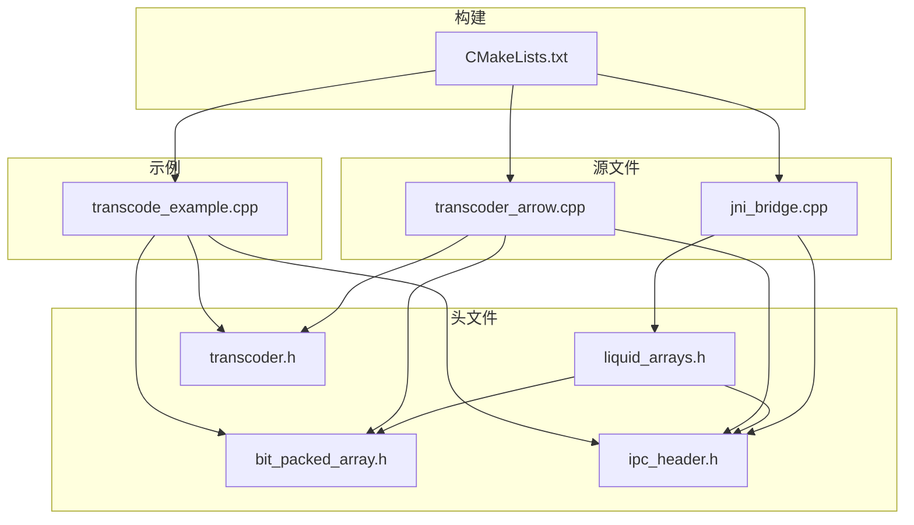
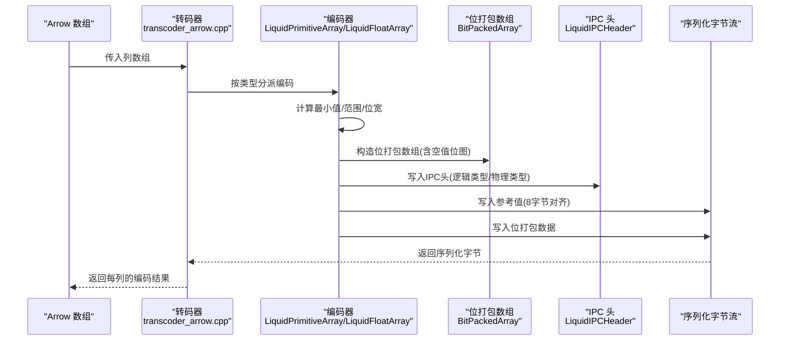
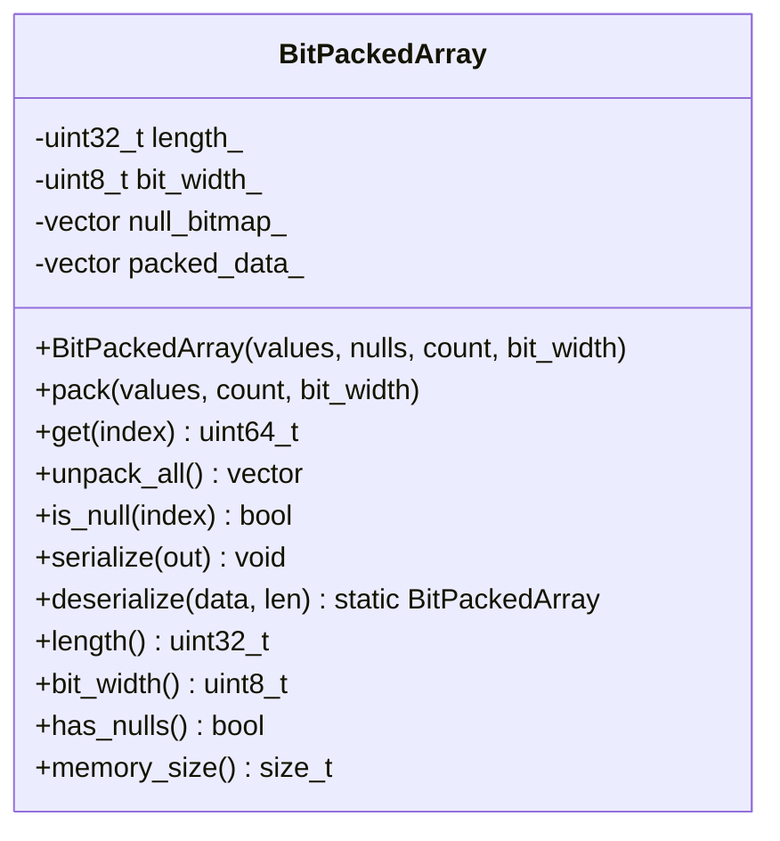
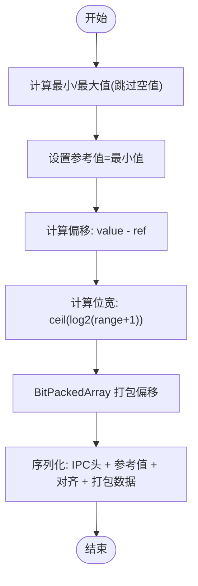
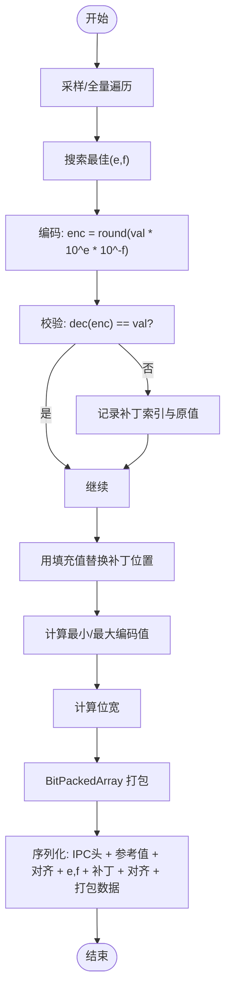
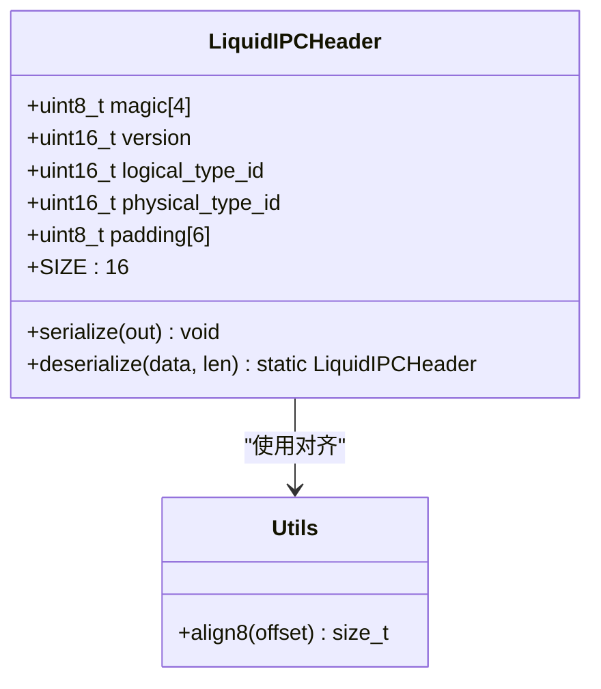
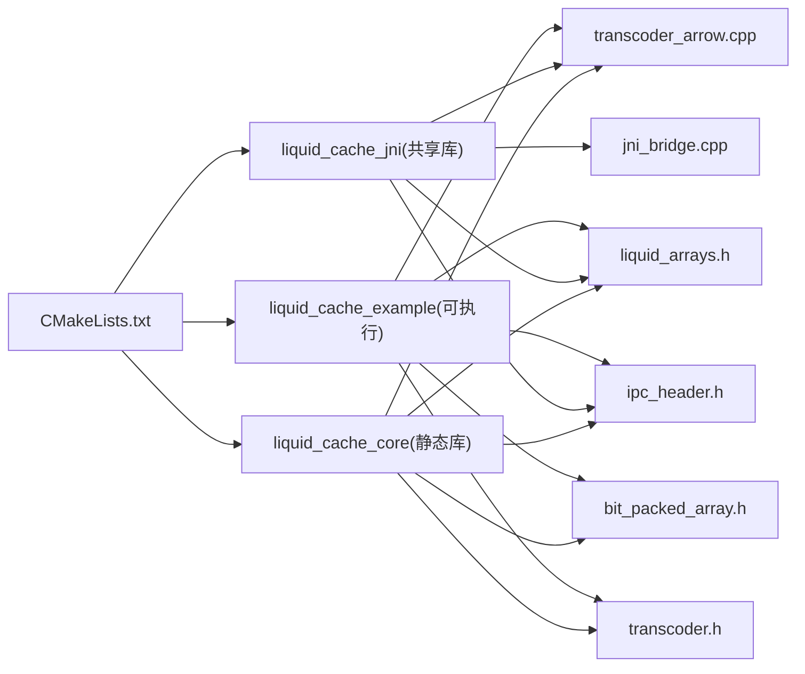

# 位打包数组实现

<cite>
**本文档引用的文件**
- [bit_packed_array.h](file://include/liquid_cache/bit_packed_array.h)
- [liquid_arrays.h](file://include/liquid_cache/liquid_arrays.h)
- [ipc_header.h](file://include/liquid_cache/ipc_header.h)
- [transcoder_arrow.cpp](file://src/transcoder_arrow.cpp)
- [transcoder.h](file://include/liquid_cache/transcoder.h)
- [transcode_example.cpp](file://examples/transcode_example.cpp)
- [CMakeLists.txt](file://CMakeLists.txt)
</cite>

## 目录
1. [简介](#简介)
2. [项目结构](#项目结构)
3. [核心组件](#核心组件)
4. [架构总览](#架构总览)
5. [详细组件分析](#详细组件分析)
6. [依赖关系分析](#依赖关系分析)
7. [性能考量](#性能考量)
8. [故障排查指南](#故障排查指南)
9. [结论](#结论)
10. [附录](#附录)

## 简介
本项目实现了与 Rust 版本二进制兼容的位打包数组（BitPackedArray），用于在 Arrow 列式数据格式与自定义 IPC 之间进行高效压缩与传输。核心目标是：
- 将固定宽度的整数以位级精度存储，最大化空间利用率
- 提供零拷贝序列化/反序列化，支持 8 字节对齐的数据布局
- 支持空值（null）位图编码，稀疏数据高效存储与查询
- 面向 SIMD 友好的数据排列，便于批量处理与内存访问优化
- 提供整型与浮点型的编码路径（整型采用帧参考 + 位打包；浮点采用自适应无损浮点编码 + 位打包）

## 项目结构
- 头文件位于 include/liquid_cache/，包含位打包、数组封装、IPC 头、转码器等
- 源文件位于 src/，包含 Arrow 转码桥接与 JNI 桥接
- 示例程序 examples/transcode_example.cpp 展示了从 Parquet 读取、转码为 Liquid Cache、解码回 Arrow 的完整流程，并提供基准测试
- 构建脚本 CMakeLists.txt 定义了静态库、JNI 共享库与示例可执行文件的构建规则

图表来源
- [CMakeLists.txt:160-206](file://CMakeLists.txt#L160-L206)
- [transcoder_arrow.cpp:1-286](file://src/transcoder_arrow.cpp#L1-L286)
- [transcode_example.cpp:1-918](file://examples/transcode_example.cpp#L1-L918)

章节来源
- [CMakeLists.txt:1-206](file://CMakeLists.txt#L1-L206)

## 核心组件
- BitPackedArray：位打包数组的核心实现，负责打包/解包、序列化/反序列化、空值检测与内存大小统计
- LiquidPrimitiveArray/LiquidFloatArray：面向 Arrow 类型的编码器，分别处理整型/日期与时点（帧参考 + 位打包）、浮点（ALP + 位打包）
- LiquidIPCHeader：二进制 IPC 头，保证与 Rust 实现的字节布局一致
- transcoder.h：原始缓冲区转码接口（JNI/Velox 等场景），提供整型与浮点的独立转码函数
- transcoder_arrow.cpp：基于 Arrow API 的转码入口，按列独立转码并返回序列化字节

章节来源
- [bit_packed_array.h:28-176](file://include/liquid_cache/bit_packed_array.h#L28-L176)
- [liquid_arrays.h:91-227](file://include/liquid_cache/liquid_arrays.h#L91-L227)
- [ipc_header.h:55-115](file://include/liquid_cache/ipc_header.h#L55-L115)
- [transcoder.h:25-342](file://include/liquid_cache/transcoder.h#L25-L342)
- [transcoder_arrow.cpp:36-286](file://src/transcoder_arrow.cpp#L36-L286)

## 架构总览
下图展示了从 Arrow 数组到 Liquid Cache 的端到端流程，以及 IPC 头、帧参考值、位打包数据与空值位图的组织方式。

图表来源
- [transcoder_arrow.cpp:36-209](file://src/transcoder_arrow.cpp#L36-L209)
- [liquid_arrays.h:107-218](file://include/liquid_cache/liquid_arrays.h#L107-L218)
- [bit_packed_array.h:38-159](file://include/liquid_cache/bit_packed_array.h#L38-L159)
- [ipc_header.h:66-105](file://include/liquid_cache/ipc_header.h#L66-L105)

## 详细组件分析

### BitPackedArray 组件分析
- 存储布局与二进制格式
  - 头部：长度（4字节）、位宽（1字节）、填充（3字节）
  - 空值位图：可选，存在时按 ceildiv(length, 8) 字节存储，并对齐到 8 字节边界
  - 打包数据：按 ceildiv(length * bit_width, 8) 字节存储，每个元素占用 bit_width 位
- 打包与解包算法
  - 打包：逐元素写入，处理跨字节边界的情况，最多写入 9 字节以容纳 64 位
  - 解包：根据索引计算位偏移，读取足够字节数，右移位偏移并按位宽掩码截断
- 空值处理
  - is_null(index) 基于空值位图按位检查，空值时返回 true
- 序列化/反序列化
  - serialize：顺序写入头部、空值位图（若存在且对齐）、打包数据
  - deserialize：解析头部后，根据剩余长度与对齐规则推断是否包含空值位图，再解析打包数据
- 内存使用
  - memory_size 返回打包数据大小 + 空值位图大小 + 对象自身大小

图表来源
- [bit_packed_array.h:28-176](file://include/liquid_cache/bit_packed_array.h#L28-L176)

章节来源
- [bit_packed_array.h:21-27](file://include/liquid_cache/bit_packed_array.h#L21-L27)
- [bit_packed_array.h:48-75](file://include/liquid_cache/bit_packed_array.h#L48-L75)
- [bit_packed_array.h:77-92](file://include/liquid_cache/bit_packed_array.h#L77-L92)
- [bit_packed_array.h:109-128](file://include/liquid_cache/bit_packed_array.h#L109-L128)
- [bit_packed_array.h:130-159](file://include/liquid_cache/bit_packed_array.h#L130-L159)
- [bit_packed_array.h:164-166](file://include/liquid_cache/bit_packed_array.h#L164-L166)

### 整型编码器（LiquidPrimitiveArray）分析
- 编码流程
  - 计算非空值的最小/最大，作为帧参考值（reference_value）
  - 将每个值减去最小值得到无符号偏移，按最大偏移确定位宽
  - 使用 BitPackedArray 存储偏移，必要时携带空值位图
- 解码流程
  - 读取 IPC 头、参考值与位打包数据
  - 逐元素解码：offset + reference_value
- 序列化布局
  - IPC 头（16B）+ 参考值（按物理类型大小）+ 8 字节对齐 + BitPackedArray 数据

图表来源
- [liquid_arrays.h:107-161](file://include/liquid_cache/liquid_arrays.h#L107-L161)
- [liquid_arrays.h:182-218](file://include/liquid_cache/liquid_arrays.h#L182-L218)

章节来源
- [liquid_arrays.h:91-227](file://include/liquid_cache/liquid_arrays.h#L91-L227)

### 浮点编码器（LiquidFloatArray）分析
- ALP（自适应无损浮点）编码
  - 通过枚举 (e, f) 搜索最佳指数对，使编码后的整数尽可能无损
  - 对无法无损还原的位置记录补丁（patch），并在位打包前用填充值替换
- 编码流程
  - 选择最佳 (e, f)，编码所有值，收集补丁
  - 以最小编码值为参考，计算位宽并位打包
- 序列化布局
  - IPC 头（16B）+ 参考值（有符号整数）+ 8 字节对齐 + 指数 e/f + 补丁数量 + 补丁索引与值 + 8 字节对齐 + BitPackedArray 数据

图表来源
- [liquid_arrays.h:344-430](file://include/liquid_cache/liquid_arrays.h#L344-L430)
- [liquid_arrays.h:477-512](file://include/liquid_cache/liquid_arrays.h#L477-L512)

章节来源
- [liquid_arrays.h:237-574](file://include/liquid_cache/liquid_arrays.h#L237-L574)

### IPC 头（LiquidIPCHeader）分析
- 16 字节固定布局，包含魔数、版本、逻辑类型、物理类型与填充
- 提供序列化/反序列化与对齐工具函数（align8）
- 与 Rust 实现严格二进制兼容

图表来源
- [ipc_header.h:55-115](file://include/liquid_cache/ipc_header.h#L55-L115)

章节来源
- [ipc_header.h:46-115](file://include/liquid_cache/ipc_header.h#L46-L115)

### 原始缓冲区转码器（transcoder.h）
- 提供不依赖 Arrow 的转码接口，适用于 JNI/Velox 等场景
- 支持整型与浮点的独立转码，内部同样使用帧参考 + 位打包或 ALP + 位打包
- 提供内存大小估算，便于资源规划

章节来源
- [transcoder.h:66-156](file://include/liquid_cache/transcoder.h#L66-L156)
- [transcoder.h:158-342](file://include/liquid_cache/transcoder.h#L158-L342)

### Arrow 转码桥接（transcoder_arrow.cpp）
- 按 Arrow 类型分派到对应的编码器（整型/日期/时间戳、浮点）
- 支持 RecordBatch 的逐列转码
- 提供解码入口（当前对浮点类型返回占位，完整实现需解析 ALP 结构）

章节来源
- [transcoder_arrow.cpp:36-286](file://src/transcoder_arrow.cpp#L36-L286)

## 依赖关系分析
- 构建依赖：Arrow、Parquet、JNI、线程库、若干第三方静态库
- 运行时依赖：Arrow API 用于类型推断、计算最小/最大、空值位图；JNI 用于 JVM 桥接
- 接口契约：所有序列化格式与 IPC 头严格与 Rust 实现兼容，确保跨语言一致性

图表来源
- [CMakeLists.txt:160-206](file://CMakeLists.txt#L160-L206)

章节来源
- [CMakeLists.txt:8-13](file://CMakeLists.txt#L8-L13)
- [CMakeLists.txt:160-206](file://CMakeLists.txt#L160-L206)

## 性能考量
- 空间效率
  - 位打包按元素固定位宽存储，理论最大压缩比为 64/bw（当 bw=1 时达到最优）
  - 空值位图仅存储必要的位，稀疏数据显著节省空间
- 时间效率
  - 打包/解包为标量实现，复杂度 O(n*bytes_per_element)，可扩展至 SIMD（当前注释指出生产版本应使用 1024 元素块的 FastLanes）
  - 8 字节对齐减少缓存行拆分，提升内存访问性能
- 内存使用
  - BitPackedArray.memory_size 返回打包数据 + 位图 + 对象大小的近似值
  - 浮点编码器额外包含补丁索引与值的内存开销
- 基准测试
  - 示例程序提供两种模式：直接读取 Parquet 与从 Liquid Cache 读取的对比基准
  - 输出迭代耗时、吞吐（行/秒、MB/秒）、最小/最大/标准差等指标
  - 支持“一次转换、多次读取”的成本回收分析（break-even）

章节来源
- [transcode_example.cpp:559-733](file://examples/transcode_example.cpp#L559-L733)
- [transcode_example.cpp:795-918](file://examples/transcode_example.cpp#L795-L918)

## 故障排查指南
- 反序列化错误
  - 若缓冲区过小或魔数/版本不匹配，将抛出异常
  - 空值位图的存在性由剩余数据长度与对齐规则推断，若格式不匹配可能导致解析失败
- 类型不支持
  - 当前 Arrow 转码对字符串/二进制类型返回占位，需后续实现 FSST 字典压缩
  - 浮点解码入口返回空指针，完整实现需解析 ALP 结构
- 内存不足
  - 序列化前预留容量，但极端稀疏或高位宽场景仍可能超出预期
  - 建议结合 memory_size 估算与实际使用情况调整预留策略

章节来源
- [bit_packed_array.h:130-159](file://include/liquid_cache/bit_packed_array.h#L130-L159)
- [transcoder_arrow.cpp:188-208](file://src/transcoder_arrow.cpp#L188-L208)
- [transcoder_arrow.cpp:275-283](file://src/transcoder_arrow.cpp#L275-L283)

## 结论
本实现以 BitPackedArray 为核心，结合 IPC 头与整型/浮点编码器，提供了与 Rust 版本二进制兼容的高效序列化方案。其优势在于：
- 显著的空间压缩（位打包 + 稀疏空值）
- 8 字节对齐与连续内存布局，有利于缓存与 SIMD 批处理
- 与 Arrow 生态无缝对接，支持从 Parquet 到自定义格式的转换与回放
建议在生产环境中引入 SIMD 打包内核与更完善的浮点解码器，以进一步提升吞吐与功能完整性。

## 附录
- 存储效率计算
  - 理论压缩比：64 / bit_width（当数据完全均匀时）
  - 实际压缩比：打包数据大小 / 原始 Arrow 缓冲大小
- 边界条件
  - bit_width=0：表示全零，打包数据为空
  - 空值位图为空：表示无空值
  - 8 字节对齐：序列化时自动补齐
- 与其他数据结构的集成
  - 与 Arrow 的最小/最大计算、空值位图、类型系统紧密耦合
  - 通过 IPC 头统一逻辑/物理类型，便于跨语言互操作