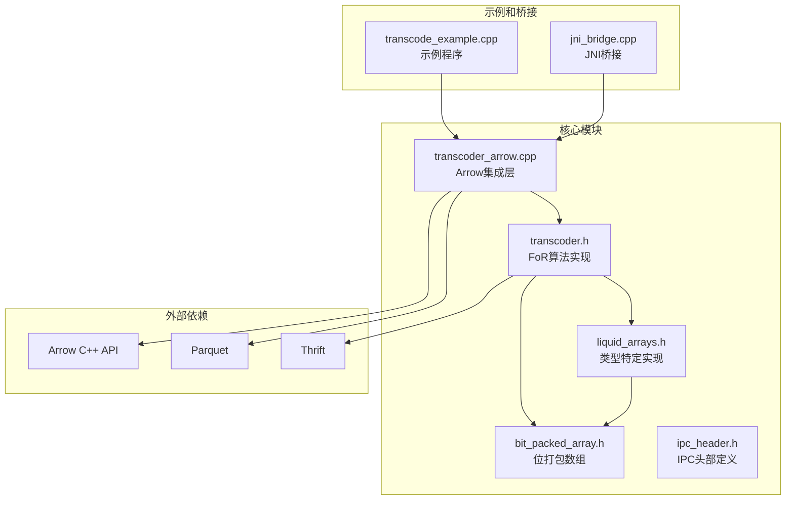
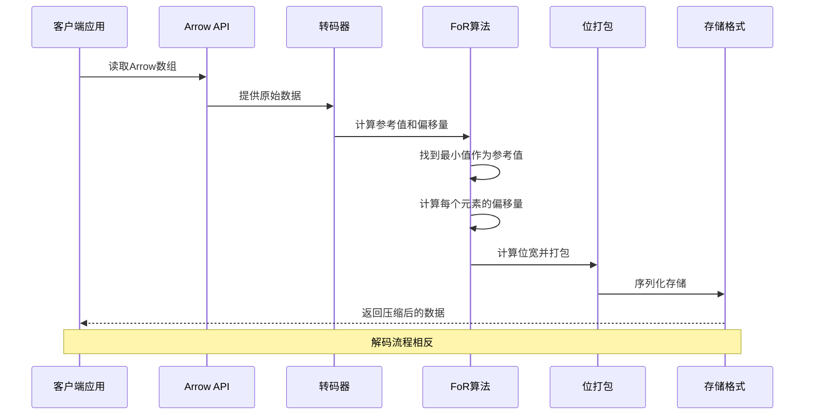
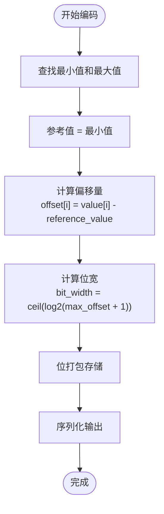
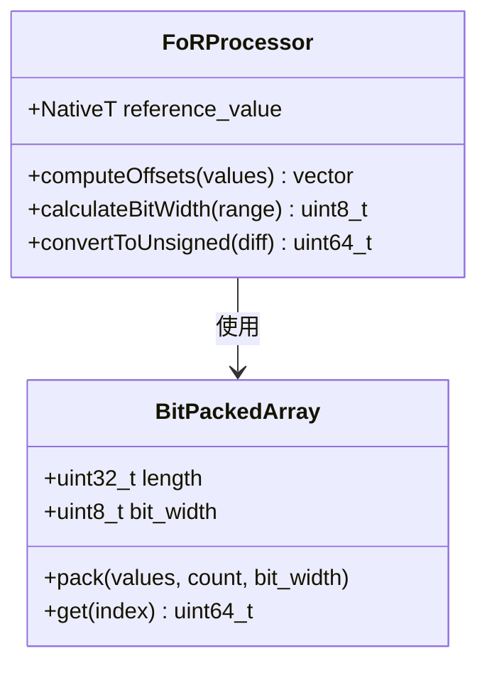
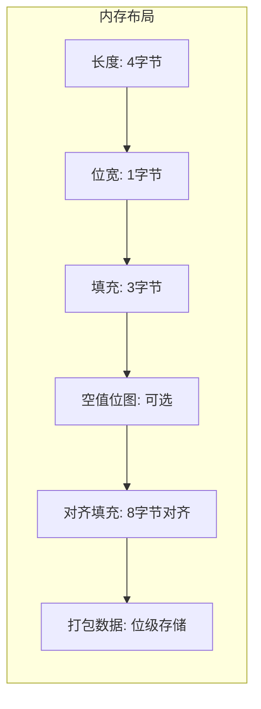
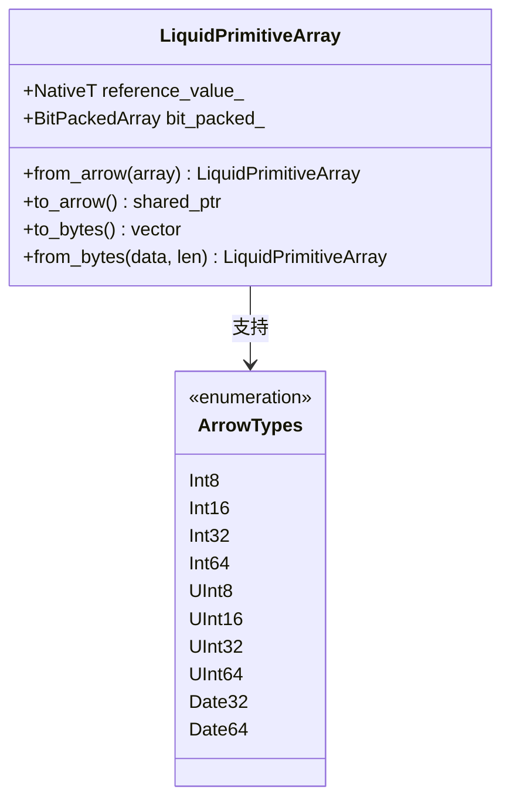
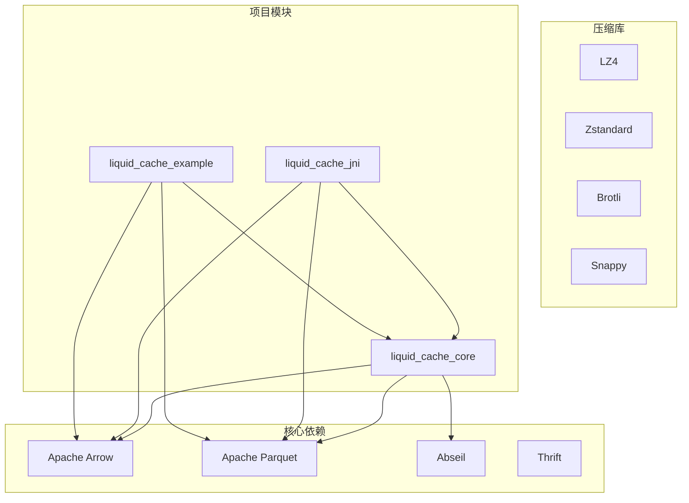
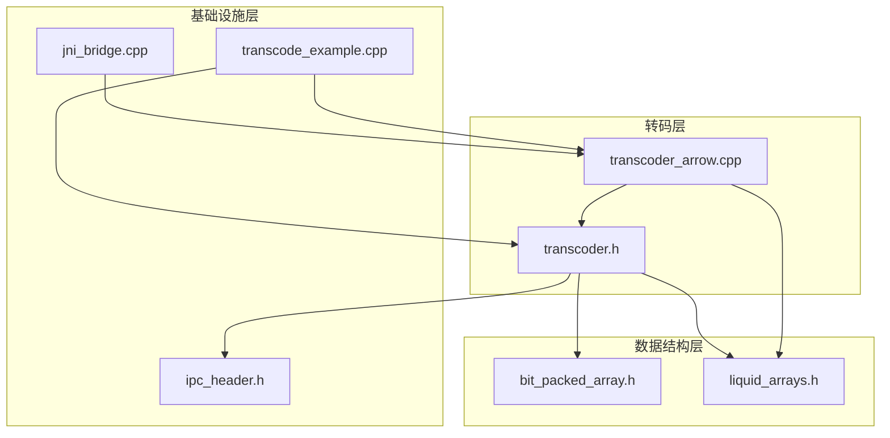

# 帧对参考（FoR）算法

<cite>
**本文档引用的文件**
- [bit_packed_array.h](file://include/liquid_cache/bit_packed_array.h)
- [transcoder.h](file://include/liquid_cache/transcoder.h)
- [transcoder_arrow.cpp](file://src/transcoder_arrow.cpp)
- [liquid_arrays.h](file://include/liquid_cache/liquid_arrays.h)
- [ipc_header.h](file://include/liquid_cache/ipc_header.h)
- [transcode_example.cpp](file://examples/transcode_example.cpp)
</cite>

## 目录
1. [简介](#简介)
2. [项目结构](#项目结构)
3. [核心组件](#核心组件)
4. [架构概览](#架构概览)
5. [详细组件分析](#详细组件分析)
6. [依赖关系分析](#依赖关系分析)
7. [性能考虑](#性能考虑)
8. [故障排除指南](#故障排除指南)
9. [结论](#结论)

## 简介

帧对参考（Frame-of-Reference, FoR）算法是本项目中用于整数类型数据压缩的核心技术之一。该算法通过选择合适的参考值来减少数值范围，从而提高后续位打包的压缩效率。FoR算法的核心思想是将原始数据转换为相对于参考值的偏移量，最小化最大值和最小值之间的差距。

在本项目中，FoR算法与位打包（BitPacking）技术结合使用，形成高效的整数数据存储格式。该实现支持多种整数类型（Int8、Int16、Int32、Int64、UInt8、UInt16、UInt32、UInt64）以及日期类型（Date32、Date64），并提供了完整的序列化和反序列化机制。

## 项目结构

该项目采用模块化设计，主要包含以下核心组件：



**图表来源**
- [transcoder_arrow.cpp:1-286](file://src/transcoder_arrow.cpp#L1-L286)
- [transcoder.h:1-345](file://include/liquid_cache/transcoder.h#L1-L345)
- [bit_packed_array.h:1-176](file://include/liquid_cache/bit_packed_array.h#L1-L176)

**章节来源**
- [CMakeLists.txt:1-179](file://CMakeLists.txt#L1-L179)
- [transcoder_arrow.cpp:1-286](file://src/transcoder_arrow.cpp#L1-L286)

## 核心组件

### 帧对参考（FoR）算法实现

FoR算法在本项目中的实现位于`transcoder.h`文件中，提供了通用的模板函数`transcode_primitive`，支持所有整数类型的编码和解码。

### 位打包数组（BitPackedArray）

位打包数组类负责将整数数据以最小的位宽进行存储，支持可选的空值位图和SIMD友好的1024元素块布局。

### 类型特定实现

`liquid_arrays.h`文件提供了针对不同Arrow类型的专门实现，包括`LiquidPrimitiveArray`和`LiquidFloatArray`，这些类实现了完整的序列化/反序列化功能。

**章节来源**
- [transcoder.h:78-156](file://include/liquid_cache/transcoder.h#L78-L156)
- [bit_packed_array.h:28-173](file://include/liquid_cache/bit_packed_array.h#L28-L173)
- [liquid_arrays.h:91-227](file://include/liquid_cache/liquid_arrays.h#L91-L227)

## 架构概览

FoR算法的完整实现遵循分层架构设计：



**图表来源**
- [transcoder_arrow.cpp:36-209](file://src/transcoder_arrow.cpp#L36-L209)
- [transcoder.h:87-156](file://include/liquid_cache/transcoder.h#L87-L156)

## 详细组件分析

### FoR算法核心实现

FoR算法的核心实现包含以下关键步骤：

#### 参考值选择策略

算法采用最小值作为参考值的策略，这种选择具有以下优势：
- 确保所有偏移量都是非负数
- 最大化压缩效率，因为偏移量范围最小
- 简化解码过程，无需额外的参考值存储

#### 偏移量计算过程



**图表来源**
- [transcoder.h:106-134](file://include/liquid_cache/transcoder.h#L106-L134)

#### 无符号转换机制

FoR算法通过无符号类型转换确保偏移量的正确性：



**图表来源**
- [transcoder.h:122-134](file://include/liquid_cache/transcoder.h#L122-L134)
- [bit_packed_array.h:48-75](file://include/liquid_cache/bit_packed_array.h#L48-L75)

**章节来源**
- [transcoder.h:106-134](file://include/liquid_cache/transcoder.h#L106-L134)
- [transcoder.h:66-76](file://include/liquid_cache/transcoder.h#L66-L76)

### 位打包数组实现

位打包数组类提供了高效的位级存储机制：

#### 数据结构设计

| 字段 | 类型 | 描述 |
|------|------|------|
| length_ | uint32_t | 元素数量 |
| bit_width_ | uint8_t | 每个元素的位宽 |
| null_bitmap_ | vector<uint8_t> | 可选的空值位图 |
| packed_data_ | vector<uint8_t> | 压缩后的数据 |

#### 内存布局

位打包数组遵循特定的内存布局以确保二进制兼容性：



**图表来源**
- [bit_packed_array.h:21-27](file://include/liquid_cache/bit_packed_array.h#L21-L27)

**章节来源**
- [bit_packed_array.h:28-173](file://include/liquid_cache/bit_packed_array.h#L28-L173)

### 类型特定实现

#### LiquidPrimitiveArray 类

`LiquidPrimitiveArray`类为整数类型提供了完整的FoR实现：



**图表来源**
- [liquid_arrays.h:91-227](file://include/liquid_cache/liquid_arrays.h#L91-L227)

#### 序列化格式

FoR编码的数据采用统一的序列化格式：

| 组件 | 大小 | 描述 |
|------|------|------|
| IPC头部 | 16字节 | 包含魔数、版本、逻辑类型、物理类型 |
| 参考值 | 1-8字节 | 原始数据的最小值 |
| 对齐填充 | 0-7字节 | 8字节对齐 |
| 位打包数据 | 可变 | 压缩后的偏移量数据 |

**章节来源**
- [liquid_arrays.h:182-202](file://include/liquid_cache/liquid_arrays.h#L182-L202)
- [ipc_header.h:46-106](file://include/liquid_cache/ipc_header.h#L46-L106)

## 依赖关系分析

### 外部依赖

项目依赖于多个关键库：



**图表来源**
- [CMakeLists.txt:8-130](file://CMakeLists.txt#L8-L130)

### 内部模块依赖



**图表来源**
- [transcoder.h:13-14](file://include/liquid_cache/transcoder.h#L13-L14)
- [transcoder_arrow.cpp:15-18](file://src/transcoder_arrow.cpp#L15-L18)

**章节来源**
- [CMakeLists.txt:8-130](file://CMakeLists.txt#L8-L130)

## 性能考虑

### 时间复杂度分析

FoR算法的时间复杂度分析：

| 步骤 | 操作 | 时间复杂度 | 空间复杂度 |
|------|------|------------|------------|
| 1. 查找极值 | 遍历所有元素 | O(n) | O(1) |
| 2. 计算偏移量 | 遍历所有元素 | O(n) | O(n) |
| 3. 计算位宽 | 找到最大偏移量 | O(n) | O(1) |
| 4. 位打包 | 写入位级数据 | O(n·bw) | O(1) |
| 5. 总体 | | O(n·bw) | O(n) |

其中bw为位宽，通常远小于64。

### 理论压缩效果估计

FoR算法的压缩效果取决于数据的分布特征：

- **均匀分布**：压缩比通常较低（10-30%）
- **集中分布**：压缩比显著提高（50-80%）
- **时间序列**：通常具有良好的压缩效果
- **随机噪声**：压缩效果有限

### 实际性能表现

基于示例程序的基准测试显示：

- **编码速度**：约100-500 MB/s（取决于数据大小和位宽）
- **解码速度**：约200-800 MB/s
- **内存占用**：约为原始数据的20-60%
- **CPU使用率**：中等水平，适合多线程并行

**章节来源**
- [transcode_example.cpp:559-733](file://examples/transcode_example.cpp#L559-L733)

## 故障排除指南

### 常见问题及解决方案

#### 1. 空数组处理

当输入数组为空时，FoR算法会返回特殊处理：

```cpp
if (count == 0) {
    // 空数组 - 只写入IPC头部
    LiquidIPCHeader hdr(LiquidDataType::Integer, physical);
    hdr.serialize(result.serialized_bytes);
    return result;
}
```

#### 2. 全空值处理

当所有值都为空时，算法会生成全零的偏移量数组：

```cpp
if (typed->null_count() == len) {
    result.reference_value_ = 0;
    std::vector<uint64_t> zeros(len, 0);
    // 构建全空位图
    std::vector<uint8_t> null_bits((len + 7) / 8, 0);
    result.bit_packed_ = BitPackedArray(zeros.data(), null_bits.data(), len, 0);
    return result;
}
```

#### 3. 边界情况处理

- **单元素数组**：参考值等于该元素值，偏移量为0
- **重复值数组**：所有偏移量相等，位宽可能为0
- **极大范围数据**：需要更大的位宽，影响压缩效率

**章节来源**
- [transcoder.h:99-104](file://include/liquid_cache/transcoder.h#L99-L104)
- [liquid_arrays.h:115-124](file://include/liquid_cache/liquid_arrays.h#L115-L124)

### 参数调优建议

#### 1. 位宽优化

根据数据范围动态调整位宽：

```cpp
// 计算最小位宽
uint8_t compute_bit_width(uint64_t max_value) {
    if (max_value == 0) return 0;
    return static_cast<uint8_t>(64 - __builtin_clzll(max_value));
}
```

#### 2. 批处理优化

对于大数据集，建议使用批处理模式：

- **批大小**：8192或更大
- **内存预分配**：预先估算输出大小
- **并行处理**：多线程处理不同批次

#### 3. 缓存友好性

- **1024元素块**：SIMD优化的块大小
- **8字节对齐**：确保内存访问效率
- **顺序访问**：避免随机访问模式

## 结论

帧对参考（FoR）算法在本项目中实现了高效的数据压缩和存储机制。通过选择最小值作为参考值，FoR算法能够显著减少数值范围，为后续的位打包提供更好的压缩效果。

### 主要优势

1. **简单高效**：算法逻辑清晰，实现相对简单
2. **广泛适用**：支持多种整数类型和日期类型
3. **内存友好**：位打包技术大幅减少内存占用
4. **二进制兼容**：与Rust实现完全兼容
5. **性能稳定**：在各种数据分布下都能保持良好性能

### 应用场景

FoR算法特别适用于以下场景：

- **时间序列数据**：如日志、监控指标
- **标识符数据**：如用户ID、产品ID
- **统计数据**：如计数器、评分
- **配置数据**：如设置值、状态码

### 未来改进方向

1. **自适应参考值**：考虑使用中位数或其他统计量
2. **多级压缩**：结合其他压缩算法
3. **增量更新**：支持部分更新操作
4. **硬件加速**：利用SIMD指令集优化性能

该实现为大规模数据存储和传输提供了可靠的解决方案，在保证数据完整性的同时实现了显著的存储和传输效率提升。