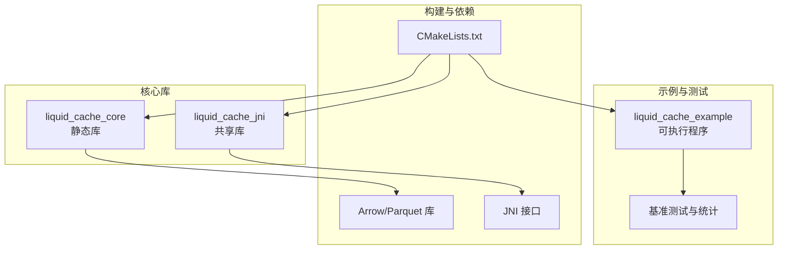
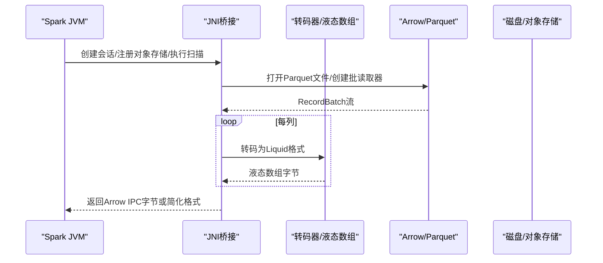
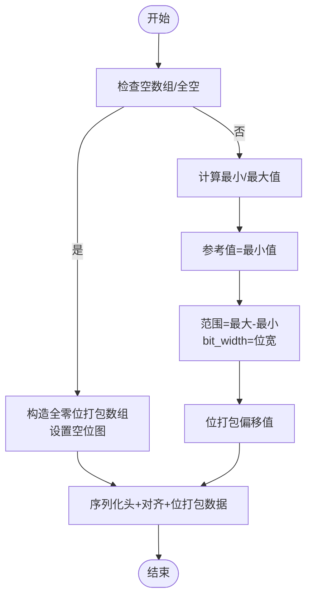
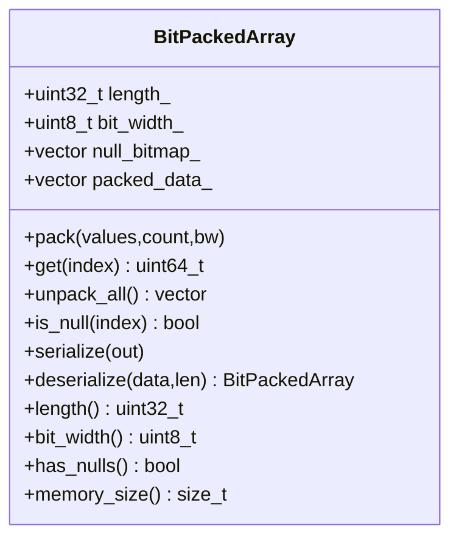
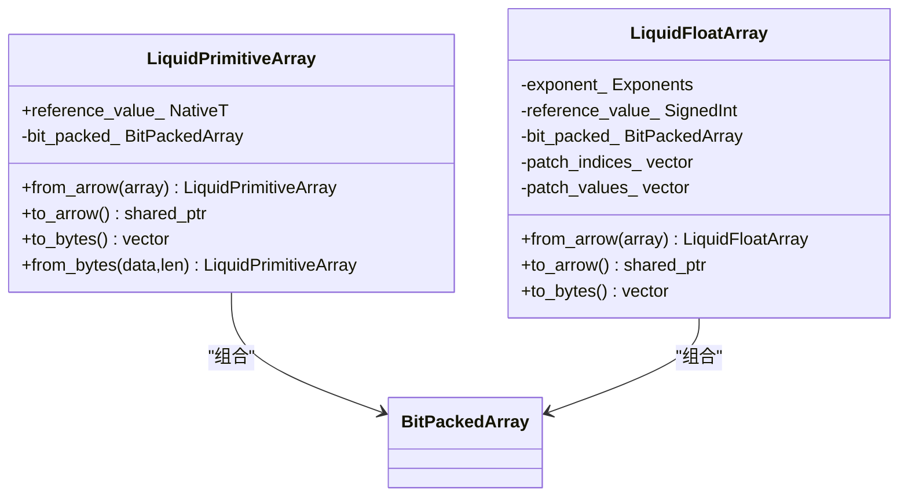
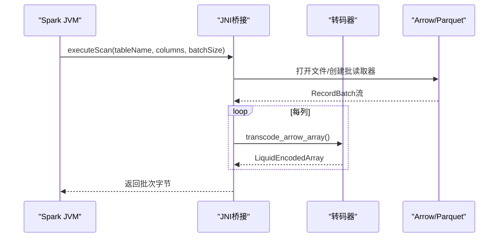
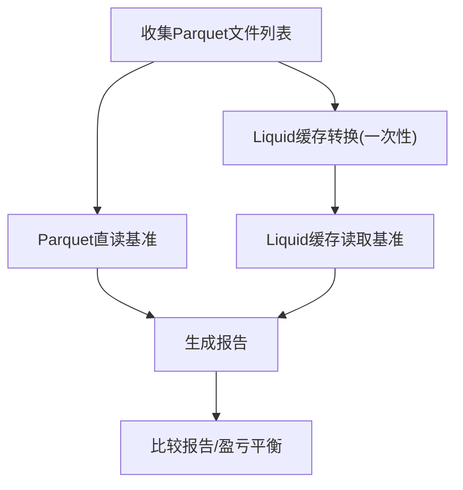
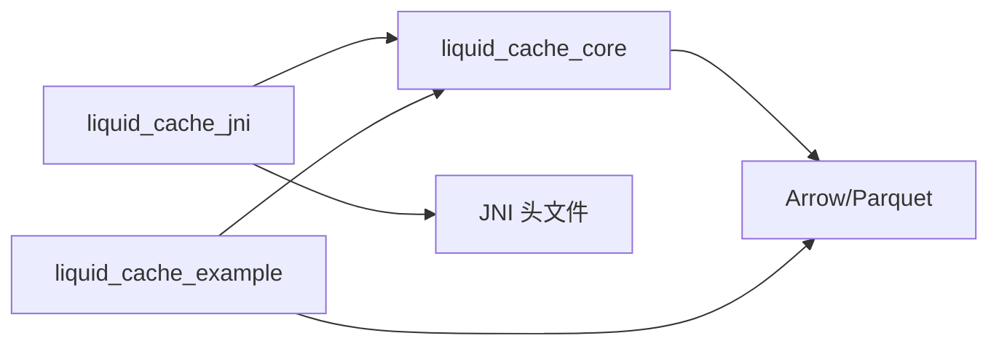

# 编码性能优化

<cite>
**本文引用的文件**
- [CMakeLists.txt](file://CMakeLists.txt)
- [transcoder.h](file://include/liquid_cache/transcoder.h)
- [transcoder_arrow.cpp](file://src/transcoder_arrow.cpp)
- [bit_packed_array.h](file://include/liquid_cache/bit_packed_array.h)
- [liquid_arrays.h](file://include/liquid_cache/liquid_arrays.h)
- [ipc_header.h](file://include/liquid_cache/ipc_header.h)
- [jni_bridge.h](file://include/liquid_cache/jni_bridge.h)
- [jni_bridge.cpp](file://src/jni_bridge.cpp)
- [transcode_example.cpp](file://examples/transcode_example.cpp)
- [debug.txt](file://debug.txt)
</cite>

## 目录
1. [引言](#引言)
2. [项目结构](#项目结构)
3. [核心组件](#核心组件)
4. [架构总览](#架构总览)
5. [详细组件分析](#详细组件分析)
6. [依赖关系分析](#依赖关系分析)
7. [性能考量与优化建议](#性能考量与优化建议)
8. [故障排查指南](#故障排查指南)
9. [结论](#结论)
10. [附录](#附录)

## 引言
本文件面向Liquid Cache编码系统的性能优化策略与技术实现进行系统化分析，重点覆盖以下方面：
- SIMD指令集优化：向量化计算、并行处理与硬件加速利用
- 预计算优化：查找表构建、幂次表缓存与位宽计算优化
- 内存访问模式优化：数据局部性提升、缓存友好的存储布局与批量处理策略
- 流水线处理机制：异步编码、并行处理与资源池化以提升吞吐量
- 性能基准测试方法、瓶颈分析技术与优化效果评估
- 不同数据类型与规模下的性能特征、内存使用模式与CPU使用率分析
- 多线程安全、锁竞争规避与资源管理策略

## 项目结构
项目采用模块化设计，核心围绕“Arrow数据读取—转码为Liquid格式—序列化/反序列化—JNI桥接—示例与基准测试”展开。关键目录与文件如下：
- include/liquid_cache：公共头文件，定义IPC头、位打包数组、原始转码函数、液态数组封装等
- src：实现转码器与JNI桥接逻辑
- examples：示例程序，包含Parquet读取、转码、解码与基准测试
- CMakeLists.txt：构建配置，静态/共享库目标、依赖与链接策略

图表来源
- [CMakeLists.txt:166-213](file://CMakeLists.txt#L166-L213)

章节来源
- [CMakeLists.txt:1-213](file://CMakeLists.txt#L1-L213)

## 核心组件
- IPC头与类型枚举：定义二进制兼容的IPC头、逻辑类型与物理类型标识，确保跨语言一致性
- 原始转码器：提供基于帧差（FoR）+位打包的整型/日期/时间戳编码，以及基于ALP的浮点编码
- 液态数组封装：对Arrow数组进行统一的编码/解码与序列化，支持整数与浮点两类
- 位打包数组：按位打包存储，支持空值位图与对齐，便于紧凑存储与快速解包
- JNI桥接：在Spark JVM与C++之间建立桥接，支持会话、扫描结果与批数据传输
- 示例与基准：提供Parquet读取、转码、解码与吞吐对比的基准框架

章节来源
- [ipc_header.h:1-118](file://include/liquid_cache/ipc_header.h#L1-L118)
- [transcoder.h:1-345](file://include/liquid_cache/transcoder.h#L1-L345)
- [liquid_arrays.h:1-580](file://include/liquid_cache/liquid_arrays.h#L1-L580)
- [bit_packed_array.h:1-176](file://include/liquid_cache/bit_packed_array.h#L1-L176)
- [jni_bridge.h:1-217](file://include/liquid_cache/jni_bridge.h#L1-L217)
- [jni_bridge.cpp:1-320](file://src/jni_bridge.cpp#L1-L320)
- [transcoder_arrow.cpp:1-286](file://src/transcoder_arrow.cpp#L1-L286)
- [transcode_example.cpp:1-918](file://examples/transcode_example.cpp#L1-L918)

## 架构总览
系统从Arrow/Parquet读取数据，经由转码器生成Liquid格式，随后可直接用于查询或通过JNI桥接返回给JVM侧。示例程序同时提供Parquet直读与Liquid缓存读取的基准对比。

图表来源
- [jni_bridge.cpp:40-126](file://src/jni_bridge.cpp#L40-L126)
- [transcoder_arrow.cpp:36-209](file://src/transcoder_arrow.cpp#L36-L209)
- [transcode_example.cpp:516-733](file://examples/transcode_example.cpp#L516-L733)

## 详细组件分析

### 组件A：原始转码器（FoR + BitPacking / ALP）
- 整数/日期/时间戳：采用帧差（最小值作为参考）+位打包，bit_width由范围决定；空值通过位图记录
- 浮点：采用ALP（自适应无损浮点）编码，通过预设幂次表与“甜点常数”实现快速舍入与近似，再用位打包存储；对无法精确还原的值记录补丁位置与原值，解码时回填

图表来源
- [transcoder.h:78-156](file://include/liquid_cache/transcoder.h#L78-L156)
- [liquid_arrays.h:99-161](file://include/liquid_cache/liquid_arrays.h#L99-L161)

章节来源
- [transcoder.h:78-156](file://include/liquid_cache/transcoder.h#L78-L156)
- [liquid_arrays.h:99-161](file://include/liquid_cache/liquid_arrays.h#L99-L161)

### 组件B：位打包数组（BitPackedArray）
- 存储布局：长度、位宽、填充、空值位图（可选）、8字节对齐、打包数据
- 支持按位写入/读取，提供整体序列化/反序列化
- 当前实现为标量打包，注释中提到生产版本应采用1024元素块的SIMD友好块（FastLanes约定）

图表来源
- [bit_packed_array.h:28-173](file://include/liquid_cache/bit_packed_array.h#L28-L173)

章节来源
- [bit_packed_array.h:15-176](file://include/liquid_cache/bit_packed_array.h#L15-L176)

### 组件C：液态数组封装（LiquidPrimitiveArray/LiquidFloatArray）
- 整型封装：FoR+BitPacking，序列化包含IPC头、参考值、8字节对齐、位打包数组
- 浮点封装：ALP+BitPacking，序列化包含IPC头、参考值、指数e/f、补丁索引与值、8字节对齐、位打包数组
- 解码路径：按位读取偏移，加回参考值，必要时应用补丁

图表来源
- [liquid_arrays.h:91-227](file://include/liquid_cache/liquid_arrays.h#L91-L227)
- [liquid_arrays.h:318-574](file://include/liquid_cache/liquid_arrays.h#L318-L574)

章节来源
- [liquid_arrays.h:77-227](file://include/liquid_cache/liquid_arrays.h#L77-L227)
- [liquid_arrays.h:236-574](file://include/liquid_cache/liquid_arrays.h#L236-L574)

### 组件D：JNI桥接（Spark JVM ↔ C++）
- 会话与结果句柄管理：原子分配、互斥保护的全局映射
- 扫描执行：读取Parquet，按批转码为Liquid格式，序列化为Arrow IPC或简化格式
- 批获取：按顺序返回下一批数据，直至耗尽

图表来源
- [jni_bridge.cpp:51-126](file://src/jni_bridge.cpp#L51-L126)
- [jni_bridge.h:40-93](file://include/liquid_cache/jni_bridge.h#L40-L93)

章节来源
- [jni_bridge.cpp:1-320](file://src/jni_bridge.cpp#L1-L320)
- [jni_bridge.h:1-217](file://include/liquid_cache/jni_bridge.h#L1-L217)

### 组件E：示例与基准（Parquet直读 vs Liquid缓存读取）
- 提供Parquet直读与Liquid缓存读取两种场景的基准框架，统计迭代耗时、吞吐、行数与字节数
- 支持比较报告与“盈亏平衡”分析（一次转码开销与多次读取收益）

图表来源
- [transcode_example.cpp:515-733](file://examples/transcode_example.cpp#L515-L733)

章节来源
- [transcode_example.cpp:1-918](file://examples/transcode_example.cpp#L1-L918)

## 依赖关系分析
- 构建依赖：Arrow、Parquet、JNI、Abseil、第三方压缩库（zstd、lz4、brotli等），通过静态链接策略减少运行时依赖
- 运行时依赖：Arrow/Parquet用于数据读取；JNI用于与JVM交互；示例程序用于基准测试

图表来源
- [CMakeLists.txt:166-213](file://CMakeLists.txt#L166-L213)

章节来源
- [CMakeLists.txt:1-213](file://CMakeLists.txt#L1-L213)
- [debug.txt:114-186](file://debug.txt#L114-L186)

## 性能考量与优化建议

### SIMD指令集优化与向量化
- 现状：位打包数组当前为标量实现，注释明确指出生产版本应采用1024元素块的SIMD友好块（FastLanes约定）。这为后续引入向量化（如AVX2/AVX512）提供了清晰的扩展点。
- 建议：
  - 在pack/unpack路径引入SIMD内核，按1024元素块批量处理，减少循环开销与分支预测压力
  - 使用位宽查表与按位掩码操作，结合向量化算术实现高效位打包/解包
  - 对ALP编码路径中的幂次表访问进行向量化，减少标量乘法次数

章节来源
- [bit_packed_array.h:48-75](file://include/liquid_cache/bit_packed_array.h#L48-L75)

### 预计算优化
- 幂次表缓存：ALP编码使用预置的10的幂次表（float32/float64），避免运行时计算开销
- 位宽计算：使用内置函数快速计算最高有效位，替代循环右移
- 最优指数搜索：对大数组采用采样策略，降低搜索复杂度

章节来源
- [transcoder.h:190-218](file://include/liquid_cache/transcoder.h#L190-L218)
- [liquid_arrays.h:263-287](file://include/liquid_cache/liquid_arrays.h#L263-L287)
- [transcoder.h:66-76](file://include/liquid_cache/transcoder.h#L66-L76)
- [liquid_arrays.h:329-342](file://include/liquid_cache/liquid_arrays.h#L329-L342)

### 内存访问模式优化
- 数据局部性：整型/浮点编码均先计算最小值/范围，再批量位打包，减少重复计算
- 缓存友好布局：位打包数组采用8字节对齐，空值位图紧随其后，减少跨缓存行访问
- 批量处理：示例程序与JNI桥接均以RecordBatch为单位进行批处理，降低系统调用与调度开销

章节来源
- [transcoder.h:137-154](file://include/liquid_cache/transcoder.h#L137-L154)
- [liquid_arrays.h:182-202](file://include/liquid_cache/liquid_arrays.h#L182-L202)
- [bit_packed_array.h:110-128](file://include/liquid_cache/bit_packed_array.h#L110-L128)

### 流水线处理机制
- 异步编码：JNI桥接中按批转码，批间可并行；示例程序中转换阶段与读取阶段分离，形成“转换→读取”的流水线
- 并行处理：示例基准中对多个文件/列独立处理；JNI层可扩展为多线程批处理
- 资源池化：会话与结果句柄采用原子计数与互斥保护，避免频繁分配释放；可进一步引入对象池（如位打包缓冲区、幂次表缓存）

章节来源
- [transcode_example.cpp:596-733](file://examples/transcode_example.cpp#L596-L733)
- [jni_bridge.cpp:51-126](file://src/jni_bridge.cpp#L51-L126)
- [jni_bridge.h:40-93](file://include/liquid_cache/jni_bridge.h#L40-L93)

### 性能基准测试方法
- 场景一：Parquet直读（统计总字节数、行数、迭代耗时）
- 场景二：Liquid缓存读取（统计转换耗时、缓存大小、读取耗时）
- 指标：平均/最小/最大/标准差、吞吐（行/秒、MB/秒）、比较报告与盈亏平衡点
- 建议：固定批大小（如8192）、预热一次、多次迭代取统计值；区分CPU与IO瓶颈

章节来源
- [transcode_example.cpp:346-407](file://examples/transcode_example.cpp#L346-L407)
- [transcode_example.cpp:515-733](file://examples/transcode_example.cpp#L515-L733)

### 瓶颈分析与优化效果评估
- 瓶颈识别：通过基准报告观察迭代方差、最小/最大耗时差异；若方差较大，可能受IO抖动或锁竞争影响
- 优化评估：对比不同批大小、是否启用幂次表缓存、是否采用SIMD内核；记录内存占用变化与CPU使用率

章节来源
- [transcode_example.cpp:409-509](file://examples/transcode_example.cpp#L409-L509)

### 不同数据类型与规模下的性能特征
- 整数/日期/时间戳：FoR+BitPacking在小范围/高重复场景表现优异；位宽越小压缩比越高
- 浮点：ALP在科学计算常见分布下效果显著；补丁数量越多，额外存储开销越大
- 规模：大数组采用采样最优指数搜索；批处理可降低调度开销

章节来源
- [transcoder.h:158-342](file://include/liquid_cache/transcoder.h#L158-L342)
- [liquid_arrays.h:344-475](file://include/liquid_cache/liquid_arrays.h#L344-L475)

### 多线程安全、锁竞争与资源管理
- 锁竞争：会话/结果映射使用互斥锁保护；建议采用无锁容器或分段锁降低热点
- 原子操作：结果索引使用原子递增，避免竞态
- 资源管理：JNI桥接中对Java字符串与数组进行本地引用管理，避免泄漏

章节来源
- [jni_bridge.h:55-93](file://include/liquid_cache/jni_bridge.h#L55-L93)
- [jni_bridge.cpp:100-120](file://src/jni_bridge.cpp#L100-L120)

## 故障排查指南
- IPC头校验：若反序列化失败，检查魔数与版本号；确保序列化/反序列化端一致
- 空值处理：确认位图存在条件与对齐逻辑；解码时正确跳过空值
- JNI异常：捕获并抛出Java运行时异常，定位错误消息
- 构建问题：关注Arrow/Parquet静态库与第三方库的查找与链接；示例日志显示部分依赖未找到但可继续构建

章节来源
- [ipc_header.h:86-105](file://include/liquid_cache/ipc_header.h#L86-L105)
- [transcoder_arrow.cpp:236-283](file://src/transcoder_arrow.cpp#L236-L283)
- [jni_bridge.cpp:122-127](file://src/jni_bridge.cpp#L122-L127)
- [debug.txt:114-186](file://debug.txt#L114-L186)

## 结论
Liquid Cache编码系统在数据压缩与序列化层面已具备良好基础：FoR+BitPacking与ALP+BitPacking分别针对整数/日期与时序浮点数据实现了高效率编码；位打包数组与8字节对齐布局提升了内存与缓存友好性；JNI桥接与示例基准为性能评估与集成提供了完整路径。未来可在SIMD向量化、幂次表与位宽计算的进一步优化、批处理与并行化、以及锁竞争缓解等方面持续改进，以在更大规模与更复杂场景下取得更优的吞吐与延迟表现。

## 附录
- 关键实现路径参考
  - [FoR+BitPacking整型编码:78-156](file://include/liquid_cache/transcoder.h#L78-L156)
  - [ALP浮点编码与幂次表:158-342](file://include/liquid_cache/transcoder.h#L158-L342)
  - [位打包数组标量实现:48-75](file://include/liquid_cache/bit_packed_array.h#L48-L75)
  - [液态数组封装与序列化:91-227](file://include/liquid_cache/liquid_arrays.h#L91-L227)
  - [JNI桥接与批处理:51-126](file://src/jni_bridge.cpp#L51-L126)
  - [示例基准与比较报告:515-733](file://examples/transcode_example.cpp#L515-L733)