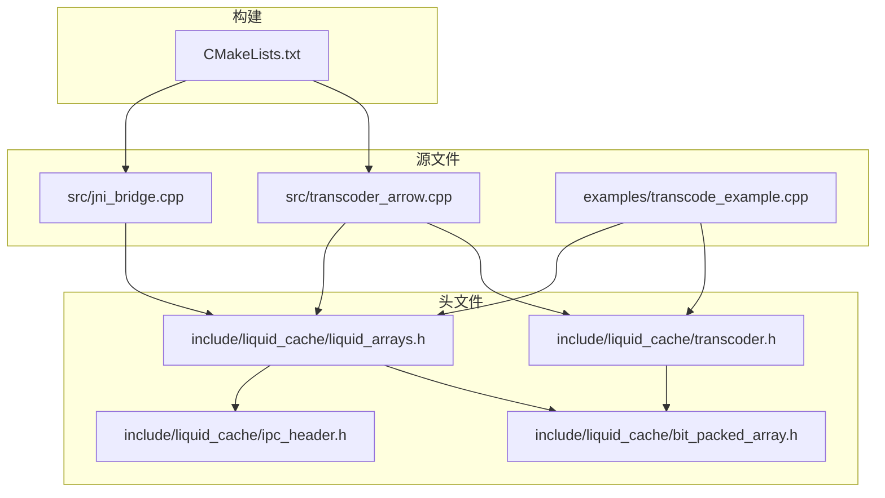
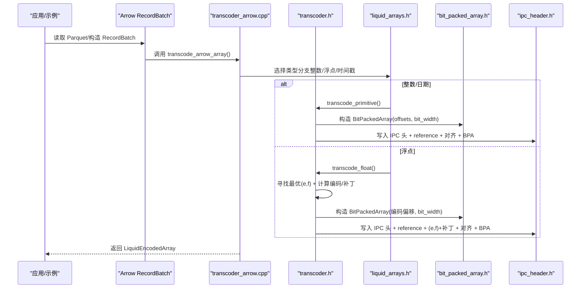
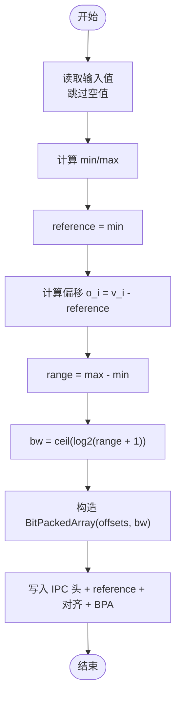
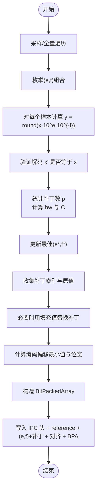
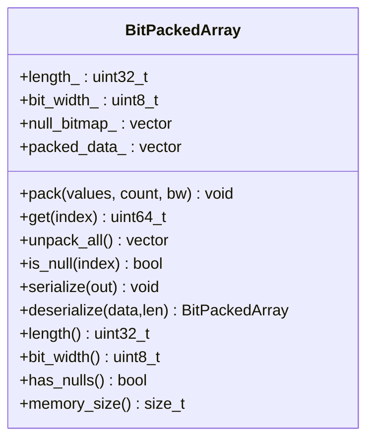
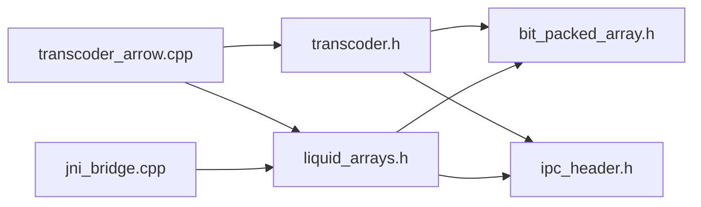

# 编码算法详解

<cite>
**本文引用的文件列表**
- [transcoder.h](file://include/liquid_cache/transcoder.h)
- [liquid_arrays.h](file://include/liquid_cache/liquid_arrays.h)
- [bit_packed_array.h](file://include/liquid_cache/bit_packed_array.h)
- [ipc_header.h](file://include/liquid_cache/ipc_header.h)
- [transcoder_arrow.cpp](file://src/transcoder_arrow.cpp)
- [jni_bridge.cpp](file://src/jni_bridge.cpp)
- [transcode_example.cpp](file://examples/transcode_example.cpp)
- [CMakeLists.txt](file://CMakeLists.txt)
</cite>

## 目录
1. [简介](#简介)
2. [项目结构](#项目结构)
3. [核心组件](#核心组件)
4. [架构总览](#架构总览)
5. [详细组件分析](#详细组件分析)
6. [依赖关系分析](#依赖关系分析)
7. [性能与复杂度](#性能与复杂度)
8. [故障排除指南](#故障排除指南)
9. [结论](#结论)
10. [附录](#附录)

## 简介
本文件面向具备算法背景的开发者，系统性解析 Liquid Cache C++ 实现中的核心编码算法：帧对参考（Frame-of-Reference, FoR）+ 位打包（BitPacking）、自适应无损浮点（Adaptive Lossless floating-Point, ALP）编码，以及位打包数组的数据结构与内存布局。文档覆盖数学原理、实现细节、适用场景、预计算优化、查找表使用、流水线处理、复杂度分析、理论压缩率估计、性能基准与参数调优建议，并提供故障排除方法。

## 项目结构
- 头文件层：定义 IPC 头、位打包数组、原始缓冲区转码器、Arrow 类型封装等。
- 源文件层：Arrow 适配层、JNI 桥接、示例与基准。
- 构建系统：CMake 配置 Arrow、Parquet、JNI 依赖及静态链接策略。

图表来源
- [CMakeLists.txt:1-127](file://CMakeLists.txt#L1-L127)
- [transcoder_arrow.cpp:1-286](file://src/transcoder_arrow.cpp#L1-L286)
- [jni_bridge.cpp:1-320](file://src/jni_bridge.cpp#L1-L320)
- [transcode_example.cpp:1-918](file://examples/transcode_example.cpp#L1-L918)

章节来源
- [CMakeLists.txt:1-127](file://CMakeLists.txt#L1-L127)

## 核心组件
- 帧对参考 + 位打包（FoR + BitPacking）
  - 整数/日期类型：以最小值为参考，将每个元素转换为非负偏移，再按所需位宽进行位打包。
  - 浮点类型：通过 ALP 将浮点映射到整数域，再用 FoR + BitPacking 存储。
- 自适应无损浮点（ALP）
  - 使用指数对齐（e, f），在编码空间中寻找使解码误差最小且压缩成本最低的参数；对误差位置记录补丁，保证无损还原。
- 位打包数组（BitPackedArray）
  - 定长位宽存储，支持空值位图；序列化格式与 Rust 对齐；提供单元素读取与全量解包接口。
- IPC 头（LiquidIPCHeader）
  - 固定 16 字节头部，包含魔数、版本、逻辑类型、物理类型等字段。

章节来源
- [transcoder.h:78-156](file://include/liquid_cache/transcoder.h#L78-L156)
- [transcoder.h:158-342](file://include/liquid_cache/transcoder.h#L158-L342)
- [liquid_arrays.h:77-227](file://include/liquid_cache/liquid_arrays.h#L77-L227)
- [liquid_arrays.h:237-579](file://include/liquid_cache/liquid_arrays.h#L237-L579)
- [bit_packed_array.h:15-176](file://include/liquid_cache/bit_packed_array.h#L15-L176)
- [ipc_header.h:16-118](file://include/liquid_cache/ipc_header.h#L16-L118)

## 架构总览
下图展示从 Arrow 到 Liquid Cache 的转码流程，以及 Arrow 与 JNI 的桥接路径。

图表来源
- [transcoder_arrow.cpp:26-209](file://src/transcoder_arrow.cpp#L26-L209)
- [transcoder.h:78-156](file://include/liquid_cache/transcoder.h#L78-L156)
- [transcoder.h:158-342](file://include/liquid_cache/transcoder.h#L158-L342)
- [liquid_arrays.h:77-227](file://include/liquid_cache/liquid_arrays.h#L77-L227)
- [liquid_arrays.h:237-579](file://include/liquid_cache/liquid_arrays.h#L237-L579)
- [bit_packed_array.h:15-176](file://include/liquid_cache/bit_packed_array.h#L15-L176)
- [ipc_header.h:46-118](file://include/liquid_cache/ipc_header.h#L46-L118)

## 详细组件分析

### 帧对参考 + 位打包（FoR + BitPacking）
- 数学原理
  - 参考值 r = min(所有非空值)
  - 偏移 o_i = (v_i − r) 作为无符号整数
  - 找到最大偏移对应的位宽 bw = ceil(log2(max(o) + 1))
  - 以 bw 位存储所有偏移，必要时附加空值位图
- 实现要点
  - 原始缓冲区 API：transcode_primitive() 完成 min/max、偏移计算、位宽确定、BitPackedArray 构造与序列化。
  - Arrow 类型封装：LiquidPrimitiveArray::from_arrow() 使用 Arrow 计算 min/max、构建空值位图、生成 BitPackedArray。
  - 序列化布局：IPC 头 + reference + 8 字节对齐 + BitPackedArray 数据。
- 适用场景
  - 连续变化较小的整数/日期序列；存在稳定最小值可显著降低位宽。
- 性能特征
  - 时间复杂度 O(n)，空间复杂度近似 n·bw/8 + 位图大小 + 元数据。
  - 位宽越小压缩比越高；空值位图带来额外开销但可避免零填充浪费。

图表来源
- [transcoder.h:78-156](file://include/liquid_cache/transcoder.h#L78-L156)
- [liquid_arrays.h:99-161](file://include/liquid_cache/liquid_arrays.h#L99-L161)

章节来源
- [transcoder.h:78-156](file://include/liquid_cache/transcoder.h#L78-L156)
- [liquid_arrays.h:99-161](file://include/liquid_cache/liquid_arrays.h#L99-L161)

### 自适应无损浮点（ALP）编码
- 技术机制
  - 将浮点 x 映射到整数域：y = round(x · 10^e · 10^{-f})，其中 e、f 为参数。
  - 解码：x' = y · 10^f · 10^{-e}。
  - 若 x' ≠ x，则记录该位置为“补丁”，并在解码阶段单独存储原值或采用填充值策略。
- 参数搜索与调优
  - 搜索范围：e ∈ [0, E_max)，f ∈ [0, e)，穷举评估成本。
  - 成本函数：C ≈ ceil((n·bw + 7)/8) + p·(8 + sizeof(FloatT))，其中 p 为补丁数量。
  - 对大数组采用采样（如每 k 个元素取一个）以加速搜索。
- 补丁策略
  - 收集所有解码误差位置，若补丁过多则考虑用填充值替换，提升后续位打包效率。
- 序列化布局
  - IPC 头 + reference（编码偏移最小值）+ 8 字节对齐 + (e, f) + 6 字节填充 + 补丁长度 + 补丁索引 + 补丁值 + 对齐 + BitPackedArray。

图表来源
- [transcoder.h:158-342](file://include/liquid_cache/transcoder.h#L158-L342)
- [liquid_arrays.h:344-579](file://include/liquid_cache/liquid_arrays.h#L344-L579)

章节来源
- [transcoder.h:158-342](file://include/liquid_cache/transcoder.h#L158-L342)
- [liquid_arrays.h:344-579](file://include/liquid_cache/liquid_arrays.h#L344-L579)

### 位打包数组（BitPackedArray）
- 存储优化策略
  - 固定位宽：每个元素占用固定 bit_width 位，避免变长编码开销。
  - 空值位图：当存在空值时，追加 1 位/元素的位图，便于快速跳过。
  - 8 字节对齐：在关键边界处填充，提升内存访问效率与缓存友好性。
- 内存布局与访问模式
  - 布局：长度、位宽、填充、空值位图（可选）、对齐、打包数据。
  - 读取：根据索引计算 bit_offset，跨字节读取并掩码提取。
  - 写入：按位偏移写入，处理跨越多字节的情况。
- SIMD 友好性
  - 注释指出应采用 1024 元素块的 FastLanes 规范，以便向量化打包/解包；当前标头实现为标量，留待生产环境扩展。

图表来源
- [bit_packed_array.h:15-176](file://include/liquid_cache/bit_packed_array.h#L15-L176)

章节来源
- [bit_packed_array.h:15-176](file://include/liquid_cache/bit_packed_array.h#L15-L176)

### IPC 头与类型映射
- IPC 头
  - 固定 16 字节，包含魔数、版本、逻辑类型、物理类型与填充。
  - 提供序列化/反序列化接口，校验魔数与版本。
- 类型映射
  - Arrow 类型到物理类型的映射，用于设置 IPC 物理类型字段。
  - 时间戳类型按单位映射到不同的物理类型（秒/毫秒/微秒/纳秒）。

章节来源
- [ipc_header.h:16-118](file://include/liquid_cache/ipc_header.h#L16-L118)
- [transcoder_arrow.cpp:36-209](file://src/transcoder_arrow.cpp#L36-L209)

### Arrow 与 JNI 桥接
- Arrow 适配层
  - 类型分派：根据 Arrow 类型选择整数/浮点/日期/时间戳路径，分别调用对应编码器。
  - 反序列化：根据 IPC 头逻辑类型与物理类型选择解码器。
- JNI 桥接
  - 提供会话创建、扫描执行、批量获取、结果关闭等 JNI 方法，内部将 Liquid 编码的批次序列化为 Arrow IPC 格式返回给 JVM。

章节来源
- [transcoder_arrow.cpp:26-286](file://src/transcoder_arrow.cpp#L26-L286)
- [jni_bridge.cpp:176-320](file://src/jni_bridge.cpp#L176-L320)

## 依赖关系分析
- 组件耦合
  - transcoder.h 依赖 bit_packed_array.h 与 ipc_header.h。
  - liquid_arrays.h 同时依赖 bit_packed_array.h 与 ipc_header.h，并通过 Arrow API 进行类型推断与计算。
  - transcoder_arrow.cpp 依赖上述两个模块，负责类型分派与 Arrow 交互。
  - jni_bridge.cpp 依赖 liquid_arrays.h 与 Arrow API，实现 JVM 侧桥接。
- 外部依赖
  - Arrow、Parquet、JNI、Abseil 静态库；CMake 配置了静态链接顺序与系统依赖。

图表来源
- [transcoder.h:12-14](file://include/liquid_cache/transcoder.h#L12-L14)
- [liquid_arrays.h:18-20](file://include/liquid_cache/liquid_arrays.h#L18-L20)
- [transcoder_arrow.cpp:15-18](file://src/transcoder_arrow.cpp#L15-L18)
- [jni_bridge.cpp:24-26](file://src/jni_bridge.cpp#L24-L26)

章节来源
- [CMakeLists.txt:8-78](file://CMakeLists.txt#L8-L78)

## 性能与复杂度
- FoR + BitPacking
  - 时间复杂度：O(n)（一次扫描求 min/max，一次扫描计算偏移与打包）。
  - 空间复杂度：≈ n·bw/8 + ceil(n/8)（空值位图）+ 元数据。
  - 理论压缩率：取决于数据分布与位宽；当偏移集中在较小范围内时压缩效果显著。
- ALP
  - 时间复杂度：O(n·E·F)（参数搜索），采样可降为 O(n·E·F/k)。
  - 空间复杂度：≈ ceil(n·bw/8) + p·(8 + sizeof(FloatT)) + 元数据。
  - 理论压缩率：在无损前提下尽可能接近整数域压缩效果；补丁越多，额外开销越大。
- 位打包数组
  - 读取/写入为 O(1) 单元素操作；全量解包 O(n)。
  - 8 字节对齐与紧凑存储减少缓存抖动，提升流水线吞吐。
- 预计算与查找表
  - 位宽计算使用内置 CLZ（或循环右移）实现，避免除法与浮点运算。
  - ALP 使用预计算的 10 的幂表（f10/if10），减少乘法次数。
- 流水线处理
  - Arrow 读取 → 类型分派 → 编码 → 序列化 → 输出，各阶段可并行于列级；批内按列独立转码。

章节来源
- [transcoder.h:66-76](file://include/liquid_cache/transcoder.h#L66-L76)
- [transcoder.h:158-342](file://include/liquid_cache/transcoder.h#L158-L342)
- [liquid_arrays.h:344-579](file://include/liquid_cache/liquid_arrays.h#L344-L579)
- [bit_packed_array.h:48-75](file://include/liquid_cache/bit_packed_array.h#L48-L75)

## 故障排除指南
- 无法识别类型或返回空结果
  - 检查 Arrow 类型是否在分派表中；字符串/二进制类型当前未实现，返回空结果属预期。
- 解码失败或 round-trip 不一致
  - 当前 Arrow 解码路径对浮点类型尚未完整实现，返回空指针；请使用原始缓冲区 API 或等待完整实现。
- IPC 头校验失败
  - 确认序列化/反序列化端使用相同版本与魔数；检查对齐与填充。
- 性能不达预期
  - 检查位宽是否合理；对于浮点数据，确认参数搜索是否充分；对大数组启用采样。
  - 确保编译器优化开启（C++20 标准）与静态链接策略正确。

章节来源
- [transcoder_arrow.cpp:236-283](file://src/transcoder_arrow.cpp#L236-L283)
- [ipc_header.h:86-105](file://include/liquid_cache/ipc_header.h#L86-L105)

## 结论
Liquid Cache C++ 在整数/日期与浮点两大类数据上提供了高性价比的无损压缩方案：FoR + BitPacking 适合连续变化较小的整数序列；ALP + BitPacking 在无损前提下将浮点映射到整数域，结合补丁策略实现稳定压缩。位打包数组提供紧凑、对齐友好的存储与访问模型，配合预计算与查找表进一步提升性能。建议在工程中优先评估数据分布，选择合适的算法与参数，并结合示例程序进行基准测试与调优。

## 附录
- 算法选择指导
  - 整数/日期：优先 FoR + BitPacking；若存在大量空值，空值位图收益明显。
  - 浮点：优先 ALP + BitPacking；对稀疏或极端分布数据，考虑先做归一化/量化。
- 参数配置建议
  - 位宽：使用内置位宽计算函数；确保覆盖最大偏移。
  - ALP：扩大搜索范围以获得更佳 e/f；对大数组启用采样；补丁阈值可根据业务容忍度调整。
- 示例与基准
  - 使用示例程序读取 Parquet 文件，转码为 Liquid Cache 并打印压缩率与内存估算；可切换 bench1/bench2 比较直接读取与缓存读取的性能差异。

章节来源
- [transcode_example.cpp:140-340](file://examples/transcode_example.cpp#L140-L340)
- [transcode_example.cpp:559-733](file://examples/transcode_example.cpp#L559-L733)