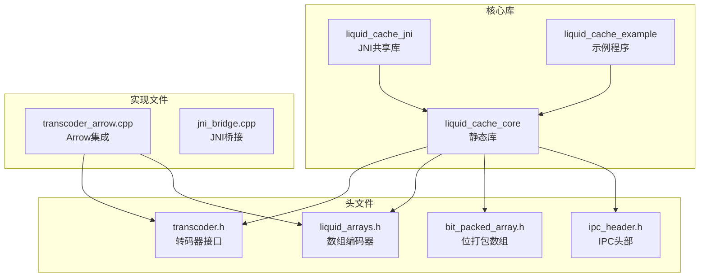
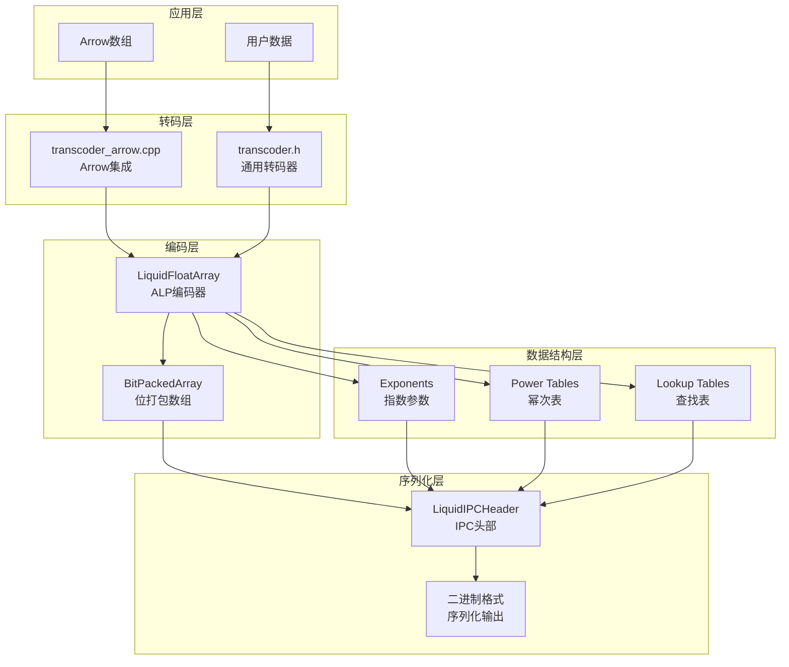
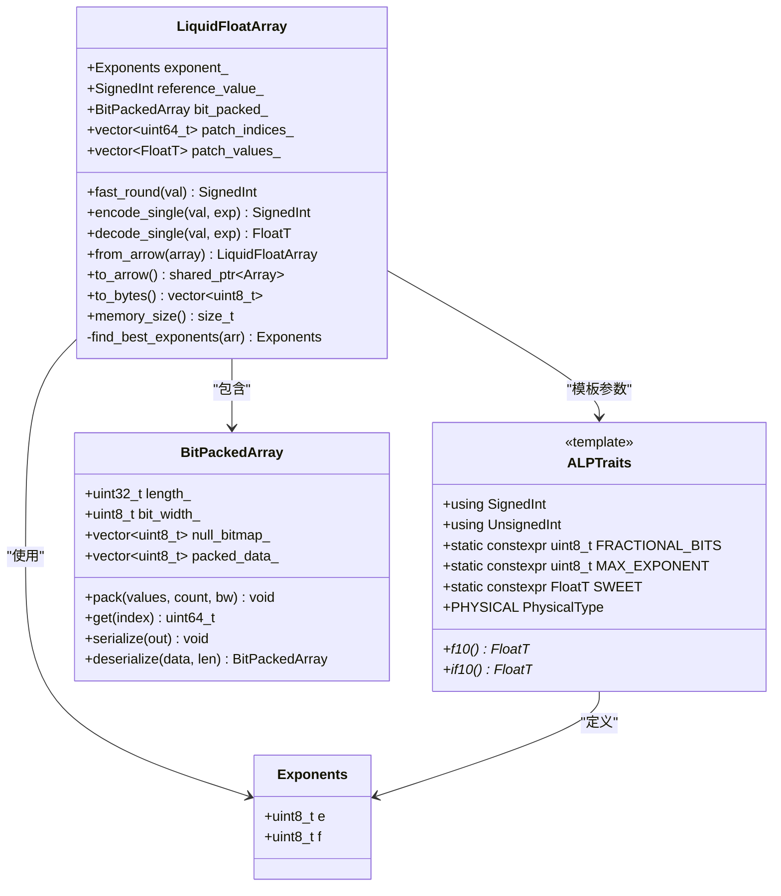
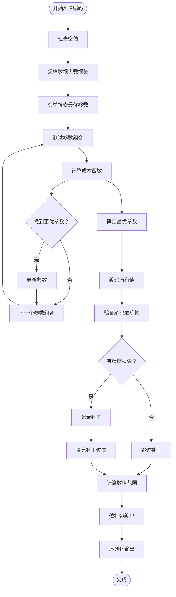
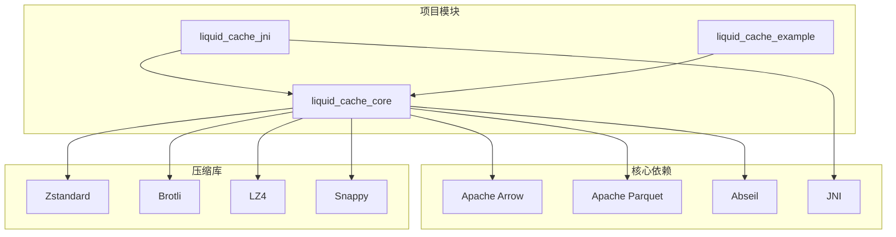
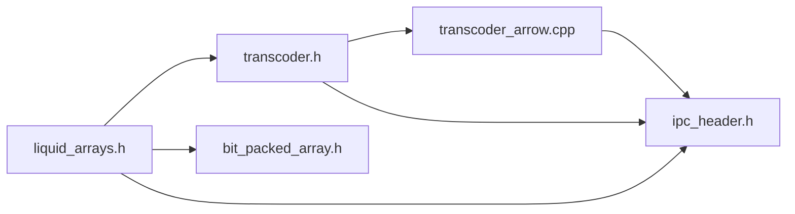

# 自适应无损浮点（ALP）编码

<cite>
**本文档中引用的文件**
- [transcoder.h](file://include/liquid_cache/transcoder.h)
- [liquid_arrays.h](file://include/liquid_cache/liquid_arrays.h)
- [transcoder_arrow.cpp](file://src/transcoder_arrow.cpp)
- [bit_packed_array.h](file://include/liquid_cache/bit_packed_array.h)
- [CMakeLists.txt](file://CMakeLists.txt)
- [transcode_example.cpp](file://examples/transcode_example.cpp)
</cite>

## 目录
1. [简介](#简介)
2. [项目结构](#项目结构)
3. [核心组件](#核心组件)
4. [架构概览](#架构概览)
5. [详细组件分析](#详细组件分析)
6. [依赖关系分析](#依赖关系分析)
7. [性能考虑](#性能考虑)
8. [故障排除指南](#故障排除指南)
9. [结论](#结论)

## 简介

自适应无损浮点（Adaptive Lossless floating-Point, ALP）编码是一种创新的浮点数压缩算法，能够在不丢失任何精度的情况下高效压缩浮点数据。该算法通过动态选择指数和小数位数来实现浮点数的无损编码，其核心变换公式为：

v' = round(v × 10^e × 10^(-f))

其中e和f是自适应选择的参数，用于优化压缩效率。ALP算法的主要特点包括：

- **无损压缩**：确保解码后的数据与原始数据完全一致
- **自适应性**：根据数据分布自动选择最优的压缩参数
- **高效性**：结合快速舍入技术和查找表优化，提供高性能实现
- **兼容性**：与Arrow格式无缝集成，支持多种浮点类型

## 项目结构

该项目采用模块化设计，主要包含以下核心组件：



**图表来源**
- [CMakeLists.txt:135-178](file://CMakeLists.txt#L135-L178)
- [transcoder.h:1-345](file://include/liquid_cache/transcoder.h#L1-L345)

**章节来源**
- [CMakeLists.txt:1-179](file://CMakeLists.txt#L1-L179)

## 核心组件

### ALP算法核心实现

ALP算法的核心实现位于`liquid_arrays.h`文件中，提供了完整的浮点数压缩和解压缩功能。算法的关键组成部分包括：

#### 快速舍入技术
算法使用特殊的快速舍入技术来提高精度和性能：
- **甜点常量**：针对float和double类型分别使用不同的甜点常量
- **舍入优化**：通过加法和减法操作实现高效的舍入
- **类型安全**：确保不同浮点类型的正确处理

#### 指数参数搜索
算法通过穷举搜索找到最优的指数参数(e, f)组合：
- **搜索范围**：e和f的取值范围根据数据类型确定
- **成本函数**：基于压缩后数据大小和补丁数量的综合评估
- **采样策略**：对大数据集使用采样以提高搜索效率

#### 补丁机制
当变换产生精度损失时，算法通过补丁机制保证无损特性：
- **检测机制**：在编码和解码过程中检测精度损失
- **存储策略**：将原始值存储在单独的补丁区域
- **恢复机制**：在解码时用原始值替换补丁位置

**章节来源**
- [liquid_arrays.h:237-574](file://include/liquid_cache/liquid_arrays.h#L237-L574)
- [transcoder.h:158-342](file://include/liquid_cache/transcoder.h#L158-L342)

## 架构概览

ALP编码系统的整体架构采用分层设计，从底层的数据结构到高层的应用接口：



**图表来源**
- [transcoder_arrow.cpp:36-209](file://src/transcoder_arrow.cpp#L36-L209)
- [liquid_arrays.h:318-574](file://include/liquid_cache/liquid_arrays.h#L318-L574)

## 详细组件分析

### ALP编码器类结构



**图表来源**
- [liquid_arrays.h:258-574](file://include/liquid_cache/liquid_arrays.h#L258-L574)

### ALP算法流程图



**图表来源**
- [liquid_arrays.h:522-567](file://include/liquid_cache/liquid_arrays.h#L522-L567)
- [transcoder.h:237-265](file://include/liquid_cache/transcoder.h#L237-L265)

### 参数搜索策略

ALP算法采用穷举搜索策略来找到最优的指数参数组合：

#### 成本函数定义
算法使用以下成本函数来评估不同参数组合的质量：

```
cost = (count × bit_width + 7) / 8 + patches × (8 + sizeof(FloatT))
```

其中：
- `count × bit_width / 8`：位打包数组的存储成本
- `patches × (8 + sizeof(FloatT))`：补丁存储成本

#### 搜索约束
- `e` 的取值范围：`0 ≤ e < MAX_EXPONENT`
- `f` 的取值范围：`0 ≤ f < e`
- `MAX_EXPONENT` 对于float32为10，对于float64为18

#### 采样优化
对于大数据集（长度 > 1024），算法使用采样策略：
- 计算步长：`step = length / 1024`
- 只对采样位置的元素进行参数测试
- 保持搜索的准确性同时提高性能

**章节来源**
- [liquid_arrays.h:522-567](file://include/liquid_cache/liquid_arrays.h#L522-L567)
- [transcoder.h:237-265](file://include/liquid_cache/transcoder.h#L237-L265)

### 快速舍入技术

ALP算法实现了高效的快速舍入技术，这是算法性能的关键因素：

#### 甜点常量机制
算法使用特定的甜点常量来实现精确的舍入：

```cpp
// float32: 2^23 + 2^22
constexpr FloatT SWEET_FLOAT = static_cast<FloatT>((1 << 23) + (1 << 22));

// float64: 2^52 + 2^51  
constexpr FloatT SWEET_DOUBLE = static_cast<FloatT>((1ULL << 52) + (1ULL << 51));
```

#### 舍入算法
快速舍入通过以下步骤实现：

1. 将输入值与甜点常量相加
2. 执行强制类型转换（截断）
3. 再次与甜点常量相减

这种技术利用了IEEE 754标准的舍入特性，确保正确的舍入行为。

#### 类型特化
针对float32和float64类型，算法提供了专门的实现：

```cpp
template <> struct ALPTraits<float> {
    using SignedInt = int32_t;
    using UnsignedInt = uint32_t;
    static constexpr uint8_t FRACTIONAL_BITS = 23;
    static constexpr uint8_t MAX_EXPONENT = 10;
    static constexpr float SWEET = static_cast<float>(1 << 23) + static_cast<float>(1 << 22);
    // ... 其他成员
};

template <> struct ALPTraits<double> {
    using SignedInt = int64_t;
    using UnsignedInt = uint64_t;
    static constexpr uint8_t FRACTIONAL_BITS = 52;
    static constexpr uint8_t MAX_EXPONENT = 18;
    static constexpr double SWEET = static_cast<double>(1ULL << 52) + static_cast<double>(1ULL << 51);
    // ... 其他成员
};
```

**章节来源**
- [liquid_arrays.h:289-316](file://include/liquid_cache/liquid_arrays.h#L289-L316)
- [transcoder.h:181-188](file://include/liquid_cache/transcoder.h#L181-L188)

### 幂次表预计算

为了提高性能，ALP算法使用预计算的幂次表：

#### 预计算策略
算法为每个浮点类型预先计算10的幂次表：

```cpp
// float32幂次表（10^0 到 10^10）
static const float F10_F32[] = {1.0f, 10.0f, 100.0f, 1000.0f, 10000.0f, 
                               100000.0f, 1000000.0f, 10000000.0f, 
                               100000000.0f, 1000000000.0f, 10000000000.0f};

// float64幂次表（10^0 到 10^18）
static const double F10_F64[] = {1.0, 10.0, 100.0, 1000.0, 10000.0, 
                                100000.0, 1000000.0, 10000000.0, 
                                100000000.0, 1000000000.0, 10000000000.0, 
                                100000000000.0, 1000000000000.0, 
                                10000000000000.0, 100000000000000.0, 
                                1000000000000000.0, 10000000000000000.0, 
                                100000000000000000.0, 1000000000000000000.0};
```

#### 查找表优化
除了幂次表外，算法还维护逆向查找表：

```cpp
// 10的负幂次表（用于除法）
static const float IF10_F32[] = {1.0f, 0.1f, 0.01f, 0.001f, 0.0001f, 
                                0.00001f, 0.000001f, 0.0000001f, 
                                0.00000001f, 0.000000001f, 0.0000000001f};
```

这些查找表避免了运行时计算开销，显著提高了算法性能。

**章节来源**
- [liquid_arrays.h:263-287](file://include/liquid_cache/liquid_arrays.h#L263-L287)
- [transcoder.h:190-218](file://include/liquid_cache/transcoder.h#L190-L218)

### 补丁机制详解

补丁机制是ALP算法保证无损特性的关键组件：

#### 补丁检测
算法在编码和解码过程中检测精度损失：

```cpp
FloatT dec = decode_single(encoded[i], best_e, best_f);
if (dec != values[i]) {
    patch_indices.push_back(i);
    patch_values.push_back(values[i]);
}
```

#### 补丁存储
补丁数据存储在独立的数组中，包含：
- `patch_indices`：精度损失位置的索引
- `patch_values`：对应位置的原始值

#### 补丁填充
为了优化压缩效果，算法会填充补丁位置：

```cpp
// 使用邻近值填充补丁位置
SignedInt fill = encoded[0];
for (auto pi : patch_indices) {
    encoded[pi] = fill;
}
```

#### 解码时的补丁应用
在解码过程中，算法会：
1. 首先解码位打包数组
2. 然后用原始值替换补丁位置
3. 确保最终结果与原始数据完全一致

**章节来源**
- [liquid_arrays.h:377-401](file://include/liquid_cache/liquid_arrays.h#L377-L401)
- [transcoder.h:267-292](file://include/liquid_cache/transcoder.h#L267-L292)

## 依赖关系分析

### 外部依赖

项目依赖于多个重要的第三方库：



**图表来源**
- [CMakeLists.txt:8-102](file://CMakeLists.txt#L8-L102)

### 内部模块依赖

项目内部模块之间的依赖关系相对简单，遵循单一方向的依赖原则：



**图表来源**
- [transcoder_arrow.cpp:15-18](file://src/transcoder_arrow.cpp#L15-L18)
- [transcoder.h:12-13](file://include/liquid_cache/transcoder.h#L12-L13)

**章节来源**
- [CMakeLists.txt:135-178](file://CMakeLists.txt#L135-L178)

## 性能考虑

### 时间复杂度分析

ALP算法的时间复杂度主要由以下因素决定：

1. **参数搜索阶段**：O(E × F × N)，其中E和F是参数搜索范围，N是数据长度
2. **编码阶段**：O(N)
3. **解码阶段**：O(N)
4. **补丁处理**：O(P)，其中P是补丁数量

对于典型的浮点数据，算法的总体时间复杂度约为O(N)，因为参数搜索通常只执行一次。

### 空间复杂度分析

ALP算法的空间复杂度主要由以下部分组成：

1. **编码数据**：bit_width × N / 8 字节
2. **补丁数据**：P × (8 + sizeof(FloatT)) 字节
3. **元数据**：参考值、指数参数等固定大小的元数据

总空间复杂度约为O(N + P)，其中P相对于N通常很小。

### 性能优化技术

#### 预计算优化
- 幂次表预计算避免运行时计算
- 甜点常量直接使用编译时常量
- 查找表缓存常用值

#### 内存访问优化
- 连续内存布局提高缓存命中率
- 批量操作减少内存访问次数
- 位打包减少存储空间

#### 算法优化
- 大数据集采样减少搜索开销
- 补丁填充提高压缩效率
- 快速舍入减少计算复杂度

## 故障排除指南

### 常见问题诊断

#### 编码失败
如果遇到编码失败，可以检查以下方面：

1. **数据类型支持**：确保使用float32或float64类型
2. **内存不足**：检查是否有足够的内存进行编码
3. **空值处理**：确认空值是否正确处理

#### 解码错误
解码错误通常是由于以下原因：

1. **序列化格式不匹配**：检查IPC头部版本兼容性
2. **数据损坏**：验证序列化数据的完整性
3. **参数不匹配**：确认编码和解码使用的参数一致

#### 性能问题
如果性能不满足要求，可以考虑：

1. **参数调整**：尝试不同的指数参数组合
2. **采样策略**：调整采样大小以平衡精度和性能
3. **硬件优化**：利用SIMD指令集加速计算

### 调试技巧

#### 日志记录
建议在关键步骤添加日志记录：

```cpp
// 记录参数搜索结果
std::cout << "Best parameters: e=" << best_e << ", f=" << best_f << std::endl;
std::cout << "Compression ratio: " << compression_ratio << "%" << std::endl;

// 记录补丁统计
std::cout << "Patches: " << patch_count << " out of " << total_count << std::endl;
```

#### 性能监控
使用性能计数器监控关键指标：

```cpp
auto start = std::chrono::high_resolution_clock::now();
// 执行编码
auto end = std::chrono::high_resolution_clock::now();
auto duration = std::chrono::duration_cast<std::chrono::microseconds>(end - start);
std::cout << "Encoding time: " << duration.count() << " microseconds" << std::endl;
```

**章节来源**
- [transcode_example.cpp:307-318](file://examples/transcode_example.cpp#L307-L318)

## 结论

ALP（自适应无损浮点）编码算法代表了浮点数压缩领域的重要进展。通过动态选择指数和小数位数，该算法能够在保证无损特性的前提下实现高效的压缩。

### 主要优势

1. **无损保证**：通过补丁机制确保解码结果与原始数据完全一致
2. **自适应性**：能够根据数据分布自动选择最优参数
3. **高性能**：结合多种优化技术，提供优秀的运行时性能
4. **兼容性**：与Arrow生态系统无缝集成

### 技术创新

- **快速舍入技术**：使用甜点常量实现高效的舍入操作
- **预计算优化**：幂次表和查找表显著提高性能
- **采样搜索**：对大数据集使用采样策略平衡精度和效率
- **补丁机制**：智能处理精度损失，保证无损特性

### 应用前景

ALP算法特别适用于需要高精度浮点数据存储和传输的场景，如科学计算、金融建模、数据分析等领域。随着算法的进一步优化和扩展，它有望成为浮点数压缩的标准解决方案之一。