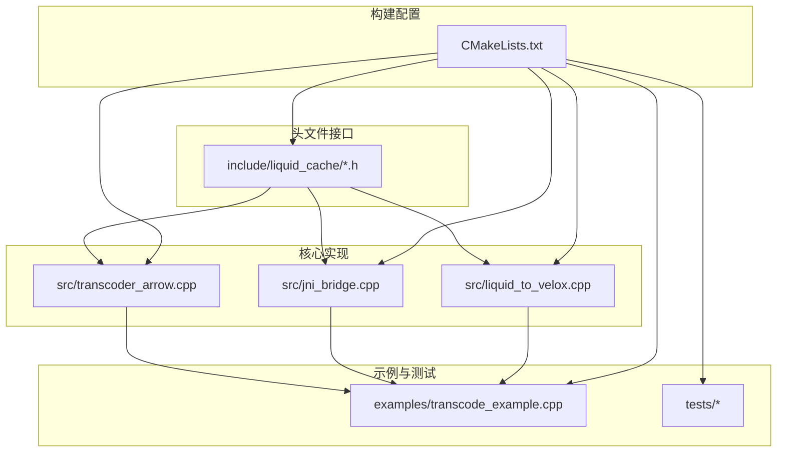
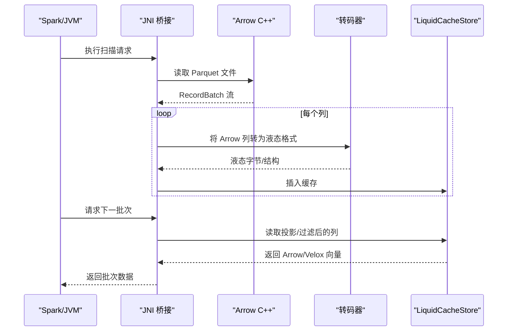
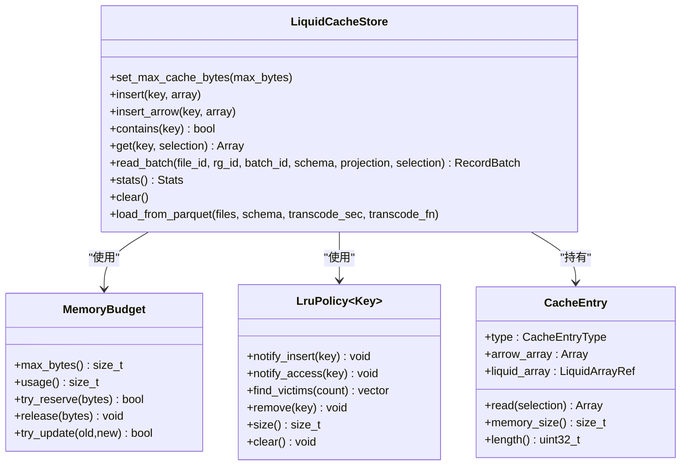
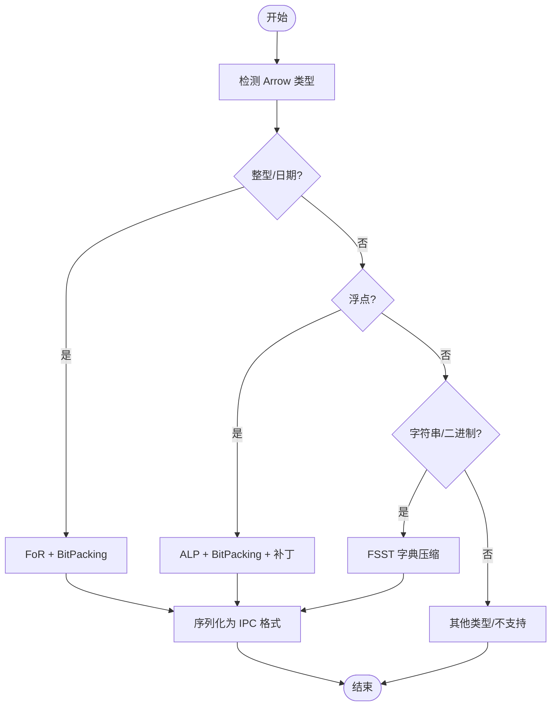
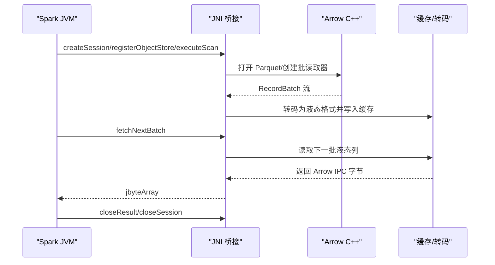
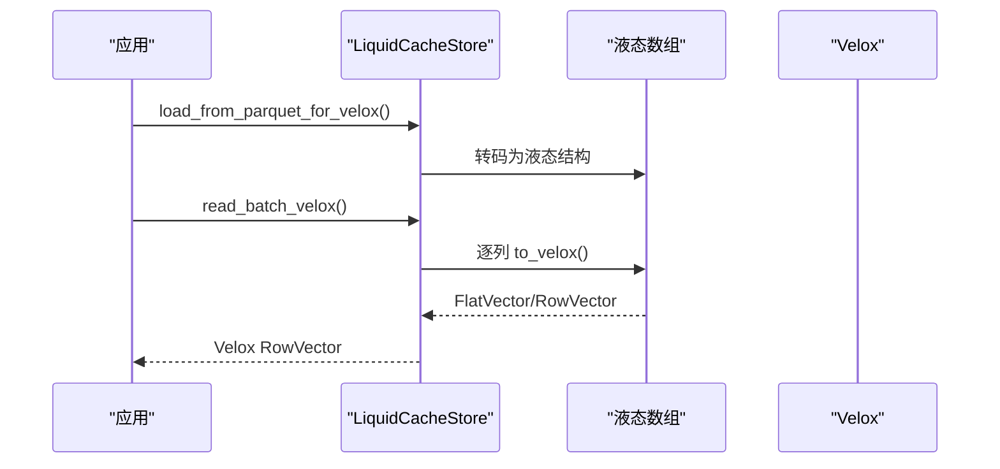
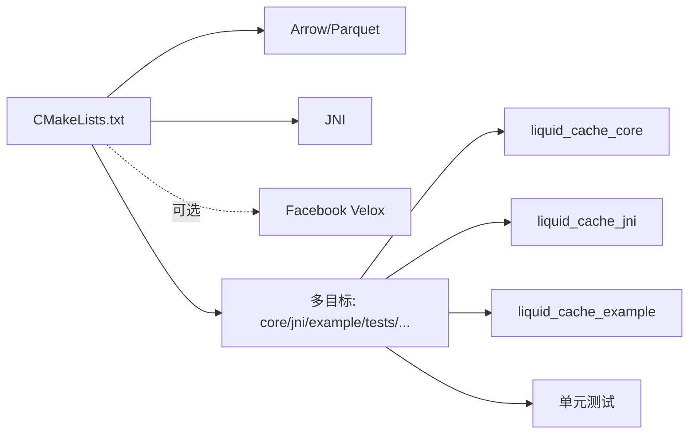

# 项目概述

<cite>
**本文档引用的文件**
- [README.md](file://README.md)
- [CMakeLists.txt](file://CMakeLists.txt)
- [liquid_cache_store.h](file://include/liquid_cache/liquid_cache_store.h)
- [lru_policy.h](file://include/liquid_cache/lru_policy.h)
- [transcoder.h](file://include/liquid_cache/transcoder.h)
- [liquid_array.h](file://include/liquid_cache/liquid_array.h)
- [transcoder_arrow.cpp](file://src/transcoder_arrow.cpp)
- [liquid_arrays.h](file://include/liquid_cache/liquid_arrays.h)
- [jni_bridge.h](file://include/liquid_cache/jni_bridge.h)
- [jni_bridge.cpp](file://src/jni_bridge.cpp)
- [liquid_to_velox.h](file://include/liquid_cache/liquid_to_velox.h)
- [liquid_to_velox.cpp](file://src/liquid_to_velox.cpp)
- [transcode_example.cpp](file://examples/transcode_example.cpp)
</cite>

## 目录
1. [简介](#简介)
2. [项目结构](#项目结构)
3. [核心组件](#核心组件)
4. [架构总览](#架构总览)
5. [详细组件分析](#详细组件分析)
6. [依赖关系分析](#依赖关系分析)
7. [性能考量](#性能考量)
8. [故障排查指南](#故障排查指南)
9. [结论](#结论)
10. [附录](#附录)

## 简介
liquid-cache-cpp 是一个高性能的数据缓存与转码库，专注于列式数据的内存缓存、零反序列化读取以及跨引擎兼容。其核心目标是通过将 Arrow 列式数据转码为内部的“液态”格式（Liquid），在内存中以结构体形式直接访问，从而实现更快的解码速度与更低的内存占用。项目支持：
- 零反序列化读取：缓存中的数组以原生结构直接访问，避免重复反序列化
- LRU 内存预算控制：基于原子计数的内存预算与 LRU 淘汰策略
- 多引擎兼容：提供 JNI 桥接以对接 Spark 生态；可选启用 Facebook Velox 集成
- 转码策略：整型/日期采用帧偏移 + 位打包（FoR + BitPacking）；浮点采用自适应无损浮点（ALP）编码；字符串/二进制采用 FSST 字典压缩等

设计理念强调“列式存储 + 内存缓存 + 零反序列化”的组合优势，并通过 C++20、CMake 构建系统、JNI 桥接等技术栈支撑高性能与跨语言互操作。

## 项目结构
仓库采用按功能域分层的组织方式：
- include/liquid_cache：公共头文件，定义缓存接口、转码器、数组抽象、类型映射等
- src：核心实现，包含转码器、JNI 桥接、Velox 转换等
- examples：示例程序，展示 Parquet 加载、转码、基准测试与正确性验证
- tests：单元测试与交叉验证（含与 Velox 的一致性测试）
- 工程构建：CMakeLists.txt 定义多目标（核心库、JNI 库、示例、测试），并支持可选的 Velox 集成

图表来源
- [CMakeLists.txt](file://CMakeLists.txt)
- [transcoder_arrow.cpp](file://src/transcoder_arrow.cpp)
- [jni_bridge.cpp](file://src/jni_bridge.cpp)
- [liquid_to_velox.cpp](file://src/liquid_to_velox.cpp)
- [transcode_example.cpp](file://examples/transcode_example.cpp)

章节来源
- [CMakeLists.txt](file://CMakeLists.txt)

## 核心组件
- 液态缓存存储（LiquidCacheStore）：以列为主、支持投影与过滤的内存缓存，键空间包含文件/行组/列/批标识，支持零反序列化读取与 LRU 淘汰
- 内存预算与 LRU 策略（MemoryBudget/LruPolicy）：线程安全的内存预算跟踪与 LRU 淘汰队列，保障缓存容量可控
- 转码器（Transcoder）：将 Arrow 数组转为液态格式（IPC 头 + 编码数据），支持原始缓冲区与 Arrow API 两种入口
- 液态数组抽象（LiquidArrayBase/LiquidArrayRef）：统一的多态接口，支持 Arrow 与可选的 Velox 直转
- JNI 桥接（JNI Bridge）：为 Spark 等 JVM 引擎提供本地方法桥接，实现 Parquet 扫描与批次传输
- Velox 集成（Liquid → Velox 直转）：在启用时，提供 Arrow Schema → Velox RowType 映射与各数组类型的直接向量转换

章节来源
- [liquid_cache_store.h](file://include/liquid_cache/liquid_cache_store.h)
- [lru_policy.h](file://include/liquid_cache/lru_policy.h)
- [transcoder.h](file://include/liquid_cache/transcoder.h)
- [liquid_array.h](file://include/liquid_cache/liquid_array.h)
- [jni_bridge.h](file://include/liquid_cache/jni_bridge.h)
- [liquid_to_velox.h](file://include/liquid_cache/liquid_to_velox.h)

## 架构总览
整体架构围绕“缓存 + 转码 + 多引擎桥接”展开，核心流程如下：
- Parquet 文件 → Arrow Reader → RecordBatch 流
- RecordBatch → 按列转码为液态格式 → 写入 LiquidCacheStore
- 查询阶段：根据投影与过滤条件从缓存读取 → 零反序列化解码 → 返回 Arrow/Velox 结果

图表来源
- [transcoder_arrow.cpp](file://src/transcoder_arrow.cpp)
- [jni_bridge.cpp](file://src/jni_bridge.cpp)
- [liquid_cache_store.h](file://include/liquid_cache/liquid_cache_store.h)

## 详细组件分析

### 液态缓存存储（LiquidCacheStore）
- 设计要点
  - 键空间：file_id/row_group_id/column_id/batch_id 组合键，便于精确缓存定位
  - 列式缓存：每列每批独立缓存，支持列投影与行过滤
  - 零反序列化读取：缓存项可直接返回 Arrow 或在启用 Velox 时直接生成 Velox 向量
  - 内存预算与 LRU：插入/更新时先确保预算空间，不足则触发 LRU 淘汰
- 关键能力
  - 单列/批量读取、统计查询、清空缓存、设置最大缓存大小
  - 可选加载 Parquet 并转码入库（支持 Arrow 与 Velox 两种模式）

图表来源
- [liquid_cache_store.h](file://include/liquid_cache/liquid_cache_store.h)
- [lru_policy.h](file://include/liquid_cache/lru_policy.h)

章节来源
- [liquid_cache_store.h](file://include/liquid_cache/liquid_cache_store.h)
- [lru_policy.h](file://include/liquid_cache/lru_policy.h)

### 转码器与液态数组（Transcoder + Liquid Arrays）
- 转码入口
  - Arrow API 入口：transcode_arrow_array()，按 Arrow 类型进行分派，生成液态字节或结构
  - 原始缓冲区入口：transcode_primitive()/transcode_float()，用于 JNI/Velox 直接调用
- 液态数组类型
  - 整型/日期：FoR + BitPacking
  - 浮点：ALP + BitPacking，带补丁表优化
  - 字符串/二进制：FSST 字典压缩（当前头文件声明，具体实现位于其他模块）
  - 线性整数：线性模型 + 残差（适合单调/近线性序列）
- 解码路径：decode_liquid_array() 依据 IPC 头进行类型分派，重建 Arrow 数组

图表来源
- [transcoder.h](file://include/liquid_cache/transcoder.h)
- [transcoder_arrow.cpp](file://src/transcoder_arrow.cpp)
- [liquid_arrays.h](file://include/liquid_cache/liquid_arrays.h)

章节来源
- [transcoder.h](file://include/liquid_cache/transcoder.h)
- [transcoder_arrow.cpp](file://src/transcoder_arrow.cpp)
- [liquid_arrays.h](file://include/liquid_cache/liquid_arrays.h)

### JNI 桥接（Spark 集成）
- 目标：为 Spark 提供与 Rust JNI 层一致的本地方法接口，实现 Parquet 扫描、批次传输与结果管理
- 数据流：JVM 调用本地方法 → 读取 Parquet → 转码为液态 → 序列化为 Arrow IPC → 返回给 JVM
- 会话与结果句柄：全局线程安全存储，分配递增句柄，支持并发访问

图表来源
- [jni_bridge.h](file://include/liquid_cache/jni_bridge.h)
- [jni_bridge.cpp](file://src/jni_bridge.cpp)

章节来源
- [jni_bridge.h](file://include/liquid_cache/jni_bridge.h)
- [jni_bridge.cpp](file://src/jni_bridge.cpp)

### Velox 集成（可选）
- 目标：在启用时，将 Arrow Schema 映射为 Velox RowType，并提供液态数组到 Velox 向量的直接转换
- 关键能力
  - Arrow Schema → Velox RowType
  - 各类型数组的 to_velox() 实现（整型/日期/时间戳、浮点、线性整数、字节视图、十进制等）
  - 缓存读取直接输出 Velox RowVector，避免中间 Arrow 对象

图表来源
- [liquid_to_velox.h](file://include/liquid_cache/liquid_to_velox.h)
- [liquid_to_velox.cpp](file://src/liquid_to_velox.cpp)
- [transcoder_arrow.cpp](file://src/transcoder_arrow.cpp)

章节来源
- [liquid_to_velox.h](file://include/liquid_cache/liquid_to_velox.h)
- [liquid_to_velox.cpp](file://src/liquid_to_velox.cpp)

### 示例程序（基准与正确性）
- 功能：加载 Parquet → 转码入库 → 基准对比（Parquet vs CacheStore）→ 正确性验证（Arrow ↔ 液态 ↔ Arrow）
- 场景：单列/多列投影、全表扫描、不同列类型覆盖
- 输出：统计缓存条目、内存占用、转码耗时、加速比等

章节来源
- [transcode_example.cpp](file://examples/transcode_example.cpp)

## 依赖关系分析
- 构建系统（CMake）
  - 必需依赖：Arrow、Parquet、JNI
  - 可选依赖：Velox（通过选项开启），并替换 Arrow 版本以保证 ABI 兼容
  - 静态链接策略：优先使用 .a 静态库，必要时回退动态库，确保最终二进制无外部共享库依赖
- 运行时依赖
  - Arrow/Parquet：用于 Parquet 读取与 Arrow 数组处理
  - JNI：用于 JVM 互操作
  - Velox（可选）：用于直接生成 Velox 向量

图表来源
- [CMakeLists.txt](file://CMakeLists.txt)

章节来源
- [CMakeLists.txt](file://CMakeLists.txt)

## 性能考量
- 零反序列化读取：缓存中直接持有原生结构，避免重复反序列化，显著降低 CPU 开销
- LRU + 内存预算：通过原子计数预留与释放，减少锁竞争；LRU 淘汰按最近最少使用顺序进行
- 编码策略：FoR + BitPacking 与 ALP 在高熵数据上仍能获得良好压缩比；字符串/二进制采用 FSST 字典压缩
- 并发与锁：缓存读写使用互斥锁保护；预算与 LRU 使用细粒度锁，尽量减少阻塞
- JNI/IPC：示例中采用 Arrow IPC 流式序列化，便于与现有 JVM 代码兼容

## 故障排查指南
- 初始化失败（Arrow 计算模块）
  - 现象：示例程序初始化 Arrow 计算模块失败
  - 排查：确认 Arrow/Parquet 静态库安装完整，且与系统库版本匹配
- Velox 集成问题
  - 现象：启用 LIQUID_ENABLE_VELOX 后链接失败或运行时崩溃
  - 排查：确保 VELOX_PREFIX 指向正确的构建目录；检查 ABI 兼容性与编译标志一致性
- JNI 方法签名不匹配
  - 现象：JVM 调用本地方法抛出 UnsatisfiedLinkError
  - 排查：核对本地方法签名与头文件声明一致；确认生成的共享库已加载
- 缓存命中率低
  - 现象：内存占用高但性能提升有限
  - 排查：检查列投影是否合理；确认键空间设计（file_id/rg_id/col_id/batch_id）是否与实际数据分布匹配

章节来源
- [transcode_example.cpp](file://examples/transcode_example.cpp)
- [CMakeLists.txt](file://CMakeLists.txt)

## 结论
liquid-cache-cpp 通过“液态”转码与内存缓存，结合零反序列化读取与 LRU 内存预算控制，在列式数据场景下实现了高性能与低内存占用。其多引擎兼容设计（JNI/Velox）使其能够无缝融入 Spark 与 Velox 生态。对于初学者，建议从示例程序入手，理解列式存储、转码与缓存的基本概念；对于有经验的开发者，可深入研究转码算法、内存预算与并发控制细节，以进一步优化性能与稳定性。

## 附录
- 技术栈概览
  - 语言与标准：C++20
  - 构建系统：CMake
  - 依赖管理：FindPkg、FetchContent（测试）
  - 引擎集成：JNI（Spark）、可选 Velox
  - 第三方库：Arrow、Parquet、JNI、可选 Velox