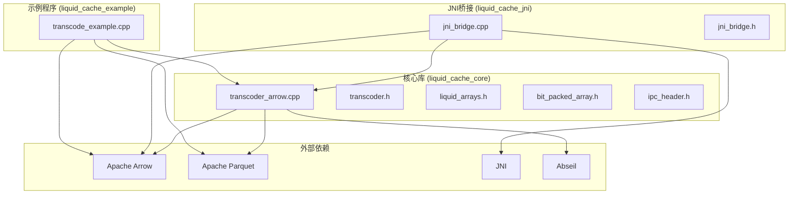
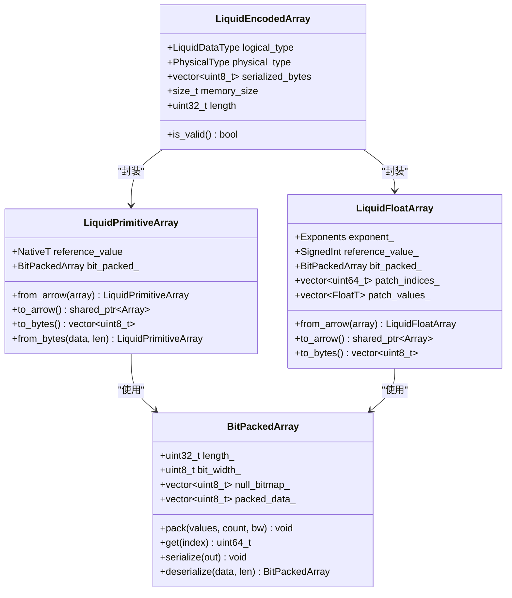
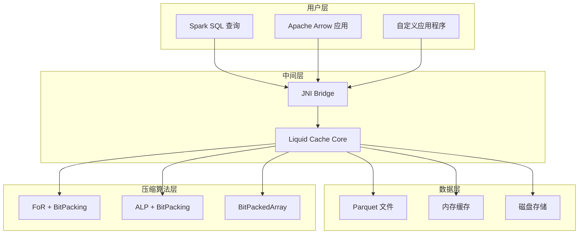
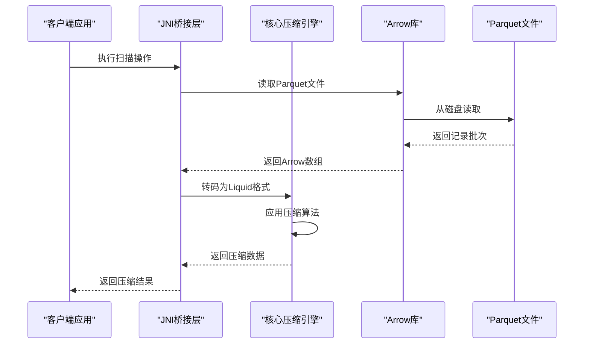
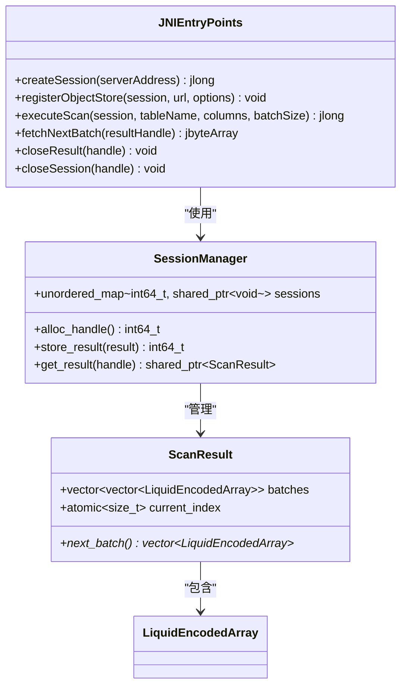
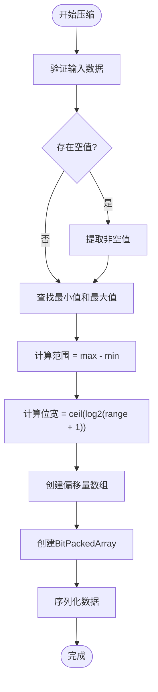
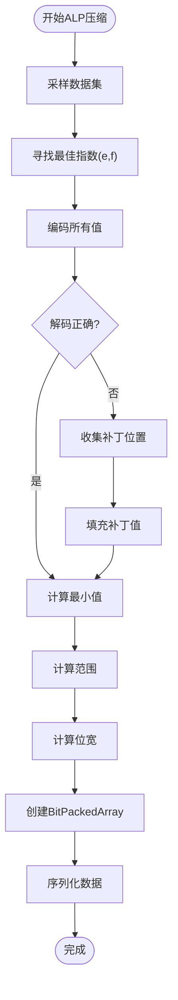
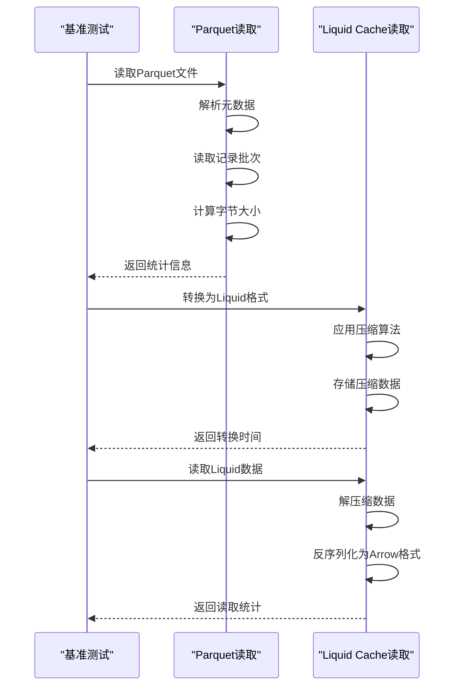

# 项目概述

<cite>
**本文档引用的文件**
- [CMakeLists.txt](file://CMakeLists.txt)
- [transcoder.h](file://include/liquid_cache/transcoder.h)
- [jni_bridge.h](file://include/liquid_cache/jni_bridge.h)
- [jni_bridge.cpp](file://src/jni_bridge.cpp)
- [transcoder_arrow.cpp](file://src/transcoder_arrow.cpp)
- [bit_packed_array.h](file://include/liquid_cache/bit_packed_array.h)
- [ipc_header.h](file://include/liquid_cache/ipc_header.h)
- [liquid_arrays.h](file://include/liquid_cache/liquid_arrays.h)
- [transcode_example.cpp](file://examples/transcode_example.cpp)
- [debug.txt](file://debug.txt)
</cite>

## 目录
1. [项目简介](#项目简介)
2. [项目结构](#项目结构)
3. [核心组件](#核心组件)
4. [架构概览](#架构概览)
5. [详细组件分析](#详细组件分析)
6. [依赖关系分析](#依赖关系分析)
7. [性能考虑](#性能考虑)
8. [故障排除指南](#故障排除指南)
9. [结论](#结论)

## 项目简介

Liquid Cache C++ 是一个高性能的数据压缩和编码库，专注于为 Apache Arrow 生态系统提供高效的列式数据存储格式。该项目的核心目标是通过创新的压缩算法和内存布局优化，显著减少大规模数据分析工作负载中的存储空间占用和I/O开销。

### 核心价值主张

- **二进制兼容性**：与 Rust 版本完全兼容，确保跨语言的一致性
- **高性能压缩**：针对数值型数据的专门优化，提供卓越的压缩比
- **现代C++20技术栈**：充分利用最新的C++标准特性
- **多平台支持**：原生支持Linux、Windows和macOS
- **Spark集成**：通过JNI桥接直接支持Apache Spark生态系统

## 项目结构

项目采用清晰的模块化组织结构，将不同功能职责分离到独立的组件中：



**图表来源**
- [CMakeLists.txt:80-127](file://CMakeLists.txt#L80-L127)
- [transcoder_arrow.cpp:1-286](file://src/transcoder_arrow.cpp#L1-L286)

### 文件组织策略

项目遵循"按功能分层"的设计原则：
- **include/**: 公共头文件，定义接口和数据结构
- **src/**: 实现文件，包含核心逻辑和JNI桥接
- **examples/**: 示例程序，展示使用方法和性能基准测试
- **build/**: 构建产物目录

**章节来源**
- [CMakeLists.txt:1-127](file://CMakeLists.txt#L1-L127)

## 核心组件

### 数据压缩引擎

Liquid Cache 的核心在于其创新的压缩算法组合：

1. **Frame-of-Reference (FoR) + BitPacking**：用于整数和日期类型
2. **ALP (Adaptive Lossless Floating-Point)**：用于浮点数的无损压缩
3. **BitPackedArray**：高效的位打包存储结构

### 编码器架构



**图表来源**
- [transcoder.h:23-34](file://include/liquid_cache/transcoder.h#L23-L34)
- [liquid_arrays.h:91-227](file://include/liquid_cache/liquid_arrays.h#L91-L227)
- [bit_packed_array.h:28-173](file://include/liquid_cache/bit_packed_array.h#L28-L173)

**章节来源**
- [transcoder.h:78-342](file://include/liquid_cache/transcoder.h#L78-L342)
- [liquid_arrays.h:77-577](file://include/liquid_cache/liquid_arrays.h#L77-L577)

## 架构概览

### 系统架构图



**图表来源**
- [jni_bridge.cpp:10-16](file://src/jni_bridge.cpp#L10-L16)
- [transcoder_arrow.cpp:26-209](file://src/transcoder_arrow.cpp#L26-L209)

### 数据流处理



**图表来源**
- [jni_bridge.cpp:51-126](file://src/jni_bridge.cpp#L51-L126)
- [transcoder_arrow.cpp:36-209](file://src/transcoder_arrow.cpp#L36-L209)

## 详细组件分析

### JNI桥接层

JNI桥接层提供了与Java虚拟机的无缝集成，支持Apache Spark等大数据框架的直接调用。

#### 关键特性

- **会话管理**：线程安全的会话和结果句柄管理
- **类型映射**：完整的Arrow类型到Java类型的转换
- **内存管理**：自动化的内存分配和释放
- **错误处理**：统一的异常处理机制



**图表来源**
- [jni_bridge.h:42-93](file://include/liquid_cache/jni_bridge.h#L42-L93)
- [jni_bridge.h:176-216](file://include/liquid_cache/jni_bridge.h#L176-L216)

**章节来源**
- [jni_bridge.h:22-161](file://include/liquid_cache/jni_bridge.h#L22-L161)
- [jni_bridge.cpp:176-320](file://src/jni_bridge.cpp#L176-L320)

### 压缩算法实现

#### Frame-of-Reference + BitPacking算法

该算法特别适用于整数和日期数据的高效压缩：



**图表来源**
- [transcoder.h:106-156](file://include/liquid_cache/transcoder.h#L106-L156)
- [liquid_arrays.h:126-161](file://include/liquid_cache/liquid_arrays.h#L126-L161)

#### ALP (Adaptive Lossless Floating-Point)算法

ALP算法为浮点数提供无损压缩，通过动态选择最佳指数和小数位数：



**图表来源**
- [transcoder.h:237-342](file://include/liquid_cache/transcoder.h#L237-L342)
- [liquid_arrays.h:364-430](file://include/liquid_cache/liquid_arrays.h#L364-L430)

**章节来源**
- [transcoder.h:78-342](file://include/liquid_cache/transcoder.h#L78-L342)
- [liquid_arrays.h:237-577](file://include/liquid_cache/liquid_arrays.h#L237-L577)

### 性能基准测试

项目内置了完整的性能测试框架，支持与传统Parquet格式的对比：

#### 基准测试流程



**图表来源**
- [transcode_example.cpp:559-733](file://examples/transcode_example.cpp#L559-L733)

**章节来源**
- [transcode_example.cpp:515-733](file://examples/transcode_example.cpp#L515-L733)

## 依赖关系分析

### 外部依赖管理

项目使用CMake进行依赖管理，确保构建过程的可重复性和一致性：

```mermaid
graph TB
subgraph "构建系统"
A[CMake 3.16+]
B[C++20标准]
C[静态链接策略]
end
subgraph "核心依赖"
D[Apache Arrow 24.0.0]
E[Apache Parquet 24.0.0]
F[JNI (Java Native Interface)]
end
subgraph "运行时依赖"
G[Abseil C++ Libraries]
H[OpenSSL]
I[Brotli/Zlib/LZ4]
J[Protobuf/CURL/Thrift]
end
subgraph "系统库"
K[Threads]
L[dl/rt]
M[zstd/re2/bz2/utf8proc]
end
A --> D
A --> E
A --> F
D --> G
D --> H
D --> I
D --> J
E --> G
E --> H
E --> I
E --> J
F --> K
F --> L
F --> M
```

**图表来源**
- [CMakeLists.txt:8-78](file://CMakeLists.txt#L8-L78)
- [debug.txt:17-118](file://debug.txt#L17-L118)

### 依赖解析策略

项目采用了"静态链接优先"的策略，通过以下方式确保部署的独立性：

1. **静态库链接**：优先使用`.a`静态库文件
2. **系统依赖剥离**：通过`--whole-archive`链接捆绑依赖
3. **Abseil配置**：支持静态安装路径配置
4. **版本锁定**：明确指定Arrow和Parquet版本

**章节来源**
- [CMakeLists.txt:14-78](file://CMakeLists.txt#L14-L78)
- [debug.txt:17-118](file://debug.txt#L17-L118)

## 性能考虑

### 内存优化策略

1. **零拷贝设计**：尽可能避免不必要的数据复制
2. **批量处理**：利用Arrow的批处理能力提高效率
3. **内存对齐**：8字节对齐优化缓存性能
4. **位打包**：最大化存储密度

### 并发安全性

- **原子操作**：使用`std::atomic`确保句柄分配的线程安全
- **互斥锁**：保护全局状态的访问
- **智能指针**：自动内存管理，防止资源泄漏

### 编译时优化

- **C++20特性**：利用现代C++的性能优势
- **内联函数**：关键路径上的函数内联
- **编译器优化**：启用适当的优化级别

## 故障排除指南

### 常见构建问题

1. **依赖未找到**：检查`CMAKE_PREFIX_PATH`环境变量
2. **静态库链接失败**：确认`.a`文件的存在和完整性
3. **JNI路径问题**：验证Java开发工具包的安装

### 运行时问题诊断

1. **内存不足**：检查`memory_size`字段的估算准确性
2. **类型不匹配**：验证Arrow类型到物理类型的映射
3. **压缩率异常**：检查数据分布和算法适用性

**章节来源**
- [debug.txt:121-186](file://debug.txt#L121-L186)

## 结论

Liquid Cache C++ 项目代表了现代数据压缩技术的先进实践，通过精心设计的算法和架构，在保持数据完整性的前提下实现了卓越的压缩效果。项目的主要优势包括：

### 技术优势

- **算法创新**：FoR+BitPacking和ALP算法的有机结合
- **架构优雅**：清晰的模块化设计和良好的抽象层次
- **性能卓越**：针对大数据场景的专门优化
- **兼容性强**：与Arrow生态系统的无缝集成

### 应用前景

该项目特别适合以下应用场景：
- **大规模数据分析**：减少存储成本和I/O开销
- **实时查询系统**：快速的数据访问和处理
- **云原生应用**：高效的云端数据存储
- **机器学习管道**：优化特征数据的存储和传输

通过持续的技术演进和社区贡献，Liquid Cache C++ 有望成为大数据压缩领域的重要标准之一。