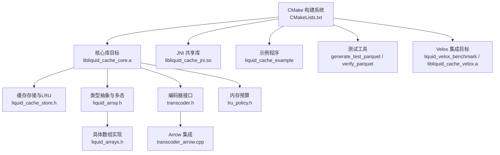
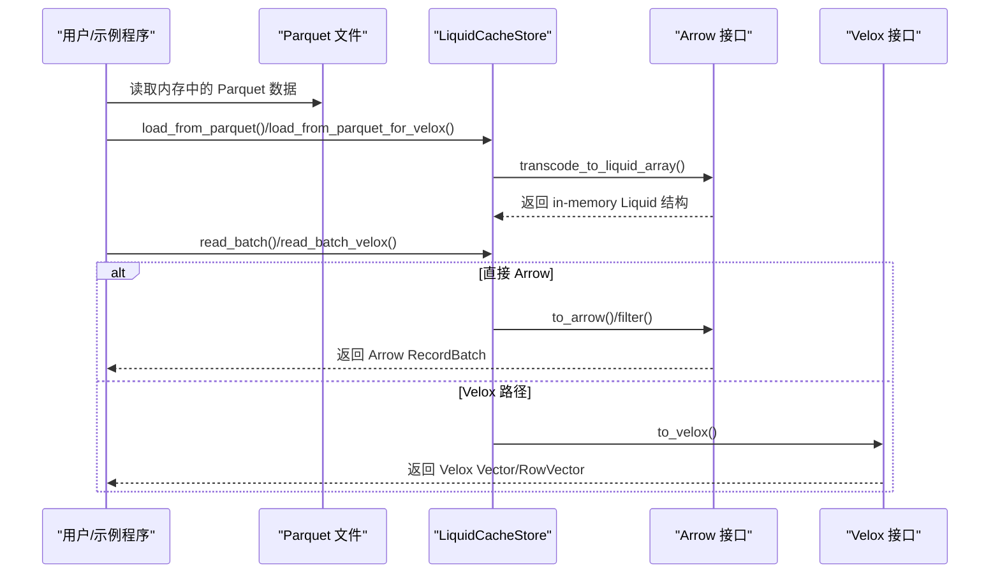
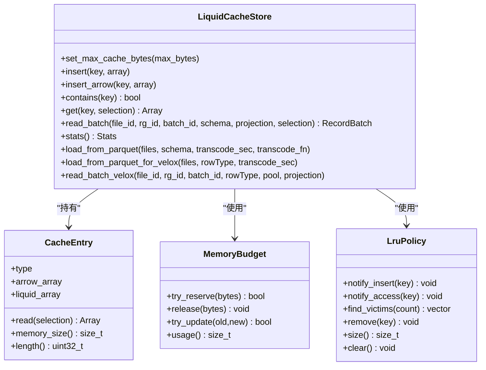
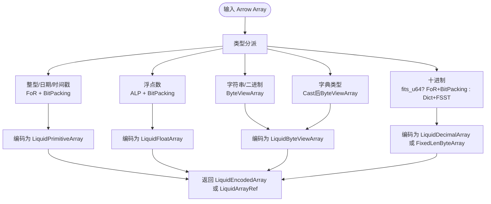
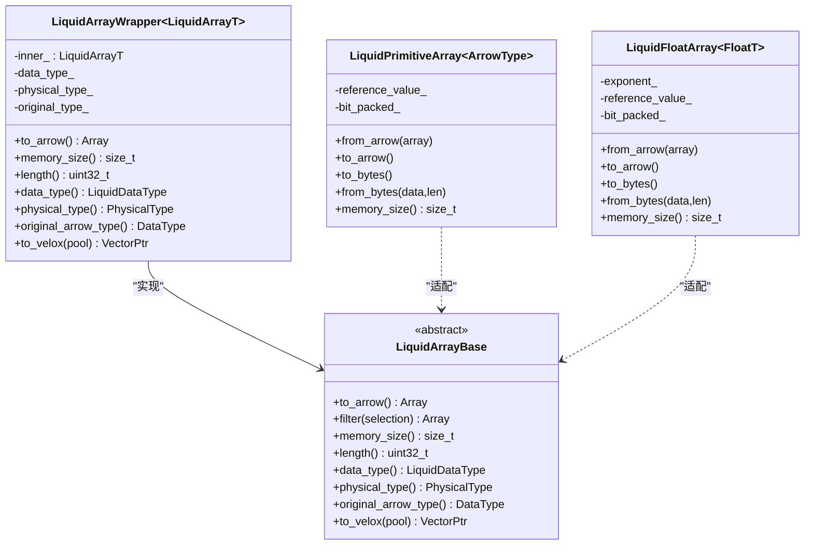
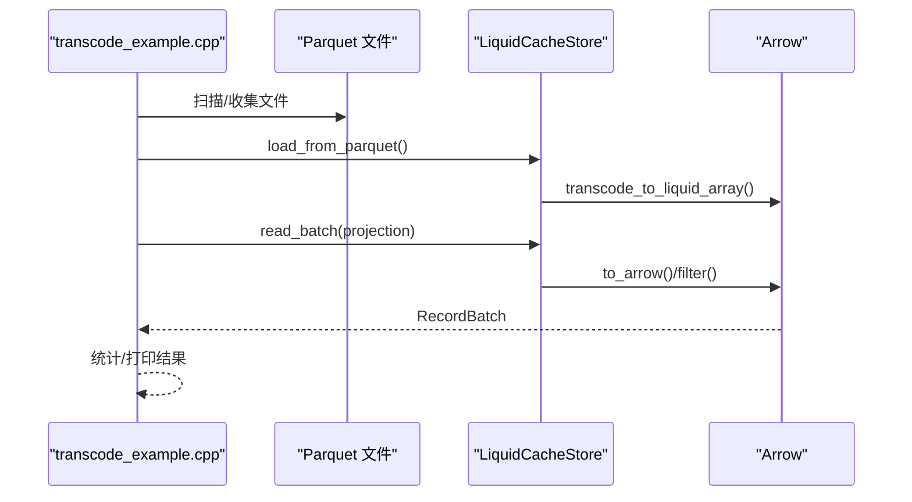
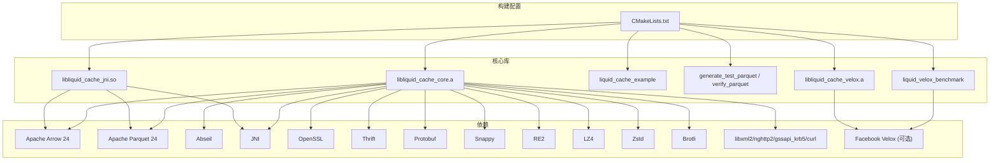

# 英文README文档

<cite>
**本文引用的文件**
- [README_EN.md](file://README_EN.md)
- [CMakeLists.txt](file://CMakeLists.txt)
- [liquid_cache_store.h](file://include/liquid_cache/liquid_cache_store.h)
- [transcoder.h](file://include/liquid_cache/transcoder.h)
- [transcoder_arrow.cpp](file://src/transcoder_arrow.cpp)
- [liquid_array.h](file://include/liquid_cache/liquid_array.h)
- [lru_policy.h](file://include/liquid_cache/lru_policy.h)
- [liquid_arrays.h](file://include/liquid_cache/liquid_arrays.h)
- [transcode_example.cpp](file://examples/transcode_example.cpp)
- [velox_benchmark.cpp](file://examples/velox_benchmark.cpp)
</cite>

## 目录
1. [简介](#简介)
2. [项目结构](#项目结构)
3. [核心组件](#核心组件)
4. [架构总览](#架构总览)
5. [详细组件分析](#详细组件分析)
6. [依赖关系分析](#依赖关系分析)
7. [性能考量](#性能考量)
8. [故障排查指南](#故障排查指南)
9. [结论](#结论)
10. [附录](#附录)

## 简介
Liquid Cache C++ 是一个高性能的列式内存数据缓存与编码/压缩库，支持高效的 Parquet 数据编解码，并可选集成 Facebook Velox 向量引擎。它提供零反序列化读取、列投影、行过滤、内存预算控制与 LRU 淘汰策略，适用于需要在内存中以压缩结构存储列数据并快速解码为 Arrow 或 Velox 向量的应用场景。

## 项目结构
仓库采用按功能分层的组织方式：公共头文件位于 include/liquid_cache，实现位于 src，示例程序位于 examples，测试工具位于 tools，自动化脚本位于 scripts，单元测试位于 tests。顶层 CMakeLists.txt 驱动构建流程，支持可选的 Velox 集成与测试目标。

**图表来源**
- [CMakeLists.txt:184-247](file://CMakeLists.txt#L184-L247)
- [liquid_cache_store.h:188-524](file://include/liquid_cache/liquid_cache_store.h#L188-L524)
- [liquid_array.h:29-85](file://include/liquid_cache/liquid_array.h#L29-L85)
- [transcoder.h:1-360](file://include/liquid_cache/transcoder.h#L1-L360)
- [lru_policy.h:30-96](file://include/liquid_cache/lru_policy.h#L30-L96)
- [liquid_arrays.h:104-264](file://include/liquid_cache/liquid_arrays.h#L104-L264)
- [transcoder_arrow.cpp:44-351](file://src/transcoder_arrow.cpp#L44-L351)

**章节来源**
- [README_EN.md:5-39](file://README_EN.md#L5-L39)
- [CMakeLists.txt:1-565](file://CMakeLists.txt#L1-L565)

## 核心组件
- 编码/解码接口：提供从 Arrow 数组到 Liquid 编码格式的转换以及反向解码能力，覆盖整型/日期/时间戳、浮点数、字符串/二进制、字典/FSST 压缩等类型。
- 内存缓存存储：以列为主的数据结构，支持列投影、行过滤、内存预算与 LRU 淘汰，键空间包含文件/行组/列/批次标识。
- 类型抽象与多态：通过 LiquidArrayBase 抽象统一不同数组类型的 to_arrow/filter/memory_size 等操作，便于缓存存储持有异构数组而无需序列化。
- 内存预算与 LRU：MemoryBudget 提供无锁原子预留/释放；LruPolicy 使用双向链表+哈希表维护最近最少使用顺序。
- Velox 集成：可选将 Liquid 编码直接解码为 Velox 向量，或通过 Arrow 中间层进行转换。

**章节来源**
- [transcoder.h:17-360](file://include/liquid_cache/transcoder.h#L17-L360)
- [transcoder_arrow.cpp:44-351](file://src/transcoder_arrow.cpp#L44-L351)
- [liquid_cache_store.h:188-524](file://include/liquid_cache/liquid_cache_store.h#L188-L524)
- [liquid_array.h:29-85](file://include/liquid_cache/liquid_array.h#L29-L85)
- [lru_policy.h:30-96](file://include/liquid_cache/lru_policy.h#L30-L96)

## 架构总览
下图展示了从 Parquet 文件加载到内存缓存，再到 Arrow/Velox 的整体路径，以及可选的 Velox 路径对比。

**图表来源**
- [transcoder_arrow.cpp:664-743](file://src/transcoder_arrow.cpp#L664-L743)
- [liquid_cache_store.h:311-356](file://include/liquid_cache/liquid_cache_store.h#L311-L356)
- [liquid_array.h:42-84](file://include/liquid_cache/liquid_array.h#L42-L84)
- [velox_benchmark.cpp:420-592](file://examples/velox_benchmark.cpp#L420-L592)

## 详细组件分析

### 组件A：LiquidCacheStore（列式缓存与读取）
- 键空间设计：使用 64 位打包键，包含文件/行组/列/批次 ID，便于快速比较与哈希。
- 插入与更新：支持插入 Liquid 结构或 Arrow 原始数组，自动计算内存大小并尝试保留预算；更新时若容量扩大则先腾挪空间。
- 读取路径：单键读取、批量读取（列投影）与行过滤；返回 Arrow RecordBatch 或 Velox RowVector。
- 统计信息：记录条目数量、内存占用、液态/箭头态分布、预算使用情况。
- Velox 集成：提供 load_from_parquet_for_velox 与 read_batch_velox，直接输出 Velox RowType/Vector。

**图表来源**
- [liquid_cache_store.h:48-524](file://include/liquid_cache/liquid_cache_store.h#L48-L524)
- [lru_policy.h:30-188](file://include/liquid_cache/lru_policy.h#L30-L188)

**章节来源**
- [liquid_cache_store.h:188-524](file://include/liquid_cache/liquid_cache_store.h#L188-L524)
- [lru_policy.h:30-188](file://include/liquid_cache/lru_policy.h#L30-L188)

### 组件B：Transcoder（编码/解码接口）
- 类型映射：将 Arrow 数据类型映射到物理类型，用于 IPC 头部与序列化布局。
- 原始缓冲区接口：提供基于原生指针的整型/浮点编码函数，适合 JNI/Velox 直接调用。
- Arrow 集成接口：根据 Arrow 数组类型分派到具体数组实现（整型/日期/时间戳、浮点、字符串/二进制、字典、十进制等），并支持反向解码。
- 优化路径：整型/日期使用帧偏移+位打包；浮点使用自适应无损浮点编码（ALP）+位打包；字符串/二进制使用字节视图与字典/FSST 压缩。

**图表来源**
- [transcoder.h:39-342](file://include/liquid_cache/transcoder.h#L39-L342)
- [transcoder_arrow.cpp:44-351](file://src/transcoder_arrow.cpp#L44-L351)

**章节来源**
- [transcoder.h:17-360](file://include/liquid_cache/transcoder.h#L17-L360)
- [transcoder_arrow.cpp:44-351](file://src/transcoder_arrow.cpp#L44-L351)

### 组件C：LiquidArrayBase 与具体数组实现
- 抽象基类：定义 to_arrow/filter/memory_size/length/data_type/physical_type/original_arrow_type 等统一接口，支持可选的 Velox 直解。
- 包装器：LiquidArrayWrapper 将具体数组类型适配为抽象基类，处理原始 Arrow 类型与内部存储类型不一致的情况（如时间戳存储为 Int64）。
- 具体实现：LiquidPrimitiveArray（整型/日期）、LiquidFloatArray（浮点）、LiquidByteViewArray（字符串/二进制）、LiquidDecimalArray（十进制）、LinearIntegerArray（线性模型）等。

**图表来源**
- [liquid_array.h:29-156](file://include/liquid_cache/liquid_array.h#L29-L156)
- [liquid_arrays.h:104-264](file://include/liquid_cache/liquid_arrays.h#L104-L264)
- [liquid_arrays.h:695-800](file://include/liquid_cache/liquid_arrays.h#L695-L800)

**章节来源**
- [liquid_array.h:29-156](file://include/liquid_cache/liquid_array.h#L29-L156)
- [liquid_arrays.h:104-264](file://include/liquid_cache/liquid_arrays.h#L104-L264)
- [liquid_arrays.h:695-800](file://include/liquid_cache/liquid_arrays.h#L695-L800)

### 组件D：示例与基准测试
- 示例程序：展示如何将 Parquet 加载到缓存、执行往返正确性验证、以及与直接读取 Parquet 的性能对比。
- Velox 基准：对比 Velox Parquet Reader 与 Liquid Cache 到 Velox Vector 的性能，统计均值、中位数、标准差、百分位与置信区间，并给出吞吐估计。

**图表来源**
- [transcode_example.cpp:364-489](file://examples/transcode_example.cpp#L364-L489)

**章节来源**
- [transcode_example.cpp:1-550](file://examples/transcode_example.cpp#L1-L550)
- [velox_benchmark.cpp:420-592](file://examples/velox_benchmark.cpp#L420-L592)

## 依赖关系分析
- 构建系统：CMakeLists.txt 定义主构建配置，支持可选 Velox 集成；在启用 Velox 时统一使用其内置 Arrow 18 以保证 ABI 兼容。
- 第三方依赖：Apache Arrow 24、Parquet 24、Abseil、JNI、OpenSSL、Thrift、Protobuf、Snappy、RE2、LZ4、Zstd、Brotli、libxml2、nghttp2、gssapi_krb5、curl 等；可选 Velox 依赖包括 Folly、fmt、simdjson、DuckDB、Boost、glog/gflags、double-conversion、libevent、libsodium、libunwind、ICU 等。
- 链接策略：对 Arrow 静态库使用全归档包装以避免丢弃带静态初始化器的模块；JNI 共享库使用动态依赖以规避 -fPIC 限制。

**图表来源**
- [CMakeLists.txt:15-179](file://CMakeLists.txt#L15-L179)
- [CMakeLists.txt:287-432](file://CMakeLists.txt#L287-L432)

**章节来源**
- [CMakeLists.txt:1-565](file://CMakeLists.txt#L1-L565)

## 性能考量
- 编码策略：整型/日期采用帧偏移+位打包；浮点采用 ALP+位打包；字符串/二进制采用字节视图与字典/FSST 压缩；十进制在范围允许时使用整型编码。
- 内存管理：使用无锁原子预留/释放预算，结合 LRU 淘汰，确保缓存命中率与内存上限可控。
- 解码路径：缓存存储持有 in-memory Liquid 结构，读取时可直接解码为 Arrow 或 Velox，避免中间序列化开销。
- 基准测试：示例程序与 Velox 基准提供多场景对比，包括单列、多列混合与全表扫描，统计均值、中位数、标准差、百分位与吞吐。

[本节为通用指导，不直接分析具体文件]

## 故障排查指南
- 链接错误“未找到 min_max”：确保对 Arrow 静态库使用全归档包装，以保留静态初始化器注册的内核。
- Velox 集成 ABI 不兼容：系统 Arrow 24 与 Velox 内置 Arrow 18 不兼容，启用 Velox 时需统一使用其内置依赖并设置编译标志。
- JNI 动态库构建失败：系统静态库通常未启用 -fPIC，JNI 共享库应使用动态依赖；必要时检查依赖分析与符号导出。
- absl 符号缺失：若系统 Arrow 使用特定 ABI 命名空间（如 debian3），请勿手动指定静态 absl 路径，让构建系统自动选择匹配的版本。
- generate_test_parquet 默认输出路径：默认输出路径硬编码于工具中，可通过命令行参数覆盖。

**章节来源**
- [README_EN.md:670-705](file://README_EN.md#L670-L705)
- [CMakeLists.txt:158-179](file://CMakeLists.txt#L158-L179)
- [CMakeLists.txt:287-432](file://CMakeLists.txt#L287-L432)

## 结论
Liquid Cache C++ 提供了面向列式内存缓存的高效编码/解码方案，结合 Arrow 与可选 Velox，实现了从 Parquet 到内存结构再到查询引擎的低开销数据通路。通过内存预算与 LRU 控制、类型抽象与多态、以及完善的基准测试工具，该库适合需要高性能列式数据处理与分析的场景。

[本节为总结性内容，不直接分析具体文件]

## 附录
- 自动化脚本：提供测试数据生成、Velox 基准构建、JNI 库构建与完整测试运行的便捷脚本，支持干跑、并行编译与构建目录定制。
- 示例与工具：示例程序演示往返正确性验证与性能对比；工具用于生成测试数据与校验 Parquet 文件完整性。
- 测试套件：包含核心往返测试、Velox 交叉验证、线性整数编码测试、浮点量化测试与缓存预算/LRU 测试。

**章节来源**
- [README_EN.md:41-283](file://README_EN.md#L41-L283)
- [README_EN.md:312-315](file://README_EN.md#L312-L315)
- [README_EN.md:437-561](file://README_EN.md#L437-L561)