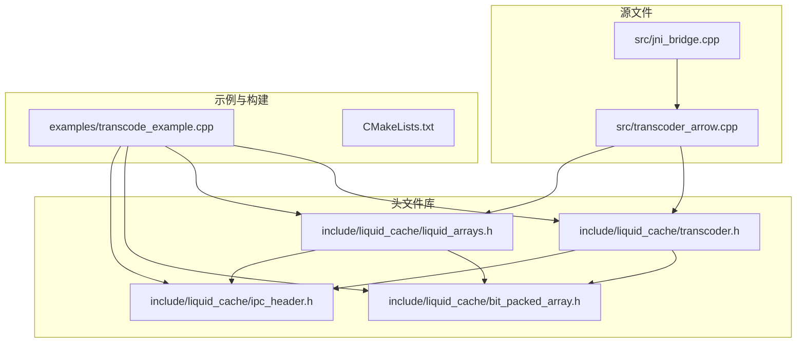
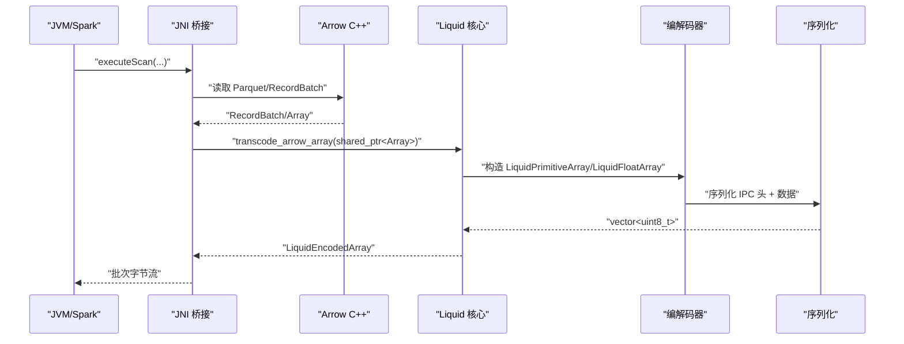
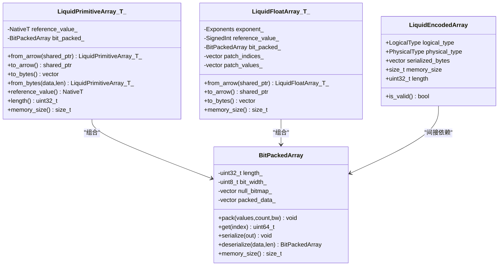
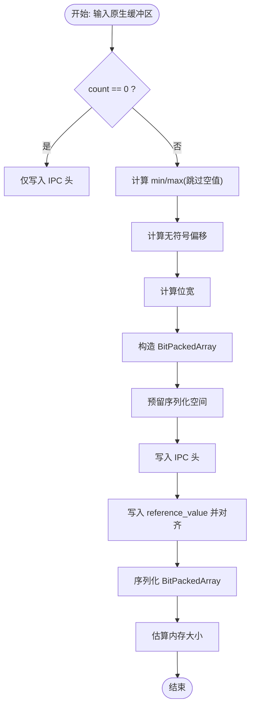
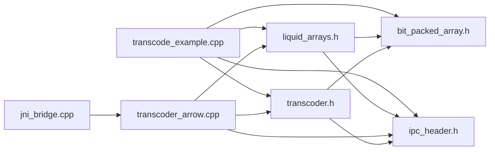

# 内存管理策略

<cite>
**本文档引用的文件**
- [transcoder.h](file://include/liquid_cache/transcoder.h)
- [transcoder_arrow.cpp](file://src/transcoder_arrow.cpp)
- [liquid_arrays.h](file://include/liquid_cache/liquid_arrays.h)
- [bit_packed_array.h](file://include/liquid_cache/bit_packed_array.h)
- [ipc_header.h](file://include/liquid_cache/ipc_header.h)
- [jni_bridge.cpp](file://src/jni_bridge.cpp)
- [transcode_example.cpp](file://examples/transcode_example.cpp)
- [CMakeLists.txt](file://CMakeLists.txt)
</cite>

## 目录
1. [简介](#简介)
2. [项目结构](#项目结构)
3. [核心组件](#核心组件)
4. [架构总览](#架构总览)
5. [详细组件分析](#详细组件分析)
6. [依赖关系分析](#依赖关系分析)
7. [性能考量](#性能考量)
8. [故障排查指南](#故障排查指南)
9. [结论](#结论)
10. [附录](#附录)

## 简介
本文件聚焦于 Liquid Cache C++ 实现中的内存管理策略与优化技术，围绕以下主题展开：
- 智能指针使用模式：std::unique_ptr、std::shared_ptr 的职责边界与生命周期管理
- 零拷贝优化：通过引用传递与就地序列化减少不必要的数据复制
- 内存池与批量分配：vector 预分配与容量管理最佳实践
- 内存对齐与 SIMD 友好布局：8 字节对齐与块式存储设计
- 内存泄漏检测与性能分析：估算内存占用、基准测试与定位热点

## 项目结构
该项目采用头文件库与源文件分离的组织方式，核心编解码逻辑位于头文件中以支持无 Arrow 依赖的原始缓冲区路径；同时提供 Arrow 适配层与 JNI 桥接模块。

**图表来源**
- [transcoder.h:1-345](file://include/liquid_cache/transcoder.h#L1-L345)
- [liquid_arrays.h:1-580](file://include/liquid_cache/liquid_arrays.h#L1-L580)
- [bit_packed_array.h:1-176](file://include/liquid_cache/bit_packed_array.h#L1-L176)
- [ipc_header.h:1-118](file://include/liquid_cache/ipc_header.h#L1-L118)
- [transcoder_arrow.cpp:1-286](file://src/transcoder_arrow.cpp#L1-L286)
- [jni_bridge.cpp:1-320](file://src/jni_bridge.cpp#L1-L320)
- [transcode_example.cpp:1-918](file://examples/transcode_example.cpp#L1-L918)
- [CMakeLists.txt:1-179](file://CMakeLists.txt#L1-L179)

**章节来源**
- [CMakeLists.txt:135-179](file://CMakeLists.txt#L135-L179)

## 核心组件
- 编解码入口与类型擦除句柄
  - 原始缓冲区路径：transcoder.h 提供独立的 transcode_primitive、transcode_float，直接接受原生指针与长度，返回包含序列化字节与内存估算的结构体
  - Arrow 路径：transcoder_arrow.cpp 将 Arrow 数组封装为 LiquidPrimitiveArray/LiquidFloatArray 并序列化
- 类型安全数组容器
  - liquid_arrays.h 定义了 LiquidPrimitiveArray<T> 与 LiquidFloatArray<T>，负责帧差 + 位打包、ALP 编码与补丁机制
- 位打包存储
  - bit_packed_array.h 提供紧凑的位打包存储，支持空值位图与 8 字节对齐
- IPC 头部与对齐工具
  - ipc_header.h 定义二进制兼容的 IPC 头部与 8 字节对齐辅助函数

**章节来源**
- [transcoder.h:23-34](file://include/liquid_cache/transcoder.h#L23-L34)
- [transcoder.h:86-156](file://include/liquid_cache/transcoder.h#L86-L156)
- [transcoder.h:169-342](file://include/liquid_cache/transcoder.h#L169-L342)
- [liquid_arrays.h:91-227](file://include/liquid_cache/liquid_arrays.h#L91-L227)
- [liquid_arrays.h:318-574](file://include/liquid_cache/liquid_arrays.h#L318-L574)
- [bit_packed_array.h:28-173](file://include/liquid_cache/bit_packed_array.h#L28-L173)
- [ipc_header.h:55-117](file://include/liquid_cache/ipc_header.h#L55-L117)

## 架构总览
下图展示了从 Arrow 到 Liquid Cache 的端到端流程，以及内存在各阶段的占用与传递方式。

**图表来源**
- [jni_bridge.cpp:50-126](file://src/jni_bridge.cpp#L50-L126)
- [transcoder_arrow.cpp:36-209](file://src/transcoder_arrow.cpp#L36-L209)
- [liquid_arrays.h:107-202](file://include/liquid_cache/liquid_arrays.h#L107-L202)
- [transcoder.h:86-156](file://include/liquid_cache/transcoder.h#L86-L156)

## 详细组件分析

### 智能指针使用模式与生命周期管理
- std::shared_ptr 的职责边界
  - Arrow 对象与结果句柄通过 shared_ptr 传递，确保跨模块共享与自动释放
  - 示例：Arrow 数组、Schema、RecordBatchReader、ScanResult 等均以 shared_ptr 形式持有
- std::unique_ptr 的职责边界
  - 文件读取器等一次性资源使用 unique_ptr，避免重复释放与所有权混淆
  - 示例：Parquet FileReader、临时 Reader 对象
- 类内资源管理
  - LiquidPrimitiveArray/LiquidFloatArray 内部持有 BitPackedArray，不依赖外部智能指针
  - 序列化时使用局部 vector 并通过 reserve 预分配，避免多次扩容

**图表来源**
- [transcoder.h:25-33](file://include/liquid_cache/transcoder.h#L25-L33)
- [liquid_arrays.h:91-227](file://include/liquid_cache/liquid_arrays.h#L91-L227)
- [liquid_arrays.h:318-574](file://include/liquid_cache/liquid_arrays.h#L318-L574)
- [bit_packed_array.h:28-173](file://include/liquid_cache/bit_packed_array.h#L28-L173)

**章节来源**
- [transcoder_arrow.cpp:36-209](file://src/transcoder_arrow.cpp#L36-L209)
- [transcoder.h:86-156](file://include/liquid_cache/transcoder.h#L86-L156)
- [liquid_arrays.h:107-202](file://include/liquid_cache/liquid_arrays.h#L107-L202)
- [liquid_arrays.h:344-475](file://include/liquid_cache/liquid_arrays.h#L344-L475)

### 零拷贝优化与引用传递
- 原始缓冲区路径的零拷贝
  - transcode_primitive/transcode_float 接受原生指针与长度，直接基于输入缓冲区进行计算与序列化，避免复制
  - 仅在必要处创建临时向量（如 offsets、patch 索引与值）用于中间计算
- Arrow 路径的就地序列化
  - LiquidPrimitiveArray/LiquidFloatArray::to_bytes 通过 reserve 预留空间，按顺序写入 IPC 头、参考值、对齐填充与位打包数据
  - 位打包数据直接追加到输出向量，避免额外拷贝
- 8 字节对齐策略
  - IPC 头后写入 reference_value，随后调用对齐函数确保后续数据 8 字节对齐，减少解包时的位移开销

**图表来源**
- [transcoder.h:86-156](file://include/liquid_cache/transcoder.h#L86-L156)
- [transcoder.h:169-342](file://include/liquid_cache/transcoder.h#L169-L342)
- [ipc_header.h:112-117](file://include/liquid_cache/ipc_header.h#L112-L117)

**章节来源**
- [transcoder.h:86-156](file://include/liquid_cache/transcoder.h#L86-L156)
- [transcoder.h:169-342](file://include/liquid_cache/transcoder.h#L169-L342)
- [ipc_header.h:112-117](file://include/liquid_cache/ipc_header.h#L112-L117)

### 内存池与批量分配策略
- vector 预分配与容量管理
  - 在已知大小的场景预先 reserve，避免多次扩容带来的分配与拷贝成本
  - 示例：Arrow 路径中对 null 位图、offsets、patch 向量进行预分配
- 临时向量的生命周期控制
  - 中间计算（如 offsets、encoded、patch 等）在函数作用域内创建，函数返回前销毁，避免长期驻留
- 批量序列化
  - 使用 insert 追加多个连续片段，减少多次 push_back 的调用开销

**章节来源**
- [liquid_arrays.h:142-160](file://include/liquid_cache/liquid_arrays.h#L142-L160)
- [liquid_arrays.h:368-401](file://include/liquid_cache/liquid_arrays.h#L368-L401)
- [transcoder.h:137-154](file://include/liquid_cache/transcoder.h#L137-L154)
- [transcoder.h:309-341](file://include/liquid_cache/transcoder.h#L309-L341)

### 内存对齐与 SIMD 友好布局
- 8 字节对齐
  - IPC 头固定 16 字节，后续字段按 8 字节对齐，提升解包效率
  - 位打包数据同样遵循对齐规则，便于后续解包与 SIMD 访问
- 块式存储设计
  - BitPackedArray 注释中提及“1024 元素块”的 FastLanes 约定，有利于 SIMD 批处理
- 结构体布局
  - IPC 头使用 #pragma pack(1) 明确布局，保证跨语言兼容性

**章节来源**
- [bit_packed_array.h:18-27](file://include/liquid_cache/bit_packed_array.h#L18-L27)
- [ipc_header.h:54-106](file://include/liquid_cache/ipc_header.h#L54-L106)

### 内存估算与使用量统计
- 内存估算来源
  - LiquidPrimitiveArray/LiquidFloatArray::memory_size 统计位打包数据大小、补丁索引与值、以及对象自身大小
  - LiquidEncodedArray::memory_size 由上层编码器根据位打包大小与附加元数据估算
- 使用量统计
  - 示例程序对 Arrow 原始字节数与 Liquid Cache 序列化字节数进行累加，用于压缩比评估

**章节来源**
- [liquid_arrays.h:221-222](file://include/liquid_cache/liquid_arrays.h#L221-L222)
- [liquid_arrays.h:513-519](file://include/liquid_cache/liquid_arrays.h#L513-L519)
- [transcoder.h:154-155](file://include/liquid_cache/transcoder.h#L154-L155)
- [transcoder.h:339-341](file://include/liquid_cache/transcoder.h#L339-L341)
- [transcode_example.cpp:255-324](file://examples/transcode_example.cpp#L255-L324)

### 内存泄漏检测与性能分析
- 内存泄漏检测建议
  - 使用 AddressSanitizer/LeakSanitizer 编译选项，结合 shared_ptr 的引用计数验证对象释放
  - 对大对象（如大型 RecordBatch、序列化缓冲区）在作用域末尾显式 reset 或 move 出作用域
- 性能分析方法
  - 使用示例程序的基准框架对比 Parquet 直读与 Liquid Cache 解码吞吐，记录每轮迭代耗时、总行数与总字节数
  - 通过 touch 操作防止编译器优化消除实际访问，确保测量真实 I/O
- 垃圾回收策略
  - 代码未实现自定义内存池；建议在高频分配场景引入对象池或内存池库（如 tcmalloc/jemalloc），并在批处理完成后统一释放

**章节来源**
- [transcode_example.cpp:516-587](file://examples/transcode_example.cpp#L516-L587)
- [transcode_example.cpp:658-733](file://examples/transcode_example.cpp#L658-L733)

## 依赖关系分析

**图表来源**
- [transcoder.h:1-345](file://include/liquid_cache/transcoder.h#L1-L345)
- [transcoder_arrow.cpp:1-286](file://src/transcoder_arrow.cpp#L1-L286)
- [liquid_arrays.h:1-580](file://include/liquid_cache/liquid_arrays.h#L1-L580)
- [bit_packed_array.h:1-176](file://include/liquid_cache/bit_packed_array.h#L1-L176)
- [ipc_header.h:1-118](file://include/liquid_cache/ipc_header.h#L1-L118)
- [jni_bridge.cpp:1-320](file://src/jni_bridge.cpp#L1-L320)
- [transcode_example.cpp:1-918](file://examples/transcode_example.cpp#L1-L918)

**章节来源**
- [CMakeLists.txt:135-179](file://CMakeLists.txt#L135-L179)

## 性能考量
- 编码阶段
  - 原始缓冲区路径避免 Arrow 层级分配，适合低延迟场景
  - Arrow 路径通过模板与内联函数减少调用开销，但会引入 Arrow 对象的分配与拷贝
- 解码阶段
  - 当前解码器对整型路径较为完整，浮点路径存在占位符；建议优先完善浮点解码以提升整体可用性
- I/O 与缓存
  - 8 字节对齐与紧凑布局降低解包复杂度，有利于 CPU 缓存命中
  - 批量序列化与预分配减少系统调用与内存重分配次数

[本节为通用性能讨论，无需具体文件分析]

## 故障排查指南
- IPC 头校验失败
  - 现象：反序列化抛出异常，提示魔数或版本不匹配
  - 排查：确认序列化端与反序列化端的 IPC 头版本一致，检查对齐与填充是否正确
- 浮点解码不一致
  - 现象：Round-trip 校验失败
  - 排查：当前浮点解码路径为占位符，需完善 decode_liquid_array 的浮点分支
- 内存占用异常
  - 现象：memory_size 与实际内存不符
  - 排查：核对估算项（位打包大小、补丁索引/值、对象大小）是否完整计入

**章节来源**
- [ipc_header.h:86-105](file://include/liquid_cache/ipc_header.h#L86-L105)
- [transcoder_arrow.cpp:275-283](file://src/transcoder_arrow.cpp#L275-L283)

## 结论
本实现通过“原始缓冲区路径 + Arrow 路径”的双通道设计，在不同场景下平衡了易用性与性能。内存管理方面，采用智能指针明确所有权、vector 预分配减少重分配、8 字节对齐与紧凑布局提升解包效率。建议在生产环境中结合基准测试持续评估，并在高频分配场景引入内存池或第三方内存分配器以进一步降低碎片与提升吞吐。

## 附录
- 关键 API 与数据结构路径
  - [LiquidEncodedArray:25-33](file://include/liquid_cache/transcoder.h#L25-L33)
  - [transcode_primitive:86-156](file://include/liquid_cache/transcoder.h#L86-L156)
  - [transcode_float:169-342](file://include/liquid_cache/transcoder.h#L169-L342)
  - [LiquidPrimitiveArray::from_arrow:107-161](file://include/liquid_cache/liquid_arrays.h#L107-L161)
  - [LiquidFloatArray::from_arrow:344-430](file://include/liquid_cache/liquid_arrays.h#L344-L430)
  - [BitPackedArray::serialize:109-128](file://include/liquid_cache/bit_packed_array.h#L109-L128)
  - [LiquidIPCHeader:55-106](file://include/liquid_cache/ipc_header.h#L55-L106)