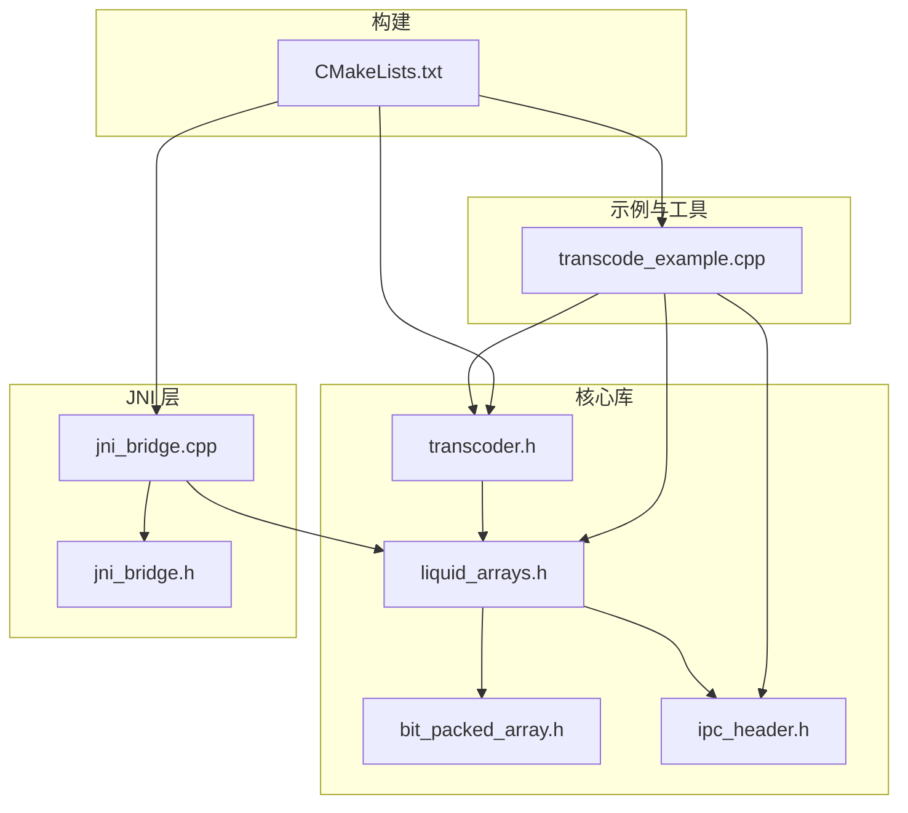
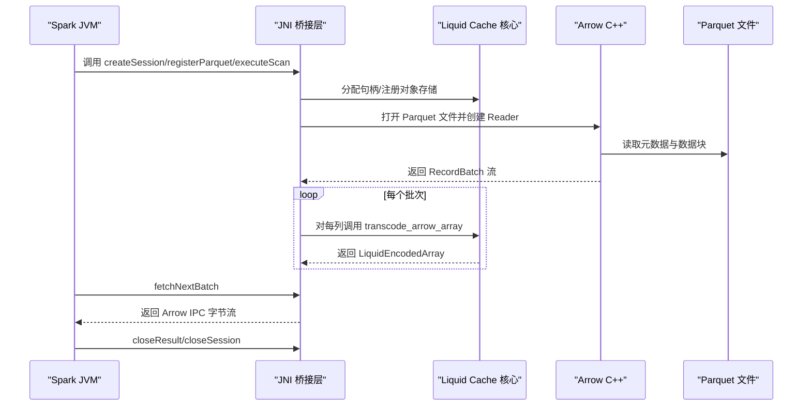
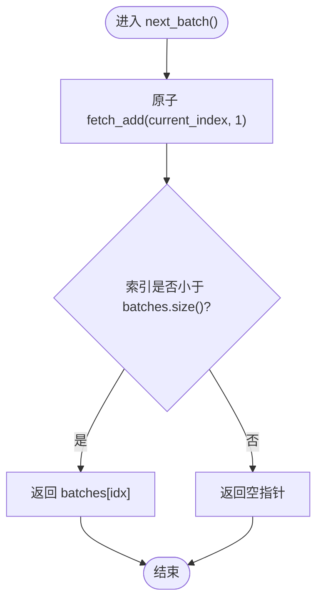
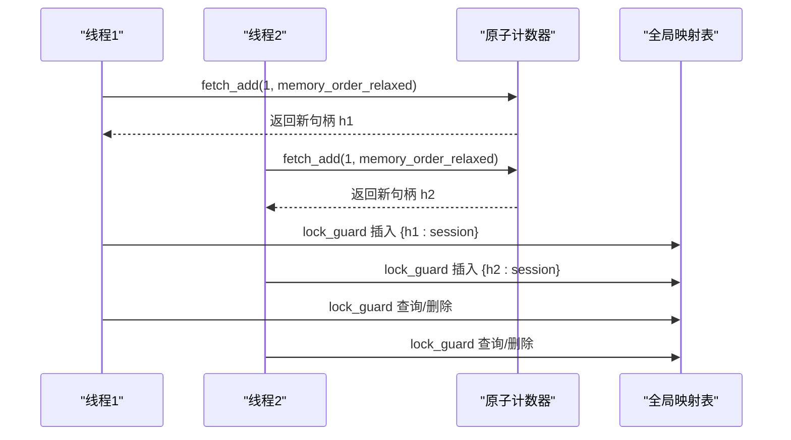
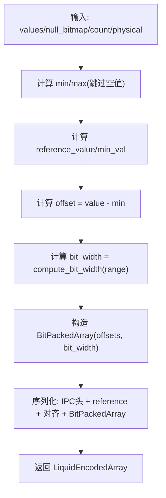
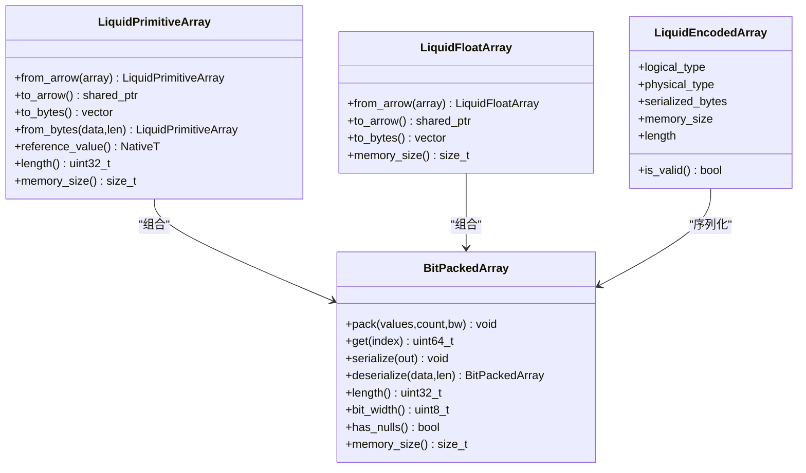
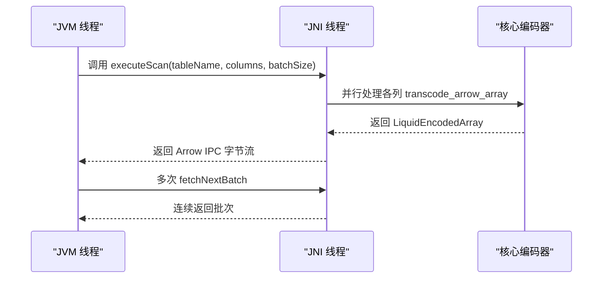
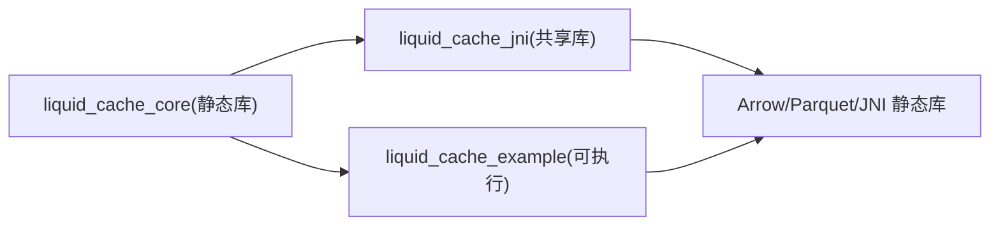

# 并发处理机制

<cite>
**本文引用的文件列表**
- [transcoder.h](file://include/liquid_cache/transcoder.h)
- [jni_bridge.h](file://include/liquid_cache/jni_bridge.h)
- [jni_bridge.cpp](file://src/jni_bridge.cpp)
- [transcoder_arrow.cpp](file://src/transcoder_arrow.cpp)
- [bit_packed_array.h](file://include/liquid_cache/bit_packed_array.h)
- [liquid_arrays.h](file://include/liquid_cache/liquid_arrays.h)
- [ipc_header.h](file://include/liquid_cache/ipc_header.h)
- [transcode_example.cpp](file://examples/transcode_example.cpp)
- [CMakeLists.txt](file://CMakeLists.txt)
</cite>

## 目录
1. [引言](#引言)
2. [项目结构](#项目结构)
3. [核心组件](#核心组件)
4. [架构总览](#架构总览)
5. [详细组件分析](#详细组件分析)
6. [依赖关系分析](#依赖关系分析)
7. [性能考量](#性能考量)
8. [故障排查指南](#故障排查指南)
9. [结论](#结论)
10. [附录](#附录)

## 引言
本文件围绕 Liquid Cache C++ 实现中的并发处理与线程安全设计展开，重点覆盖以下方面：
- 多线程环境下编码器的使用模式：线程本地存储与共享状态管理
- 无锁数据结构的应用：如何通过原子变量与最小锁策略降低竞争
- 任务并行化策略：数据分片与流水线处理思路
- 原子操作与内存屏障：在多线程中的正确使用与性能影响
- JNI 环境下的线程安全：Java-C++ 互操作的并发问题与最佳实践
- 并发性能测试方法与瓶颈识别技术

目标是为在多线程环境中使用 Liquid Cache 的开发者提供系统、可操作的技术指导。

## 项目结构
该项目采用模块化组织，核心模块包括：
- 编码器与数据结构：transcoder.h、liquid_arrays.h、bit_packed_array.h、ipc_header.h
- JNI 桥接层：jni_bridge.h、jni_bridge.cpp
- Arrow 集成与示例：transcoder_arrow.cpp、transcode_example.cpp
- 构建配置：CMakeLists.txt

图表来源
- [CMakeLists.txt:135-179](file://CMakeLists.txt#L135-L179)
- [transcoder.h:1-345](file://include/liquid_cache/transcoder.h#L1-L345)
- [liquid_arrays.h:1-580](file://include/liquid_cache/liquid_arrays.h#L1-L580)
- [bit_packed_array.h:1-176](file://include/liquid_cache/bit_packed_array.h#L1-L176)
- [ipc_header.h:1-117](file://include/liquid_cache/ipc_header.h#L1-L117)
- [jni_bridge.h:1-217](file://include/liquid_cache/jni_bridge.h#L1-L217)
- [jni_bridge.cpp:1-320](file://src/jni_bridge.cpp#L1-L320)
- [transcode_example.cpp:1-918](file://examples/transcode_example.cpp#L1-L918)

章节来源
- [CMakeLists.txt:135-179](file://CMakeLists.txt#L135-L179)

## 核心组件
- 编码器与数据结构
  - 原始缓冲区编码接口：提供独立于 Arrow 的 transcode_primitive、transcode_float，适合 JNI 或 Velox 等场景直接调用
  - Arrow 集成编码器：LiquidPrimitiveArray/LiquidFloatArray 提供类型分派与序列化/反序列化
  - 位打包数组：BitPackedArray 支持零拷贝读取、按位打包与解包
  - IPC 头部：LiquidIPCHeader 定义统一的二进制头部格式与对齐规则
- JNI 桥接层
  - 会话与结果句柄管理：使用原子计数器分配句柄；使用互斥保护全局映射表
  - 批次迭代：ScanResult 使用原子索引实现无锁的顺序消费
  - Arrow IPC 序列化：将编码后的列批量序列化为 Arrow IPC 字节流
- 示例与基准
  - 提供 Parquet 直读与 Liquid Cache 读取的对比基准，包含统计与可视化输出

章节来源
- [transcoder.h:66-156](file://include/liquid_cache/transcoder.h#L66-L156)
- [transcoder.h:158-342](file://include/liquid_cache/transcoder.h#L158-L342)
- [liquid_arrays.h:77-227](file://include/liquid_cache/liquid_arrays.h#L77-L227)
- [liquid_arrays.h:237-574](file://include/liquid_cache/liquid_arrays.h#L237-L574)
- [bit_packed_array.h:28-173](file://include/liquid_cache/bit_packed_array.h#L28-L173)
- [ipc_header.h:1-117](file://include/liquid_cache/ipc_header.h#L1-L117)
- [jni_bridge.h:30-93](file://include/liquid_cache/jni_bridge.h#L30-L93)
- [jni_bridge.cpp:40-172](file://src/jni_bridge.cpp#L40-L172)
- [transcode_example.cpp:559-733](file://examples/transcode_example.cpp#L559-L733)

## 架构总览
下图展示从 JVM 到 C++ 编码器再到 Arrow 的典型调用链路，以及 JNI 层的并发控制点。

图表来源
- [jni_bridge.cpp:40-172](file://src/jni_bridge.cpp#L40-L172)
- [jni_bridge.cpp:183-318](file://src/jni_bridge.cpp#L183-L318)
- [transcoder_arrow.cpp:26-227](file://src/transcoder_arrow.cpp#L26-L227)

## 详细组件分析

### 组件一：无锁批次消费与原子索引
- 设计要点
  - ScanResult 内部维护 batches（批次向量）与原子 current_index
  - next_batch() 使用原子 fetch_add 获取下一个批次索引，避免锁竞争
  - 适用于生产者单写、消费者多读的流水线场景
- 线程安全性
  - 原子 fetch_add 提供无锁自增与可见性保证
  - 仅在首次分配时需要互斥保护（store_result/get_result/remove_result）
- 性能影响
  - 无锁索引减少锁竞争，提高吞吐
  - 若消费者数量过多，需注意批次数量与缓存命中率

图表来源
- [jni_bridge.h:42-53](file://include/liquid_cache/jni_bridge.h#L42-L53)

章节来源
- [jni_bridge.h:42-53](file://include/liquid_cache/jni_bridge.h#L42-L53)

### 组件二：句柄分配与全局存储的并发控制
- 设计要点
  - 句柄分配：使用原子计数器 next_handle() 与 fetch_add(1, memory_order_relaxed)
  - 全局存储：sessions/results 使用互斥保护的全局映射表
- 线程安全性
  - 句柄分配无锁且线程安全
  - 存储访问使用 lock_guard 包裹，确保插入/查询/删除的原子性
- 性能影响
  - 原子分配避免了全局锁争用
  - 映射表的互斥范围小，仅在句柄生命周期管理阶段加锁

图表来源
- [jni_bridge.h:30-93](file://include/liquid_cache/jni_bridge.h#L30-L93)

章节来源
- [jni_bridge.h:30-93](file://include/liquid_cache/jni_bridge.h#L30-L93)

### 组件三：原始缓冲区编码器（无 Arrow 依赖）
- 设计要点
  - transcode_primitive：整型列的帧参考 + 位打包
  - transcode_float：ALP（自适应无损浮点）+ 位打包
  - compute_bit_width：计算最小位宽，减少存储空间
- 线程安全性
  - 函数参数均为只读输入，内部局部变量不共享，天然线程安全
  - 适合多线程并行处理不同列或不同批次
- 性能影响
  - 位打包显著压缩存储；ALP 在浮点上提供近似无损编码
  - 无锁数据结构（BitPackedArray）支持 O(1) 访问

图表来源
- [transcoder.h:78-156](file://include/liquid_cache/transcoder.h#L78-L156)
- [transcoder.h:158-342](file://include/liquid_cache/transcoder.h#L158-L342)

章节来源
- [transcoder.h:66-156](file://include/liquid_cache/transcoder.h#L66-L156)
- [transcoder.h:158-342](file://include/liquid_cache/transcoder.h#L158-L342)

### 组件四：Arrow 集成编码器与解码器
- 设计要点
  - 类型分派：根据 Arrow 类型选择对应编码路径（整数/日期/时间戳/浮点）
  - 编码：生成 LiquidPrimitiveArray/LiquidFloatArray 并序列化
  - 解码：解析 IPC 头部后按逻辑类型分派到具体解码器
- 线程安全性
  - 编码/解码函数以 Arrow Array 为输入，内部使用局部容器，无共享状态
  - 适合多线程并行处理不同列或不同批次
- 性能影响
  - Arrow 计算 API 用于 min/max 等聚合，可能引入额外开销
  - 解码器对浮点类型当前为占位，后续可优化

图表来源
- [liquid_arrays.h:77-227](file://include/liquid_cache/liquid_arrays.h#L77-L227)
- [liquid_arrays.h:237-574](file://include/liquid_cache/liquid_arrays.h#L237-L574)
- [bit_packed_array.h:28-173](file://include/liquid_cache/bit_packed_array.h#L28-L173)
- [transcoder.h:23-33](file://include/liquid_cache/transcoder.h#L23-L33)

章节来源
- [transcoder_arrow.cpp:26-283](file://src/transcoder_arrow.cpp#L26-L283)
- [liquid_arrays.h:77-227](file://include/liquid_cache/liquid_arrays.h#L77-L227)
- [liquid_arrays.h:237-574](file://include/liquid_cache/liquid_arrays.h#L237-L574)

### 组件五：JNI 层的并发与互操作
- 设计要点
  - 会话与结果句柄：原子分配 + 互斥映射
  - 批次迭代：原子索引 + 无锁顺序消费
  - Arrow IPC 序列化：将编码后的列批量序列化为 Arrow IPC 字节流
- 线程安全性
  - 句柄分配与批次索引使用原子操作，避免锁
  - 结果存储使用互斥保护，确保插入/查询/删除一致性
  - JNI 层与 JVM 的交互遵循 JNI 规范，避免跨线程共享本地引用
- 性能影响
  - 无锁索引与原子计数降低锁竞争
  - Arrow IPC 序列化在 JVM 侧可直接消费，减少中间拷贝

图表来源
- [jni_bridge.cpp:246-302](file://src/jni_bridge.cpp#L246-L302)
- [jni_bridge.cpp:128-170](file://src/jni_bridge.cpp#L128-L170)

章节来源
- [jni_bridge.cpp:40-172](file://src/jni_bridge.cpp#L40-L172)
- [jni_bridge.cpp:128-170](file://src/jni_bridge.cpp#L128-L170)

## 依赖关系分析
- 构建系统
  - CMake 将核心编译为静态库，JNI 与示例分别链接静态依赖，减少运行时依赖
  - 通过 --whole-archive 确保静态库中被间接引用的对象被保留
- 运行时依赖
  - Arrow/Parquet/JNI 为必需依赖
  - 通过静态链接策略尽量消除 ABI 不兼容风险

图表来源
- [CMakeLists.txt:135-179](file://CMakeLists.txt#L135-L179)

章节来源
- [CMakeLists.txt:135-179](file://CMakeLists.txt#L135-L179)

## 性能考量
- 无锁与最小锁策略
  - 原子计数器与原子索引避免锁竞争
  - 仅在句柄生命周期管理阶段使用互斥，范围小、频率低
- 数据结构与算法
  - BitPackedArray 采用按位打包，减少存储与带宽占用
  - ALP 浮点编码在保证近似无损的前提下显著压缩
- 并行化建议
  - 列级并行：不同列可并行 transcode_arrow_array
  - 批级并行：不同 RecordBatch 可并行处理
  - 流水线：Producer(读取) → Encoder(编码) → Consumer(序列化/传输)
- 基准测试
  - 示例程序提供 Parquet 直读与 Liquid Cache 读取的对比基准
  - 输出均值、最小/最大、标准差、吞吐等指标，并支持“破局点”分析

章节来源
- [transcode_example.cpp:559-733](file://examples/transcode_example.cpp#L559-L733)
- [transcode_example.cpp:409-509](file://examples/transcode_example.cpp#L409-L509)

## 故障排查指南
- JNI 层常见问题
  - 句柄无效：检查 store_result/get_result 是否匹配，确认互斥保护范围
  - 批次耗尽：next_batch() 返回空指针表示已无剩余批次
  - Arrow IPC 序列化失败：检查 RecordBatch 列数与类型是否一致
- 编码器问题
  - 不支持的 Arrow 类型：transcode_arrow_array 返回空结果，需在上游过滤
  - 浮点解码未实现：decode_liquid_array 对 Float 类型返回空，需使用 to_arrow 或自行实现
- 性能问题定位
  - 使用示例基准工具对比直读与缓存读取，关注标准差与最小/最大值
  - 关注 CPU 缓存命中与内存带宽，必要时调整批大小与并行度

章节来源
- [jni_bridge.cpp:276-302](file://src/jni_bridge.cpp#L276-L302)
- [transcoder_arrow.cpp:229-283](file://src/transcoder_arrow.cpp#L229-L283)
- [transcode_example.cpp:559-733](file://examples/transcode_example.cpp#L559-L733)

## 结论
本项目在并发与线程安全方面采用了“最小锁 + 原子操作”的设计原则：
- 原子计数器与原子索引替代锁，降低竞争
- 互斥仅用于必要的句柄生命周期管理
- 编码器与数据结构（BitPackedArray、IPC Header）无共享状态，天然适合多线程并行
- JNI 层通过无锁批次消费与 Arrow IPC 序列化，实现高效的数据流转

对于多线程环境下的使用，建议：
- 采用列级/批级并行，结合流水线模式
- 合理设置批大小与并行度，平衡内存与吞吐
- 使用示例基准工具进行性能回归与瓶颈识别

## 附录
- 并发最佳实践清单
  - 使用原子变量管理轻量状态（如句柄、索引）
  - 仅在必要时使用互斥，缩短临界区
  - 避免跨线程共享本地 JNI 引用
  - 对热点路径进行基准测试与剖析
  - 采用流水线与分片策略提升吞吐