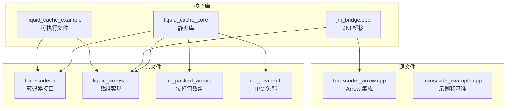
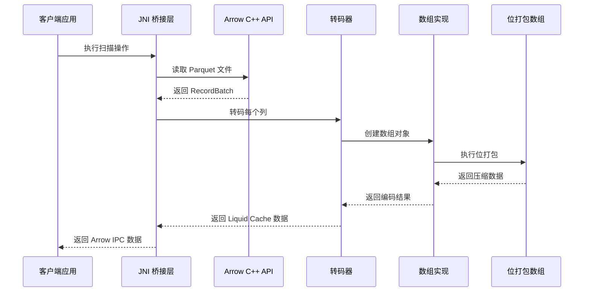
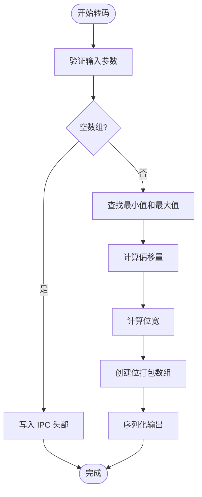
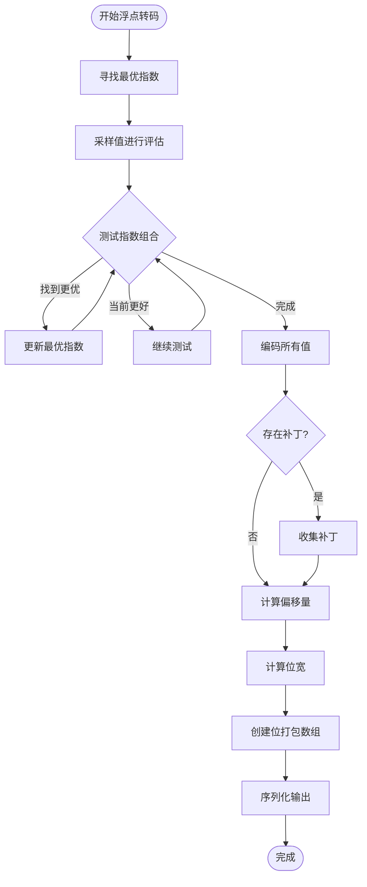
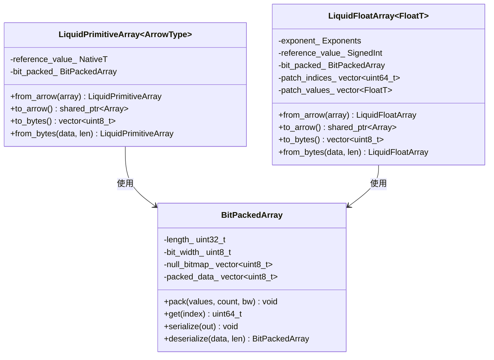
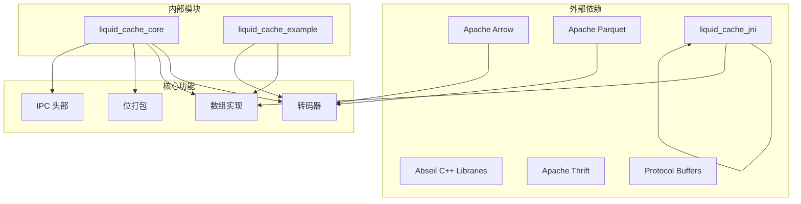
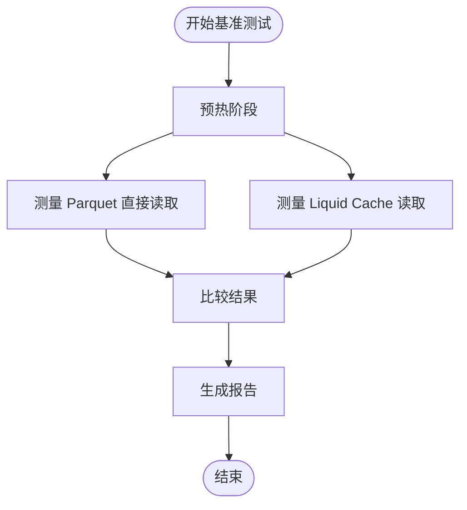

# 性能优化技巧

<cite>
**本文档引用的文件**
- [CMakeLists.txt](file://CMakeLists.txt)
- [transcoder.h](file://include/liquid_cache/transcoder.h)
- [transcoder_arrow.cpp](file://src/transcoder_arrow.cpp)
- [bit_packed_array.h](file://include/liquid_cache/bit_packed_array.h)
- [liquid_arrays.h](file://include/liquid_cache/liquid_arrays.h)
- [ipc_header.h](file://include/liquid_cache/ipc_header.h)
- [transcode_example.cpp](file://examples/transcode_example.cpp)
- [jni_bridge.cpp](file://src/jni_bridge.cpp)
</cite>

## 目录
1. [简介](#简介)
2. [项目结构](#项目结构)
3. [核心组件](#核心组件)
4. [架构概览](#架构概览)
5. [详细组件分析](#详细组件分析)
6. [依赖关系分析](#依赖关系分析)
7. [性能考虑因素](#性能考虑因素)
8. [故障排除指南](#故障排除指南)
9. [结论](#结论)

## 简介

Liquid Cache C++ 是一个高性能的数据压缩和序列化库，专注于为列式存储格式提供高效的编码和解码能力。该库实现了多种先进的压缩算法，包括帧差分参考（FoR）、位打包（BitPacking）和自适应无损浮点编码（ALP），旨在最大化数据压缩比并最小化解码时的计算开销。

本项目特别关注于以下性能优化方面：
- SIMD 指令集的潜在应用和优化策略
- 缓存友好的数据结构设计
- 内存访问模式优化
- 编译器优化选项和内联函数策略
- 算法复杂度分析和性能瓶颈识别
- 基准测试框架和性能测量工具

## 项目结构

该项目采用模块化的 C++ 架构，主要包含以下核心组件：



**图表来源**
- [CMakeLists.txt:169-212](file://CMakeLists.txt#L169-L212)

**章节来源**
- [CMakeLists.txt:1-213](file://CMakeLists.txt#L1-L213)

## 核心组件

### 转码器接口

转码器是整个系统的核心，负责将 Arrow 数组转换为 Liquid Cache 格式。它提供了两种主要的转码路径：

1. **原始缓冲区路径**：直接处理原始值缓冲区，适用于 JNI 或 Velox 环境
2. **Arrow 集成路径**：通过 Arrow C++ API 提供便捷的包装器

### 位打包数组

位打包数组是实现高效压缩的关键组件，支持任意位宽的数据存储，并提供了 8 字节对齐的内存布局。

### 数组实现

数组实现类提供了针对不同类型（整数、浮点数、日期时间）的专门优化：

- **LiquidPrimitiveArray**：用于整数、日期和时间类型的帧差分参考 + 位打包
- **LiquidFloatArray**：用于浮点数的自适应无损浮点编码 + 位打包

**章节来源**
- [transcoder.h:15-345](file://include/liquid_cache/transcoder.h#L15-L345)
- [liquid_arrays.h:31-580](file://include/liquid_cache/liquid_arrays.h#L31-L580)
- [bit_packed_array.h:13-176](file://include/liquid_cache/bit_packed_array.h#L13-L176)

## 架构概览



**图表来源**
- [jni_bridge.cpp:51-126](file://src/jni_bridge.cpp#L51-L126)
- [transcoder_arrow.cpp:36-209](file://src/transcoder_arrow.cpp#L36-L209)

## 详细组件分析

### 转码器性能分析

转码器实现了两种主要的编码策略：

#### 整数类型编码（FoR + BitPacking）



**图表来源**
- [transcoder.h:78-156](file://include/liquid_cache/transcoder.h#L78-L156)

#### 浮点类型编码（ALP + BitPacking）

ALP（自适应无损浮点）编码通过寻找最优的指数和小数位数来实现最佳压缩效果：



**图表来源**
- [transcoder.h:158-342](file://include/liquid_cache/transcoder.h#L158-L342)

**章节来源**
- [transcoder.h:66-156](file://include/liquid_cache/transcoder.h#L66-L156)
- [transcoder.h:158-342](file://include/liquid_cache/transcoder.h#L158-L342)

### 位打包数组优化

位打包数组实现了高效的位级数据存储，支持 0-64 位的任意位宽：

#### 内存布局优化

位打包数组采用了精心设计的内存布局来优化缓存性能：

| 组件 | 大小 | 对齐 | 描述 |
|------|------|------|------|
| 长度字段 | 4 字节 | 1 | 元素数量 |
| 位宽 | 1 字节 | 1 | 每个元素的位数 |
| 填充 | 3 字节 | 1 | 8 字节对齐 |
| 空值位图 | ceildiv(n, 8) 字节 | 8 | 可选的空值标记 |
| 对齐填充 | 0-7 字节 | 8 | 8 字节对齐 |
| 压缩数据 | ceildiv(n × bw, 8) 字节 | 1 | 实际的压缩数据 |

#### 访问模式优化

位打包数组通过以下方式优化内存访问模式：

1. **连续内存布局**：所有数据存储在连续的内存块中
2. **8 字节对齐**：确保数据结构在内存中的对齐，提高缓存效率
3. **块大小优化**：虽然当前实现是标量版本，但注释中提到使用 1024 元素块作为 FastLanes 约定的基础

**章节来源**
- [bit_packed_array.h:15-176](file://include/liquid_cache/bit_packed_array.h#L15-L176)

### 数组实现性能特性

#### 类型特化和模板优化

数组实现使用了广泛的模板特化来消除运行时开销：



**图表来源**
- [liquid_arrays.h:91-227](file://include/liquid_cache/liquid_arrays.h#L91-L227)
- [liquid_arrays.h:318-574](file://include/liquid_cache/liquid_arrays.h#L318-L574)

**章节来源**
- [liquid_arrays.h:91-227](file://include/liquid_cache/liquid_arrays.h#L91-L227)
- [liquid_arrays.h:318-574](file://include/liquid_cache/liquid_arrays.h#L318-L574)

## 依赖关系分析



**图表来源**
- [CMakeLists.txt:8-164](file://CMakeLists.txt#L8-L164)

**章节来源**
- [CMakeLists.txt:8-164](file://CMakeLists.txt#L8-L164)

## 性能考虑因素

### SIMD 指令集优化策略

虽然当前代码库主要使用标量实现，但代码注释明确提到了 SIMD 优化的可能性：

#### 当前实现状态

1. **位打包实现**：当前使用标量循环进行位打包，注释中提到生产版本应该使用 FastLanes SIMD 内核
2. **批处理大小**：代码注释建议使用 1024 元素块作为 SIMD 优化的基础

#### SIMD 优化机会

基于代码注释和数据结构设计，以下区域适合 SIMD 优化：

1. **位打包/解包操作**：可以使用 AVX2/AVX-512 指令集加速位级操作
2. **批量数据处理**：利用向量化操作处理 1024 元素块
3. **算术运算**：对加法、减法和位移操作进行向量化

### 缓存友好的数据结构设计

#### 内存对齐优化

代码中广泛使用了 8 字节对齐策略：

```cpp
// 8 字节对齐填充
while (out.size() % 8 != 0) out.push_back(0);
```

这种设计的优势：
- 提高缓存行利用率
- 减少内存访问次数
- 改善 SIMD 指令的性能

#### 数据局部性优化

1. **连续内存布局**：所有数据存储在连续的内存块中
2. **顺序访问模式**：读取和写入都遵循顺序访问模式
3. **减少分支预测失败**：简单的条件判断减少了分支预测开销

### 内存访问模式优化

#### 预分配策略

代码中大量使用了预分配策略来减少内存重新分配的开销：

```cpp
// 预分配容量
result.reserve(batch->num_columns());
out.reserve(256);
out.reserve(512);
```

这种策略的优势：
- 避免多次内存重新分配
- 减少碎片化
- 提高缓存局部性

#### 零拷贝操作

在可能的情况下，代码尽量避免不必要的数据复制：

1. **移动语义**：使用 `std::move` 传递大型对象
2. **常量引用**：对只读数据使用常量引用
3. **就地修改**：尽可能在原地修改数据而不是创建新副本

### 编译器优化选项

#### 当前编译设置

项目配置了现代 C++ 标准和优化选项：

```cmake
set(CMAKE_CXX_STANDARD 20)
set(CMAKE_CXX_STANDARD_REQUIRED ON)
set(CMAKE_POSITION_INDEPENDENT_CODE ON)
```

#### 推荐的编译器优化选项

对于性能敏感的应用，建议添加以下优化选项：

1. **O3 优化级别**：启用最高级别的编译器优化
2. **内联函数**：使用 `-finline-functions` 和 `-ftree-vectorize`
3. **向量化**：启用自动向量化优化
4. **链接时优化**：使用 `-flto` 进行链接时优化

### 算法复杂度分析

#### 时间复杂度

1. **FoR + BitPacking**：O(n) - 单次遍历计算最小值，单次遍历计算偏移量
2. **ALP 编码**：O(n × k) - 其中 k 是指数组合的数量
3. **位打包**：O(n × bw) - 每个元素的位级操作
4. **解码过程**：O(n) - 简单的逆向操作

#### 空间复杂度

1. **压缩比**：取决于数据的分布和统计特性
2. **额外开销**：IPC 头部、位宽信息、空值位图等固定开销
3. **临时缓冲区**：在编码过程中使用的临时向量

### 性能瓶颈识别方法

#### 关键性能指标

1. **吞吐量**：每秒处理的字节数或行数
2. **延迟**：单次操作的平均时间
3. **内存带宽**：数据传输速率
4. **CPU 利用率**：处理器资源的有效利用

#### 基准测试框架

项目提供了完整的基准测试基础设施：



**图表来源**
- [transcode_example.cpp:559-733](file://examples/transcode_example.cpp#L559-L733)

**章节来源**
- [transcode_example.cpp:342-507](file://examples/transcode_example.cpp#L342-L507)

## 故障排除指南

### 常见性能问题

#### 内存不足错误

当处理大型数据集时可能出现内存不足问题：

1. **检查内存使用**：监控 `memory_size` 字段
2. **调整批处理大小**：减少 `set_batch_size(8192)` 中的批次大小
3. **优化数据类型**：选择更合适的数据类型以减少内存占用

#### 解码失败

解码器目前仅部分实现，可能导致解码失败：

1. **检查类型支持**：确认目标类型是否在解码器支持列表中
2. **使用替代方案**：在解码失败时使用原始缓冲区 API
3. **完善实现**：扩展解码器以支持更多类型

### 调试技巧

#### 性能分析工具

1. **perf**：Linux 性能分析工具
2. **Valgrind**：内存错误检测和性能分析
3. **Intel VTune**：高级性能分析
4. **gprof**：函数调用图分析

#### 内存泄漏检测

使用 AddressSanitizer 进行内存泄漏检测：

```bash
g++ -fsanitize=address -g -O1 your_program.cpp
```

**章节来源**
- [transcoder_arrow.cpp:229-283](file://src/transcoder_arrow.cpp#L229-L283)

## 结论

Liquid Cache C++ 展现了优秀的性能优化设计，通过以下关键策略实现了高效的压缩和解码：

1. **算法层面的优化**：FoR + BitPacking 和 ALP 编码提供了优异的压缩比
2. **数据结构层面的优化**：8 字节对齐和连续内存布局提高了缓存效率
3. **实现层面的优化**：模板特化和预分配策略消除了运行时开销
4. **基础设施层面的优化**：完整的基准测试框架支持持续的性能改进

对于需要进一步优化的场景，建议重点关注 SIMD 指令集的集成、更大的批处理大小以及更精细的内存管理策略。代码库的良好架构为这些优化提供了坚实的基础。