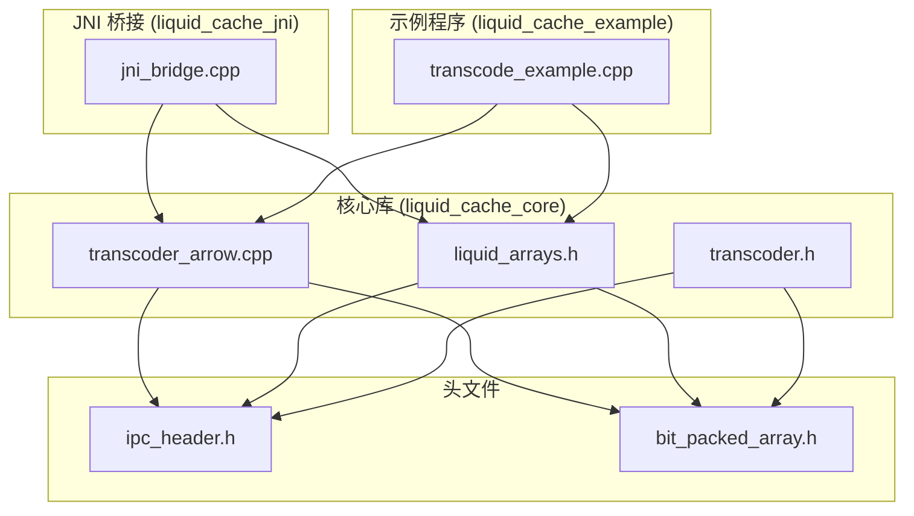
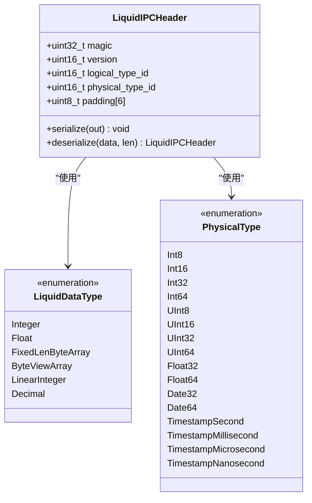
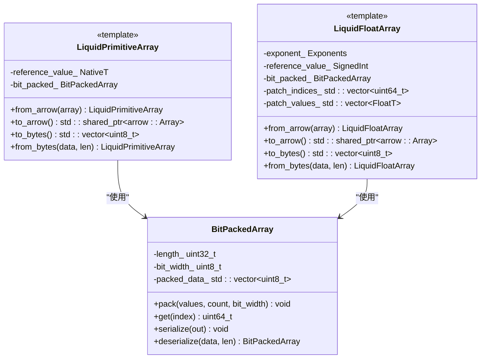
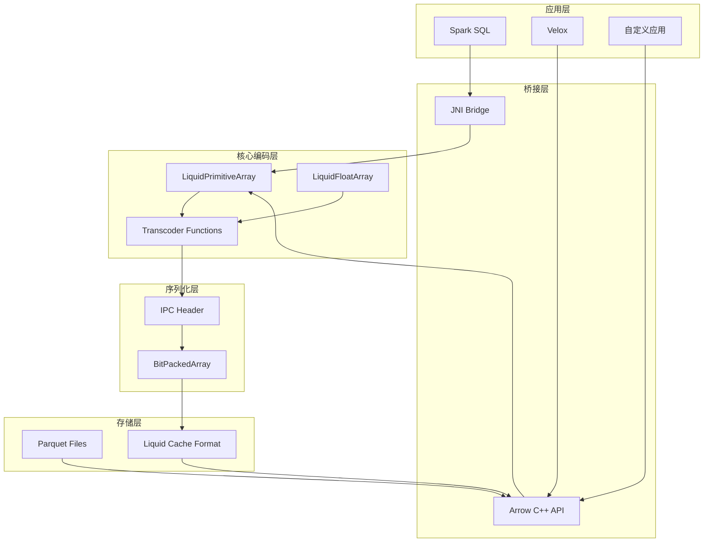
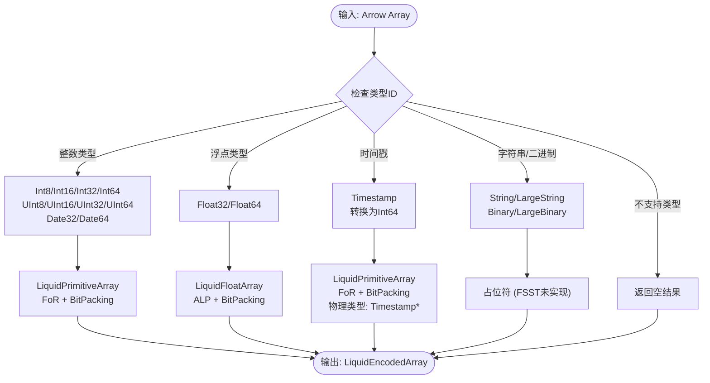
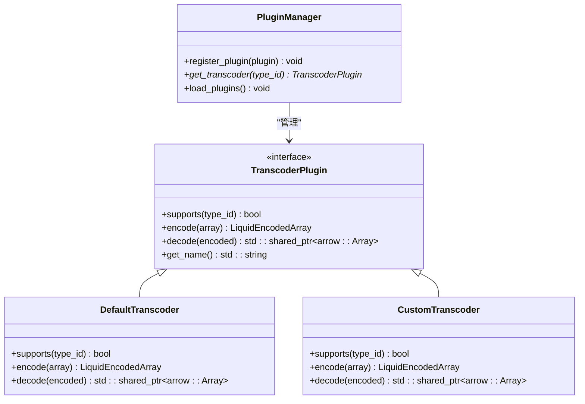
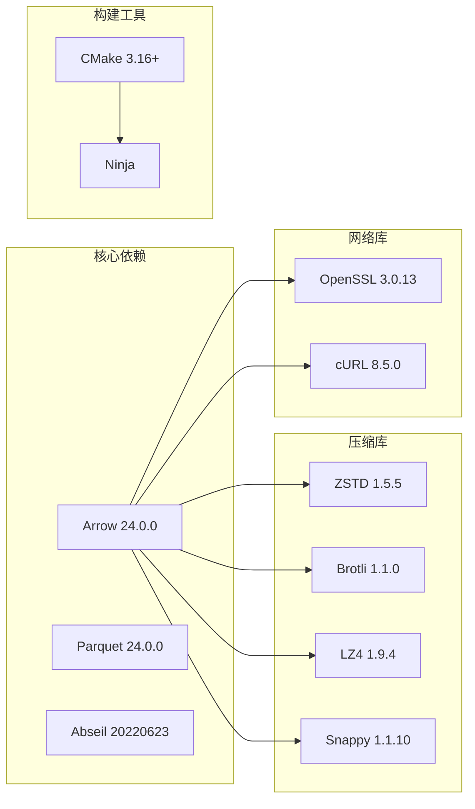
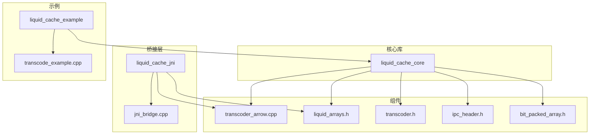

# 扩展开发指南

<cite>
**本文档引用的文件**
- [CMakeLists.txt](file://CMakeLists.txt)
- [transcoder.h](file://include/liquid_cache/transcoder.h)
- [transcoder_arrow.cpp](file://src/transcoder_arrow.cpp)
- [liquid_arrays.h](file://include/liquid_cache/liquid_arrays.h)
- [ipc_header.h](file://include/liquid_cache/ipc_header.h)
- [bit_packed_array.h](file://include/liquid_cache/bit_packed_array.h)
- [jni_bridge.cpp](file://src/jni_bridge.cpp)
- [transcode_example.cpp](file://examples/transcode_example.cpp)
- [debug.txt](file://debug.txt)
</cite>

## 目录
1. [简介](#简介)
2. [项目结构](#项目结构)
3. [核心组件](#核心组件)
4. [架构概览](#架构概览)
5. [详细组件分析](#详细组件分析)
6. [依赖关系分析](#依赖关系分析)
7. [性能考虑](#性能考虑)
8. [故障排除指南](#故障排除指南)
9. [结论](#结论)
10. [附录](#附录)

## 简介

Liquid Cache C++ 是一个高性能的数据压缩和序列化库，专门用于优化 Arrow 生态系统中的数据存储和传输。本指南面向高级开发者，提供完整的扩展开发指导，涵盖数据类型支持、自定义编码器实现、插件系统架构、类型分派器扩展以及与 Arrow 生态系统的集成方法。

该库的核心特性包括：
- 基于 Arrow C++ API 的原生支持
- 高效的二进制序列化格式
- 支持多种数据类型的压缩编码
- JNI 桥接支持 JVM 集成
- 可扩展的编码器架构

## 项目结构

项目采用模块化的 C++ 架构，主要包含以下组件：



**图表来源**
- [CMakeLists.txt:160-206](file://CMakeLists.txt#L160-L206)
- [transcoder_arrow.cpp:1-286](file://src/transcoder_arrow.cpp#L1-L286)
- [liquid_arrays.h:1-580](file://include/liquid_cache/liquid_arrays.h#L1-L580)

**章节来源**
- [CMakeLists.txt:1-206](file://CMakeLists.txt#L1-L206)
- [transcoder_arrow.cpp:1-286](file://src/transcoder_arrow.cpp#L1-L286)

## 核心组件

### IPC 头部系统

IPC 头部是所有序列化数据的基础结构，确保跨语言兼容性：



**图表来源**
- [ipc_header.h:16-44](file://include/liquid_cache/ipc_header.h#L16-L44)
- [ipc_header.h:55-106](file://include/liquid_cache/ipc_header.h#L55-L106)

### 编码器接口设计

编码器采用模板特化和策略模式相结合的方式，提供灵活的扩展机制：



**图表来源**
- [liquid_arrays.h:91-227](file://include/liquid_cache/liquid_arrays.h#L91-L227)
- [liquid_arrays.h:318-574](file://include/liquid_cache/liquid_arrays.h#L318-L574)
- [bit_packed_array.h:28-173](file://include/liquid_cache/bit_packed_array.h#L28-L173)

**章节来源**
- [transcoder.h:23-34](file://include/liquid_cache/transcoder.h#L23-L34)
- [liquid_arrays.h:1-580](file://include/liquid_cache/liquid_arrays.h#L1-L580)

## 架构概览

Liquid Cache 采用分层架构设计，从底层的二进制序列化到高层的 Arrow 集成：



**图表来源**
- [transcoder_arrow.cpp:26-209](file://src/transcoder_arrow.cpp#L26-L209)
- [jni_bridge.cpp:10-320](file://src/jni_bridge.cpp#L10-L320)

## 详细组件分析

### 类型分派器工作原理

类型分派器负责将 Arrow 类型映射到相应的 Liquid 编码器：



**图表来源**
- [transcoder_arrow.cpp:36-209](file://src/transcoder_arrow.cpp#L36-L209)
- [transcoder.h:41-58](file://include/liquid_cache/transcoder.h#L41-L58)

### 自定义编码器实现

要实现自定义编码器，需要遵循以下步骤：

#### 步骤1: 定义物理类型映射

```cpp
// 在 ipc_header.h 中添加新的物理类型
enum class PhysicalType : uint16_t {
    // ... 现有类型 ...
    CustomType = 16,
};
```

#### 步骤2: 创建编码器类

```cpp
template <typename ArrowType>
class LiquidCustomArray {
public:
    // 实现编码方法
    static LiquidCustomArray from_arrow(
        const std::shared_ptr<arrow::Array>& array);
    
    // 实现解码方法
    std::shared_ptr<arrow::Array> to_arrow() const;
    
    // 实现序列化方法
    std::vector<uint8_t> to_bytes() const;
    
    // 实现反序列化方法
    static LiquidCustomArray from_bytes(
        const uint8_t* data, size_t len);
};
```

#### 步骤3: 更新类型分派器

```cpp
case arrow::Type::CUSTOM_TYPE: {
    auto liquid = LiquidCustomArray<arrow::CustomType>::from_arrow(array);
    // 设置逻辑类型和物理类型
    result.logical_type = LiquidDataType::Custom;
    result.physical_type = PhysicalType::CustomType;
    // 完成编码过程...
    return result;
}
```

**章节来源**
- [transcoder_arrow.cpp:26-209](file://src/transcoder_arrow.cpp#L26-L209)
- [liquid_arrays.h:91-227](file://include/liquid_cache/liquid_arrays.h#L91-L227)

### 插件系统架构设计

插件系统采用策略模式和工厂模式结合的方式：



**图表来源**
- [transcoder_arrow.cpp:36-209](file://src/transcoder_arrow.cpp#L36-L209)
- [transcoder.h:86-156](file://include/liquid_cache/transcoder.h#L86-L156)

### 编码器接口设计原则

#### 设计原则

1. **类型安全**: 使用 C++ 模板确保编译时类型检查
2. **内存效率**: 最小化内存分配和拷贝操作
3. **二进制兼容性**: 严格遵守 IPC 格式规范
4. **错误处理**: 提供清晰的错误信息和异常处理
5. **性能优化**: 支持 SIMD 和向量化操作

#### 最佳实践

```cpp
// 推荐的编码器实现模式
template <typename ArrowType>
class OptimizedLiquidArray {
    // 使用移动语义减少拷贝
    static OptimizedLiquidArray from_arrow(
        std::shared_ptr<arrow::Array>&& array) {
        // 实现细节...
    }
    
    // 提供常量表达式配置
    static constexpr size_t BUFFER_SIZE = 8192;
    
    // 实现高效的序列化
    void serialize(std::vector<uint8_t>& out) const {
        // 实现细节...
    }
};
```

**章节来源**
- [liquid_arrays.h:107-161](file://include/liquid_cache/liquid_arrays.h#L107-L161)
- [transcoder.h:86-156](file://include/liquid_cache/transcoder.h#L86-L156)

## 依赖关系分析

### 外部依赖

项目依赖于多个关键库：



**图表来源**
- [CMakeLists.txt:8-117](file://CMakeLists.txt#L8-L117)

### 内部依赖关系



**图表来源**
- [CMakeLists.txt:160-206](file://CMakeLists.txt#L160-L206)

**章节来源**
- [CMakeLists.txt:1-206](file://CMakeLists.txt#L1-L206)

## 性能考虑

### 编码性能优化

1. **SIMD 加速**: BitPackedArray 使用 1024 元素块进行 SIMD 友好访问
2. **内存对齐**: 所有数据结构都进行 8 字节对齐
3. **零拷贝操作**: 尽可能使用移动语义和就地操作
4. **批处理优化**: 支持批量编码和解码操作

### 内存管理

```cpp
// 内存优化示例
class MemoryEfficientArray {
    // 预分配缓冲区
    std::vector<uint8_t> buffer_;
    
    // 使用 reserve 避免多次重分配
    void optimize_buffer_allocation(size_t estimated_size) {
        buffer_.reserve(estimated_size);
    }
    
    // 使用移动语义
    std::vector<uint8_t> to_bytes_optimized() {
        return std::move(buffer_);
    }
};
```

### 并发处理

JNI 桥接层支持多线程操作：

```cpp
// 线程安全的会话管理
class ThreadSafeSession {
    static std::mutex sessions_mutex_;
    static std::unordered_map<int64_t, SessionData> sessions_;
    
    static std::lock_guard<std::mutex> acquire_lock() {
        return std::lock_guard<std::mutex>(sessions_mutex_);
    }
};
```

## 故障排除指南

### 常见问题诊断

#### 1. 类型不支持错误

**症状**: 编码后返回空结果或逻辑类型为 ByteViewArray

**解决方案**: 
- 检查 Arrow 类型是否在支持列表中
- 验证类型分派器的 case 语句
- 确认物理类型映射正确

#### 2. 内存不足错误

**症状**: 序列化过程中抛出 std::bad_alloc 异常

**解决方案**:
- 检查系统可用内存
- 优化批处理大小
- 实现内存池管理

#### 3. JNI 调用失败

**症状**: Java 层抛出 UnsatisfiedLinkError

**解决方案**:
- 确认共享库正确加载
- 检查符号导出
- 验证 JNI 函数签名

**章节来源**
- [transcoder_arrow.cpp:188-209](file://src/transcoder_arrow.cpp#L188-L209)
- [jni_bridge.cpp:133-172](file://src/jni_bridge.cpp#L133-L172)

## 结论

Liquid Cache C++ 提供了一个强大而灵活的扩展框架，支持多种数据类型的高效编码和解码。通过理解其架构设计和实现原理，开发者可以：

1. **轻松添加新的数据类型支持** - 通过扩展类型分派器和编码器类
2. **实现自定义编码算法** - 利用模板特化和策略模式
3. **构建可插拔的编码系统** - 通过插件管理和工厂模式
4. **深度集成 Arrow 生态系统** - 保持与 Arrow API 的完全兼容

该库的设计充分考虑了性能、可扩展性和易用性，为大数据处理场景提供了高效的解决方案。

## 附录

### 扩展开发流程

#### 新数据类型实现步骤

1. **定义物理类型**: 在 PhysicalType 枚举中添加新类型
2. **创建编码器类**: 实现 LiquidCustomArray 模板类
3. **更新类型分派器**: 添加对应的 case 语句
4. **测试验证**: 编写单元测试和集成测试
5. **性能优化**: 分析和优化编码性能

#### 示例: 添加 Decimal 类型支持

```cpp
// 1. 在 ipc_header.h 中添加
enum class PhysicalType : uint16_t {
    // ... 现有类型 ...
    Decimal128 = 16,
    Decimal256 = 17,
};

// 2. 实现编码器类
template <>
class LiquidDecimalArray<arrow::Decimal128Type> {
    // 实现 decimal 编码逻辑
};

// 3. 更新分派器
case arrow::Type::DECIMAL128: {
    auto liquid = LiquidDecimalArray<arrow::Decimal128Type>::from_arrow(array);
    result.logical_type = LiquidDataType::Decimal;
    result.physical_type = PhysicalType::Decimal128;
    return result;
}
```

这个扩展开发指南提供了完整的 Liquid Cache C++ 扩展开发蓝图，涵盖了从基础概念到高级实现的所有必要知识。开发者可以根据具体需求选择合适的扩展方式，并遵循最佳实践确保代码质量和性能。