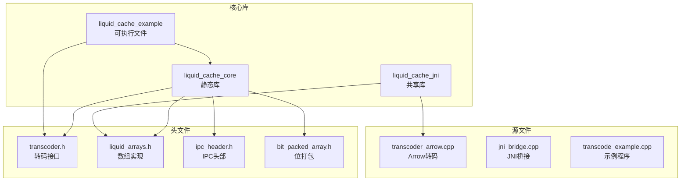
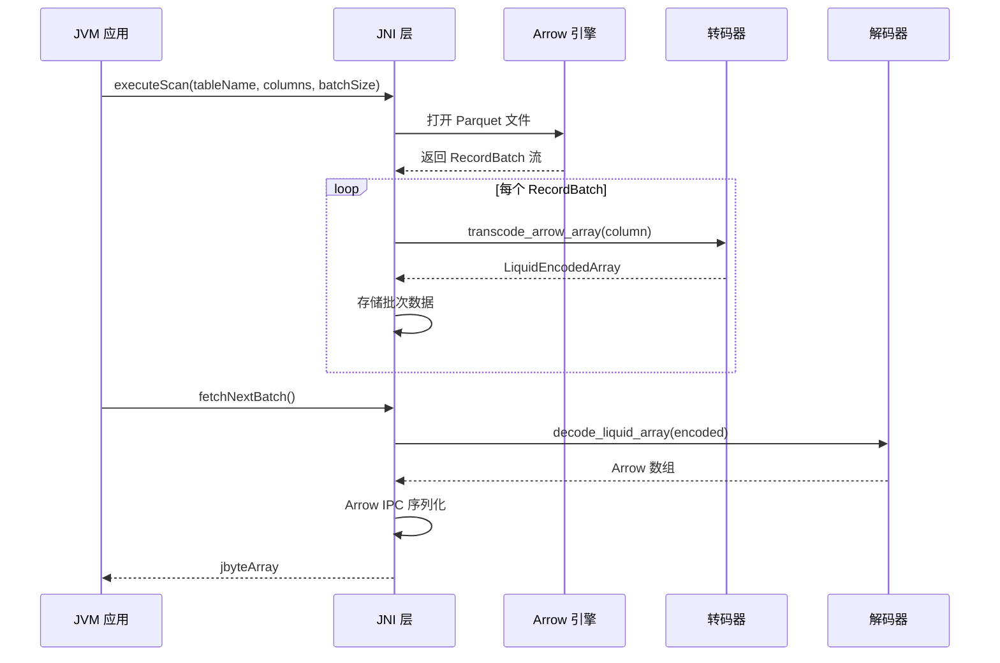
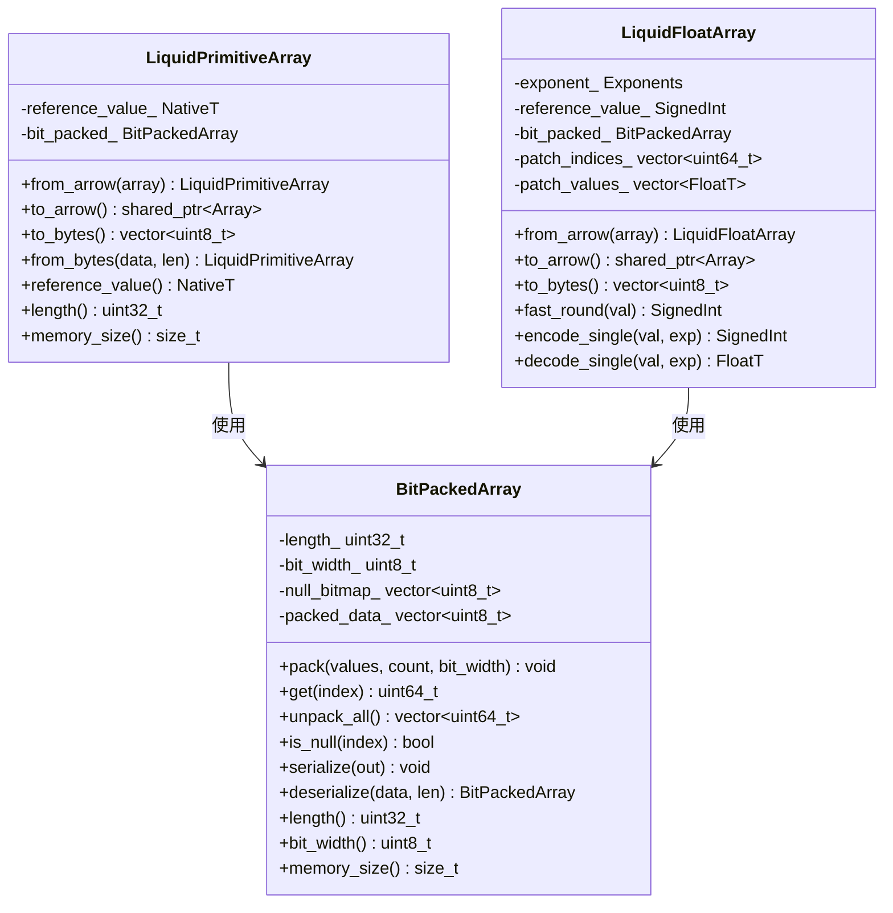
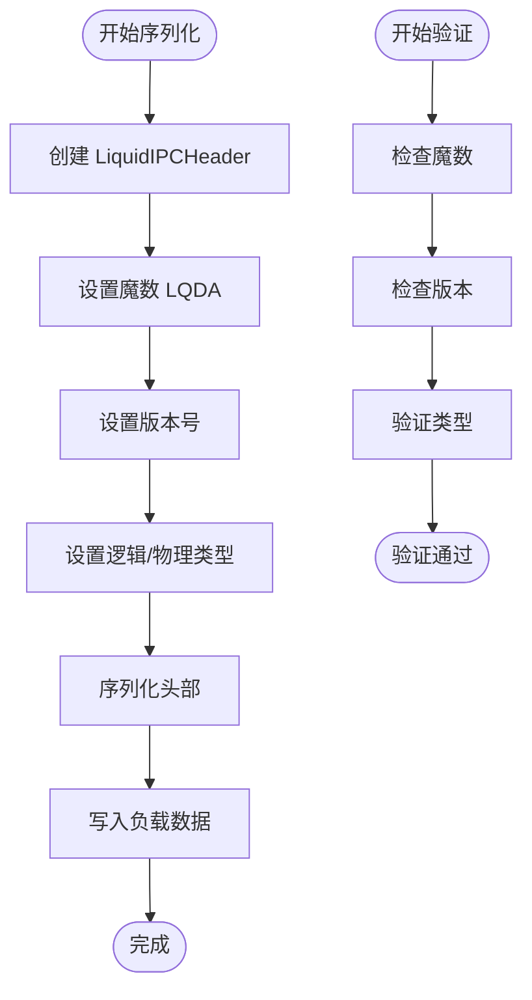
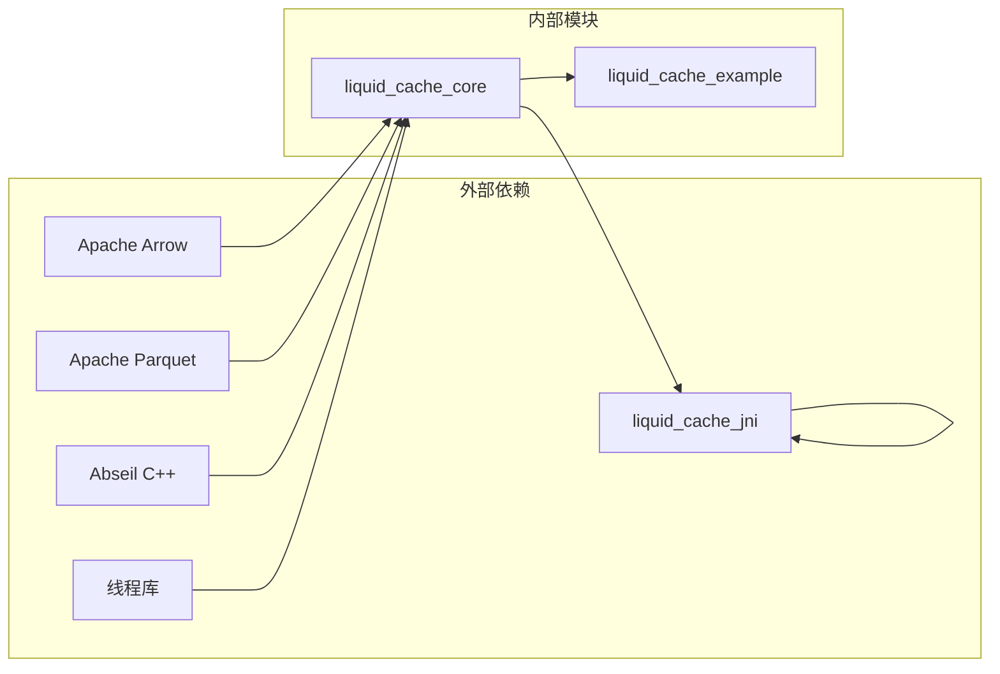

# 调试与故障排除

<cite>
**本文档引用的文件**
- [CMakeLists.txt](file://CMakeLists.txt)
- [debug.txt](file://debug.txt)
- [transcoder_arrow.cpp](file://src/transcoder_arrow.cpp)
- [jni_bridge.cpp](file://src/jni_bridge.cpp)
- [transcoder.h](file://include/liquid_cache/transcoder.h)
- [liquid_arrays.h](file://include/liquid_cache/liquid_arrays.h)
- [ipc_header.h](file://include/liquid_cache/ipc_header.h)
- [bit_packed_array.h](file://include/liquid_cache/bit_packed_array.h)
- [transcode_example.cpp](file://examples/transcode_example.cpp)
</cite>

## 目录
1. [简介](#简介)
2. [项目结构](#项目结构)
3. [核心组件](#核心组件)
4. [架构概览](#架构概览)
5. [详细组件分析](#详细组件分析)
6. [依赖关系分析](#依赖关系分析)
7. [性能考虑](#性能考虑)
8. [故障排除指南](#故障排除指南)
9. [结论](#结论)

## 简介

Liquid Cache C++ 是一个高性能的数据压缩和序列化库，专门用于优化 Arrow 数据格式的存储和传输。该项目提供了从 Arrow 数组到自定义 Liquid Cache 格式的转换功能，支持整数、浮点数和日期类型的有效压缩。

本指南专注于调试技巧和故障排除方法，涵盖数据类型不匹配、内存访问违规、性能问题等常见错误类型，并提供针对 GDB、Valgrind 和 AddressSanitizer 的配置指导。

## 项目结构

项目采用模块化设计，主要包含以下组件：



**图表来源**
- [CMakeLists.txt:169-212](file://CMakeLists.txt#L169-L212)
- [transcoder_arrow.cpp:1-286](file://src/transcoder_arrow.cpp#L1-L286)
- [jni_bridge.cpp:1-320](file://src/jni_bridge.cpp#L1-L320)

**章节来源**
- [CMakeLists.txt:1-213](file://CMakeLists.txt#L1-L213)

## 核心组件

### 转码引擎 (Transcoder Engine)

转码引擎是整个系统的核心，负责将 Arrow 数组转换为 Liquid Cache 格式。它支持多种数据类型：

- **整数类型**: INT8, INT16, INT32, INT64, UINT8, UINT16, UINT32, UINT64
- **浮点类型**: FLOAT32, FLOAT64  
- **日期类型**: DATE32, DATE64
- **时间戳类型**: TIMESTAMP (按单位存储为 INT64)

### JNI 桥接层 (JNI Bridge Layer)

JNI 桥接层提供 Java 虚拟机与 C++ 核心库之间的接口，支持 Spark SQL 集成：

- Parquet 文件读取和扫描
- 批处理数据流处理
- Arrow IPC 格式序列化

### 编解码器 (Encoder/Decoder)

编解码器实现数据的二进制序列化和反序列化，确保跨语言兼容性：

- **整数编码**: Frame-of-Reference + BitPacking
- **浮点编码**: ALP (Adaptive Lossless Floating-Point) + BitPacking
- **字节视图**: 占位符（FSST 尚未实现）

**章节来源**
- [transcoder_arrow.cpp:26-209](file://src/transcoder_arrow.cpp#L26-L209)
- [transcoder.h:25-34](file://include/liquid_cache/transcoder.h#L25-L34)

## 架构概览



**图表来源**
- [jni_bridge.cpp:51-126](file://src/jni_bridge.cpp#L51-L126)
- [transcoder_arrow.cpp:218-227](file://src/transcoder_arrow.cpp#L218-L227)

## 详细组件分析

### 转码器类结构



**图表来源**
- [liquid_arrays.h:91-227](file://include/liquid_cache/liquid_arrays.h#L91-L227)
- [liquid_arrays.h:318-574](file://include/liquid_cache/liquid_arrays.h#L318-L574)
- [bit_packed_array.h:28-173](file://include/liquid_cache/bit_packed_array.h#L28-L173)

### IPC 头部结构

IPC 头部确保跨语言兼容性和数据完整性验证：



**图表来源**
- [ipc_header.h:55-105](file://include/liquid_cache/ipc_header.h#L55-L105)

**章节来源**
- [transcoder_arrow.cpp:36-209](file://src/transcoder_arrow.cpp#L36-L209)
- [liquid_arrays.h:183-202](file://include/liquid_cache/liquid_arrays.h#L183-L202)

## 依赖关系分析



**图表来源**
- [CMakeLists.txt:8-124](file://CMakeLists.txt#L8-L124)

**章节来源**
- [CMakeLists.txt:143-164](file://CMakeLists.txt#L143-L164)

## 性能考虑

### 内存管理策略

1. **零拷贝优化**: 使用 Arrow 的缓冲区直接访问，避免不必要的数据复制
2. **批量处理**: 默认批大小为 8192，平衡内存使用和吞吐量
3. **延迟分配**: 按需分配内存，减少峰值内存占用

### 压缩算法选择

- **整数类型**: Frame-of-Reference + BitPacking 提供最佳压缩比
- **浮点类型**: ALP 编码在保持精度的同时实现高效压缩
- **日期类型**: 直接复用整数压缩策略

## 故障排除指南

### 常见错误类型诊断

#### 1. 数据类型不匹配

**症状**:
- 转码后数据长度不一致
- 解码时抛出异常
- IPC 头部验证失败

**诊断步骤**:
1. 检查 Arrow 数组类型与预期是否匹配
2. 验证 IPC 头部中的逻辑类型和物理类型
3. 确认数据范围和位宽计算正确

**解决方案**:
```cpp
// 类型安全检查示例
if (array->type_id() != expected_type) {
    throw std::invalid_argument("数据类型不匹配");
}

// IPC 头部验证
auto header = LiquidIPCHeader::deserialize(data, len);
if (header.logical_type_id != expected_logical_type) {
    throw std::runtime_error("逻辑类型不匹配");
}
```

#### 2. 内存访问违规

**症状**:
- 段错误或访问违例
- 内存越界读取
- 野指针访问

**诊断工具配置**:

**GDB 配置**:
```bash
# 编译时启用调试信息
mkdir build && cd build
cmake .. -DCMAKE_BUILD_TYPE=Debug
cmake --build .

# 启动 GDB
gdb ./liquid_cache_example
(gdb) set environment MALLOC_CHECK_=2
(gdb) break transcode_arrow_array
(gdb) run /path/to/test.parquet
```

**AddressSanitizer 配置**:
```bash
# 编译时启用 ASan
export CC=clang
export CXX=clang++
cmake .. -DCMAKE_BUILD_TYPE=Debug -DSANITIZE_ADDRESS=On
cmake --build .

# 运行时检测
./liquid_cache_example test.parquet
```

**Valgrind 配置**:
```bash
# 安装 Valgrind
sudo apt-get install valgrind

# 内存泄漏检测
valgrind --tool=memcheck --leak-check=full ./liquid_cache_example test.parquet

# 详细错误报告
valgrind --tool=helgrind ./liquid_cache_example test.parquet
```

#### 3. 性能问题诊断

**CPU 性能分析**:
```bash
# 使用 perf 分析 CPU 使用情况
perf record -g ./liquid_cache_example test.parquet bench
perf report

# 分析热点函数
perf stat -e cycles,instructions,cache-misses ./liquid_cache_example test.parquet bench
```

**内存性能分析**:
```bash
# 使用 perf mem 分析内存使用
perf mem record -g ./liquid_cache_example test.parquet bench
perf mem report

# 内存分配热点
perf stat -e mem-loads,mem-stores ./liquid_cache_example test.parquet bench
```

### 日志记录和错误追踪最佳实践

#### 结构化日志记录

```cpp
#include <spdlog/spdlog.h>
#include <spdlog/sinks/stdout_color_sinks.h>

// 初始化日志
auto logger = spdlog::stdout_color_mt("console");
logger->set_level(spdlog::level::debug);

// 错误日志
try {
    auto result = transcode_arrow_array(array);
} catch (const std::exception& e) {
    logger->error("转码失败: {} - 类型: {}, 长度: {}", 
                 e.what(), array->type()->ToString(), array->length());
    throw;
}
```

#### 错误追踪策略

1. **分层错误处理**: 在每个抽象层次捕获和重新抛出有意义的错误信息
2. **状态检查**: 对所有 Arrow API 调用进行状态检查
3. **资源清理**: 确保异常路径上的资源正确释放

### 单元测试和集成测试

#### 单元测试框架配置

```cpp
// 使用 Google Test 进行单元测试
#include <gtest/gtest.h>

TEST(TranscoderTest, IntegerEncoding) {
    // 创建测试数据
    std::vector<int32_t> values = {100, 105, 102, 110, 103};
    
    // 转码
    auto encoded = transcode_primitive<int32_t>(
        values.data(), nullptr, values.size(), PhysicalType::Int32);
    
    // 解码
    auto decoded = decode_liquid_array(encoded);
    
    // 验证
    ASSERT_TRUE(decoded != nullptr);
    EXPECT_EQ(decoded->length(), values.size());
}

TEST(JNITest, ParquetScan) {
    // 测试 JNI 接口
    jlong session = createSession("localhost:8080");
    ASSERT_NE(session, -1);
    
    jlong result = executeScan(session, "test.parquet", nullptr, 8192);
    ASSERT_NE(result, -1);
    
    jbyteArray batch = fetchNextBatch(result);
    ASSERT_NE(batch, nullptr);
    
    closeResult(result);
    closeSession(session);
}
```

#### 集成测试策略

1. **端到端测试**: 验证完整的数据流从 Parquet 到 Arrow 的转换
2. **回归测试**: 包含已知问题的数据集，确保修复不会引入新问题
3. **性能基准测试**: 定期运行性能测试，监控性能变化

### 预防措施和最佳实践

#### 代码质量保证

1. **静态分析**: 使用 clang-tidy 和 cppcheck 进行代码检查
2. **内存安全**: 优先使用智能指针和 RAII 资源管理
3. **边界检查**: 对所有数组访问进行边界检查

#### 配置管理

```cmake
# CMake 配置选项
option(ENABLE_DEBUG "启用调试模式" OFF)
option(ENABLE_SANITIZERS "启用内存检查器" OFF)
option(ENABLE_BENCHMARKS "启用性能测试" OFF)

if(ENABLE_SANITIZERS)
    set(CMAKE_CXX_FLAGS "${CMAKE_CXX_FLAGS} -fsanitize=address,undefined")
    set(CMAKE_LINKER_FLAGS "${CMAKE_LINKER_FLAGS} -fsanitize=address,undefined")
endif()

if(ENABLE_DEBUG)
    set(CMAKE_BUILD_TYPE Debug)
    set(CMAKE_CXX_FLAGS "${CMAKE_CXX_FLAGS} -O0 -g")
endif()
```

### 常见问题解决方案

#### 1. Arrow 版本兼容性问题

**问题**: 不同版本的 Arrow API 变化导致编译错误

**解决方案**:
- 使用 `#ifdef` 条件编译处理 API 差异
- 在构建脚本中指定兼容的 Arrow 版本
- 更新 deprecated API 调用

#### 2. JNI 线程安全问题

**问题**: 多线程环境下 JNI 调用导致数据竞争

**解决方案**:
- 使用互斥锁保护全局状态
- 避免在 JNI 回调中进行长时间阻塞操作
- 实现适当的会话管理和资源清理

#### 3. 内存不足问题

**问题**: 处理大型数据集时内存使用过高

**解决方案**:
- 实现流式处理，避免一次性加载所有数据
- 优化批处理大小
- 使用内存映射文件处理超大数据集

**章节来源**
- [transcoder_arrow.cpp:57-126](file://src/transcoder_arrow.cpp#L57-L126)
- [jni_bridge.cpp:40-126](file://src/jni_bridge.cpp#L40-L126)
- [transcode_example.cpp:177-340](file://examples/transcode_example.cpp#L177-L340)

## 结论

Liquid Cache C++ 提供了高效的 Arrow 数据格式转换和压缩功能。通过理解其架构设计和实现细节，开发者可以有效地进行调试和故障排除。

关键要点：
- **类型安全**: 严格的数据类型检查和验证
- **内存管理**: 零拷贝优化和智能指针使用
- **错误处理**: 分层错误处理和资源清理
- **性能优化**: 批处理和 SIMD 友好的数据布局

建议的开发工作流程：
1. 使用 AddressSanitizer 进行内存安全检查
2. 实施全面的日志记录策略
3. 建立自动化测试套件
4. 定期进行性能基准测试
5. 维护详细的文档和变更日志

通过遵循这些最佳实践和故障排除方法，可以确保 Liquid Cache C++ 库的稳定性和可靠性。