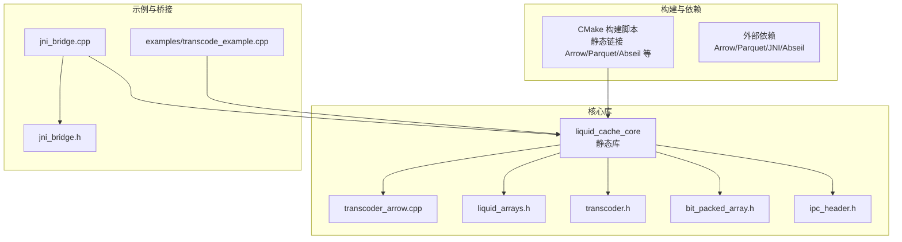
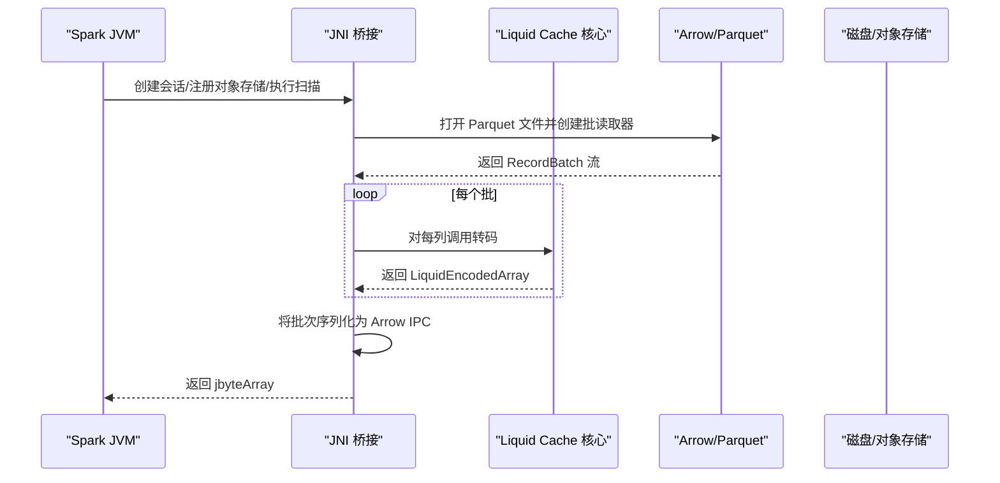
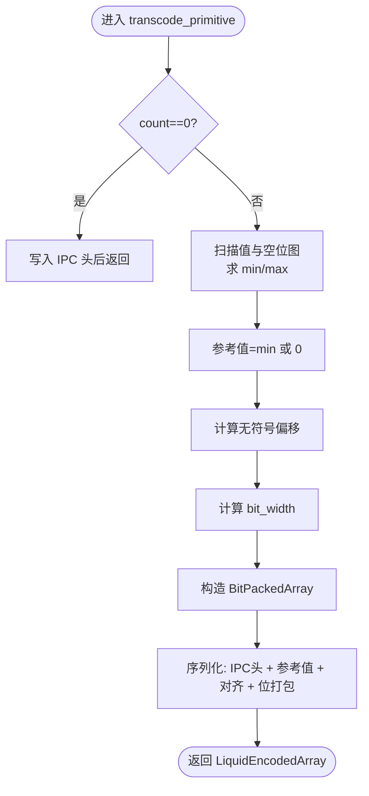
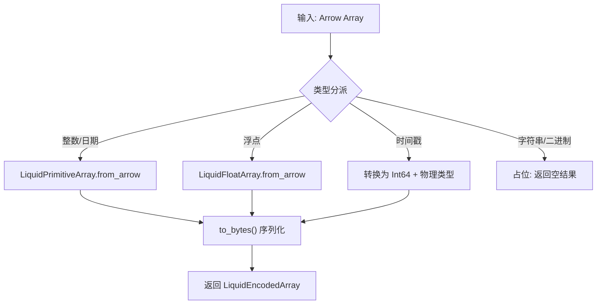
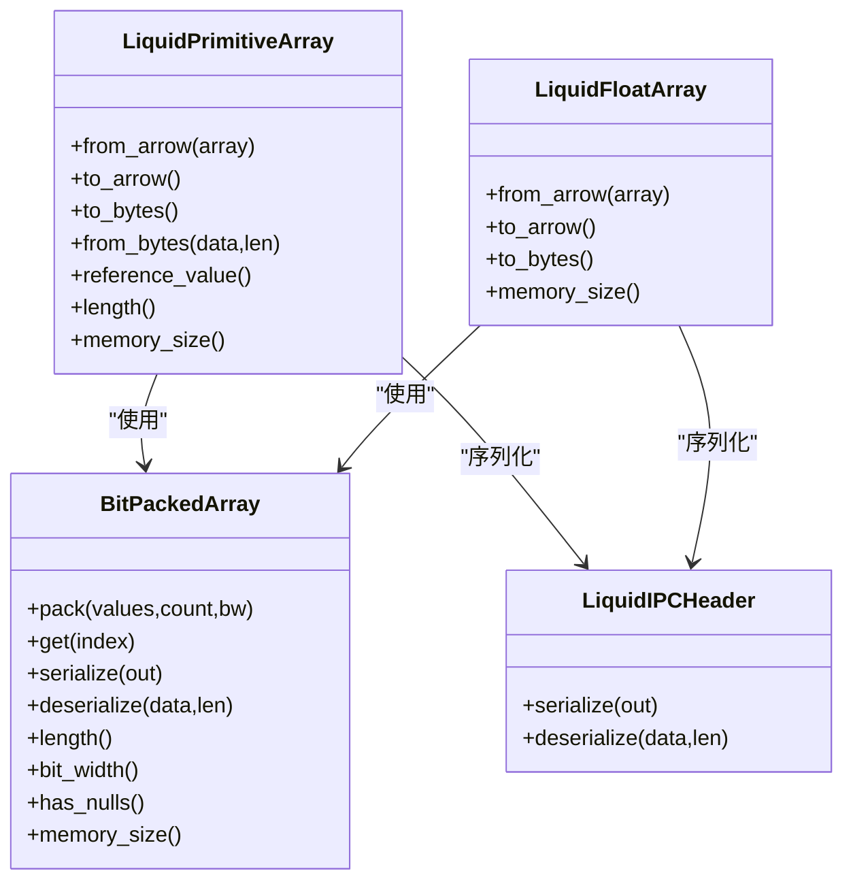
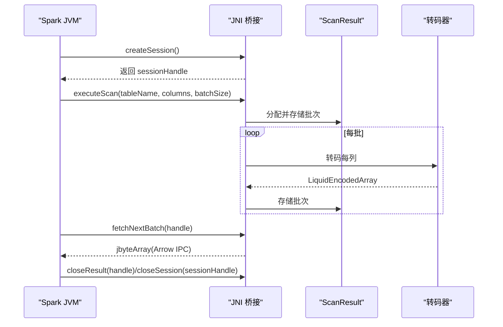
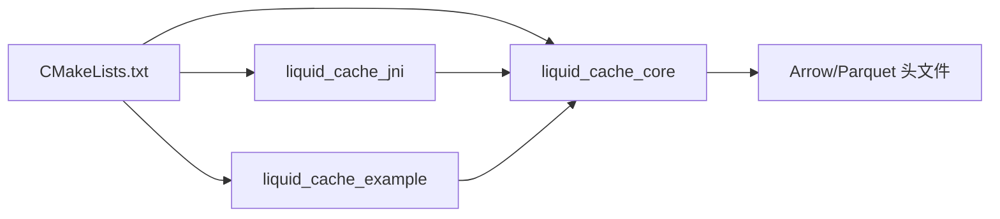

# 高级主题

<cite>
**本文引用的文件**
- [CMakeLists.txt](file://CMakeLists.txt)
- [transcoder.h](file://include/liquid_cache/transcoder.h)
- [liquid_arrays.h](file://include/liquid_cache/liquid_arrays.h)
- [transcoder_arrow.cpp](file://src/transcoder_arrow.cpp)
- [bit_packed_array.h](file://include/liquid_cache/bit_packed_array.h)
- [ipc_header.h](file://include/liquid_cache/ipc_header.h)
- [jni_bridge.h](file://include/liquid_cache/jni_bridge.h)
- [jni_bridge.cpp](file://src/jni_bridge.cpp)
- [transcode_example.cpp](file://examples/transcode_example.cpp)
- [debug.txt](file://debug.txt)
</cite>

## 目录
1. [简介](#简介)
2. [项目结构](#项目结构)
3. [核心组件](#核心组件)
4. [架构总览](#架构总览)
5. [详细组件分析](#详细组件分析)
6. [依赖关系分析](#依赖关系分析)
7. [性能考量](#性能考量)
8. [故障排查指南](#故障排查指南)
9. [结论](#结论)
10. [附录](#附录)

## 简介
本文件面向高级用户与贡献者，系统性梳理 Liquid Cache C++ 实现中的高级主题，涵盖：
- 内存管理策略与智能指针使用
- 零拷贝优化思路与边界
- 并发与线程安全设计
- 性能瓶颈识别与优化路径
- 扩展开发指南（新增数据类型、自定义编码器、插件化思路）
- 调试技巧、性能分析与故障排除
- 与 Arrow 生态的深度集成与 Parquet 优化
- 大规模数据处理最佳实践与资源监控

## 项目结构
该项目采用模块化布局，核心由头文件接口与少量实现文件组成，配合示例程序与 JNI 桥接层，形成“核心库 + 示例 + JVM 桥接”的完整链路。

图表来源
- [CMakeLists.txt:133-179](file://CMakeLists.txt#L133-L179)
- [transcoder_arrow.cpp:1-286](file://src/transcoder_arrow.cpp#L1-L286)
- [liquid_arrays.h:1-580](file://include/liquid_cache/liquid_arrays.h#L1-L580)
- [transcoder.h:1-345](file://include/liquid_cache/transcoder.h#L1-L345)
- [bit_packed_array.h:1-176](file://include/liquid_cache/bit_packed_array.h#L1-L176)
- [ipc_header.h:1-118](file://include/liquid_cache/ipc_header.h#L1-L118)
- [jni_bridge.h:1-217](file://include/liquid_cache/jni_bridge.h#L1-L217)
- [jni_bridge.cpp:1-320](file://src/jni_bridge.cpp#L1-L320)
- [transcode_example.cpp:1-918](file://examples/transcode_example.cpp#L1-L918)

章节来源
- [CMakeLists.txt:1-179](file://CMakeLists.txt#L1-L179)

## 核心组件
- 编码器与数组模型
  - 原始缓冲区编码器：提供独立于 Arrow 的纯 C++ 编码函数，便于 JNI/Velox 等场景直接使用。
  - Arrow 集成编码器：基于 Arrow 数组进行类型分派与转码，输出统一的 Liquid 编码结果。
  - 数值数组模型：整数/日期采用“参考值 + 偏移 + 可变宽位打包”；浮点采用“ALP + 位打包”，并记录修复补丁。
- 底层存储与序列化
  - IPC 头：固定 16 字节，携带魔数、版本、逻辑/物理类型等。
  - 位打包数组：按 bit_width 存储，支持空值位图与 8 字节对齐。
- JNI 桥接
  - 提供会话/结果句柄管理、Parquet 扫描、批次序列化为 Arrow IPC 的桥接入口。
- 示例与基准
  - 支持单文件/目录扫描、列转码、往返校验、吞吐对比、断点续查菜单等。

章节来源
- [transcoder.h:17-345](file://include/liquid_cache/transcoder.h#L17-L345)
- [liquid_arrays.h:77-580](file://include/liquid_cache/liquid_arrays.h#L77-L580)
- [transcoder_arrow.cpp:26-286](file://src/transcoder_arrow.cpp#L26-L286)
- [bit_packed_array.h:28-176](file://include/liquid_cache/bit_packed_array.h#L28-L176)
- [ipc_header.h:46-118](file://include/liquid_cache/ipc_header.h#L46-L118)
- [jni_bridge.h:40-217](file://include/liquid_cache/jni_bridge.h#L40-L217)
- [jni_bridge.cpp:40-320](file://src/jni_bridge.cpp#L40-L320)
- [transcode_example.cpp:140-918](file://examples/transcode_example.cpp#L140-L918)

## 架构总览
整体数据流从 Parquet/Arrow 读取开始，经转码为 Liquid 格式，随后可直接用于 JVM 或本地解码回 Arrow，或进一步写入/传输。

图表来源
- [jni_bridge.cpp:51-126](file://src/jni_bridge.cpp#L51-L126)
- [transcoder_arrow.cpp:36-227](file://src/transcoder_arrow.cpp#L36-L227)
- [transcode_example.cpp:516-733](file://examples/transcode_example.cpp#L516-L733)

## 详细组件分析

### 组件一：原始缓冲区转码器（无 Arrow 依赖）
- 设计要点
  - 面向 JNI/Velox 等场景，直接以原生指针与长度进行转码。
  - 整型采用“帧参考 + 位打包”；浮点采用“ALP + 位打包 + 补丁”。
  - 通过内联计算 bit_width 与对齐填充，减少额外分配。
- 关键流程
  - 整型：求最小值作为参考，计算无符号偏移，统计最大范围确定位宽，构造 BitPackedArray，序列化 IPC 头 + 参考值 + 对齐 + 位打包数据。
  - 浮点：在小范围内穷举搜索最优指数对，记录解码不一致的位置为补丁，用参考值 + 位打包存储，序列化时附加指数与补丁表。
- 性能与内存
  - 使用局部向量暂存偏移/编码值，避免重复扫描。
  - 通过 reserve 预估容量，减少扩容成本。
  - 仅在必要时复制 null 位图，避免不必要的拷贝。

图表来源
- [transcoder.h:86-156](file://include/liquid_cache/transcoder.h#L86-L156)

章节来源
- [transcoder.h:66-156](file://include/liquid_cache/transcoder.h#L66-L156)

### 组件二：Arrow 集成转码器
- 设计要点
  - 基于 Arrow 类型 ID 进行分派，整数/日期走“帧参考 + 位打包”，浮点走“ALP + 位打包”，时间戳按单位映射为对应物理类型。
  - 不支持的类型返回空结果，便于上层判断。
- 关键流程
  - 逐列转码，收集每列的 LiquidEncodedArray，形成批级结果。
  - 解码路径：解析 IPC 头，按逻辑/物理类型选择对应的数组类进行反序列化与重建。

图表来源
- [transcoder_arrow.cpp:36-209](file://src/transcoder_arrow.cpp#L36-L209)

章节来源
- [transcoder_arrow.cpp:26-286](file://src/transcoder_arrow.cpp#L26-L286)

### 组件三：数值数组模型（LiquidPrimitiveArray/LiquidFloatArray）
- 设计要点
  - 整数/日期：参考值 + 无符号偏移 + 位打包；支持空值位图与内存大小估算。
  - 浮点：ALP 编码 + 位打包；记录补丁索引与原始值，保证无损还原。
- 关键流程
  - 编码：计算 min/max/位宽，构造 BitPackedArray；序列化 IPC 头、参考值、对齐、位打包数据。
  - 解码：按位打包读取偏移，加回参考值得到原值；若存在补丁则替换为原始值。
- 内存与性能
  - 使用 Arrow 计算 min/max，避免二次遍历。
  - 位打包按块组织，便于后续 SIMD 扩展。

图表来源
- [liquid_arrays.h:91-227](file://include/liquid_cache/liquid_arrays.h#L91-L227)
- [liquid_arrays.h:318-574](file://include/liquid_cache/liquid_arrays.h#L318-L574)
- [bit_packed_array.h:28-176](file://include/liquid_cache/bit_packed_array.h#L28-L176)
- [ipc_header.h:55-106](file://include/liquid_cache/ipc_header.h#L55-L106)

章节来源
- [liquid_arrays.h:77-580](file://include/liquid_cache/liquid_arrays.h#L77-L580)

### 组件四：JNI 桥接与会话管理
- 设计要点
  - 会话/结果句柄采用原子计数与互斥保护，支持多线程安全访问。
  - 扫描阶段直接读取 Parquet 并转码，批次序列化为 Arrow IPC 以便 JVM 侧消费。
- 关键流程
  - createSession：分配会话句柄并保存地址信息。
  - executeScan：打开文件、构建批读取器、逐批转码、缓存批次。
  - fetchNextBatch：返回 Arrow IPC 字节流，直至耗尽。
  - closeResult/closeSession：清理资源。

图表来源
- [jni_bridge.h:40-94](file://include/liquid_cache/jni_bridge.h#L40-L94)
- [jni_bridge.cpp:51-170](file://src/jni_bridge.cpp#L51-L170)

章节来源
- [jni_bridge.h:1-217](file://include/liquid_cache/jni_bridge.h#L1-L217)
- [jni_bridge.cpp:1-320](file://src/jni_bridge.cpp#L1-L320)

### 组件五：示例与基准测试
- 功能概览
  - 单文件/目录扫描、列转码、往返校验、压缩比统计、吞吐报告、断点菜单。
  - 两阶段基准：Parquet 直读 vs. 转码后读取，支持对比与加速比分析。
- 性能指标
  - 迭代次数、总耗时、平均/最小/最大/标准差、总行数/字节数、吞吐（rows/s、MB/s）。
  - 断点续查：一次转码后多次读取，评估“一次性转码 + 后续多次读取”的性价比。

章节来源
- [transcode_example.cpp:140-918](file://examples/transcode_example.cpp#L140-L918)

## 依赖关系分析
- 构建与链接
  - 使用 CMake 定义目标：liquid_cache_core（静态库）、liquid_cache_jni（共享库）、liquid_cache_example（可执行）。
  - 通过 find_package 引入 Arrow/Parquet/JNI/Abseil，优先使用静态库以减少运行时依赖。
  - 采用 --whole-archive 链接 Arrow 自带依赖，确保二进制兼容性。
- 运行时依赖验证
  - 构建日志显示未发现部分静态库时回退到共享库；最终产物可通过 ldd 检查是否仍携带 Abseil 共享库（调试日志中可见多个 absl 共享库被加载）。

图表来源
- [CMakeLists.txt:133-179](file://CMakeLists.txt#L133-L179)

章节来源
- [CMakeLists.txt:1-179](file://CMakeLists.txt#L1-L179)
- [debug.txt:173-186](file://debug.txt#L173-L186)

## 性能考量
- 编码器层面
  - 整数/日期：帧参考 + 位打包，bit_width 由范围决定；空值位图与 8 字节对齐减少跨缓存行访问。
  - 浮点：ALP 搜索最优指数对，补丁数量越少压缩率越高；参考值 + 位打包降低存储开销。
- 解码器层面
  - 当前 Arrow 解码路径为“解码回 Arrow → 重新序列化”，在 JVM 侧兼容性更好但有额外成本；可考虑直接发送 Liquid 字节流以减少一次重编码。
- 并发与线程安全
  - JNI 层使用互斥锁保护会话/结果表，next_batch 使用原子计数实现无锁迭代。
  - 示例基准中使用 steady_clock 与多次迭代统计，避免抖动影响。
- I/O 与批大小
  - 示例默认批大小为 8192，可根据数据特征调整以平衡内存占用与吞吐。
- 零拷贝与内存管理
  - 代码中大量使用 std::vector 与就地 append，尽量避免中间拷贝；对 Arrow Buffer 的访问通过指针与长度直接读取，减少封装层开销。
  - 注意：当前实现未引入 mmap 或零拷贝内存池，如需进一步优化可结合内存池与页对齐策略。

章节来源
- [transcoder.h:78-156](file://include/liquid_cache/transcoder.h#L78-L156)
- [transcoder_arrow.cpp:211-286](file://src/transcoder_arrow.cpp#L211-L286)
- [jni_bridge.h:40-94](file://include/liquid_cache/jni_bridge.h#L40-L94)
- [transcode_example.cpp:346-509](file://examples/transcode_example.cpp#L346-L509)

## 故障排查指南
- 构建问题
  - 依赖缺失：Arrow/Parquet/JNI/Abseil 未找到时会报错；建议使用静态安装路径或设置 CMAKE_PREFIX_PATH。
  - 静态库回退：当静态库不可用时自动回退到共享库；最终产物可能仍携带共享库依赖。
- 运行时问题
  - IPC 校验失败：检查魔数与版本号是否匹配；确认序列化/反序列化两端一致。
  - 类型不支持：对于字符串/二进制等类型，当前返回空结果；需要在上层做降级处理。
  - Arrow API 兼容：示例与 JNI 代码中存在对旧版 API 的警告，建议升级到 Result 版本以消除告警。
- 调试技巧
  - 使用示例程序的“raw”模式快速验证编码/解码正确性。
  - 通过基准报告观察最小/最大/标准差，定位异常波动。
  - 在 JNI 层捕获异常并通过 throw_runtime_exception 抛给 JVM，便于定位错误来源。

章节来源
- [debug.txt:17-118](file://debug.txt#L17-L118)
- [transcode_example.cpp:859-918](file://examples/transcode_example.cpp#L859-L918)
- [jni_bridge.cpp:183-320](file://src/jni_bridge.cpp#L183-L320)

## 结论
Liquid Cache C++ 在 Arrow 生态下提供了高性能、二进制兼容的列式编码方案，具备良好的扩展性与工程落地能力。通过帧参考 + 位打包与 ALP + 位打包两大核心算法，结合 JNI 桥接与示例基准，能够满足大规模数据处理与 JVM 集成需求。未来可在以下方向持续演进：
- SIMD 加速：在位打包与解包路径引入 SIMD 指令集，提升吞吐。
- 内存池与零拷贝：引入内存池与页对齐策略，减少分配与拷贝。
- 插件化与自定义编码器：抽象编码器接口，支持按列/类型注册自定义编码策略。
- 更丰富的数据类型：完善字符串/二进制的字典压缩与变长视图编码。
- 并发与资源管理：细化锁粒度与批处理策略，结合监控指标持续优化。

## 附录

### 扩展开发指南
- 新增数据类型
  - 在 Arrow 类型分派处增加新类型分支，实现对应的编码/解码路径。
  - 若涉及复杂类型（如列表/结构体），需设计嵌套编码协议与 IPC 头扩展。
- 自定义编码器
  - 在 transcoder.h 中新增独立转码函数，遵循 IPC 头 + 数据的序列化约定。
  - 在 liquid_arrays.h 中新增数组类，实现 from_arrow/to_bytes/from_bytes。
- 插件系统
  - 建议引入工厂/注册表模式，按类型 ID 动态选择编码器，便于热插拔与灰度发布。

章节来源
- [transcoder_arrow.cpp:36-209](file://src/transcoder_arrow.cpp#L36-L209)
- [transcoder.h:66-156](file://include/liquid_cache/transcoder.h#L66-L156)
- [liquid_arrays.h:77-580](file://include/liquid_cache/liquid_arrays.h#L77-L580)

### 与 Arrow 生态的深度集成
- 读取与转码：直接使用 Arrow/Parquet Reader 读取，转码为 Liquid，再解码回 Arrow，保证与现有生态无缝衔接。
- IPC 兼容：Arrow IPC Stream 格式便于 JVM 侧消费；也可直接传输 Liquid 字节流以减少一次重编码。
- 版本与兼容：严格校验 IPC 头魔数与版本，避免不同版本间的不兼容。

章节来源
- [transcoder_arrow.cpp:211-286](file://src/transcoder_arrow.cpp#L211-L286)
- [jni_bridge.cpp:128-170](file://src/jni_bridge.cpp#L128-L170)
- [ipc_header.h:86-118](file://include/liquid_cache/ipc_header.h#L86-L118)

### 大规模数据处理最佳实践
- 批大小与内存：根据数据分布与可用内存调整批大小，避免 OOM。
- 并发策略：在 JNI 层使用原子计数与互斥锁控制结果迭代，避免竞争条件。
- 监控与告警：在示例基准基础上扩展指标采集（CPU/内存/网络），结合日志与指标平台进行可视化。

章节来源
- [transcode_example.cpp:346-509](file://examples/transcode_example.cpp#L346-L509)
- [jni_bridge.h:40-94](file://include/liquid_cache/jni_bridge.h#L40-L94)